# Advanced Dungeons' Dragons 

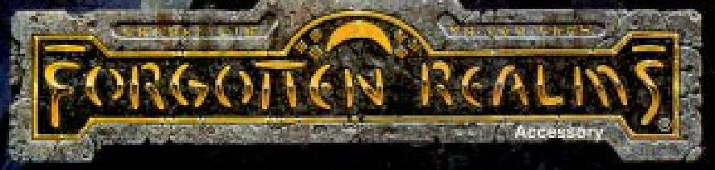

## volos Guide to the

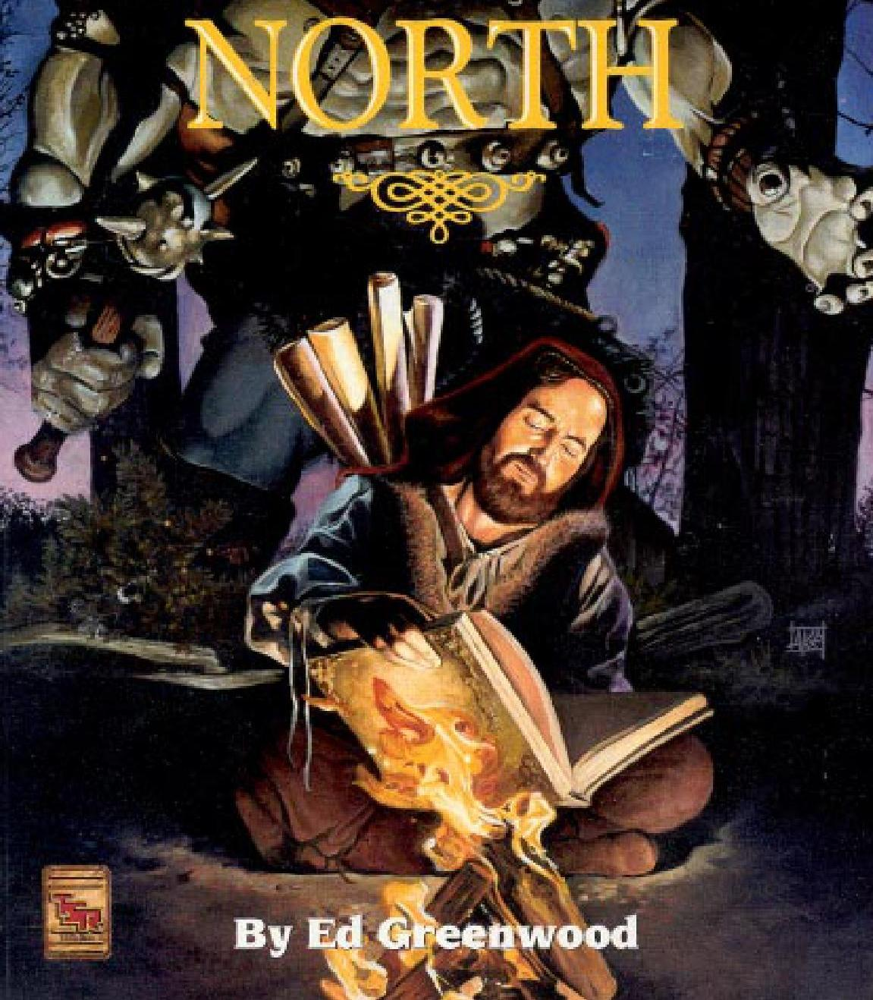

---

# VoLo's Guide to the North 

## Wind by the Fireside

So as you shiver in the cold and the dark, Look into the fire and see in its spark-
My eve
Watching over you.
(6) 0

As you walk in the wind's whistling claws. Listen past the howling of the wolf's jaws. My song
Comes to you.
(6) 0

And when you're lost in trackless snow, Look up high where the eagles go.
My star
Shines for you.
(6) 0

In deep, dark mine or on crumbling peak, Hear the words of love I speak.
My thoughts
Are with you.
(6) 0

You are not forsaken.
You are not forgotten.
The North cannot swallow you.
The snows cannot bury you.
I will come for you.
Faerûn will grow warmer,
And the gods will smile
But oh, my love, guard yourself well-
All this may not happen for a long, long while.
(A traditional trail ballad of the Savage Frontiercomposer unknown)

---

# Credits 

Design: Ed Greenwood
Editing: Victor K. Wertz, Lisa Stevens, and Kathryn Haines
Additional Editing: Julia Martin and Karen S. Boomgarden
Cover Art: John and Laura Lakey
Interior Art: Valerie Valusek
Cartography: Cynthia Felegy, Rob Lazzaretti, and David Sutherland III
Typesetting: Angelika Lokotz
Production: Paul Hanchette

ADVANCED DUNGEONS \& DRAGONS, AD\&D, FORGOTTEN REALMS, SPELLJAMMER, and MONSTROUS COMPENDIUM are registered trademarks owned by TSR, Inc.
DUNGEON MASTER, DM, and the TSR logo are trademarks owned by TSR, Inc.
All TSR characters, character names, and the distinctive likenesses thereof are trademarks owned by TSR, Inc.
(C)1993 TSR, Inc. All Rights Reserved. Printed in the United States of America.

Random House and its affiliate companies have worldwide distribution rights in the book trade for English language products of TSR, Inc.
Distributed to the book and hobby trade in the United Kingdom by TSR Ltd.
Distributed to the toy and hobby trade by regional distributors.
This material is protected under the copyright laws of the United States of America. Any reproduction or unauthorized use of the material or artwork contained herein is prohibited without the express written permission of TSR, Inc.

9393

TSR Ltd.
120 Church End
Cherry Hinton
Cambridge CB1 3LB
United Kingdom

---

# Contents 

Preface ..... 4
Volo's Ratings System ..... 4
A Word from Volo ..... 5
Savage Frontier ..... 6
A Warning to Travelers ..... 8
A Note About Wards ..... 9
The Dessarin ..... 11
Amphail ..... 13
The Stag-Horned Flagon ..... 17
The Stone Stallion ..... 19
Mother Gothal's ..... 22
Bargewright Inn ..... 27
Beliard ..... 35
Calling Horns ..... 37
Conyberry ..... 40
Goldenfields ..... 43
Griffon's Nest ..... 45
Grunwald ..... 46
Kheldell ..... 50
Longsaddle ..... 52
Mornbryn's Shield ..... 63
Nesmé ..... 68
Noanar's Hold ..... 74
The Boar with Black Tusks ..... 75
Rassalantar ..... 78
Red Larch ..... 79
Triboar ..... 82
Westbridge ..... 89
Xantharl's Keep ..... 90
Yartar ..... 93
Beldabar's Rest ..... 97
The Coast ..... 107
Leilon ..... 108
Luskan ..... 111
The Ruins of Illusk ..... 119
The Host Tower of the Arcane ..... 121
The Cutlass ..... 125
Seven Sails Inn ..... 127
Neverwinter ..... 130
The Fallen Tower ..... 135
The Moonstone Mask ..... 138
The Shining Serpent Inn ..... 140
Port Llast ..... 144
The Frozenfar ..... 147
Icewind Dale (The Ten Towns) ..... 148
Mirabar ..... 151
The House of the Bright Blade ..... 157
The Goblet and Gems ..... 159
The Sign of the Forgehammer ..... 161
The Interior ..... 163
Everlund ..... 165
Silverymoon ..... 170
Sundabar ..... 178
Delhnbiyr Vale ..... 189
Loudwater ..... 190
Other Places of Interest in Delimbiyr Vale ..... 193
Other Places of Note in the North ..... 195
Places in the Dessarin ..... 195
Uluvin ..... 195
Places in the Coast ..... 196
Phandalin ..... 196
Thundertree ..... 197
Places in the Frozenfar ..... 198
Fireshear ..... 198
Hundelstone ..... 199
Ironmaster ..... 200
Places in the Interior ..... 201
Citadel Adbar ..... 201
The Citadel of Many Arrows ..... 203
Deadsnows ..... 204
Jalanthar ..... 206
Mithral Hall ..... 207
Olostin's Hold ..... 208
Quaervarr ..... 209
Places in Delimbiyr Vale ..... 210
Hellgate Keep ..... 210
Llorkh ..... 212
Orlbar ..... 214
Zelbross ..... 215
Appendix I: Folk of the North ..... 216
Appendix II: Wardings of the North ..... 226
Appendix III: Elminster's Notes ..... 230
Appendix IV: Index ..... 238

---

# Preface 

I don't know how he talks me into these things. Look ye-another tome of hilarious misinformation about part of the Realms, from the irrepressible, nay, pompous and pretentious Volo. This time, he's presuming to tell travelers something of where to go and what to do in the northern Sword Coast-that part of Faerûn we still call the Savage Frontier. It lies north of Waterdeep for as far north as the snow blows, east of the Sea of Swords and west of Anauroch. It's a land of endless mountains and vast forests, home to more gems and metal riches-and to more orcs and worse monsters-than any other region of Faerûn.

I'd feel a mite guilty if I let fools trust in Volo's guidance without a little warning. Fools? Aye. Anyone who
ventures north of Waterdeep for mere entertainment must be a fool. Even those who do it to earn riches are ruled by reckless greed, not good sense.

But enough. It is for such that I've agreed to provide a crucial modicum of behind-the-scenes information. My colleague, Ed of the Greenwood, has recast my words into notations of import to gamers. I must warn all of ye: it's been many long winters since I was that special sort of fool known as an "adventurer" in the North. My lore is surely incomplete and outdatedsurpassed in faults only by the work of the esteemed Volo. Gods give ye good luck, readers-you'll assuredly need it!

Elminder of Shadoudale

---

# A word from Volo 

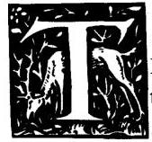
o all who would see the splendors of the Savage North: Well met! Welcome to the only guidebook to the perils and glories of the fabled lands north of Waterdeep.

You've heard of the Savage Frontier, I know. Folk all across Faerùn hear of the North, where countless monsters roam dark and trackless forests, and snow and wind howl into mountain valleys where no human has ever walked. White dragons wing over realms of tortured ice; korred dance and treants walk. Everywhere, cruel and hungry orcs lurk with ready blades.

These tales are not fanciful. I've been there, and I know! This is the only guidebook to the Savage Frontier, because few dare to go where I have gone, to see firsthand the beauty and the dangers-and of the few who did go, not many survived.

In these pages, you'll read my practical reports of the best inns, taverns, and places to see or avoid. Don't set forth without your blade (or a good wand, if blades aren't your style) and this book. I must admit that I soon took to wearing a ring of warmth, as well.

I've fallen in love with these rugged lands, and recommend visiting them to both adventurers and enterprising merchants. The North is where most of the gold, iron, gemstones, and mithral in the Realms come from, as well as the huge trees from which most large ships of the

Sword Coast are built. Many a fortune has been made by venturing boldly into remote corners of the North. Your riches may be next.

Come North with me, after reading two words of warning:

- This book is your guide to the friendly locations in the North. Once off the trails, you're on your own.
- Until you've slept a night out under the stars of the North, you don't know what cold is. Bring extra clothing to wear, and even more to burn, to keep yourself warm. Don't, I beg, burn your guidebook-the information herein may save your life several times over.
If it does, tell your friends, and look for my other guidebooks. Keep in mind this one blessing from the gods: In the North, there are few insects, and remarkably fewer of the sort that sting, bite, or buzz around the heads of humans ${ }^{1}$

May good fortune find you on the trail and lead you to what you're looking for. Whatever befalls, though, I urge you to remember with favor the name of:

## Volo

(Volothamp Geddarm)
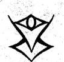
P.S. Despite hunting many days, I've never laid eyes on the fabled Hunter-of-Men-the many-fanged crag cat of the North I'd very much like to hear from anyone who has met this feared predator, and survived to tell the tale. ${ }^{2}$

[^0]
[^0]:    ${ }^{1}$ Note from Elminster: Don't believe him.
    ${ }^{2}$ Elminster has. For details of this beast, see Appendix III.

---

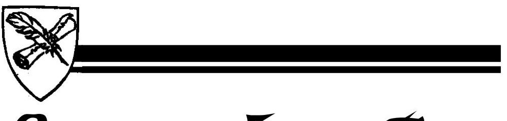

# Savage Frontier 

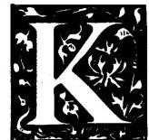
now, O traveler, that this guidebook should be at your belt, as essential as dagger or blade, when you venture north of the city of Waterdeep (the subject, for those who have not yet had the pleasure, of my previous book!).

In the tome you hold, I provide an introduction to the inns, taverns, sights, and local details worth knowing, if you'd like to survive a journey into the northern Sword Coast, called by some the Savage Frontier.

For the purposes of this work-and
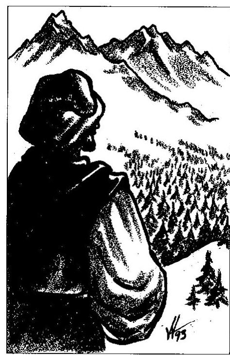
despite the endless arguments of sages-the North is all the land east of the waves breaking along the Sword Coast and west of the Great Desert, Anauroch. Between these bounds, we take in all the land north of Waterdeep, as far as humans know and walk.

This untamed land is far too vast for even a person who lived a thousand years to see every corner. There are many places in the North I've not been, and many things I've not seen. Let that not deter you; what is here is correct in every detail, ${ }^{1}$ and exhaustive in its inquiry. Where danger or circumstances prevented my visiting an important locale, you'll find all I could learn of it from the most reputable sources.

The North is a vast and wonder-ful-though too often deadly and chillingly cold-region. It encompasses most of the different types of terrain I've known in Faerûn, except the extremes of jungle and desert.

For your convenience, I've divided the area into five somewhat artificial regions.

The Dessarin is the surprisingly fertile center of the North. It's a long valley drained by the River Dessarin, which runs like a sword into the heart of the northern wilderlands. It is this river that serves most travelers as their road to the interior.

[^0]
[^0]:    ${ }^{1}$ Elminster's note: Don't believe a single bejeweled word of this.

---

The Coast covers the Sword Coast from Waterdeep to where grinding ice forces ships to turn back. It's a narrow strip of storm-lashed land where most of the cities of the North stand.

The Frozenfar is a term used in Amn and the Inner Sea lands (and heard betimes in the Shining South, too) to describe Mirabar, and the mines and frozen mountains north of it. It traditionally includes Icewind Dale and the Howling Ice Plain beyond. I use the name as it is used elsewhere, to collectively describe the icy interior around the peaks known as the Spine of the World, where dwarves and humans claw precious metal out of the rock.

The Interior is the remote region that folk of warmer areas picture when they hear the words the North. It is centered on Silverymoon and Sundabar, and takes in many mountains and valleys where no human has walked. These are places where orcs lurk, building their numbers until a new horde sweeps down toward the rich south, slaying and carving bloody destruction as they come. It is the area least touched by humans, where the richest gold and gem lodes of all Faerûn are said to lie in wait for those who can claim them.

If the Dessarin thrusts like a sword blade into the heart of the North, Delimbiyr Vale is a scimitar curving around to strike up at the northern wastes along the edge of Anauroch. This crescent of land
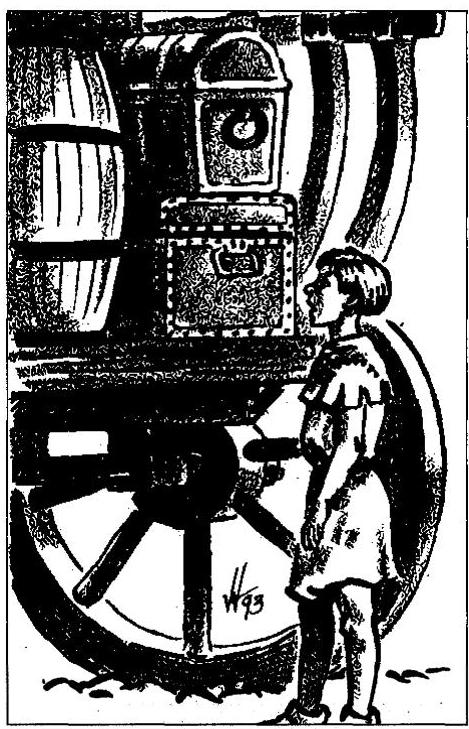
provides a long and perilous road to the North, up the valley of the River Delimbiyr. ${ }^{2}$

The two great rivers of the North are separated by the High Forest, the greatest wood in known Faerûn. Were I a treant, this would no doubt be a region of the North all to itself-and the foremost one. Humans have rarely penetrated far into this vast green realm, and so it is not dealt with in this book.

What you will find in this guidebook, though, are the best sights and places to stay that I found on my travels. Many of them are places I'd settle in to live out my days if it weren't for a little thing called winter.

Death can swiftly find the traveler

[^0]
[^0]:    ${ }^{2}$ By local tradition, Secomber and Zundbridge aren't considered part of the North, so they don't appear here.

---

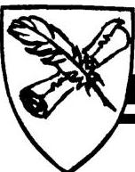
who hasn't known true coldbeware!

A haughty Calishite strode past me out of an inn one clear, cold night. After a few flagons I resumed my journey, only to find the southerner not far along my road, frozen stiff as ice! The cold had caught him in midstride, and it had frozen his heart, I guess.

On my wanderings, I saw many amulets against Auril's breath, and many offerings left at her altars, to ward off the cold.

Why? Ah, if you can ask that, you haven't felt the true teeth of the North. It's a cold that stabs at your lungs like a sword thrust, and makes your breath freeze in the air in front
of your mouth, only to fall like a tinkling rain of icicles as you stride forward. It's a cold that causes skin to stick to metal like glue, and to peel away from flesh like a discarded glove; a cold that makes boots crack into tatters after a short walk, leaving the exposed feet to share their fate. It's a cold that can make a priest believe in other gods and a wizard doubt the power of magic! Never walk naked to the outhouse at night in the North, or it will be a one-way trip.

Looking forward to seeing the North? I knew you would be! Remember that beyond the views that take your breath away there are amazing amounts of gold, gems, silver, and more!

# A Warning to Travelers 

The North is far too large a place for anyone to provide a proper guidebook, and this fellow Volo is the only traveler foolish enough to try, thus far. So, you're stuck with this tome. It's useful enough for choosing beds, platters, and alleys to keep thy nose out of, so long as ye stick to well-traveled, civilized areas. Those who'd go off the trails are warned: You'll face real danger in the backlands and high valleys that even Volo has never seen. Fair weather, then, and have ye a good trip!

## Elminster of Shadowdale

---

# A Note About Wards 

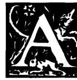n unusual, impressive, and potentially deadly feature of the North is its wards. Intended to keep undesirables like orcs, brigands, and hungry monsters out, these are usually seen as rings of mist. They are often set up around inns, abbeys, keeps, and other inhabited places.

Many an inn has a ward around its stables, gardens, and yard, hidden from the road or approach by a palisade or planting of trees. Most wards have tokens that allow someone to pass through the ward without suffering any of its effects, and in some cases without even knowing it is present. These tokens often are set into the door lintel or doorstep of an inn, so patrons can pass freely in and out without hindrance or challenge. In other cases, a token is affixed to the staff, breastplate, or baton of a door warden.

I'm sure I missed noticing some wards with concealed tokens, but wherever possible, I've identified wards and their tokens throughout this guide.

Be warned: Thieves value ward tokens highly. Open possession of one can be hazardous. However, unless challenged by a human guard, showing a token openly is never
necessary. Wards work from inside a pack or under one's shirt just as well as if brandished overhead.

The magic of wards is beyond me, as it is beyond most wizards and priests today. ${ }^{1}$ Although many wizards' towers have wards, few have multiple spells, or powerful guardians like the ancient wards found around some ruins and tombs in Netheril and other such lands.

Travelers contemplating removal of a ward taken for later use should note that wards seem to give magical warning of token movement. Also, know that tokens are built into some room keys. Travelers planning to cast spells in the privacy of their rooms, or trusting in magic for protection are also warned that some wards prevent certain spells from operating, or cause the spells to backfire on the caster with disastrous results. Wizards staying in inns in the North often stay out late to cast spells from the nearest place of concealment. This is generally not recommended, unless you have companions to guard against night predators.

Travelers staying in abbeys or temple-owned inns are often warned up front about magic bans. Private innkeepers, though, are often more reticent, preferring to let dangerous guests reveal their powers to their own misfortune.

[^0]
[^0]:    ${ }^{1}$ Readers looking for hard game information are directed to Appendix II of this book, wherein Elminster reveals some details of wards.

---

# 9 

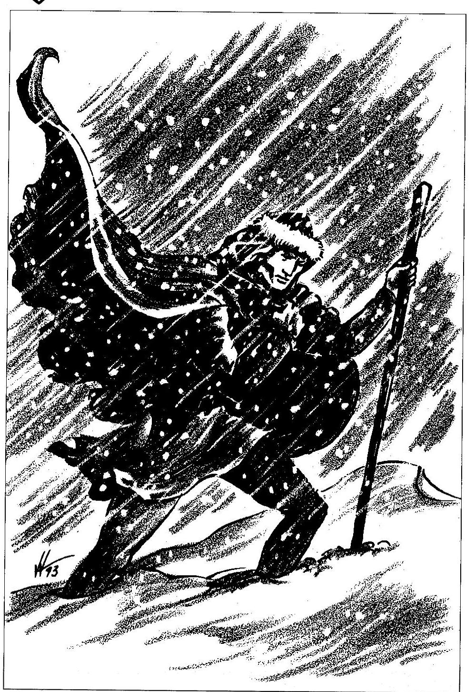

---

# The Dessarin 

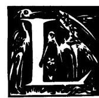
ong ago, before there were roads anywhere north of Tethyr, the Dessarin was known as the Road to the North. The river reaches up past Waterdeep to the Evermoors, and into the eastern end of the Spine of the World.

When humankind first explored the North, we chose the surprisingly fertile Dessarin delta for our first settlements. To this date, more humans live in the long, broad valley of the Dessarin than in any other part of the Savage Frontier. The farms and ranches of the delta feed the North, nourishing remote mining settlements as well as the orc hordes that sweep down the Dessarin every decade or so.

Minstrels often describe the Dessarin as a sword thrusting up into the heart of the North. In fact, the river itself was once known as the Sword. This is important knowledge to those puzzling out Netherese and other ancient writings, trying to locate important sites or priceless treasure.

The Long Road, running parallel to the river along the west side, is definitely the best road in the North. Much of interest may be found along this avenue.

Travelers are advised not to hunt large game on lands claimed by a lord or village. It is also highly inadvisable to take down cattle or trample crops
in any case. Small foraging vermin of the sort that consume crops, however, may be freely killed and eaten.

Large herds of deer are found along the western edge of the High Forest, and those eager to hunt are directed to Noanar's Hold. Be warned, though, that satyrs sometimes drive the deer in order to lead human hunters into ambushes and pitfall traps.

The Dessarin region is known for its spectacular sunsets and wide sky above. It is favored by those who like to gallop horses long and hard.

Travelers planning overland journeys in the northern Dessarin should bear in mind that the lichen- and shrub-covered moors are a favored dwelling of trolls. No matter how often these loathsome creatures are eliminated from the Evermoors, they still creep back down from mountain fastnesses again. Many nearby settlements send expeditions up onto the moors to give their fighters battle experience, because one can always count on meeting some trolls there.

I visited, and have reported on, the following places in the Dessarin: Amphail, Bargewright Inn, Beliard, Calling Horns, Conyberry, Goldenfields, Griffon's Nest, Grunwald, Kheldell, Longsaddle, Mornbryn's Shield, Nesmé, Noanar's Hold, Rassalantar, Red Larch, Triboar, Westbridge, Xantharl's Keep, and Yartar. Their entries appear alphabetically

---

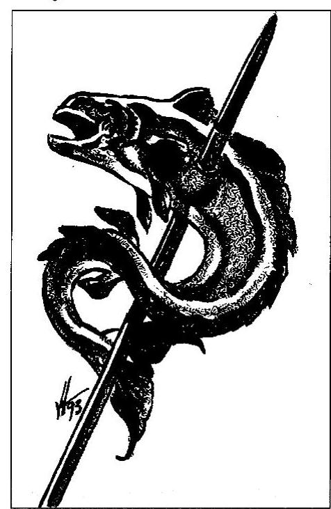
hereafter. I also spent some time in a place called Uluvin. I found that it didn't really merit a section of its own, so you'll find a brief overview of it in the section of this guidebook entitled "Other Places of Note in the North."

A word of warning about the Dessarin and its tributaries-cross only at bridges. There is Zundbridge at the mouth of the river, and a bridge that has only recently replaced the old ford at Ironford. You may also cross at Dead Horse Ford, but don't attempt this in the spring, or you may well learn firsthand how the ford got its name.

The Surbrin is bridged just north of its confluence with the Dessarin, at Yartar, and at Nesmé. The Rauvin is
bridged at Everlund, at Sundabar, and at Silverymoon, where it is spanned by the famous Moonbridge. The Laughingflow (known as the Trollflow in nearby Nesmé) and the Rauvin are not safe rivers; orcs, trolls, and barbarians wait to attack river travelers. Someone busy poling a raft will probably find it hard to dodge volleys of arrows fired from cover along the bank, so dress accordingly.

The Dessarin itself is fast-flowing, cold, and deep for most of its length. It is navigable as far north as Dancing Falls, at the base of the Lost Peaks. A small boat turning up the Rauvin can paddle and pole as far north as Dead Orc Pass, northeast of Sundabar. You can navigate up the Surbrin almost to its source, or up the Redrun as far as the Citadel of Many Arrows.

The Dessarin is home to many silver, troutlike fish that grow to two feet in length. These are called shalass, and they're highly prized on tables throughout the North. These are best caught in a particular type of fish basket called a cone net. Such baskets are mounted on long, sturdy poles, and they require great strength to hold. Expert fisherfolk use long spears to stab the swimming fish from the bank, or from a raft or boat.

The persistent traveler can also find catfish, coldwater crabs, and small brown fish known as lout. The last are tasty when pan-fried, but you need seven or so to fill the pan. The chilly waters of the Dessarin also hold larger and more dangerous life, so beware!

---

# Amphail 

This village lies on the Long Road, a good three days' ride north of Waterdeep. About 600 folk call Amphail home ( 850 , if the population of outlying farms is included). Most are humans, but there are half-elves and a smattering of dwarves and halflings.

Amphail is named for one of Waterdeep's early warlords, Amphail the Just, who had estates here. Though all traces of his keep are long gone, it is said that Amphail still rides the area in spirit form, frightening away trolls and hostile barbarians.

In all seasons except deep winter, the village is patrolled by Waterdeep from an outpost in Rassalantar. Amphail is ruled by a Lord Warder, currently a quiet-spoken, trimbearded man named Briiathor Alougarr, ${ }^{1}$ whose gray eyes miss little. The Lord Warder swears fealty to Piergeiron of Waterdeep. In return, the City of Splendors provides military strength, a Warder's purse of 600 gp quarterly, and many orders for fresh mounts from local horse breeders, notably the Selember ranch.

Amphail is a quiet but beautiful place. By night or in a snowstorm, the
traveler can mark it by the thick stands of dark duskwood and spruce trees that cluster along the road.

This farming village is pleasant to the eyes of all. In hot summer weather, though, it is only pleasant to the noses of those who like horse manure. The folk of Amphail are famous for breeding and training horses. They have traditionally equipped the noble families and armies of Waterdeep and the armies of Neverwinter, as well as merchants and satraps of Amn and Calimshan.

Fine horses are plentiful here. However, those thinking to just ride off on some are warned that the Roaringhorn family maintains a patrol of 12 skilled knights ${ }^{2}$ to deal with horse thieves. This patrol is guided by the scrying of six youthful Roaringhorn sorceresses who dwell on the family farm. These young ladies often show up in the saddles of pegasi, wands at the ready, if the patrol runs into monsters or thieves using magic.

Amphail grays are famous across Faerûn as intelligent, loyal, and hardy personal mounts, but most soldiers prefer the larger, more powerful glossy black chargers bred in

[^0]
[^0]:    ${ }^{1}$ Briiathor Alougarr is an LN hm F3, and a member of Waterdeep's city guard, though he will tell people he has retired if asked outright. He is absolutely loyal to Piergeiron and an old battle-companion of Khelben "Blackstaff" Anmsun, for whom he has occasionally hidden persons or items.
    ${ }^{2}$ All are F5s to F13s clad in scale mail, with shields, full weaponry, and expert knowledge of the countryside. They ride the swiftest Roaringhorn horses, which are truly fast mounts. The patrol is guided by the family sorceresses (W7s to W13s, most bearing wands of paralysis and magic missiles), as noted. The sorceresses are prim but bored young nieces, noted for their mischief. They share a taste for long, straight hair and outlandish gowns, and they delight in hurling lightning bolts when they want to make an impression.

    When I asked for their names, Elminster raised his eyebrows, told me to leave cradles alone, and yielded up the names Aurila, Ileera, Olone, Phanshara, Tlanteth, andVelareene. He warned me that their tutor, Ambara, was a retired adventuress (and W16) who knew all the tricks of wizards and rogues alike and was not to be trifled with. Elminster asserts that Ambara is the main reason the fine horses of Amphail are safe from the covetous mages of Calimshan.

---

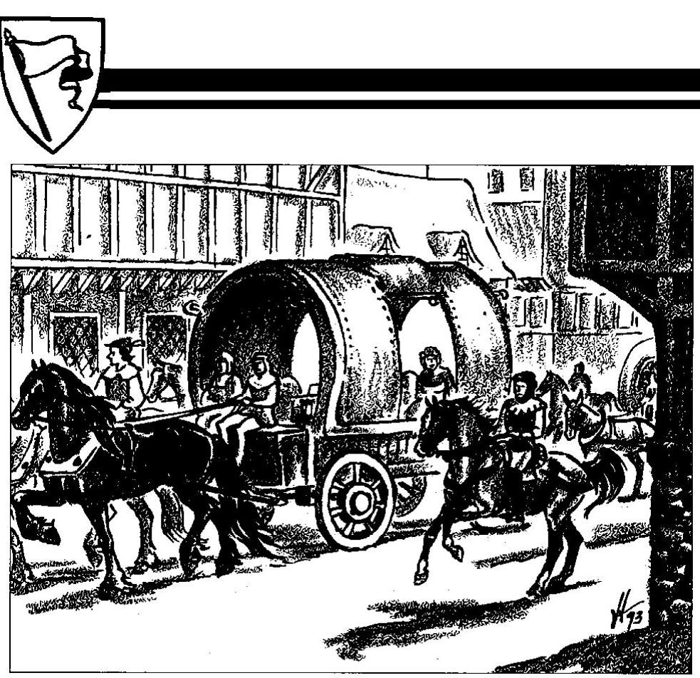

Amphail. The various Waterdhavian noble families who keep stables here have traditionally been major breeders, notably the Amcathra, Ilzimmer, Jhansczil, Roaringhorn, and Tarm families. The independent stable masters Ohm "Steelhand" Oglyntyr, Rorth Baldasker, and Elraghona Selember are also noted breeders.

The whip-wielding Ilzimmer racing teams frequently tear up and down the Long Road, practicing. Travelers should beware; these teams have been known to ride down (or "not see") lone walkers in their way, and tend to answer with ready blades those who dispute this use of the road. Every year, the Ilzimmer family fields teams at the Sword Coast races outside Baldur's Gate.

Two of Waterdeep's more noble families have extensive holdings in the Amphail area.

The Eagleshield family, which produces skilled animal tenders, maintains a farm where sick animals are nursed, and a shop where tack of the finest sort is made and sold. The Eagleshield harness is made for the lone rider's mount. It is of black leather, adorned with silver-plated studs bearing the spread-winged eagle that is the heart of the family blazon.

The Ammakyl family makes more money than all other inhabitants of Amphail combined. This clan dominates the chief business of Amphail: feeding Waterdeep. Any local vegetables that don't come out of Ammakyl

---

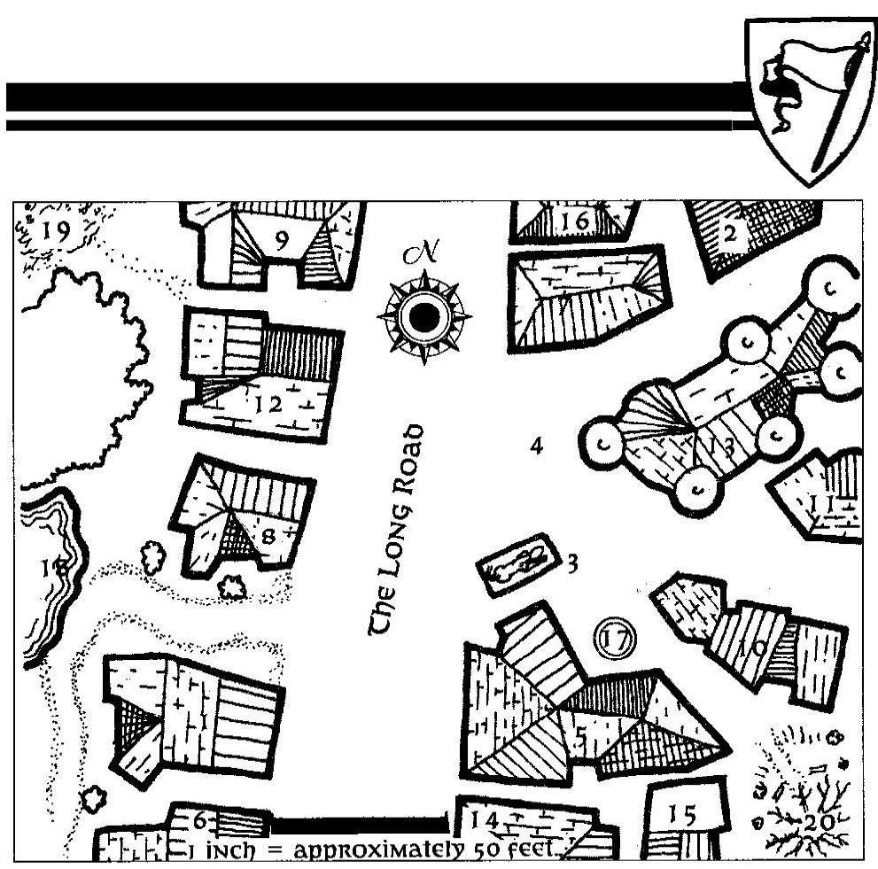

# Amphall 

1. Elboar's Finest
2. Imbryl's Cloaks
3. Statue of the Great Shalarn
4. The Malanderways
5. The Stag-Horned Flagon
6. Shrunedalar's Secrets
7. Mother Gothal's
8. Maerlbar Eggs \& Fresh Fowl
9. Eagleshield Fine Horse Leathers
10. Ammakyl Flowers and Foods
11. Halana Shauluth
12. Blodhlar's Wares
13. Hagala's Manyturrets
14. Golaund Sester's
15. Pelost Galathaer
16. The Stone Stallion
17. Well
18. Horse Pond
19. The Middens
20. The Old Dead Rowan

---

fields are purchased by the family at fair market prices and carted to Waterdeep in large, well-armed family caravans. These caravans are always on the road between Amphail and Waterdeep.

Amphail is a small but prosperous place, the sort of town a hurried traveler can ride through without noticing much of interest, thereby missing a great deal.

## Landmarks

Amphail covers hill after hill of rolling farm fields, but the settlement itself is quite small. The town is centered on an open space where the side streets meet the Long Road. This space is known as the Malanderways. It took its name from a butcher shop owned by the family Malander that used to stand on the corner. Sadly, the shop was destroyed by fire about a decade ago.

This open space is overlooked by a black stone statue of the Great Shalarn, a famous war stallion bred in Amphail 39 winters ago. Gelded long ago by a prankster, the rearing horse image is often painted various hues by high-spirited locals. There is a local rule that allows children to use slings, flung stones, or hand crossbows to bring down birds perching on the statue, so it remains free of the usual bird-droppings. The children often climb it themselves, and perch precariously in the high, tilted saddle, waving their arms and commanding imaginary armies into battle.

The statue is a popular place to leave cryptic messages, either tucked under the hind hooves, or slid between the sculpted curls of the tail. It's also a common place for arranged signals, which are usually a bit of colored cloth tied to a particular part of the horse.

Local lore holds that if the grim, ghostly figure of the ranger Yarobyn Longarm, a long-ago hero of Amphail, is ever seen in the saddle, war will soon come to the town.

For a local spot of interest, you might try the Horse Pond. It's a placid, muddy home to frogs and water-lilies, and it is said to hide the underwater entrance to a tomb. Local lore tells of the Maiden King, a female human chieftain who ruled here an age ago. According to the tale, she sleeps forever on a stone bed, with a magical two-handed sword on her breast. Adventurers have entered the pool several times looking for her sunken tomb, and at least one band did not return. Some years ago, a number of undead skeletons emerged from the pond and stalked through the village, strangling several folk before the beasts were hacked apart. The truth about what lies in the depths of the pond remains to be revealed. However, it is used daily, without incident, to water dirty, thirsty horses.

There's also the Old Dead Rowan, a leafless tree whose trunk is as large as some cottages. Its forked top serves the locals as a lookout to the north. The tree is a popular meeting place for locals, who sit on plank benches

---

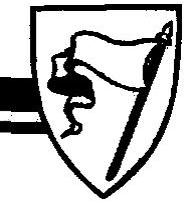
under its bare boughs and smoke pipes, sip cider, play at dice, or just chat. Legend says that a sorceress of great power is buried under its roots, and her power keeps the tree from rotting. Supposedly, this power sometimes heals sick folk who sleep atop the trunk's fork. Locals swear that they've seen it happen. ${ }^{3}$ Local law dictates that anyone caught chopping at the tree will receive the same number of axe blows that the culprit dealt it.

At the north end of the village stands the burned ruin of the Laughing Bandit Inn. It was destroyed in a wild spell battle three winters ago. The battle was between a mysterious masked mage whose skin was inkblack (some folk believe he was a drow) and the wizard Thalagh Tarn of Tethyr who was blasted to bloodspray. It's not clear if the other mage escaped the inferno of the inn. Many, many bones, cracked by the heat, were found in the ashes.

As the owner died in the conflagration, there is no great interest in rebuilding. Local children love to play in the ruins, where many "jools" of melted, puddled glass can be found. Somewhere under the charred timbers lie the inn's cellars, which may still contain some valuables. There's no way to get down there without doing a lot of digging that would have to be done in full view of the children and anyone passing on the road.

To the north is a disused temple to Waukeen. It is rapidly becoming overgrown with ivy and creeping vines.

Nearby is the horse breeding ranch belonging to the retired adventuress Elraghona Selember-perhaps the most successful business of Amphail, after the Ammakyl farms. Elraghona supplies remounts to travelers up and down the Long Road. Her horses are distributed through inns such as the Sleeping Dragon in Rassalantar, which buys dozens of Selember horses each year.

As if all this wealth weren't enough, Amphailans all think the Waterdhavian nobles have chests upon chests of gold buried on Amphalian farms. Gossip I heard at parties in Waterdeep suggests that this rumor may be at least partially true.

## The Stag-Horned FlaGON

## Tavern

## 䍿䍿䍿䍿䍿䍿

This cozy timber-and-stone building is the only watering hole in Amphail. It's a handsome, if rather dark, tavern. This shouldn't be surprising, considering the wealth of the Waterdhavian nobles who drink here, and of those who come to buy horses from them. It is named for an ancient and battered drinking cup-a warrior's helm of unknown origin, with two antlers affixed to it-that hangs over the bar. The "Stag'n'Flag," as locals sometimes refer to it, enjoys an excellent reputation. Mirt the Money-

[^0]
[^0]:    ${ }^{3}$ According to the Old Mage, the tree does sometimes cure disease and neutralize poison, but no one knows why or if a sorceress is really buried there.

---

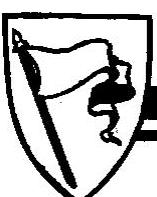
lender of Waterdeep called it "a safe place to get blind drunk in."

## The Place

The Stag's cellar is of fieldstone, as is the lower half of the ground floor. The rest of the structure is timber, topped with a sloping turf roof. In summer, wildflowers grow up there, and travelers can sometimes see the staff aloft, cutting the grass.

Out back is a private luncheon bower, used many a summer night, and the tavern's extensive stables.

## The Prospect

Inside, the Stag is stoutly and simply furnished. Old, broken weapons, scythes, and yokes hang almost invisibly on the walls. The massive ceiling beams and posts are everywhere; and simple tables crowd among them. Drink is served in pewter flagons whose handles resemble antlers.

This cozy place is never empty, as elders whittle away the day playing dice and strategy games. However, the Stag is usually quiet. The thick walls seem to drink in sound, and voices are seldom raised. A hunting horn is sounded at the bar to mark the tapping of a new keg, or to signal closing time.

The tavern master is Kriwin Shamblestar, an old, soft-spoken man with silver hair and a beard.

Stocky and spare of movements, Krivvin has an excellent memory for faces and the favored drinks that go with them. He has six young and beautiful serving-girls, and he has trained them all to be expert knifethrowers. ${ }^{4}$ The tavern's beams bear the scars of their long hours of practice.

## The Provender

The Stag serves an excellent selection of wine (though the purple, spicy local vintage known as mushroom wine is very much an acquired taste) and dark, dense barley beer known as slaker.

The only food served at the Stag is a sort of dark molasses-hardwheat biscuit. Platters of them are delivered with a pot of garlic butter (so good, my mouth waters just recalling it) and sprigs of parsley. It is not unusual to see these leafy greens bobbing up and down, forgotten, on the lips of powerful Waterdhavian nobles as they discuss horses.

## The Prices

Wines, zzar, and sherries cost 7 cp to 4 gp per tallglass, ale is 1 cp per tankard, and slaker is 3 cp for each tankard.

Biscuits come by the platter (which holds about 16), at 2 cp . They're very filling. Many locals, in fact, bring their own fish fillets or slices of ham, and make this their daily meal.

[^0]
[^0]:    ${ }^{4}$ Consider them all THAC0 11 with thrown daggers ( 2 per round) while inside the Stag only. At least one of them can throw hard and fast enough to sever the wick of a falling candle before it can land in an oil pot.

---

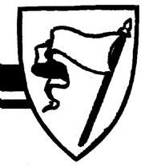

## Travelers' Lore

The Stag has a ward against all fire magic. It extends only around the tavern walls, and doesn't affect the bower or stables. It also has an interesting legend, celebrated in the yearly Rite of the Stag Lass. A maiden from Waterdeep (traditionally of noble blood) rides through Amphail clad in an antlered stag mask and a tunic and breeches of green. She dismounts north of the village and runs back, on foot, to the bar of the Stag. Along the way, village folk who see her give chase and fling goblets of water, soured wine, or old milk over her. When the lass reaches the bar of the Stag, she must drain the old antlered drinking cup, filled with the bitterest beer the tavern master can find. At the bottom of the cup is a beautiful piece of jewelry-hers to keep. A bath is brought for her, and while she bathes, the villagers drink her health. All beer poured to a villager or to the Stag Lass is free that day.

This curious rite remembers a priestess of Mielikki, who dwelt in Amphail long ago. She could take the shape of a stag, and was one day hunted by ignorant visiting nobles. They pursued her even after she changed back to human shape. The lass fled through the village, her blood trailing from wounds the hunters had made. She died at the bar of the Stag, pleading for aid. By some accounts, the legendary figure was the goddess herself in disguise.

Legend holds that any worshipper of Mielikki who kisses the bar of the Stag can ask the goddess one question each year, and hear in their mind a clear answer from the Lady of the Forest. ${ }^{5}$ Many rangers and druids come to the Stag every year, and no one of Amphail ridicules anyone who bends to kiss the bar.

## The Stone Stallion

Inn
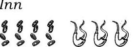

The only inn still existing in Amphail is one named after the horse statue at the center of the village. It's a large, modern place, built seven winters ago after a previous inn on the same site burned to the ground. The Stone Stallion has pleasant, if austere, tapestryhung rooms-and a dark history.

## The Place

The Stallion is always cool and gloomily lit. It can house a small army, as it has four floors of twenty rooms each, plus a cellar crammed with furniture. The place is often nearly empty, leaving sleepers in dark, deserted, and decidedly creepy surroundings. All rooms have canopied beds with side draperies, wall tapestries of woodland or countryside hunting scenes, and candlelanterns. Each room also has a curtained-off corner, home to a copper hip-bath. The stairs are steep, and

[^0]
[^0]:    ${ }^{5}$ The legend, Elminster insists, is true.

---

the lobby small and unpretentious, with barely room for a desk before the stairs.

## The Prospect

Service in the Stallion is almost nonexistent. Unless you cause some sort of explosion, throw something down the stairs or out a window during daylight hours, or come and hammer on the desk, you'll be left alone. The proprietor, Thorn Tlassalune, sees this as "respecting everyone's privacy." According to local tales, this "privacy" extends to rival adventuring bands staging pitched battles on the fourth floor.

Certainly, ladies from Mother Gothal's (the local festhall) have been known to sneak in with their clients and use a room unnoticed. There are adventuring bands who prefer to stay here because they can practice with weapons in upper rooms without complaints. On the other hand, travelers are on their own. There's no one to protect you from thieves or worse creeping down the halls late at night.

Additionally, despite being recently built, the Stallion has a reputation of being haunted.

The innkeeper, however, ridicules such talk. "There're no ghosts in the Stallion-it's just idle talk by folks who don't like my music!" Thorn is a retired merchant from Amn who spends most of his time plucking at a lute. Meanwhile, his five strong, silent daughters cook and see to the linen.

## The Provender

Meals are served in the rooms, which guarantees that the food will be lukewarm by the time it reaches you. The only morningfeast or high-sun-bite is toast and a wholesome but unseasoned beef and vegetable stew. (I improved mine by stirring pepper and a bottle of cheap red wine into it.)

Eveningfeast is a strict rotation of beef, mutton, and pork roasts (one sort per night, served in thick, fatty gravy, with greens in summer, and parsnips or potatoes in winter).

The fare is good, but Thorn's daughters never learned the first thing about spices or dressing things up. I brought an oversalted sausage out of my pack, just to balance the blandness. Dessert is an apple tart. This is good, but best eaten in the bath-one bite causes it to explode into crumbs, in all directions.

Potables include sherry, buttermilk sprinkled with cinnamon (odd, as they don't use any other spices), a weak red wine from someplace forgettable in Amn, a good, dry, sparkling white wine from the Dragon Coast, and good, rather nutty, local ale.

## The Prices

Rooms in the Stallion go for 1 gp per night, meal and bath included. There is no discount if you forego either. There is no tenday rate, and although stabling is included, feed for each mount is 3 cp extra. Your meal

---

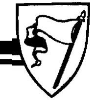
includes a glass of whatever you prefer; extra drinks are 7 cp per glass or tankard, or 3 sp per bottle, regardless of your choice.

## Travelers' Lore

The villagers say that Thorn has treasure buried under the inn, accompanied by the bodies of several thieves who thought they could relieve him of it. ${ }^{6}$ He doesn't make enough running the inn, they claim, to keep its doors open.

Thorn escapes local censure because townsfolk think he's dealing with the Weeping Witch for them. The earlier inn burned down because of her, they whisper. They add that Thorn found its successor standing open and empty because of her as well.

The Weeping Witch is a strange sort of ghost. Most of the time, she's a silent apparition. She's a woman in dark robes and bare feet, long hair
hiding her face, who strides along the halls, gliding in and out of rooms to look down on sleeping guests.

Sometimes she remains unseen but can be heard, sobbing faintly but uncontrollably somewhere nearby. And some of the time, locals whisper, she is as solid as you or I, walking the night to strangle her foes! ${ }^{7}$

The Weeping Witch, the story goes, was a sorceress who lived long ago where Amphail now stands. She learned magic from powerful grimoires of fallen Netheril. She defended herself against orcs with spells that turned hares and foxes into monstrous beasts under her command.

One day, though, her betrothed came to visit. She mistakenly turned her beasts on him. Finding him slain, she fled from her magic, sobbing in remorse, and was promptly slain by watching orcs. Her spell books have never been found, and must still lie somewhere near. It is said that the

[^0]
[^0]:    ${ }^{6}$ Elminster's Note: The villagers are correct.
    ${ }^{7}$ The Old Mage tells us the local tale of the Weeping Witch is all so much dragonspit. The truth, according to him, is that the Witch is a sorceress named Phelansheene. She is under a curse that traps her on another plane except when the moon is full. For two nights before and after a full moon, she can, by force of will, see into Faerûn and manifest as a phantom. She adopts the weeping woman form to scare folk away from the inn. Her only links to Faerûn are her spell books, buried under the building, and she doesn't want anyone to find and bear them away, trapping her forever! Her scare tactics worked with the man who rebuilt the inn, one Tlost Rhuanthel (now deceased), but Thorn is different. He was curious, and spoke to her.

    On nights when the moon is full, Phelansheene walks Faerûn like anyone else. She used to use such nights to seize scrolls and spell books from around the Realms to replenish her magic. Her own spell books are lost under heavy stones, and she dared not trust anyone to dig them up for her. She also used magic to slay or drive away those near the site of her hut (now the inn).

    When she came to kill Thorn, though, he invited her to dine and tried to befriend her. She did not slay him, but sat with him and talked instead. In the years since his wife died, Thorn and Phelansheene have grown intimate. On nights when the moon is full, they dine together. She hasn't told him about her spell books, and he hasn't told his daughters about her. They think their father locks himself up to escape her when the moon is full. His daughters, meanwhile, go out dancing at Mother Gothal's until dawn.

    The curse on Phelansheene was laid by a Red Wizard of Thay after she refused to yield her spell books to him. She was unable to force him to free her from the curse. Instead, she imprisoned him in a crystal ball that she has brought to the inn and hidden in a corner of the attic. Elminster says he'd have destroyed the Red Wizard long ago but for the danger of trapping Phelansheene forever. Now, the Stallion faces the ever-present danger of an angry Red Wizard of Thay (about a W20) getting free and blowing the place apart with everyone in it!

---

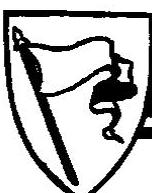
door of her hut was shaded by the same duskwood trees that now mark one end of the village.

## Mother Gothal's

## Festhall

## 1111

If the "Stag'n'Flag" (the local tavern) is the place to chat quietly and make deals, Mother Gothal's is the local spot to have fun. Yes, it is a place where ladies can be hired for an evening, but it's also where the whole village turns out to dance and listen to traveling minstrels. Those who want to revel can change their clothes for some ridiculous costumes of black cotton, mock lace, high ruffles, and masks. Wearing these onto the dance floor is an open invitation for nearby critics to comment on your singing, dancing, or small talk by dousing you with their glasses of "Mother's mead." If you think this sounds like a fun place to forget your cares for a night, you're right.

## The Place

Mother Gothal's is a tall old house with high arched windows, and many small, labyrinthine rooms.

There are pillared porches running around the outside on all three stories, and a set of stairs at the back. These are used at night by shy clientele. The steps are softly lit by fireflies trapped in glass globes set atop the stairposts.

The ground floor is devoted to a dance floor with a raised stage, with seats all around the outside. The seats are soft, and curtained off with silken drops and beaded curtains. There are no fewer than three staircases that climb to the rooms above. For some measure of privacy on the upper floors, dancing lights are used for lighting, while ghost pipes provide continuous background music.

## The Prospect

Folk come here for the company of ladies, who are always masked when on the ground floor or when out in the streets of the village. There are persistent rumors that some bored noblewomen of Waterdeep drop in to spend time among them, for fun.

Mother Gothal's is open all hours, and is ably managed by Mother Gothal herself, or her aide, a formidable warrior known only as Dlara. Mother Gothal is a tiny, frail old woman who clings to remnants of striking beauty, and sometimes takes to the stage to dance, clad only in her floor-length black hair. Her assistant, meanwhile, is an eight-foottall woman from the jungles of Chult. Dlara once broke up a fight outside the Stag by picking up two bullies and tossing them like rag dolls into their foes. There are also usually about two dozen of Mother Gothal's girls on call at any one time. They enjoy a good reputation among travelers, and many merchants arrange their affairs so as to stop by here regularly.

---

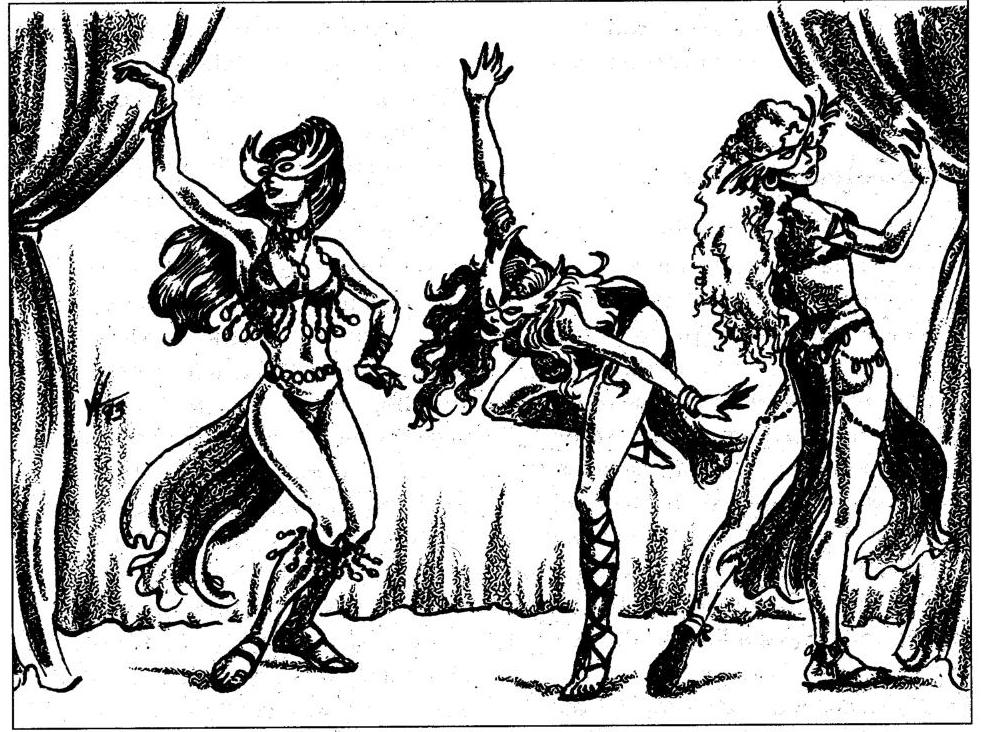

Spells (and, it is said, monsters) guard a vault in the cellars that can only be reached through Mother Gothal's bedroom. Any guest can leave all of his valuables in her keeping, secure in the knowledge that nothing will be stolen. ${ }^{8}$

Mother Gothal also owns a small cottage, a mile or so east of the festhall, on a side road among the farms. Her girls can go there for a rest from the festhall. They are forbidden to bring clients there, but they can entertain friends. Some Harpers have been seen slipping away from there,
so at least one of the girls is likely to be a Harper informant.

## The ProvenDer

Mother Gothal's mead is honeyed wine with fruit juices added to give the flavor a twist. Much of it is hurled about on the dance floor and all over the dancers, but it's not bad on the tongue.

## The Prices

Mead is 1 cp per glass, and an escort is 4 gp each visit or 7 gp for the night

[^0]
[^0]:    ${ }^{8}$ Mother Gothal and Dlara will both be alerted by any entry into the vault, because it is warded. Only they bear the keys, tiny silver triangles on their anklets. Spares are hidden in their bedposts. Two helmed horrors are linked to the ward, and they will attack intruders. There is a false crown of gilt and paste set on a shelf in the vault where someone descending the shaft can't fail to see it. Touching this crown will trigger a hold person spell and ring a gong. In the shaft itself is an open niche with a false handle at the back. If the handle is touched, a row of rusty blades will snap out of the wall to impale the thief (THAC0 4, Dmg 4d4).

---

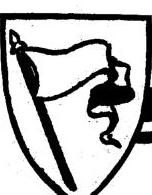
(includes safe storage of goods, free mead, and your own private bed, if you wish).

## Travelers' Lore

This festhall was once the country house of Dalrosz Kothont, an eccentric old nobleman who had turned his back on the high society of Waterdeep and relocated here. His own family spurned him because of his interest in necromantic arts, so he lived out his days here alone, experimenting with captured outlaws and cadavers in a quest for immortality. He also experimented with augmentation of the human form, such as additional limbs, eyes added to the back of the head, and the like.

There are many gruesome tales of misshapen people with tentacles, extra arms, and the like, menacing passersby. After Dalrosz disappeared, a dozen or so of his experiments escaped to live in the hills nearby. Local rumor insists that their weird descendants still roam, preying on mountain animals and the occasional unlucky traveler. ${ }^{9}$

The house fell into the hands of an adventuring band from Waterdeep, the Five Ready Blades. They used it as their headquarters for only a season before they disappeared. Locals thought them to be still at hometheir very hungry horses were found in the stables, and no one had seen them leave-but they had vanished!

Some villagers think that the adventurers were killed by Dalrosz. They believe that he still lurks in cellars somewhere under the house. Others suggest that he did not find immortality at all, but became a lich, and lured the five unfortunate adventurers into undead servitude.

The truth remains unknown. It is also rumored that the Five found a gate or other magical teleport to another place from which they haven't yet returned, or where they met their dooms. ${ }^{10}$ There are also rumors of people vanishing from Mother Gothal's, and of nobles appearing there who were seen in Waterdeep a short time before, but weren't seen on the road. It's possible that these folk made use of a teleport service run by certain mages in Waterdeep.

## Other Places of Interest in Amphajl

## Shops

Ammakyl Flowers and Foods
Produce Shop
\$\$\$\$\$
Ammakyl's expands into an awningcovered stall in summer and fall, catering to travelers. They sell excellent trail baskets of carefully chosen vegetables, and wooden skewers of sliced vegetables dipped in gravy, meant for frying over a fire.

[^0]
[^0]:    ${ }^{9}$ Elminster says these tales are true; a tribe of at least a dozen of these "wild things" still exists. Treat them as mongrelmen (detailed in MC2), although some have tentacles and other features that give them greater powers.
    ${ }^{10}$ Elminster hinted this slyly.

---

They're 4 cp each, but they're delightful!

In winter, this shop imports fruit and vegetables from the Shining South, and sells them to locals and travelers alike at high prices in the summer and fall, and exorbitant prices in the winter and spring.

## Blodhlar's Wares Hardware

## 䒠䒠

This is a ramshackle shop that looks like a barn about to fall down, which it may well be. They sell nails, damaged kegs (bought cheap from the docks of Waterdeep and then resealed), fence posts, wire, rope, slats, crates, and gate hinges. There's a good selection, and the prices are moderate.

## Eagleshield Fine Horse Leathers Tack Store

## 䒠䒠䒠䒠

This is a large, professional shop where pleasant young men sell saddles, reins, and other tack designed for the single rider. Whips and leather breeches are available, but boots must be bought elsewhere. This shop prefers to custom-make gear for the truly wealthy, but even off-the-peg harness is dear indeed. You will find a wide selection of excellent goods, but the prices are very high. This is a store for adventurers and the foolishly wealthy only.

## Elboar's Finest

## Winery

## 䒠䒠䒠

Elboar's is a dark, wood-paneled wine, spirits, spices, and sauces shop. The selection is fair, and prices are moderate to high.

## Halana Shauluth's

## Bakery

## 䒠䒠䒠

Halana is a retired adventuress, a warrior who fought as a mercenary alongside a dozen dwarven women. After she lost a hand to gangrene following a battle, she came home and opened this bakery. She sells round, dark brown hardwheat loaves that stand up very well on the trail ( 2 cp each), and small buns with chopped meat stew cooked into their centers, a delicacy to equal anything anywhere (three for 1 sp or 4 cp each). Halana has a small selection of good wares, and her prices are moderate to high.

## Imbryl's Cloaks Garment Maker

## 䒠䒠

Imbryl's is a dingy place where local women gather to talk, sip wildflower wine, and make cloaks, smocks, simple tunics, and breeches. The women also make the large-brimmed, shapeless hats, known locally as "rainspouts." Imbryl herself is a short, fat, broad-shouldered woman with a merry manner, a nose like an axe-

---

blade, and glossy, gleaming black hair. She can alter garments to fit, but prefers to sell them as is. She typically tells those requesting alterations that the work will take at least three days. If the patron agrees to wait, and pays the fee of at least 4 sp up front, the work will actually take only a day. She has a fair selection of poorly finished though serviceable garments. Her prices are moderate, but alterations are expensive.

## MaerlbarEggs\&FreshFowl Fowler

## §

This is a shop full of sawdust, blood, and stinks, where the thin, whining proprietor and his fat, whining wife sell eggs and geese, ducks, chickens, turkeys, and pheasants. All of the birds are available live, plucked, or light-roasted. Over the counter is a little bamboo cage that contains a golden-hued songbird that Maerlbar swears is "a Red Wizardess of Thay, trapped by spells into the shape ye see her now." I've heard countless such tales, but the look the bird gave me as I chuckled made me think there may be some truth to this claim. There's a fair selection, but it's not very clean. Prices are low to moderate.

## Pelost Galathaer's

## Carpenter

## 1111

Pelost has been in Amphail all of his life, taking over his father's shop
some forty winters ago. His signboard says "beds repaired, furniture sold, sledge-runners a specialty," and it doesn't lie. This salty-tongued, aging craftsman doesn't have the skill to repair wagons or wheels, so he buys all of the broken wagons he can find, keeping the wheels to sell to desperate travelers for as much as 20 gp each. He does good work, as long as the finish doesn't matter to you. Prices are low to moderate, except for those wheels.

## Shrunedalar's Secrets Boutique

## 111111

This place is popular with local ladies, and with merchants' wives on the way into Waterdeep, who want to freshen up after a long journey. Its perfumed air was so thick that I could scarcely stay long enough to look around. The fat, soft-fingered Ulreth Shrunedalar and his silent, skilled sons and daughters offer hair-bathing and cutting, body painting, and makeup application. Fat women shrouded in steaming towels seem to be everywhere, and they give any male who enters the place looks that could pierce the most stout armor.

Shrunedalar also sells perfumes, fashion accessories, and gowns that are no longer quite in fashion in Waterdeep. He has a good selection of services, but the prices are very high. Things cost even more here than in the City of Splendors itself.

---

# Ulvinhand Smithy 

## Smith

## 䍐䍐䍐䍐

West of the ruins of the Laughing Bandit inn, down a side-track, stands the home and forge of the tall, bearded finesmith Akrosz Ulvinhand. He is said to be the equal of any smith in Waterdeep, and therefore, he's among the best human smiths in all the Sword Coast lands. There is a steady stream of strange visitors down the track to his forge, but he undertakes only those commissions that interest him. Local gossip says that his selected commissions include many blades that are later enchanted by wizards. An Ulvinhand blade might cost you as little as 100 gp , or as much as 700 , not counting the cost of any adornments, such as gems.

## INNS

## Golaund Sester's

## 䍐䍐䍐䍐䍐

Golaund's is a large, exclusive rooming house, renting rooms out at 5 sp per person per night with bath included and complimentary mulled, spiced cider. No food is available, but a laundress and tailor can repair and clean clothing for 1 gp per garment. This place is often used by wealthy merchants and nobility on the way to trysts or hunts. It's not unusual to come face-to-face on the stair with a young Waterdhavian miss in a gown of the sort commonly called "I-dare-you-I-really-do," or to brush
shoulders with an arrogant trainingmage or fat merchant in the entry hall.

## Hagala's Manyturrets

## 䍐䍐

This is an old, rambling, drafty rooming house that obviously used to be quite grand. Rooms rent by the night at 1 sp per person per night, or 8 sp per tenday. The rate includes no meals, but hot soup and cold ale are always available, at 1 cp for a bowl or tankard.

## Bargewright InN

This community of about 35 folk has become an important base for visitors to the North, but isn't even a hamlet. It was formerly a lone wayside inn on a natural hill overlooking Ironford on the River Dessarin. Persistent brigand attacks made the proprietor, Feston Bargewright, decide to fortify the hill. He looked for someone to share the cost. To this end, he persuaded several Waterdhavian merchants, tired of guild politics and fees, to relocate. They did so, surrounding his inn and the slopes of the hill with businesses of use to caravan travel. On good summer nights, Bargewright Inn may have a temporary population of close to 750 .

Agents of the Lords of Waterdeep and the Harpers both keep sharp eyes on Bargewright Inn, because the Zhentarim have been trying to buy into it for some years now. They hope to gain control of the ford, and even-

---

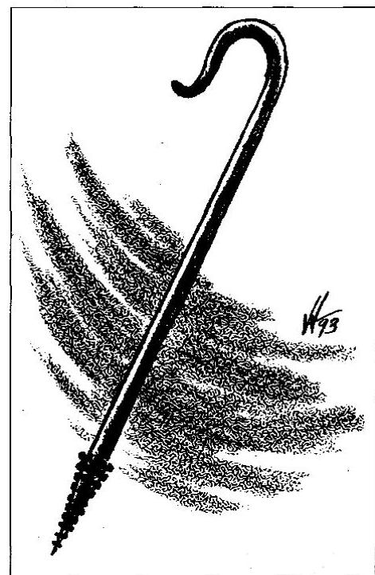
tually, the farms that lie to the north of the Inn, on the west bank of the Dessarin. Meanwhile, the useful businesses here make Bargewright Inn a haven for travelers in the North.

From a distance, this place looks like a ramshackle castle. One sees a hill topped by two towers-one tall and thin, the other shorter, thicker, and leaning at an angle. There are buildings straggling down the slopes of the hill, and the whole lot is encircled by two concentric walls. Around the bottom of the hill are paddock areas, enclosed by a second, outer wall. Caravans encamp here, and drovers pen their stock for sale or for nighting over on a run to Waterdeep. The inn stables are also here.

The single set of gates is the only way in, excepting rope-chairs lowered over the walls from some of the houses. This is done at night for very stiff fees, typically $4-6 \mathrm{gp}$ per use. The moment you enter those gates, you face a wide expanse of trampled dirt and cow-dung, piled at the start of a road that winds up the hill. This place is known, prosaically enough, as "the Mud." Facing you are two gatewardens, unsmiling people who hold crook-topped staves. They'll ask your business, and satisfy themselves that you're not an orc in disguise. Then, they'll outline the features of the place, and direct you where you want to go. This only takes them a moment. If you get an idea that there's not much of interest in this austere place, you're right.

The lower part of Bargewright Inn consists of the circle of paddocks between the two walls. The overwhelming smell here is that of fresh manure. Carted out daily to nearby farms at a 1 cp per cart fee, the manure comes from the livestock brought for market, and from caravan beasts and travelers' mounts. The paddocks each hold about 40 beasts if they're crowded in. They rent for 5 cp per day (highsun to highsun). Nearby are the Stalls. Here, local farmers come to sell their fresh produce. They can rent an awning, a bench, a full water bucket, and a table for 1 cp per day.

Around the north side of the hill are the stables. These are linked to the inn itself by a rickety rope-lift elevator, and some rather treacherous

---

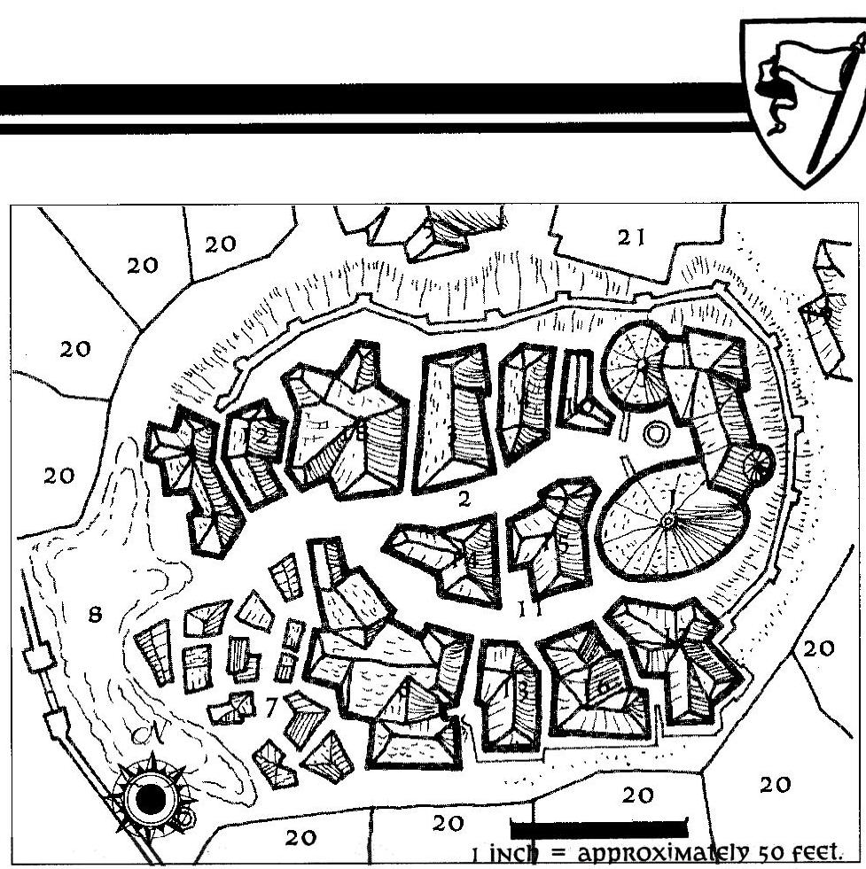

# Bargewright InN 

1. The Bargewright Inn
2. The Rise
3. Belvyn's House of Good Cheer
4. Shondrin's Packsack of Plenty
5. The Wet Crossing
6. Rinthar's Wagonworks
7. The Stalls
8. The Mud
9. Haeleth's Horseshoes
10. Ruldarr's Pipes, Locks, Tobacco, and Fine Furniture
11. The Back
12. House of Belvyn
13. House of Halduth Meer
14. House of Shondrin
15. House of Rinthar
16. House of Haeleth
17. House of Ruldarr
18. Tabra's
19. The Healing House
20. Rental Paddock
21. Inn Stables

---

steps that zig-zag up the rocky north face of the hill. Of course, you can also take the long way around, via the street.

The stablemaster, Aldon Bargewright, leads a militia of five hostelers and 20 shopkeepers, all armed with pikes, should Bargewright Inn face a troll, orc or brigand raid. Any adventurers in town at the time would be asked to join the defenders. For their service, each would receive 1 gp , and freedom from all inn fees for the next tenday.

From the Mud, a single street climbs the spine of the hill. It is lined with shops, ending in the courtyard of the Bargewright Inn at the hill's top. A second street angles away from the first to run precariously along an edge of the hill. This street serves the homes of the inhabitants. Several of these homes perch on pillars, bridging over the livestock path below. This provides the drovers with shelter when it rains.

Bargewright Inn has two wells. One is a deep well in the courtyard of the inn itself, atop the hill. The other is a covered and locked well in the paddock area on the south side of the hill. From this well, water is pumped into troughs at a fee of 1 cp per trough.

The merchants of Bargewright Inn carry staves that have a distinctive metal crook on one end, and a studded metal goad on the other. Disobeying a person carrying such a staff inside the walls of Bargewright Inn is grounds for immediate expulsion.

This is not a big place. One can survey its attractions thoroughly in half a day-and pity the person who has to stay here longer than two nights.

## Places of Interest in Bargewright InN

## Shops

## Haeleth's Horseshoes Smith

## 111

Haeleth's is the dark, crowded smithy of a tall, laconic ironworker who specializes in shoeing all manner of beasts. Haeleth has worked with copper and silver, but is uncomfortable dealing with finer metals. Stout ironmongery is his love and his forte. When he's not shoeing mounts, he keeps busy making hooks, hinges, and hasps that he ships to the markets of Waterdeep by the cart load. All of his money goes into buying Waterdhavian properties. The rent from these keeps his wife comfortable in a Waterdhavian villa, and his four sons sponsored in adventuring careers all over Faerûn. Thieves have often gone through Haeleth's shop (the smith is a sound sleeper, whose snores can often be heard in the Rise outside through multiple closed doors and shuttered windows) but have never found more coinage than a handful of coppers. Haeleth has a pet lizard of unknown species that looks like a smaller cousin of the basilisk, but has no demonstrated petrification powers.

---

# The Healing House 

## Physic

## 䒠

This is the home and office of a local physic and animal healer, Chanczlatha Luruin. He uses more herbs and broths than magic in his treatments, ${ }^{11}$ typically charging 5 gp per visit or 6 gp for a day and night of continuous care.

His wife, Baerlatha, and a large number of adopted children assist Chanczlatha in his home, and in running one of the paddocks in the lower circle. His paddock is a place where sick animals are tended, and one can always sell sick, weary, or no-longer-needed mounts for 5 sp or take a chance on buying a mount on the mend for 8 sp , though this price can sometimes be bargained down for particularly small or sorry-looking beasts.

## Rinthar's Wagonworks

Wheelwright

## 䒠䒠䒠

This is the workplace of an aging, gruff craftsman who seldom speaks. He can often be seen out in his yard, though, steaming and bending pieces of ash to fashion the plain, stout wheels for which he is best known (15 gp each or 25 gp for a pair). Besides being a skilled wheelwright, Rinthar fixes wagons. He and his six young apprentices specialize in rough but sturdy repairs. These are quick and expensive ( 30 gp per wagon for by-
sunset or next-morning repairs), or slower and more reasonable ( 10 gp per day). Rinthar is something of an authority on wood, and can identify woods of great age or rarity. More importantly, he can perform the proper weatherproofing treatments on them.

## Ruldarr's Pipes, Locks, Tobacco, and Fine Furniture

## Tobacconist/Furnisher

## 䒠䒠䒠

This is the aromatic, dimly lit shop of the urbane Ruldarr. You'll find him to be a man of smooth manners and subtle jests, with his small pointed beard and oiled mustache. Ruldarr's shop smells of fine, exotic woods, and a variety of tobacco. The shop is crowded with beautiful, ornately carved furniture, including a cellar full of coffins and strongchests. Bins of tobacco sell steadily ( 2 cp to 1 sp per pouch, depending on the ingredients). However, Ruldarr's chief business is in the sale of padlocks. He also has a case of "found" keys that presumably fit ancient locks in ruins somewhere in the North. Brought to Ruldarr by adventurers, these are for sale at 6 gp each to other adventurers who hope to find the locks they fit, and, presumably, the treasure beyond. Many of Ruldarr's furniture pieces have hidden drawers, but he hides his money somewhere else. There are allegedly secret compartments in the dozen interior pillars that hold up the roof of his

[^0]
[^0]:    ${ }^{11}$ "To some success," according to Elminster.

---

shop. At least one of these is known to be fitted with a trap that causes a dagger blade to spring out of it. This rumor was confirmed when a wouldbe thief was found impaled on it one morning.

An old, battered scythe hangs on one pillar. Local talk says that it becomes animate at Ruldarr's will, defending him against anyone foolish enough to attack him in his shop.

Ruldarr is an avid gardener. His house is full of hanging plants that grow in large pots that levitate wherever Ruldarr wants them to. Sometimes, they drift in slow orbits around a room, trailing their fronds and roots behind them. Some of these plants seem to have developed a taste for the rather exotic wines Ruldarr likes to serve his guests. One of his favorites is the black wine of Phelzol, which one sprinkles with salt before each sip. It's particularly strong and bitter; some would say vile. However, someone wanting to surreptitiously empty his glass into a plant may discover that four or five plants are suddenly jostling for position at his elbow!

## Shondrin's Packsack of Plenty General Store

## 11111

This is a small, crammed shop. Its fat, jolly proprietor spins endless, wild tales of his career as a sailor up and down the Sword Coast. Shondrin sells dry goods and practical sundries, from outerwear to rope and candles.

He prides himself on knowing the nearest source of whatever you might want to buy that he doesn't carry. Of course, an answer of Waterdeep, or Athkatla, or Calimport, may not be of much use to you, but you can trust Shondrin's knowledge of lawful, open-market vendors to be as thorough and as up-to-date as he can make it. Shondrin sells things at just a shade above the common market price. ${ }^{12}$ He sometimes even takes items such as old weapons, armor, and hardware, in trade. You never know what you'll find in "The Sack." However, Shondrin seldom deals in magical things. Nevertheless, I once found a bag of holding there that looked like a fat dragon statuette, whose head swung back to allow access. I've also heard of travelers buying an old blade, and gaining a magical sword with strange, unknown powers.

## Tavern

## The Wet Crossing

## 111111

This is the only tavern in town. Its original proprietor was the ferryman on the old, leaking boat that crossed the Dessarin here before the Ironford bridge was built. Once the new bridge opened, the ferryman brought his boat ashore, where its unlovely prow and leaping-fish figurehead now provides the tavern's facade. Though the original owner died soon after opening the tavern,

[^0]
[^0]:    ${ }^{12}$ Prices as given in the Player's Handbook.

---

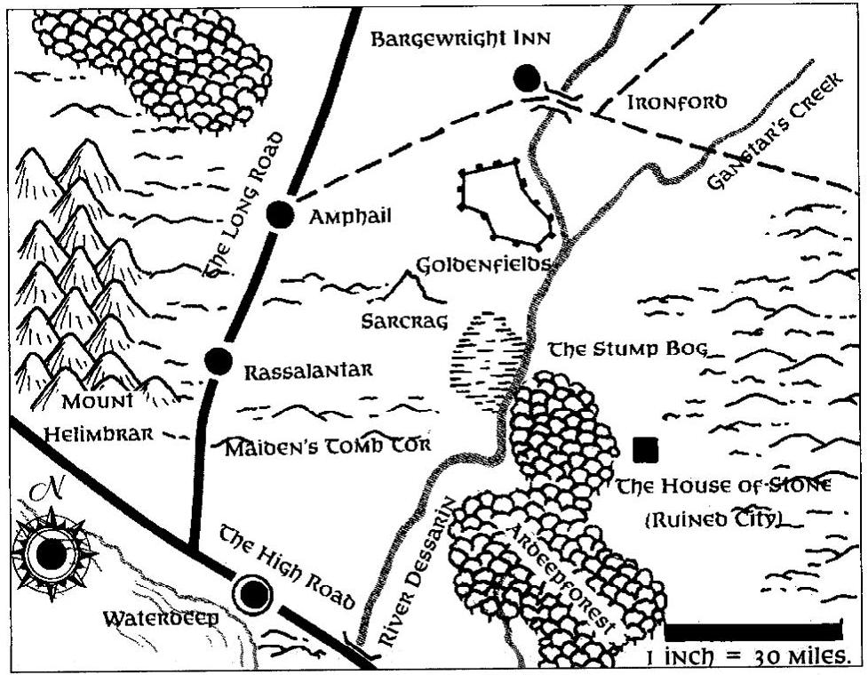
his old friends now run the tavern for his widow. They continue the tradition of loud, boisterous singing and dancing for which the ferryman was legendary.

Prices here are 1 cp per tankard of beer and 2 cp per tallglass of wine (a rough but good dry white and a truly horrible, reeking red). Drinking here can be an ear-splitting tumult of stomping feet and shouted revelry. Many friends are made in the Crossing, but those who would do business or discuss things must often scramble outside to hear themselves think. Regardless, a surprising amount of the North's trade is conducted here, to the good-natured background din of the Crossing.

## I N N

## The Bargewright Inn

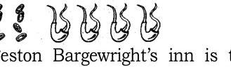

Feston Bargewright's inn is the center of this community. It's an efficient, no-frills place of fine wood paneling and swift service. Strict order is kept by four strong warriortypes, while the inn's stables are run by Feston's brother Aldon
Bargewright. Aldon is a ranger who captains the local militia, and wields a long sword reputed to be magical.

Private rooms at the inn go for 1 gp per person per night, including a bath. A chambermaid is 1 gp extra. She helps you with your bath, rubs

---

your back and feet if so asked, and (a charming touch, this) tells a brief bedtime tale or local legend! One can also share a double room for 5 sp per person, or a wardroom of 6 to 18 bunks for 2 sp per person.

All room rates include a talltankard (a pewter monster with a lid that holds about twice what a normal tankard does) of rather watery ale, and a platter of biscuits and pickles. The latter are so salty, they send you scurrying for real food. This tends to be pork and beef roasts of the hearty but plain variety, accompanied by heaps of turnips, potatoes, radishes, and parsnips. Those who dine at the inn are saved from total boredom by the presence of a good cheese tray, and, in winter, a hearty vegetable and root sauce soup. This is the only meal available at the inn. It is served from lunch to moondown (midnight, regardless of what the moon's actually doing). The cost is 5 cp per head. Drinks are extra. Available beverages include various beers at 1 cp for each tankard (a normal-sized tankard this time) and a dry clear wine at 4 cp per tallglass. Curiously, the inn also offers the chilled green wine of Mintarn-very much an acquired taste-at 7 cp for a tallglass or 1 sp for a bottle (I suspect Feston likes it himself). Sherry is also available, at the same price as the Mintarn.

The view from the uppermost turrets of the inn is impressive. The taller North Tower and the slightly leaning and much larger South Tower overlook the rolling grasslands of the

Dessarin. All in all, it's a safe but unspectacular place, with the air of a castle preparing for war. Every winter, Feston has more of the wooden parts of the inn torn down, and replaced with stonework. Soon, it'll look just like a castle, too.

## Festhalls

## Belvyn's House of Good Cheer Festhall and Temple

## 11

Belvyn's House is a tall, narrow, steeply roofed hall with catwalk galleries running along its high crossbeams. Belvyn, a sly, belly-rubbing rogue if ever I saw one, rents it out for 25 gp per night. It has two major functions. It may be used as a festhall, or as a temple. For the latter use, a plain altar and braziers are provided to worshipers of any nonviolent faith. Exceptions include worship of Tempus and Helm, which are permitted, but that of Malar is not.

Various organizations rent out the house to throw parties. This is most often done by merchant cabals or leagues, Waterdhavian guilds on frolic, or adventuring bands celebrating a success. These renters often hire most of the girls from Tabra's for the night. Funerals are also held here, free of charge.

There's a persistent local rumor telling of chests and chests of gold coins hidden in or under the House. However, it's a simple, open place, easily searched, and no one has ever found so much as an extra copper piece here.

---

# Tabra's 

## 111

Tabra's is known, even in Waterdeep, as one of the "must visit" places in the North. It's a tall, many-balconied house furnished with shabby gentility. Rooms rent for 2 gp per night, with all meals included. The fare is simple, but always delicious. You can order leek-and-leftovers soups (vegetable, meat, and cheese chunks), oysters and mushrooms on toast, or spiced scrambled eggs. Tenants are always hanging around the kitchens. The place is home to never fewer than a dozen lady escorts, who you can hire for 25 gp each from highsun to highsun. Their chief attraction is their relaxed friendliness. As one regular, a female merchant who simply ignores all the kissing and cooing around her, puts it, Tabra's "feels like home." There are always folk to sit and chat with, or several ongoing gambling games. There are quiet window-seats where one can curl up to read one of Tabra's huge collection of books, chapbooks, and scrolls on every topic, except magic. Tabra even provides a weapons practice room in the cellars, and a magically shielded conference room at the top of the house, next to her own rooms.

Tabra herself is a kind, motherly, blond little wisp of a thing. She looks like a little girl too young to be thinking of men-until one looks at her eyes. Presumably, she does this by magic, a topic she pretends to know nothing about. Tabra has been around the North for as long as

Elminster can remember, and that's long indeed. There are rumors that Tabra is really a gold dragon, in human shape to guard a hoard hidden under her house. When one wonders why she's never been seen in dragon form, the usual answer is that she's hiding from a more powerful dragon who would sweep down and destroy her and Bargewright Inn if her true identity ever slipped out.

One of the tales told around Bargewright Inn is of a time, a decade or more ago, when a black dragon swept down out of the sky to attack Bargewright Inn. Tabra allegedly leapt from the balcony of her bedroom, turned into a dragon in midair, and drove off the black dragon. Strangely, the tellers of this tale can never agree just what type of dragon Tabra turned into.

This story is never told in Tabra's hearing. If it is, her usual softly furious reaction is to turn the speaker out of her house.

## Beliard

This small, tree-cloaked village stands east of the Stone Bridge, where the trail from Westbridge meets the trail coming north from Ironford.

Beliard is a market town for local cattle drovers, complete with a covered well free for anyone to use. Rather than setting up ranches, farmers build their houses in Beliard, and wander the nearby moors and rolling grasslands with their herds.

From time to time, folk disappear

---

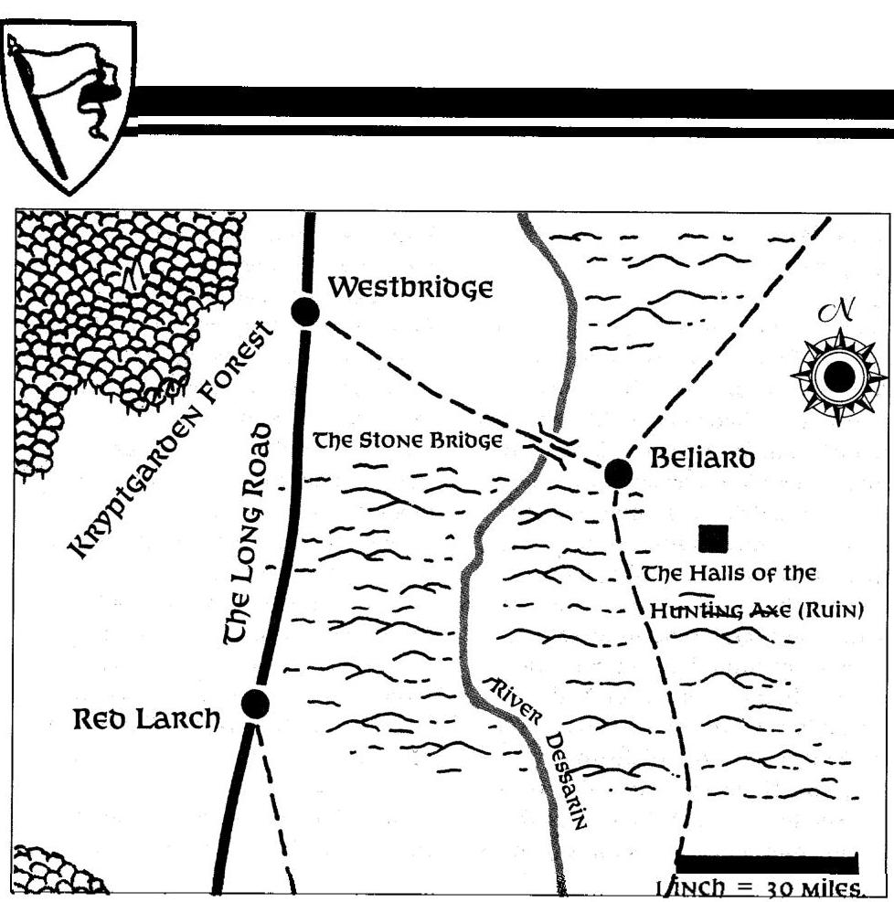
in or near Beliard. Recently, four spice merchants vanished. ${ }^{13}$

## Places of Interest in Beliard

## Shops

## Halamar's Horses

## Stabler

## 1111

At the east end of Beliard is a stable known as Halamar's Horses. A stout, white-bearded, retired warrior
named Blasko Halamar runs the stables with the aid of a dozen boys. ${ }^{14}$ Blasko does a steady trade here, buying tired or lame mounts and draft animals, and selling fresh, rested replacements. He's full of tales about adventurers, orc ambushes, and treasure. ${ }^{15}$ His favorite treasure tale is of riches buried nearby an age ago by effete ladies fleeing the fall of Netheril. He sells mounts for 25 gp each and draft animals, such as oxen and mules for 20 gp each. If you're trading up for a fresh animal, he'll buy yours for 12 gp , and then sell to

[^0]
[^0]:    ${ }^{13}$ A doppleganger in town is responsible for this.
    ${ }^{14}$ The stable boy who uses the name Hagarl is actually a doppleganger. It preys on horses, dogs, and the weakest travelers camped near Beliard. Its "kill pit" is at the north end of the village's garbage dump. There it dumps corpses it hasn't had time to eat. It also hurls bones and treasure there, covering them with a layer of garbage.
    ${ }^{15}$ Most of them true, or not far wrong, Elminster says.

---

you for 10 gp more. Whatever deals are made, he'll try to keep a 10 gp spread between payments and prices.

## Milshoun's Stronghouses Warehouses

## 䍿䍿䍿䍿䍿

Three squat stone warehouses stand across an open area from the well. Warehouse space can be rented by the night, tenday, or month for 10 gp per chest, 50 gp per chest, or 125 gp per chest, respectively. The warehouses are run by Ahbhaer Mhilshoun, ${ }^{16}$ an oily little Calishite who constantly complains about the cold. His "stronghouses" have a standing guard of a dozen men-at-arms, who spend their spare time hunting game in the nearby hills to the north.

## INN

## The Watchful Knight

## 䍿䍿䍿䍿䍿䍿

The inn in Beliard has 16 rooms. It's a rough place indeed, built of logs and as cold as a drafty tomb in winter. The hostel is run by Arachar Calatharr, who is the namesake of, but no relation to, the famous ranger Arachar Calatharr. Arachar becomes intensely irritated whenever anyone
asks if he's related to "the real one."
The Watchful Knight has a central hall with a massive chimney at either end, and two floors of rooms opening onto internal balconies that overlook the hall. A suit of empty full plate armor stands in the center of the hall, facing the front door. It can animate to defend the inn or Arachar, at the innkeeper's silent mental command. ${ }^{17}$ At bedtime, the noise from the shared hall makes it very likely that you'll spend a "watchful night."

## Calling Horns

## Inn

## 䍿䍿䍿䍿䍿䍿䍿

South of the Evermoors, the trail from Dead Horse Ford meets the trail that links Yartar and Everlund. The two trails converge in an area of lightly wooded, rolling hills. The exact spot is marked by a cairn of weathered and lichen-covered orc skulls that commemorates the longago slaughter of a horde here. Overlooking this point is a hogback ridge, topped by a low, massive fieldstone inn and its stables.

This isolated inn bears the name Calling Horns. It takes its name from a battle that took place nearby, long ago. During this legendary battle,

[^0]
[^0]:    ${ }^{16}$ Ahbhaer pretends to be a powerful person with many connections in Waterdeep and Calimport. He'll try to make you believe he's an exiled satrap or part of a secret group of magically powerful beings. In reality, he's a failed merchant who got hold of what magic he does have by killing a sleeping wizard and snatching everything valuable he could find. Ahbhaer wears a spellbattle ring (see Appendix III) and a ring of magic missiles (identical to a wand of magic missiles). When the ring's 24 remaining charges are gone, it will crumble to dust.
    ${ }^{17}$ The animated suit of armor is a helmed horror, detailed in the revised FORGOTTEN REALMS® Campaign Set. It is Int 14; AL N; AC 2; MV 12, F112 (A); HD 4+ 14; hp 46; THACO 12; \#AT 1; Dmg by weapon (battle axe: 1d8, twohanded sword: 1d10,3d6 vs. L) or 1d4 (fist); SA None; SD immune to fireball, heat metal, and lightning bolt magics, can see invisible to $120^{\circ}$; MR special; SX M (6' tall); ML special; XP 2,000.

---

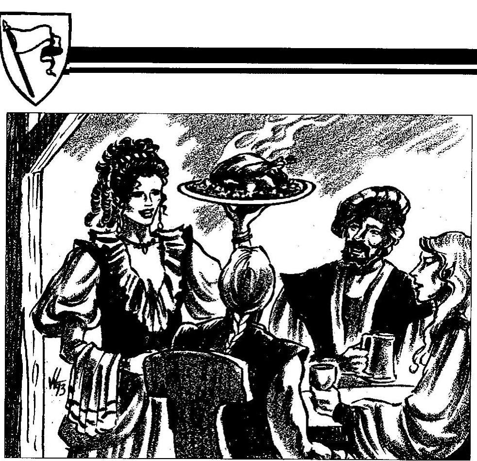
humans and dwarves united to defeat the last real troll army.

Calling Horns is run by Tosker Nightsword, a retired hunter and guide. He kindly took the time to personally provide me with the history of his inn. ${ }^{18}$

Calling Horns was originally built as the hunting lodge of a family called Zoar. These folk were once powerful Waterdhavian nobles, but they are now outlaws. There are persistent rumors of the Zoars using the inn as a base. These rumors suggest that the family is trying to regain its former control in the City of Splendors. However, there is no evidence to justify this, as the surviving Zoars seem to dwell mainly in Amn.

After the fall of the Zoars, various noble families used the lodge as they pleased, until a wandering wizard took up residence in the place. This clever wizard used his spells to dupe the next two families who showed up. His deception was not discovered for a long time. Instead, the lodge was thought of as haunted, so it was left alone.

The wizard, Balbannon, took over the lodge. While living there, he studied the magic of summoning and commanding creatures from other planes. He succeeded beyond his powers, and was torn apart by a babau tanar'ri. The creature then took over the lodge as its own abode. For many years, it preyed on

[^0]
[^0]:    ${ }^{18}$ According to Elminster, every word of this is accurate.

---

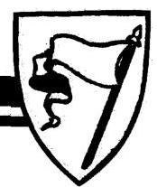
travelers, and creatures of the nearby High Forest.

After many years, the tanar'ri was destroyed by the Bright Blade Held High, an adventuring band of halfelves. These folk used the lodge as their base for almost a decade before they disappeared into the depths of the High Forest.

The vacant lodge was then used by a succession of brigands, monsters, and orc raiding bands, until a dwarven adventuring band from Sundabar moved in. This group was known as the Axe of Thunder. They found some ore nearby, but before they located any real riches, an orc horde swept down out of the north and slaughtered them all.

The lodge was thereafter taken over by a human band of adventurers who called themselves the Bored Swords. All the members of this party were idle sons and daughters of noble Waterdhavian birth. They enjoyed much success finding ruins in the North, but they grew tired of having to fight their way into their own abode each time they returned. It seems that persistent brigands continually came looking for the treasure that the noble adventurers must have found.

So, the Bored Swords hired their friend Tosker to run the lodge as an inn. They soon simply gave him the place. Their treasure is certainly hidden somewhere in or near the
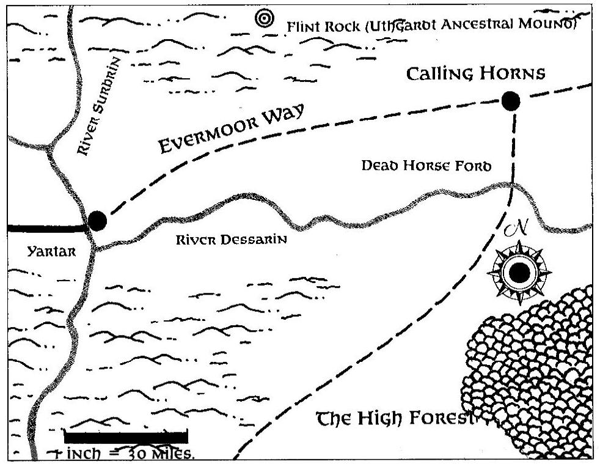

---

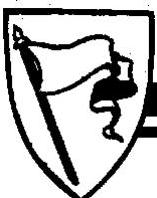
inn, and they may never return to claim it. The Swords went deep into the High Forest last winter, telling Tosker little. They did mention that they'd found a ruined city cloaked in a field of magic, similar to the mythal that surrounds Myth Drannor. Apparently, they hoped to find powerful magic there. They still haven't returned, and with each passing day, the likelihood of their return diminishes.

The inn has a slate roof and very thick stone walls. Cellars, kitchens, and a lower floor of rooms are dug into the south face of the ridge. The rooms of the inn are arranged in a single row. The doors of the rooms all open onto a single wide passage. The passage wall opposite the doors is broken only by a series of arrow-slit windows. The watchtower at the inn's eastern end overlooks the stables. A large feasting hall lies at the west end, with meeting rooms and grand suites let into the hill below it.

Furnishings are sparse, but of the best taste and quality. Magical driftlights dispel the gloom of the belowground areas. The luminance of these flying spheres of radiance is controlled by your will. They can even be made to trail after you like a faithful dog.

Rooms go for 4 sp to 4 gp per night, depending on its size. This includes three meals and unlimited watered ale and iced well-water. Meals consist of rolls, greens, and cold meat or fish at highsun, and stew in the evening.

Beer is sold by the tankard for 3 cp each. You can choose between a nutty-tasting ale and a very dark, strong-tasting stout, both brewed at the inn. Other drinks are sold by the bottle for 1 sp and up, with a good selection of zzar, sherries, and wines.

Those wanting the "grand evenfeast" can pay 1 gp extra each night to gorge themselves on roast oxen, boar, venison, turkey and wildfowl soup, spiced greens, and potatoes flamed in sherry. When the hunting is good, this is supplemented by spits of seared pheasant, quail, grouse, or other wildfowl.

Tosker has a staff of three old, sharp-witted and sharp-tongued women, and a dozen young maids. All are equally at home in the kitchens or the stables, or out with a sword or bow, slaying orc raiders with cool efficiency. ${ }^{19}$

## CONYBERRY

This small farming village is one of many that shelter on forest edges or nestle in foothills around the edge of the Dessarin. It is mainly famous as home to the Ghost of Neverwinter Wood.

Conyberry itself is nothing more than a dozen or so houses standing in a cluster on the eastern edge of Neverwinter Wood. Adjoining farms spread out to the east and south, divided by a cart track that runs to distant Triboar.

The folk of Conyberry cut trees from the wood as needed. They hunt

[^0]
[^0]:    ${ }^{19}$ Elminster says Tosker has imbibed at least one potion of longevity. The three crones, he adds, are all Tosker's wives and the dozen maids his daughters.

---

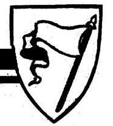
in the fringes of the wood, and snare rabbits and the like in the grassy plains south of their farms. They also grow crops to feed themselves, and to trade with any travelers who come their way. They are largely self-sufficient, needing to purchase only linens and finished clothing from peddlers. At night, the farmers take turns keeping watch from the rooftops of their homes. They arm themselves with scythes, daggers, swords, and crossbows. They are very good shots. ${ }^{20}$

Although trolls and brigands lurk in the hills to the south of Conyberry, skirting the hills is the fastest way from the interior to the coast. Because of this, there is a steady passage of travelers, except in the harshest winter months. Harsh winter conditions are known as "wolf weather" in Conyberry, because the wolves grow hungry and come down to the village to raid for food.

Conyberry has a smithy of sorts, several rough-and-ready carpenters, a person who can fix harnesses and tend to minor equine and livestock injuries, and two brewers who ferment their own horrible beer.

## Landmarks

The chief landmark in the Conyberry area is a grove that is the haunt of a ghost. The ghost of Neverwinter Wood is actually a banshee, known as Agatha. This name is almost certainly a corruption of the elven surname Auglathla, which means Winterbreeze in one of the older elven dialects. She lairs in a grove in Neverwinter Wood, northwest of Conyberry. Her haunt is at the end of a path whose entrance is marked by a stand of birch trees.

Agatha's lair used to be guarded by a magic mirror spell. This was set up to hide her real location, and give her time to hurl spells at intruders. These defenses were shattered by the heroes Drizzt Do'Urden and Wulfgar, son of Beornegar. The two adventurers then stole her treasure. ${ }^{21}$

The banshee had amassed her treasure hoard by thieving in the night, slaying travelers, and pillaging old tombs and ruins. Since her wealth was stolen, she has taken to looting the Dessarin again, trying to rebuild her riches. She also seeks revenge for the theft, and so considers any adventurers fitting recipients of death. ${ }^{22}$

[^0]
[^0]:    ${ }^{20}$ Conyberry can muster about 140 able-bodied F1s ( 6.8 hp each, THAC0 20), due to the labor-intensive nature of their farming. Consider them to have THACOs of 16 with bows (and, by day, slings) inside their village, where they're well practiced in hitting particular spots. When hunting outside the village, they have THACOs of 17 with the same weapons.
    ${ }^{21}$ As related in Chapter 3 of R.A. Salvatore's novel The Halfling's Gem (TSR, Inc., 1990).
    ${ }^{22}$ Agatha may be encountered anywhere in the Dessarin region. However, she will avoid confrontations when in cities. She will also refrain from attacking if she believes that powerful wizards or priests may be nearby. She appears as an elven maiden, clad in a flowing, swirling gown. Her skin is shriveled though, and her eyes look white, empty, and blind. However, she can see quite well. In addition to the usual powers of a banshee (see MC2), she retains the mastery of magic she had in life.
    Agatha is a W13 (5,5,5,4,4,2). She never leaves Neverwinter Wood without a strong roster of fighting spells. One of her favorite combat spells is lightning bolt. She is constantly on the lookout for new spell books and magical items. Her spell books lie hidden in several places, though none are in her lair. Agatha's intangibility makes many of these useless, except for their trading value. Nevertheless, she is experimenting with spell trigger magic to defend her lair. Near her haunt, one will find wands wedged into trees and aimed at the path to her home.

---

Agatha's lair has new defenses now. Her spells enable her to charm owlbears and, occasionally, the people of Conyberry, into digging pitfall traps along the path to her lair. These servants have also been seen guarding her haunt. Other than this, Agatha does not bother the folk of Conyberry. Rather, she views them as allies. Agatha often uses her spells to bring them beasts for food in the worst winter weather. She also slaughters orcs and brigands who venture too near to the village. Folk in Conyberry regard Agatha almost affectionately as their guardian and friend. They often talk about her, and speculate on what she's up to. The villagers are also interested in news
of the North, particularly talk of whether the orcs are on the march again.

The main place to socialize in town is Conyberry's Hall. Here, folk gather for communal feasts, or meet to drink, smoke, and gossip most nights. The Hall is also where travelers spend the night. The building itself is a large rectangular pavilion with two removable walls, a flagstone floor, and a stout thatch-and-beam roof with a large overhang. There is a large hearth chimney at either end, and a few rustic benches and tables. In winter, both permanent walls are stacked to the rafters, inside and out, with firewood. There is a deep well in the

---

center of the hall, and a hitching post outside that is surrounded in winter by a windbreak made of baled straw.

Travelers arriving at the Hall are usually met by one of the people standing guard. This person is always covered by another on a roof nearby, armed with a crossbow. The first guard finds out if travelers have anything to sell or barter, or if they want to buy anything.

Locals sell beer and food. Ale is usually 2 cp per jug (an earthenware crock that can fill four good-sized tankards) and "firebeer" costs 5 cp for each jug. This is a concoction of ale made stronger by dumping spirits into it. It tastes even more vile than it sounds, but I learned that it can be used as lamp fuel. Available food includes uncooked or stewed rabbit or grouse, biscuits or fresh bread, fresh eggs and salty butter, root vegetables (raw or chopped and fried), and roast pig.

Local tales of treasure center on a legendary lost elven keep called the Sharandar. It was supposedly abandoned by elves who sallied forth to fight orcs, and were overwhelmed. The Sharandar is said to be full of gems, magic items, and armor, as well as fantastic sculpted glass furniture, and other things of beauty. Locals say that the Sharandar is now cloaked by living trees that have overgrown it.

## Goldenfields

Sometimes called the Granary of the North, this walled abbey was founded over a decade ago by the priest Tolgar Anuvien of Waterdeep. Tolgar is a retired senior member of the Company of Crazed Venturers.

Once only a small farm lost in the rolling sweep of the grassy Dessarin meadows, Goldenfields has grown into the largest abbey of Chauntea. It is currently a fortified farm complex sprawling across 20 square miles. Within its walls, over 5,000 devout worshippers of Chauntea tend crops of grain and edible vegetables.

Most folk of Faerûn are staggered by the sheer size of the tillage. It seems like a large slice of the paradise of plenty promised by many gods. Of course, an agricultural wonder like this is walled and jealously guarded. The people of Goldenfields have already driven off more than 20 largescale barbarian raids.

Mounted patrols of 20 or more adventurer-priests ${ }^{23}$ scour the lands around Goldenfields. They patrol as far north as the Stone Bridge, and as far east as the High Forest. These patrols seek trolls, goblinkin, and other evils to fight. They also try to capture game for domestication. They challenge all folk they meet, but will not fight unless they are attacked or encounter obviously evil creatures, such as drow or orcs.

[^0]
[^0]:    ${ }^{23}$ A Goldenfields patrol usually includes four or five priests of Chauntea (3rd to 5th level) and five or six men-atarms (F2s to F4s in chain mail and bearing lances). These stalwarts are accompanied by a dozen or more lay brothers and lay sisters (F1s in leather armor, armed with a variety of weapons). There is a $20 \%$ chance that any patrol will be accompanied by a wizard of NG or LN alignment (2nd to 5th level). This chance rises to $90 \%$ if the patrol is responding to a horn call of alarm or entering known danger.

---

Goldenfields is rapidly becoming the agricultural backbone of the North. It supplies food to Waterdeep and most of the inland settlements. With its increasing importance, the influence and stature of Tolgar Anuvien has also grown. He is quickly becoming the equal of such rulers as Lord Nasher of Neverwinter and High Lady Alustriel of Silverymoon.

Tolgar plans to expand Goldenfields northward to gain control of the strategic Ironford river crossing at Bargewright Inn. From there, Goldenfields could safely expand to the east bank of the Dessarin. Tolgar is now puzzling over just how to absorb, ally with, or take over Bargewright Inn, but he has not yet made any open offers to Feston Bargewright.

Before he can undertake any further expansion, Tolgar needs adventurers willing to defend Goldenfields. Evil creatures such as orcs, brigands, trolls, and a few goblins, bugbears, and foraging monsters still roam the area. Tolgar's defenders must be faithful worshippers of Chauntea or Lathander, with a loyalty to Goldenfields. They will most likely spend their lives patrolling the region. Tolgar's main problem here is that most adventurers would quickly find such service too boring.

Goldenfields enjoys good relations with Waterdeep and all the humanheld cities of the North. It's unofficially a member of the Lords' Alliance, and it will undoubtedly soon join this alliance openly. Tolgar is already in

---

nearly constant communication with Khelben "Blackstaff" Arunsun and Piergeiron of Waterdeep.

Goldenfields happily takes in adventurers weary of danger, or on the run from justice elsewhere. They may stay as long as they are willing to work in the fields and fight and defend the abbey-farm if necessary.

Chauntea is said to be very proud of Goldenfields, and allegedly watches over it personally. Rumors say that he guides his workers through dream-visions, and aids his defenders with timely bolts of lightning or earth tremors.

## Griffon'sNest

In the heart of the grass-cloaked hills, west of Shining Creek, stands the lit-tle-known village of Griffon's Nest. It is one of the few places where an Uthgardt barbarian tribe has built a permanent settlement. The Nest is a fascinating and dangerous place. Swaggering barbarian warriors are everywhere, and each is always looking to prove his battle-prowess by carving open an outlander.

The journey there is recommended only for the powerful or foolish. One must travel through hills studded with sheep, shepherds, and Uthgardt lookouts who can swiftly summon javelin-hurling patrols of 12 to 16 pony-back warriors.

Once a bandit hold, Griffon's Nest has grown rapidly in recent years. In its former status, a man called Azglyn and his half-orc band controlled the area. This ended when the Uthgardt slaughtered them all.

The current self-declared chief of Griffon's Nest is Kralgar Bonesnapper. Throughout his youth, Kralgar wandered the Sword Coast, seeing all its ways and wealth. He has since become a barbarian who covets the riches and leisure of Waterdeep.

Kralgar has proven a wise leader, keeping feuds and lawlessness to a minimum. He has also managed to show his people the prosperity that trade can bring. Griffon's Nest now includes 20 or so thatched log huts, sealed with baked earth. The huts are arranged around two warehouses and a central longhall, and all of this is encircled by a stout log palisade. Stables are located inside the compound, and a dozen or so small farms lie on the hills around. Perhaps 900 folk live in the Nest, and another 1,000 or so of the Griffon tribe will rally to Kralgar's call.

The Griffon barbarians hunt, farm, and pan for gold in Shining Creek. They buy goods (mainly weapons of good steel) with gold nuggets and dust. They sell woven rush and cane baskets and trunks to traveling merchants who swing by from the Long Road.

The Griffons are the most literate, organized, and skilled Uthgardt. Kralgar welcomes all contact with outsiders, as he believes that anyone in Faerûn may be an ally in his ultimate goal of conquering a rich city of the North. Though Waterdeep would be best, Kralgar will settle for a lesser place if he thinks he can snatch victory. Kralgar has declared ritual war on all cities, and many outlaws and unallied Uthgardt seeking plunder

---

have joined the Griffons. Visitors to the Nest can expect to meet adventurers of all sorts. Some are probably undercover agents of the Harpers, the Zhentarim, the Cult of the Dragon, the Red Wizards of Thay, or just about any other power group interested in the North. They all seem to believe that the rustic village of Griffon's Nest is a place to watch.

## Grunwala

This place is little more than three dozen crude stone lodges gathered in a clearing in the forest. Here, the Thunderbeast tribe dwells in the Lurkwood. These folk are arguably among the most civilized of the Uthgardt peoples. Unlike most barbarians in the North, this tribe tolerates outlanders, and is always busy trading with the "realms outside." Traders who bring fine cloth or good steel weapons or tools are always welcome at Grunwald. Traders may choose to camp in "the clearing of the rock," or at the Stone Bow. The former is an area of land marked by a huge boulder at its center, where a signal fire is ready for lighting in times of danger. The latter is the name of the building that passes for an inn here.

King Gundar Brontoskin rules here, with a just but firm hand. In Grunwald itself, there is a standing patrol of a dozen veteran barbarian warriors, who are experts with slung stones, hurled spears, and blades. Peddlers report that some of these weapons are dipped in some sort of sleep-inducing substance. ${ }^{24}$

Gundar is a handsome man who is shrewd, attentive, and polite. He is always eager for news of the Realms. Gundar's influence keeps the various Uthgardt tribes from attacking more civilized human settlements in the North. He understands the wisdom of trade and of growing rich, and criticizes the wasting of lives in futile war with others. However, he never forgets that the orcs of the North are always gathering another horde, against which the Uthgardt tribes must stand and fight or be swept away. Polite travelers always seek an audience with Gundar, and give him a small gift. Maps of the Realms lift his heart like a gift of a doll to a small child. He will encourage visitors to provide any news they have. In return, visitors are usually given a feast, where Gundar issues the command that they be unmolested in their doings in Thunderbeast lands

[^0]
[^0]:    ${ }^{24}$ When considering the weapons of King Gundar, his bodyguard, and the Grunwald patrol, of which there are two squads of 12 people each, any weapon is $70 \%$ likely to be treated with a glistening, translucent gray salve that causes slumber. This salve, called haedrar, is kept hidden in small jars somewhere in Grunwald and at the Thunderbeast's clan hearth at Morgur's Mound. It is not for sale. Stolen jars of the stuff have sold in Waterdeep and Calimshan for as much as 60 gp each. The salve is made only by shamans of the tribe from a secret recipe that is known to include herbs and roots found in the Lurkwood.

    When a weapon treated with haedrar strikes, it forces the victim to save vs. poison at -3. Success means no sleep effect. Failure means that the victim is instantly slowed to half movement rates and attacks. The effects are exactly the same as the slow spell. The slowed-down victim will collapse into a coma-like state $1 \mathrm{~d} 4+1$ rounds later. The only things that arouse a victim from this are magic (such as a neutralize poison) or the passage of time. The coma will break after 3d4 rounds have passed. If the treated weapon hits a second time, the save is at -2 , the third time at -1 , and so on. After seven strikes (and a save at +3 ), so little salve is left that no creature can be affected.

---

and holds. He also issues them a place in his long and careful memory.

The folk of Grunwald make their coins by logging and trapping. Furs and wood-carvings are their main goods to trade with traveling merchants. In return, they like to barter for silks, woven and dyed cloth, finished garments, and good steel weaponry and hardware of all types. However, the people of Grunwald are always short of coinage, and they will sell their wares outright to a merchant who has nothing to barter. They usually sell pelts for 1 sp each. Unusually fine or large specimens, such as an entire snow bear pelt or the furred shedskin of the seldomseen glacier snake ${ }^{25}$ are sold for up to

1 gp . Wood carvings are 5 cp for a small, decorative "whimsy" (a tiny statuette of an upright bear, a rearing horse, or the like). Whittled rings are 1 sp , and large, carved carry-boxes and near life-size statues sell at up to 4 gp . It should be noted that the carvers of Grunwald never make any image that duplicates any Uthgardt totem beast. Asking them to make such a piece will be taken as an insult.

The main income of Grunwald comes from logging. The Thunderbeast tribe considers cutting wood in the western Lurkwood to be their exclusive right. This includes any location within three days walking distance of Grunwald. They are liable to attack transgressors without warning,

[^0]
[^0]:    ${ }^{25}$ See Appendix III for details of this creature.

---

seeking to kill. In the wintertime, stripped logs are transported on huge sledges, and sold in Mirabar and Longsaddle. They sell typically for 5 gp to 25 gp each, depending on diameter and length. The longest trunks are highly valued for use as masts and supporting beams. Blocks of dark shanut wood are sold year-round to merchants who make regular runs through the North. These blocks are usually the size of a man's head, but they may be as large as a tall barrel. They vary in price between 15 gp and 55 gp , depending on size and quality. The merchants usually sell them to woodcarvers in Sundabar and Waterdeep.

The houses of Grunwald are family halls that resemble burial barrows or mine tips more than anything else. They are long, oval mounds of heaped stone blocks, roofed with timbers spread over with mud. Mosses and grasses grow on the roofs in profusion. In fact, they are often partially overgrown with bushes and scrub trees. Sometimes, only the massive central chimneys of these halls betray the presence of any structure at all. The stones used to make these buildings were taken from the aboveground fortifications of a former dwarfhold.

The dwarves left this place long before the Thunderbeast tribe came here. The barbarians do know that an intricate network of tunnels lies beneath Grunwald. New entrances to the tunnels are being found every year. The only known dwarven name associated with the crumbling hold is "Thornhammer." Even the dwarves
don't remember if that is a clan name, the name of a prominent individual, or a place name. The Uthgardt use portions of the tunnels as cesspits and bonepits, and forbid anyoneeven themselves-to enter the farther reaches of the tunnels, upon pain of death. To do so, they say, is to bring misfortune to Grunwald, and awaken "the shadows" that lie below. Just what evil might lurk there is uncertain. The Uthgardt decline to discuss the subject when sober. When drunk, though, they often vie with each other in hair-raising tales of fearsome, wildly improbable monsters that flap, lurch, squirm, wriggle, ooze, and pounce through the tunnels and village, slaying and maiming for the sheer delight of it. Small children who fall into the depths may be rescued by using baskets on drop-lines, but children who are caught playing down into the tunnels are expelled from their families to fend for themselves. The sick are often unceremoniously dumped down a shaft, where they perish, broken and alone, in the darkness below.

For all their cruel ways, the folk of Grunwald tolerate and welcome outsiders far more than most of the dangerous Uthgardt tribes. Be warned that the folk of Grunwald don't take too kindly to folk who loiter about their village without a clear reason for being there. If you're not waiting for certain sorts of wood to be cut and brought out, or to meet a specific person who's out venturing or on patrol, you're expected to move along. Failure to do so will result in some hard

---

questions. Folk who provide bad answers may find themselves imprisoned, run out of town, or even slain out of hand as spies "for the orcs" or "for the darkhearts." The Thunderbeast tribe uses the term "darkhearts" to mean all other Uthgardt folk who harbor any ill will against the Thunderbeasts. In a suspicious Grunwald native's mind, that means anyone of another tribe.

## Landmarks

The rockpiles of the community are overlooked by the crumbling remnants of a keep that rises to the east. This is the King's Lodge. It has only three floors, and it includes a throne room of sorts and a feasting hall. There are also dungeon cells in the lower section. The Lodge has an outside stone stair, with no handrail. Hanging on iron hooks along the wall above these steps are the heads of foes of Grunwald slain by the folk of the village. These are mostly a line of weathered orc skulls, but, from time to time, the fresh head of a would-be thief or dishonest merchant is added.

In the shade of the King's Lodge, in the forest to the east, is a grove sacred to Silvanus. The druids who dwell here heal the folk of Grunwald for free, though a healed patient must refrain from hunting for a tenday. All others will be healed for a fee (steep, I hear). South of the grove, in the easternmost arm of the village, is the Hand of Justice, a pavilion marked by the upright gauntlet of a giant. This is a shrine to Tyr. It is attended by a
half-dozen warrior-priests. The priests accompany the Thunderbeast patrols, guide or rescue adventuring wayfarers, and maintain order in Grunwald. King Gundar has often been fascinated by their rulings, and their interpretations of what seemed to be simple laws when he decreed them. He now allows the priests of Tyr to argue over and examine all disputes before he passes judgment. This allows them to hold court, serving as lawyers, advocates, investigators, and jury, and leaving the king to make a decision after they've uncovered all they can. Travelers are warned that they can't expect any lenience or favoritism from these holy clerics. To these priests, justice is all.

## Places of Interest in Grunwald

## INN

## The Stone Bow

## 1. 1

The Stone Bow stands on the southwestern edge of Grunwald. It is as large as the King's Lodge, but it sprawls along the rolling ground rather than rising up from it. You can expect to share sleeping quarters with very old and filthy straw, and your own mounts and pack-beasts. You will also share dining quarters with thick smoke from the cooking hearth, and the elbows of everyone else in the place. The Bow can sleep about 50, or, if all of the animals are pushed out, 70. However, there are three good

---

things about the Bow: it's warm and fairly dry; no one seems to attack anyone else inside; and the food is surprisingly good. There may be unwritten rules forbidding attack within the walls, as it doesn't even happen when folk collide, stumble over sleeping strangers, and so on.

A place to sleep inside at night costs 1 cp for each beast and 2 cp for each person. Feed for an animal (a water bucket and fresh straw) is 3 cp per night, and food is 4 sp per person, including evenfeast and dawnfry. Dawnfry is bacon, fried bread, cheese, a raw onion, and a tankard of thick dark beer. Evenfeast is three tankards of beer, a platter of beef, a handful of parsnips or radishes, some meat dumplings, ${ }^{26}$ pickled boar, and offal (liver and tripe fried in fat flavored with beer and pepper).

As rough and revolting as it sounds, I found the Bow and its meals warm, welcoming, and filling. I even slept like a dead man ("a dead man who snores very loudly," said the traveler next to me, in the morning).

## Kheldell

Most folk in the North have never heard of this quiet place, but it's one of my favorite stops. Kheldell is a logging village on the northern edge of the Westwood, tucked into the foothills of the Sword Coast Spires. Its only link to the outside world is a trail
winding down through the rolling hills to Red Larch.

Kheldell is just a cluster of log homes around a horse-powered sawmill. About 50 folk live in the village, with another 20 or so loggers working the woods.

These loggers are led by the wizard Ghelkyn, who levitates felled logs while the lumberjacks maneuver them down to waiting horse teams. The horses then drag the logs down to the mill by way of one of the winding forest trails. Finally, after the wood is milled, carts or sledges take the cut wood to market in Red Larch, where Waterdhavian merchants have storage sheds and buyers. Ghelkyn avoids the wrath of the treants and satyrs of Westwood by working with three druids who dwell in the woods, and cutting only where they direct. The folk of Kheldell plant and tend more trees than they cut, slowly extending the forest under the direction of the druids, who call themselves the Dusk Circle. These people dwell in the woods, and are rarely seen in the village.

Kheldell has no one ruler and all decisions are by consensus. However, the people with the most influence here are Ghelkyn and a woman called Shala Thaeral, known as the Voice of the Circle.

I recommend Kheldell as a place to rest from the cares of travel, or to hide from enemies. It's a beautiful,

[^0]
[^0]:    ${ }^{26}$ In Grunwald, a meat dumpling means meat of questionable origin-bear or elk when available, but more often hare, squirrel, or weasel, I'm told, all mixed with scraps from small birds and rodents, and rolled in a suet dough. The dough is made by adding two parts flour to one part suet. This is mixed by hand with enough cold water to make the mixture gluey. The finishing "touch" is a pinch of salt.

---

quiet backwater. Kheldell is too small to have an inn, though, so visitors typically sleep on the shuttered back porch of the tavern. However, visitors who bring a donation to Silvanus or Mielikki, and agree not to cut or burn wood during their stay, are allowed to camp in one of the moss-floored glades maintained by the druids. More than once, I've come to such a glade and found a wizard deep in study, or levitating, asleep or with a companion, above the soft greensward.

## Landmarks

Local legend says the ruins of an elven castle stand in a dell at the heart of the Westwood. Much magic exists in the ruins, and they're supposedly haunted by owlbears and "wild trees." The latter are treants turned to evil, who prey on intruders. The way thence is best sought at night, for the route from Kheldell is marked by ancient spells that cause floating moonglow symbols to shine in darkness. ${ }^{27}$

The goddess Mielikki is venerated at a hidden shrine somewhere nearby in the Westwood. Only rangers are guided to her temple.

One interesting, but little-known attraction of Kheldell is Tchandrae Euinwood, a quiet, gray-eyed girl of 12 winters. For a fee of 2 gp per examination (and only in the presence of her protective parents), Tchandrae will examine items brought to her.

She can often tell you things about their histories. This seems to be a gift from the gods, as Tchandrae can't tell you how she does it. ${ }^{28}$ Wizards from Waterdeep come here quietly to use her skills.

## Places of Interest in Kheldell

## Tavern

## The Stag at Rest

## \$ 3

Kheldell's sole tavern is a dark, lowceilinged place with a flagstone floor, rough-hewn furniture, and a quiet

[^0]
[^0]:    ${ }^{27}$ For moonglow details, see Appendix III.
    Tchandrae seems to have a natural legend lore power, not psionics; see Appendix I.

---

atmosphere. After a day of work, the townsfolk are usually too tired for more than a few tankards and a little chat, before they stumble home to bed. However, fresh gossip of the world outside will be welcomed eagerly. Particularly, the folk of Kheldell always like to hear about the "lawlessness and debauchery" of Waterdeep. The only drinks served here are stout ( 3 cp per tankard), ale ( 2 cp per tankard), and sugared water (free). A meal is 2 sp , and consists of bread, gravy, and as much as you want from whatever is roasting in the hearth, usually bear, venison or boar. A serving of vegetables is 2 sp extra; in this forest town, they're scarce and must be bought in Red Larch, or from the farms along the Long Road. Sleeping at the Stag is free. The place is run by an incredibly fat, grayhaired woman, known, oddly enough, as Delgara the Slim. She's an expert with a cleaver. ${ }^{29}$

## Longsadale

This small village of 130 or so is located on the Long Road. Depending on when you take a look at it, Longsaddle is either sleepy and almost deserted, or dusty and crowded, crawling with bawling livestock and folk eager to buy them. Either way, Longsaddle is little more than a market center for the thousand or so folk who live in the surrounding ranches.

Longsaddle is dominated by the many-spired, crazily chaotic bulk of the Ivy Mansion. This, the ancestral home of the Harpell family, perches atop Harpell Hill in the center of the village. The other buildings in Longsaddle line both sides of the Long Road, which is the only street in the village.

For miles around, the grasslands are claimed by ranchers. The ranches usually include a fortified ranch house, a stockade, and stables. Most ranchers also hire and house longriders. These farmhands are hired more to fight off orc and barbarian raiders than to tend the stock. Cattle are the predominant livestock, but horses and sheep are also reared. Every ranch also grows its own vegetables, and sells any surplus at market in Longsaddle. The ranchers always send those who are temporarily disabled by injuries or illness to Longsaddle so that someone is waiting there to report the arrival of buyers back to the ranch.

Due to the large amount of trade that ranching brings to the village, the ranchers would probably control Longsaddle, were it not for the capricious, magically mighty Harpell clan.

For generations, the Harpells have brought Longsaddle an importance in the North far greater than its size and purpose would normally warrant.

The Harpells have always been mages. This tradition began with mighty Authrar Harpell, who was famous in the North an age ago for

[^0]
[^0]:    ${ }^{29}$ This isn't surprising, Elminster tells us. Delgara was once a pirate captain along the Sword Coast. She retired into hiding after slaying the favorite son of one of the high captains of Luskan. Delgara is an F14 and always carries a dagger +4 sheathed and hidden in her capacious bosom. No one knows where her treasure is hidden or even if she has any left.

---

single-handedly destroying an onrushing orc horde with his spells. More recently, Malchor Harpell, along with his Company of Crazed Venturers, once fought off a demigod. On another occasion, fighting alone, he destroyed two Red Wizards of Thay and the undead beholders under their command!

These days, Malchor keeps to the comparative peace of his own Tower of Twilight and is rarely seen in Longsaddle.

The current village elder is Ardanac Harpell, the son of Adanac. He is the only Harpell who can be bothered with the headaches of local politics, or the doings of the world around. Ardanac is by no means the
most powerful ${ }^{30}$ or eldest Harpell living in the Ivy Mansion. In fact, he doesn't control anything within the walls of the house. By tradition, the oldest Harpell women do that.

The Harpells are a kind-hearted clan, but their magic is capricious. It is also so powerful that Uthgardt barbarians never dare raid Longsaddle, though defiant bands sometimes steal cattle and horses from the outlying ranches around the village.

Longsaddle's location on the overland trade road insures that the village will always have stables ready. Also, a number of craftsmen have come to the village because of the protection of the Harpells. Most importantly though, Longsaddle is an important source of

[^0]
[^0]:    ${ }^{30}$ Ardanac is an NG hm W9

---

beef and mutton, attracting buyers from all over the North. Shipping masters come from all of the port cities, especially Luskan and Waterdeep, to compete furiously for the trade.

Meat intended for local consumption usually travels to its destination as livestock. Meat that will end up in a ship's hold, though, is usually brought to the Harpells' stall at the market. For 5 gp per carcass, a Harpell will seal fresh meat into a magically applied and hardened shell. This casing, made of mixed clay and leaves, fades after 10 days. In the meantime, though, the magic keeps the meat cool and sealed from the air. The shell also keeps the scent of the meat concealed from predators. The sealed meat can usually be transported to a boat and dumped into a hold full of ice, or for long voyages to the South, salt, before the magic fails.

The Harpells put their youngest children to work at this duty, starting them into magic at an early age. The monotony of this task usually has the effect of encouraging the children to experiment with, and eventually master, stronger magic.

The Harpell family is experimenting with shrinking animals to miniature sizes. They hope to breed them as stable species at the smaller size, to allow for maximum food use and minimal feed consumption. A furious private debate is currently raging within the
family over the morality of such tampering with natural forces, but the research continues. To this date, few of the results, known as minimals, have been released onto the market. ${ }^{31}$

Folk who travel the North think of Longsaddle as a place where you must watch your step, because of the magic hurled about everywhere. Moreover, griffons that dwell in the nearby hills sometimes attack travelers on the road. Even the local ranchers have begun to hire apprentice wizards to escort their shepherds and longriders. These wizards are usually equipped with wands of paralyzation bought from the Harpells. The Harpells have magic to spare, and they will use it without hesitation to aid travelers and villagers alike.

Most people think that scores of wands, rings, and magic trinkets must be hidden all over Longsaddle, so there's never a shortage of curious visitors poking around the village, looking for all this hidden magic. Many of the searchers are reckless young thieves, or ambitious agents of the Zhentarim or other groups. There are several such groups known to frequent Longsaddle. These include the Cult of the Dragon; the Arcane, a wizards' guild that rules Luskan through the five high captains; and the Talonmists, a family of sorcerers who dwell near Westbridge. The latter are hereditary enemies of the Harpells. ${ }^{32}$ All are a source of constant

[^0]
[^0]:    ${ }^{31}$ See MC2, "Mammal, Minimal."
    ${ }^{32}$ See Appendix II. The Talonmists are known to include several liches in their ranks and at least six mages of level 20 or greater. Their chief interests lie in controlling and influencing events on other worlds and planes. Some of the younger Talonmists, though, are becoming restless. They'd like to take over either the Zhentarim or the Red Wizards of Thay-or both-and carve out their own vast slave empire in Faerûn. Their elders regard such plans as akin to dirtying one's own lair, or youthful foolishness, so they have sternly forbidden it. This may be all that keeps much of the North free.

---

irritation to the villagers, and constant amusement to the Harpell children, who delight in using magic to play pranks on the visitors.

There are two sets of wards at work in Longsaddle. The first is oval, and it surrounds the village proper. Its function is to continuously signal the location of beings within its confines that don't possess ward tokens. It also allows the Harpells to send an audible message to all beings who do have ward tokens. The token for this ward is a small slate arrowhead engraved with a certain rune. Every resident of Longsaddle has such a token, and the Harpells are adept at using spells to trace these tokens if they are
stolen or hidden.
The second ward is circular, and encloses Harpell Hill, the area that includes the Ivy Mansion. Only members of the Harpell family have tokens to pass this ward.

The boundary of the ward acts as a dome-shaped wall of force to all magic cast by anyone who doesn't have a token. It also affects all physical things that are not in contact with a token bearer. Thus, hurled weapons or flying griffons are locked out, but a Harpell riding an aerial mount would pass the ward as if it were not there.

Any bearer of a ward token can open a hole in the boundary to allow free passage of a nonbearer, but this

[^0]
[^0]:    ${ }^{23}$ See Appendix II again.

---

sets off a signal to all token bearers within the ward. There are also two gates that are near to, but not corresponding with, the apparent road gates, which are false. The real ward gates allow passage without alarms being activated, but each of these is guarded at all times by a Harpell. This person might appear as a child playing in the dirt or an old man sleeping, but it will always be a mage of some power.

The Harpells' ward tokens are tiny, clear, crystal ovals, like eye lenses, with a pattern cut into them. Harpells often conceal their tokens by gluing them to toenails or wearing them over their eyeballs.

## Landmarks

The chief landmark in town is the Ivy Mansion. ${ }^{34}$ This is a constantly expanding building is an ongoing tumult of experimental spells going wrong, incorrectly mixed potions exploding, and magical pranks. Few are allowed to visit the Ivy Mansion, and fewer still see any more of the Mansion than the central dining and meeting room. This room is a domed, circular hall, known as the Fuzzy Quarterstaff. It is dominated by a central hearth and chimney, surrounded by many feasting tables. There is also
a bar, with a background orchestra of magically animated instruments. Senior mages of the family often project large, animated images of the locales they're currently scrying in the Realms. In all, the room is a delightful place.

There is one other notable family home in Longsaddle. It's a building called Griffonposts. Named for the statues that surmount its gateposts, this tall house is surrounded by a walled garden of dark, thickly grown, forbidding pines and duskwoods. It is the seat of the Stormrider family, who have reared famous rangers for at least six generations The current matriarch of the family is Oblayna Stormrider. She established a trail across the High Forest that is still a family secret. She used the trail to bring back powerful magic from the ruins she found in the eastern reaches of that vast wood. Oblayna now dwells here in quiet seclusion, happy to raise her grandchildren. Her children include the rangers Shaellina and Torst Stormrider of Sundabar, and Myrin Stormrider of the Tor. Myrin dwells atop Maiden's Tomb Tor, near Waterdeep, and is hired to guide many expeditions by the nobles of the city. All three Stormriders continue to win fame and glory

[^0]
[^0]:    ${ }^{34}$ At any given time, the Ivy Mansion is home to at least a dozen mages over 14th level and almost three dozen wizards of lesser power. The DM can assume that almost every magical item described in the DUNGEON MASTER ${ }^{\text {M }}$ Guide is hidden somewhere in the mansion. There are extradimensional chambers that can be reached through doors at the backs of closets in various spots in the mansion. The house has a pet faerie dragon as a guardian. This is an old, blue-green specimen named Saintlar (see MC3 for details of this powerful creature). The Harpells won't hesitate to blast intruders to the Nine Hells in a hurry if need be, but they prefer to be more whimsical than that, even in the midst of furious combat. They are more likely to hurl an opponent up through a chimney to smash into the domed ward overhead. As a finishing touch, they might turn the offender into some silly (and more or less helpless) creature on the way down.

---

# Longsaddle 

1. The Ivy Mansion
2. Harpell Hill Farm
3. The Gilded Horseshoe
4. The Leaping Hooves Trade Stables
5. The Rolling Wheel
6. Nalathar's Fine Stirrups \& Spurs
7. Jaster's Ring of Bells
8. The Horn and Hoof
9. The Hill Stream
10. Saddle Pond
11. The Paddock
12. Market Podium
13. Sixhorns Select Wares
14. The Gambling Golem
15. The Night Cloak
16. Beliver family home
17. Griffonposts
18. Dostril family home
19. Feldryn family home
20. Gosstal family home
21. Irimarl family home
22. Ostever family home
23. Ostever's Slaughterhouse

---

as they walk the perilous wilderlands of Faerûn. ${ }^{35}$

## Places of Interest in Longsadale

## Ranches

## The Cadrasz Ranch

The Cadrasz family raises cattle on a large ranch northeast of Longsaddle. They're a quick-tempered clan, with a small amount of orc in their bloodline. Because of this, the Cadrasz constantly find themselves mixed up in many local feuds and misunderstandings. They're not totally innocent, though-the Cadrasz string up the bodies of slain raiders the way that other farmers erect scarecrows. Local lore whispers that these dead come to unlife on dark nights and walk the fields, strangling anyone they meet.

Cadrasz Brand: An upright left hand about to grasp a star.

## The Emmert Ranch

The Emmerts are cattle ranchersspecifically, they're the chief rivals of the Cadrasz family. They're a prolific clan of very tall, handsome folk, many of whom have become expert warriors and rangers. The Emmerts have perfected fighting in a pincer
formation, using mounts and lances. The head of the family swings a magical storm star in battle. ${ }^{36}$ The Emmerts are making a name for themselves as their kin leaves the ranch to scatter all over the North.

Emmert Brand: Three arrowheads forming a tight circle, with their points aimed inward.

## The Kromlor Ranch

The Kromlors raise horses and sheep on a ranch northwest of Longsaddle. They're a family of stolid longriders who arm themselves with whips. The Kromlors remain ice calm as they mercilessly hunt down orcs, goblins, kobolds, and trolls, leaving a trail of burned corpses in their wake.

Kromlor Brand: Two sheep's horns protruding from a diamond.

## The Mammlar Ranch

The Mammlars raise cattle and sheep. Their ranch lies north of Longsaddle, along the east side of the Long Road. The Mammlars are the wildest and most skilled longriders of Longsaddle. The ranch sends out regular patrols armed with lances and crossbows to scour the area for miles north of the ranch.

Mammlar Brand: An upright double-headed arrow.

[^0]
[^0]:    ${ }^{35}$ Oblayna Stormrider is an LG hf R16, now in her eighties. She is armed with many magical items accumulated by the family over the years. These are hidden in the house. Many are guarded by spell triggers that will bring doom to thieves. Her daughter Shaellina is an 30 hf R9, and her son Torst is a CG hm R10. Both are based in Sundabar, and serve the interests of that city in defying the evil orcs. Their older brother Myrin Stormrider of the Tor is a CG hm R15. Of the notable Stormrider rangers, Oblayna's brother-in-law Eryndar and sister-in-law Shalassa disappeared on an expedition across the planes three winters ago. When they disappeared, Eryndar was a CG hm R17, and Shalassa an 30 hf R15. Those who would learn more of this remarkable family are advised to consult Elminster.
    ${ }^{36}$ See Appendix III for details of this magical item.

---

# The Sharnshield Ranch 

The Sharnshields farm horses and cattle on a ranch southwest of Longsaddle. They're a haughty family whose members are largely female, and they're capable warriors as well as riders.

Sharnshield Brand: Crossed swords with a horizontal bar below them.

## The Suldivver Ranch

The Suldivvers are sheep ranchers. They have a tract of land, known as Rock Ranch, located on poor ground southeast of Longsaddle. They are generally a fat and easy-going clan, though some may say they're just lazy.

Suldivver Brand: Three links of a chain, arranged horizontally.

## The Zelorrgosz Ranch

The Zelorrgosz are outlanders. They came from eastern Amn over a hundred years ago. These cattle ranchers are a dusky-skinned family of tireless riders. They're also polite, learned folk who send their children to live with tutors all over the North as they grow up, so they have as wide a view of Faerûn as possible.

Zelorrgosz Brand: Two triangles, arranged side by side to look like eyes.

## Shops

## Jaster's Ring of Bells

Bell Caster

## 䍿䍿䍿䍿

This is the workshop and store of Jaster Redshar, a caster of bells who
does a steady trade in outfitting local herd animals, as well as selling to merchants who come through. He's very proud of his finger bells. These are tiny bells with a high, clear tone, suitable for adorning garments and pets ( 12 gp each). Larger bells range in price from 1 gp to 20 gp .

## The Leaping Hooves Trade Stables

Horse Trader

## 䍿䍿䍿䍿

The Leaping Hooves does a steady and profitable business buying wornout mounts and selling fresh horses to travelers. When trading horses, there's a fee of 1 sp , so Urvon, the stablemaster, never loses much in any transaction.

## Nalathar's Fine Stirrups \& spurs

Stirrup and Spur Maker

## 䍿䍿

Longsaddle's second largest export business, after livestock, is moving the finely forged wares of Nalathar Druyn. Nalathar is a finesmith who makes spurs and stirrups of plain design at the best quality. Here, 1 sp will buy any single stirrup or spur. However, the prices rise manyfold as his wares are bought and sold all across Faerûn. Merchants with room on their wagons never fail to pick up a few pieces on their way through.

---

## Ostever's Slaughterhouse

Slaughterhouse

## 䍃

This is the scene of an infamous scandal that spread quickly across the North about five winters back. It was discovered that goblin and orc victims of the winter raids were being chopped up and mixed in with the usual offal, and ground into sausages. The culinary crime was revealed when orc fingers were found under the grinding table.

Bamall Ostever has weathered that storm, and still serves as the butcher to buyers wanting to take home meat, rather than live animals, from the market. However, his fellow villagers don't buy sausage from him anymore, and he has to endure their ceaseless dark jokes about checking the backsides of nearby folk whenever he displays any bacon for sale. People have long memories in Longsaddle.

## The Rolling Wheel

Traveler's Supplies

## 䍃

Visitors who need gear can buy torches, candles, lanterns, tarps, ropes, spikes, shields, and even dry firewood at the Rolling Wheel. The name of the shop comes from the replacement wheels bought in bulk from Waterdeep, sold for 20 gp each, or 50 gp for a pair and an axle (the price is firm).

## Sixhorns Select Wares

Dry Goods

## 䍃䍃

This store is the "all things small and sundry" shop in this community. Here, one can buy everything from chamber pots to socks. Belt daggers are an especially popular buy at 2 gp each. Canvas sacks, waxed against the weather, go for an outrageous 1 gp each. This price is surpassed only by stout, crudely built hand chests at 20 gp , and blanket chests at 35 gp each. ${ }^{37}$

## Tavern

## The Horn and Hoof

## 䍃䍃䍃

This is the sort of tavern that survives because a village is too small to have anything better. It has an awesome assortment of potables in its cellar, and they are served at high prices-a minimum of 7 sp for a tankard or 9 sp for a tallglass. The wines climb sharply from that base price to a high of 76 gp per tallglass for elverquisst. A hand keg of inferior beer costs 10 gp , and a bottle of passable wine 14 to 20 gp . Those wishing to drink in the Paddock can buy whole bottles, at the same outrageous prices, from a window in the back wall of the Hoof.

The atmosphere reminds me of hogs crowded up against a slop trough. It's a good place to go if you enjoy being elbowed by everybody

[^0]
[^0]:    ${ }^{37}$ Many blanket chests see use as coffins in the Dessarin region.

---

else in town, or want to start a fight. It's definitely not a place to talk privately; most conversations are carried on at full bellow, lips to ears, over the bellows of those around. It is rare to come back from a session there without wearing somebody else's drink, as the drinks are passed over the heads of the drinkers, and there is always some spillage. From time to time, someone gets everyone singing. When this happens, everyone for miles around knows. The tavern sways in time to the movements of the shoulder-to-shoulder drinkers, and the sound of joyous voices lifted in song drifts on the breeze.

The Hoof never closes. The barkeeper is a scarred ex-warrior who sports a truly ferocious red mustache. He goes by the name Malavos Drunn. ${ }^{38}$ He attempts to keep order with the aid of a stout cudgel, a barrel of darts soaked in sleep venom, and a wand of magic missiles. All of these are kept behind the bar for ready use in emergencies. Nonetheless, knifings are common. It's easy not to notice an attack until the victim's shoulders sag and he falls out of the press of drinkers. The bodies of the dead, sick, or slumbering are simply tossed outside.

## INN

## The Gilded Horseshoe

## 111111111

The Gilded Horseshoe is run by "Trappy" Snulgers, an amiable, paunchy, scatterbrained, fringebearded man. He often lurches about chortling at old jests and remembered pratfalls from a long-ago adventuring career. Formerly a trapper, he opened the inn to give cattle buyers a warm place to stay and a stable for their horses. The inn is an old feed barn, and apt to be drafty, but Trappy and his 16 daughters make everyone feel welcome. They tack up old bedsheets and furs to cut the worst winds.

The inn costs 2 gp per person per night. This includes stabling for one animal, and an evening meal. Trappy and his daughters serve truly gargantuan meals. My favorite dish at the Shoe is turkey in a mushroom, parsley, and garlic sauce-my mouth waters just remembering it. Drinks are extra. Prices are typically 3 cp each for beers, 1 sp each for zzar or firewine, and 3 sp each for spirits. They also sell rabbit pies to eat on your journey for 5 cp each. One pie is a complete meal for a large and hungry person. At the Shoe, you get your own bed. Private rooms, though, are an extra 1 gp per night, and only 10 are available.

[^0]
[^0]:    ${ }^{38}$ Malavos Drunn is an NE hm F10 (STR 16). He has considerable treasure hidden in the cellars of the Hoof. One particular room, containing much of the treasure, is entered through a false wine cask found in the roomy cellar. The front of the cask swings open like a door to reveal an aromatic tunnel to the main treasure room. Drunn fences stolen goods, but takes care that none of his neighbors know. Of course, some know anyway. In particular, the Harpells have privately warned him what they'll do if they discover him working with agents of the Zhentarim or Hellgate Keep.

---

The inn has its own stockade to keep stock theft to a minimum, and Trappy keeps a disused chimney full of what he calls "fists of fire."39 These are ready to be hauled up to the roof for defenders to hurl down at orc raiders. These defenders can crouch for protection behind the low parapets on the roof.

## Festhall

## The Night Cloak

## 11

Longsaddle's festhall is a dim, tapestry-hung place where travelers can rent rooms by the tenday or month. The interior is lit by enchanted glowing globes. They were given the forms of small, flickering upright ovals, and cast on unlit candles, so that the place appears to be lit only by candle lamps. Rooms are comfortably furnished with armchairs, rugs, footstools, canopied beds, writing tables, and wardrobes. All of the furniture is battered, but serviceable.

Rooms cost 1 sp per night if rented by the month, or 2 sp per night if rented by the tenday. Either way, you must prepay. You may leave and return, and your room will be held for you, locked against unwanted intrusion. Evenings spent with lady companions are 10 gp per night extra,
but this includes a bath and a meal, both administered by the companion. Those wishing to avoid the ladies at work can enter by a back, staircase, outside.

Rowdy guests are warned that the establishment's name comes from the nickname of its proprietress, Alastra Hathwinter. She's an archmage of some adventuring prowess. Her power is evidenced by her reaction to a Zhentarim mage who threatened her. She cast a smiting spell that propelled him clear down her uppermost hall and across the street beyond. All these years later, you can still see the outline his body left on the chimney of the house opposite the festhall.

## Gambling Houses

## The Gambling Golem

## 1111 for Drink Prices

This is an old, rambling house whose sloping floors creak alarmingly. It is crowded with pipe smoke and people eager to lose their money at games of dice and cards. There are also two specialty games. One is known as fighting frogs. This involves trained frogs fitted with leg spurs. It's a cruel sport and is looked on with disapproval in most other places and reviled by priests of nature deities and druids.

[^0]
[^0]:    ${ }^{39}$ These are standard oil pots wrapped in clay to keep breakage to a minimum. This also keeps the rope wicks, stuck to the sides of the pots, burning well. They do 2d6 points of damage on the first round and 1d6 on the second to directly hit targets. Anyone within a 3 -foot-diameter area will suffer 1 d 3 hp of damage. Most folk can loft these only about 60' from the palisade (with minimal accuracy). Trappy, though, is a CG hm F8 who has practiced with these for hours. He can hurl them 70 feet away with his usual THACO of 13 , tossing 4 per round like some sort of manic windmill.

---

The second game is called scattershields. This rarely seen game is played on a slate table with a gutter and a raised lip along all four sides. In the center of the table is a hollow, called the throne. Around this are affixed six small, curved, metal replicas of war shields.

Each player has six glass spears (marbles) of a chosen color. A round consists of each player in turn tossing a marble onto the table. Each player tries to place one of his spears in the throne, and to knock the spears of all other players away from it. Spears that end up in the gutter are out of play, but spears that strike the lip and bounce back onto the slate are still in play. At the end of a round, points are counted for the positions of spears still in play. Those in the throne command the highest points, and those closer to the gutter receive less, in concentric scoring rings.

The women and men of Longsaddle are expert players of this game, which has the charm of being governed by skill and not the whim of Tymora. Harpells are forbidden to play; the temptation to use magic to help their spears has always proved too strong. Locals like to talk about a match between two Harpells wherein the spears turned to miniature griffons and fought each other. The gaming table pitched like waves sloshing around in a rain barrel, and small strokes of lightning leapt from shield to shield.

## MornbryN's Shield

This hamlet stands on the north bank of the confluence of the River Surbrin and the Laughingflow. Mornbryn's Shield takes its name from the rocky, horseshoe-shaped ridge that forms a natural rampart along the west and south sides of the settlement. It is this ridge that shields the community from the violent spring flooding of the two rivers.

Mornbryn was a ranger of some fame in the North, over 400 winters ago. Legend says that his underground tomb is somewhere under these rocks. It's said to be a complex of rooms crammed with the treasures offered by the many communities he had rescued from orcs and trolls. He would not accept these rewards in life, but they were laid to rest with him after his death.

Most folk believe that the treasure is still hidden. Others say that the tomb was found long ago, and that the community was built over it in order to prevent it from being plundered. Magic is said to lie among the coins, crowns, and gems, but the rocks of the Shield contain much durneth. This is known to the dwarves as a very rare, hard, leaden stone that masks magical auras. This durneth prevents easy detection of any magical items.

The folk of Mornbryn's Shield are a hardy lot. Day after day, they face the fury of the Evermoors, which either sends wind howling out of the northeast, or cloaks them in damp,

---

clammy fog that usually conceals creeping trolls. Those ever-present menaces of the moors like to attack when fog masks their approach, dulls their sounds, and dampens fire, their deadliest foe.

The Shield is a community of shepherds, fisherfolk, and moss growers. The mosses of the Shield are prized far and wide across Faerùn for their medicinal properties. They also form a secret ingredient in Waterdhavian hair dyes and perfumes made in Waterdeep and Amn. It is also fashionable to eat Shield mosses in some circles of nobility in

Waterdeep and Calimshan, and, when times were less troubled, Tethyr. The mosses are deep-fried and coated in various sauces or in wine-and-peahen gravy. I find it brittle and not particularly tasty, ${ }^{40}$ but some folk swear by it. In the markets of Waterdeep, many folk will pay 4 gp per handful of moss. It remains a delicacy even when it's old enough to be quite dry, and has turned gray instead of its usually bright bluegreen. Some traveling merchants reach the Shield by barge up the Surbrin, and then buy whole boatloads of moss, typically for 50 to

[^0]
[^0]:    ${ }^{40}$ Elminster says that fried Shield moss tastes rather like the corn chips made in our world. However, it's slightly more brittle, so the dining experience is rather like eating hard, fried noodles-or biting down on a mouthful of twigs.

---

75 gp per barge, depending on the competition from other possible buyers.

The damp rocks of the moor also support other vegetables, and the nearby land is used to graze the longhaired, hardy ponies that are bred here for local use.

The visitor will find that the Shield is a small, damp, stone-built community, always alert to the changing weather and to troll activity. Only 30 or so houses crowd together in the angle formed by the meeting rivers. They stand inside the ridge, a good 30 feet above the flood line. The ridge itself rises 20 feet up from the ground on the land side, and it has been
carved away on that side. This was done to create a walkway guarded by a rampart. The walkway is reached by precipitous flights of stone steps.

The northeastern edge of the community is guarded by a small stone keep, and a circular, walled garden planted with old, gnarled trees.

The keep is used by the community militia as an armory. It boasts firehurling catapults, enough fire pot missiles to burn down most of the nearby Lurkwood, and no less than 250 suits of full plate armor. The keep is guarded at all times by a ring of mist. This is a ward that is linked to 14 helmed horrors. ${ }^{41}$ The horrors will attack anyone entering the keep,

[^0]

[^0]:    ${ }^{41}$ See Appendix II for details of typical wards and their linked monsters. Mornbryn's Tomb has unusual wards, details of which are only known to certain worshippers of Mielikki, and so don't appear here.

---

unless, of course, the intruder bears a ward token. Only militia members have these, and there is a rule against carrying them outside the Shield. It is hoped that this will ensure that the tokens will never fall into the wrong hands.

The stone-walled garden is a very old shrine to Mielikki, where many weapons rust away on an altar formed by a living tree. These arms were wielded in her honor by now-dead rangers. Many northern rangers make pilgrimages here, in order to worship the Lady of the Forest in the presence of the relics of her greatest servants.

The only place considered more holy to Mielikki is the headwaters of the Unicorn Run, in the depths of the High Forest. Rangers who have been rewarded for their deeds often leave offerings here on the altar-and the offerings disappear soon after. The locals say that the tributes are taken away at night by the Sisters Who Serve. Just who or what these

"sisters" are, though, or where the treasure goes, is a mystery. ${ }^{42}$

In general, Mornbryn's Shield is a surprisingly nice place to stay. However, it is bleak in the midwinter, endangered by trolls at all times, and far too small to interest or engage a traveler for more than a day.

Travelers are warned to keep children indoors, and hidden as much as possible. Also, try to conceal wounds or other weaknesses. There are persistent rumors that at least one doppleganger is keeping watch on the Shield. It is rumored to enter the Shield regularly, in the shape of a villager or one of the roving peddlers who often stops at the local inn. It surveys the folk who have come to town, and then reports back to a nearby band of trolls. It also figures out who might be worth ambushing.

## Places of lnterest in MornbryN's Shield

## Shop

## Caldreth's Cobbling Cobbler

## 䍗䍗䍗䍗

Caldreth Wyvernlyng makes and fixes shoes, boots, and weather-cloaks.

[^0]
[^0]:    ${ }^{42}$ Elminster snorted when he read this. "Such melodrama," he snorted. "The sisters are two human sisters-quite nice folk, and skilled rangers themselves, too. They know how to keep their mouths shut. They take the offerings down into Mornbryn's Tomb, of course. And they hold the only tokens to pass its wards." He shivered. "Scary stuff, those wards." He then quickly changed topics and refused to discuss this any further.

---

He's especially proud of his riverwaders. These are waxed, heavy leather boots that come up to the crotch of the wearer. He charges 9 gp for each pair of these.

## Restaurant

## The Maid of the Moors

## 1111

The Maid of the Moors is a restaurant run by Beldora Thiiruin. ${ }^{43}$ The Maid is a sunny, cheery place with many hanging ferns and other plants, and large expansive windows. (Shutters can be fitted in case of a severe storm or a troll raid.) Beldora also lets her pet bats fly about, allegedly to hunt insects.

The Maid features a small but hearty menu. A fresh garden salad, priced at 1 cp , consists of lettuce leaves awash with whitecurds, ${ }^{44}$ olives, parsley, shavings of parsnip and strong cheese. A fryplate is priced at 2 cp . This consists of bacon and fried tomatoes covered with a mound of sliced almonds and fried mushrooms, and then slathered with buttered, scrambled eggs flavored with a pinch of pepper and a few drops of brandy.

Bustards are the decapitated, gutted, and declawed carcasses of the large ground quail of the moors. These are rolled in clay and then
thrust into a roaring fire so that the clay can later be broken off, taking the feathers with it. The singed birds are cooked slowly in covered pots, in a bubbling gravy made from quail eggs, beef drippings, flour, and the stock yielded from steaming cabbage and asparagus. The latter grows in profusion on the moors, and may be picked and eaten at will by the traveler who isn't so unobservant as to crush it all under his boots. Beldora charges 6 sp for a platter with two bustards awash in gravy, accompanied by circles of fried flatbread. I'd gladly pay more than thrice that for such a heavenly meal.

There is also less exciting, but adequate fare, from turtle soup ( 3 sp for a bowl) or roast beef ( 9 sp for a platter; 3 gp for a whole roast), to spiced river fish ( 5 sp per platter if eels are included; 8 sp for a platter if they're not). Beldora also features strong spiced rice, served with buttered snails, sliced nuts, and dunroot, at a price of 4 sp per bowl. It's a real surprise to find such a dish so far from the south.

Drinks include tea, various chilled and mixed fruit juices, and hot broth. Those wishing for something stronger are directed to the inn; Beldora says she hasn't enough time or hands to do more than one thing right, and she's always preferred eating to drinking.

[^0]
[^0]:    ${ }^{43}$ Beldora is a CG hf P6 of Lathander, though she keeps this fairly quiet. She invests heavily in any new ventures mounted by her neighbors. She is well liked because of this and her open, friendly personality. She wears bracers of defense AC2 and fights with a mace and morning star. She has hidden 12 blocks of incense of meditation and 4 candles of invocation for use when the success of her spells is critical, such as in defense of the Shield against a major troll attack.
    ${ }^{44}$ Cottage cheese to us, according to Elminster.

---

## InN

## The Troll in Flames

## 䍐䍐 䍐䍐䍐 䍐

The traveler will find that the Shield is too small to have a proper inn. The lone tavern, though, called the Troll in Flames, does rent out rooms for the night, but has only four to offer. Two are so small that they can sleep only three folk-and that only if someone sleeps on the floor beside the lone bed.

Rates are 2 sp per person per night. This includes a tankard of ale and a basket of hot spread bread. Spread bread is a dish made of crusty rolls spread with garlic butter, and then spread again with a paste made locally from tiny silverlings. These are river fish that get scooped up along with the larger fish. Silverlings taste rather like the sardines known along the Sword Coast, only with an added smoky or mushroom-like hint.

That's the only food the Troll serves. It has a limited selection of good ales and fine, sturdy, unspectacular wines. Drinks are priced by the pitcher for beer ( 7 sp to 1 gp , depending on the brew) and by the bottle for wine ( 9 sp to 9 gp ). The top price is shared by zzar, Saerloonian glowfire, and evershimmer. The latter is the sweet, strong freshwater wine traditionally made in Everlund.

The tavernmaster is a gruff-voiced and rotund gnome by the name of Flanagus Gnarlybone. He has been known to stock up on a wine or brew favored by a traveler who stops by regularly.

The tavern's signboard, by the way, shows a laughing troll head wreathed in raging flames.

## Nesmé

This fortified trading town of about 6,000 folk is in turmoil. Recently, it was hit by Uthgardt barbarians raiding from Griffon's Nest and by trolls coming down the Surbrin from the northern valleys. Also, during the Time of Troubles, Waukeen was destroyed, and the ruling clergy of Nesmé lost all their powers.

Nesmé lives by its trade; its citizens couldn't attack everyone who approached, so they were often caught in ambushes by false caravans. The Riders of Nesmé were hard pressed to defend the crumbling fortifications of the town against the external threats, so the citizens had to settle things themselves. This process is still sorting itself out; visitors to Nesmé are advised to hold their tongues, keep weapons ready, and stay alert.

The wizardess Tessarin "Longtresses" Alaurun, a long-time resident of the town and a fierce opponent of the theocratic Council of Nesmé, led the move for dismissal of the clergy. The Council was deposed, and Tessarin administered new elections. Adventurers in town at the time led the townsfolk in voting. The citizens decided to reorganize the Council. Tessarin herself took over rule of Nesmé as First Speaker of the

---

Council. She also brought in Jygil Zelnathra, the former high priestess of Waukeen, as her apprentice.

Two Council seats were permanently left open: one seat represents merchants, and the other represents adventurers. These positions are to be filled at random by a different person at each Council meeting.

The townsfolk then seized the spired temple of Waukeen and used much of its treasure to hire fresh Riders and to refortify the town. The temple is now a camping hall for visiting merchants, at a price of 1 gp per night.

Today, Nesmé has the best stone walls between Mirabar and

Silverymoon. The fortifications bristle with arrow catapults and heavy catapults. ${ }^{45}$

The new strength of Nesmé has made Kralgar, the Uthgardt ruler of Griffon's Nest, even more determined that this town will be his. At the same time, though, those very fortifications have put off a time when such a barbarian victory would be possible.

Adventurers and merchants have both been attracted to the new security of Nesmé. The town is seen as a base for trade and for exploration of the hitherto remote and perilous upper Surbrin, where abandoned dwarf holds are said to

[^0]
[^0]:    ${ }^{45}$ These weapons are detailed in DMGFk2 The Castle Guide.

---

be numbered in the dozens. ${ }^{46}$
First Speaker Tessarin welcomes adventurers to her town. Those who wish to have an audience with her can expect to be told the latest news about orc barbarian, and troll activities in the vicinity, and the locations of known abandoned dwarf holds, mines, and ruins.

Tessarin is particularly concerned about recent reports of beholders and undead eye tyrants hunting around the long-abandoned village of Andalbruin. This is the place known for a former school of wizardry, the Dungeon of the Ruins. ${ }^{47}$

Armed nonbarbarian human bands wandering about Nesmé make Tessarin a happy woman. She wants her town to impress its traditional enemies as much as possible. She also wants her town to be known in Waterdeep and all down the Sword Coast. I suspect that she's behind some of the latest rumors, such as the one that new veins of ore and gems have been found east and north of Nesmé. An excited dwarf showed me a handful of gems he swore were mined "north of the

Surbrin" when I was there, so there may be some truth behind all the talk. ${ }^{48}$

There is one definite goal for adventurous types operating out of Nesmé. Somewhere in the broken country north of the Surbrin are cliffs where the daring prospector can chip free the valuable, exceedingly rare, dull, black, oval gemstones known as chardalyn. Chardalyn are known for their property of entrapping spells, and unleashing them later. ${ }^{49}$ Of course, adventurers searching out these gems have to do it between battles against orcs, trolls, giants, and other aggressive predators in the area.

Adventurers who get out of line can expect to face the Riders of Nesmé. About a third of this 400strong force is out on patrol at any one time, except when the town is actually under attack. The Riders patrol the land around for two days' ride in all directions. The organization's ranks have recently been bolstered by adventurers hired on by Tessarin, so they have the necessary muscle to deal with unruly visi-

[^0]
[^0]:    ${ }^{46}$ Elminster says this is true-but the dwarf holds were abandoned because local ore veins had been worked out, and orcs and giants were growing ever more numerous in the area. Adventurers may find meager treasure in the lairs of these two-legged predators, plus whatever can be gleaned from old dwarven tombs, but that's about it.
    ${ }^{47}$ The school of wizardry, according to Elminster, was a place where reckless mages opened gates to other planes at whim and imprisoned all manner of monstrous creatures for study and experimentation. It was once a dwarf hold, but the dwarves moved to Settlestone, a higher, more defensible valley nearby (also now ruined). When the dwarves moved upland, Andalbruin was taken over by human mages cast out from Netheril-a realm, Elminster reminds us darkly, that seemed to allow its citizens to do just about anything. Elminster suspects that giant frog-things seen dancing around fires in Andalbruin were actually the tanar'ri known as hezrou (detailed in MC8 Outer Planes).
    ${ }^{48}$ Elminster says it's all true. "There is a certain wyvern-haunted peak east of Andalbruin," he told me. "It's known as the Watchful Troll, because of the shape of its southern face, which resembles a sitting troll, nose thrust forward. A dwarven adventurer recently found a rich vein of smokestone studded with rubies there. The dwarves of Mithral Hall are searching for this lode, but have not found it so far, and there is talk of dark magic and trickery."
    ${ }^{49}$ For details of chardalyn, see Appendix III.

---

tors. ${ }^{50}$ The Riders have always served as a police force for Nesmé, because the transient trading population has always brought thieves, feuds, and other trouble to the city.

Nesmé is a place poised on the brink of action. For good or ill, great events lie close ahead for the folk of the Bridge Town. For now, this is a place for merchants to make money. Tomorrow, it could all be swept away-or it could be the next great city of the North, if nearby Mithral Hall flourishes, if the barbarians of Griffon's Nest are defeated, and if the strength of the trolls and orcs in the area is broken. As sages in Waterdeep are wont to say, "My, but ye have a lot of ifs there."

## Landmarks

A fortified bridge links the circular, walled town with a castle on the west bank of the Surbrin. This castle is the stronghold of the Riders of Nesmé. It also encloses the town's docks, paddocks, and stock pens. In the event of a river attack, boulders and flaming oil can be dropped through sliding panels in the bridge floor to sink hostile river barges, a lesson recently learned by a band of orcs. Also, the docks can be cut off from the rest of the western fortress. That fortress can in turn be isolated from the town proper.

When attack is not imminent, the folk of Nesmé grow crops along the
river. They keep sheep and a few cattle on the Evermoors, and they have the right to bring these into the city. Manure produced within the walls is collected for use in the riverbank farms.

The west bank of the Surbrin is home to four horse ranches. Here, hardy, high-country horses are bred to withstand the damp summers and harsh winters of the far North. In times of trouble, these ranches have the right to drive their stock into the safety of the western fortress of Nesmé, assuming it can be reached in time. In return, each ranch pays an annual sanctuary tax of 70 gp . South of Westbridge, Nesmé horses are regarded as inferior stock, but in the true North, they command higher prices than other horses, generally 25 gp more than the usual price. ${ }^{51}$

Natural clefts in the rock here yield rich iron. In fact, this was the original reason for a dwarven settlement at this spot. The plateau of the Evermoors still yields rich iron, so Nesmé continues to be an important center for smelting and smithing. Blades made in Nesmé are the solid, dependable swords of the North. Even more important to the local economy, vast numbers of pick heads and shovel blades are exported to just about every nondwarven community in the North.

The Citadel of the Riders on the west side of the Surbrin is doublewarded. The inner ward is around

[^0]
[^0]:    ${ }^{50}$ The Riders currently include two W10s and a W9 (plus Tessarin, a W13); a P11 of Tymora, a P10 of Tempus, and P7s of Mystra and Lathander; a T7, three F10s, an R10 and an R9, and a Pa16. There are also many lesser-level adventurers, and most of the veteran Riders are F3s or F4s.
    ${ }^{51}$ The usual price means those that appear in the Player's Handbook.

---

the armory keep itself, and the outer ward is in the dock area and on the bridge. The ward tokens can readily be seen. They are hung high up beside wall lanterns. They are too high for a human to reach without standing on the shoulders of another. In the event of an attack, the tokens can be taken away so that attackers face the monsters linked to the ward. Spare tokens are locked in an inner room of the armory, I'm told.

The outer ward is intended to drive back superstitious barbarians. The monsters that appear in the wardmist are the animated skeletons of the largest monsters of the North that were available to the mages who created the wards.

The inner ward hurls one lightning bolt at each intruder, and then unleashes the burning skeletons known as blazing bones to defend the armory.

The town inside this stern and ready fortress is a busy, bustling place of square stone houses with roof gardens. The gently sloped roofs almost all leak in wet weather, and have meltwater cisterns for gathering ready drinking water. There are at least six forges in the city, plus any number of blacksmiths, finesmiths, scroll-crafters, locksmiths, engravers, and other metalworkers.

Visitors planning a long stay can find rooms to their liking in any of dozens of rooming houses; every-

---

one with space to spare rents out their upper rooms. Of course, you should be warned that these are the ones that leak the most in wet weather.

## Places of Interest in Nesme

## Shops

## The Fallen Temple

Meeting House

## 11111

The upper levels of the Fallen Temple can be rented out as worship areas by any nondangerous faith. (The definition of nondangerous is stretched to allow followers of Loviatar, Malar, and other such faiths to use the facilities.) The cost of this is 50 gp for a night, or 20 gp for half of an evening. Payment must be made to the Council offices in advance.

## The House of the Wise Unicorn

Rental Club

## 11111

The Unicorn is a quiet club where folk wishing to gamble, talk, or even read can rent a room for the evening. Each room rents for 5 gp , and drinks can be bought by the bottle. There's no sleeping over, and no spellcasting is allowed on the premises, though spell study is permissible. The club is run by a wizard, Nistlor the Undying, and his staff of 16 armed guards and three apprentice wizards.

## Taverns

The Cat on the Post
The Duke and the Hunter
The Embattled Dwarf
Five Gold Crowns
The Northwind Arms
The Ringing Anvil
The Sundered Shield
All 11111
Most visitors to Nesmé find one of the town's taverns. These are all poorly lit, crowded, roaring places full of fighters and mercenaries looking for a tussle. Weapons must be checked at the door, and persons who are clearly wizards or priests are not allowed in, as they do too much damage when drunk. Most of these taverns serve no food other than bread and whole roast fowl ( $4 \mathrm{sp} /$ serving). They share a limited selection of drinks, and the prices are the same all across the city: ale is 2 cp for a tankard, stout is 4 sp per tankard, winter wine is 8 sp each tallglass, and zzar is 1 gp for a tallglass. Competition is nonexistent. There are always more drinkers than tavern space, and on most dry evenings the drinkers stumble out into the streets to carouse under the stars. Of course, they're carefully watched by detachments of Riders.

## INN

## The Sleepless Knight

Secure House

## 1111111111

Since the spired temple was opened as a camping hall, there are no good

---

inns left in Nesmé. However, those with money to burn ( 25 gp per person per night) can rent secure rooms for private deals, or for guarded storage of valuables.

## Festhall

## The Pride of the North

## 䍐䍐䍐

The motto of this place is "Every night's a wild party, with jesters and minstrels aplenty!" For 100 gp , you can spend a night with a trained companion after feasting in the great hall. The feast alone is 25 gp , with drinks extra. Prices are 1 gp for a talltankard of beer and 2 gp for a carafe of wine. Jesters and minstrels can always find steady work at the festhall, though the clientele hurls eggs (and worse) to ensure that the turnover among entertainers is high.

## Noanar'sHolo

Nobles and wealthy merchants of Waterdeep speak of Noanar's Hold in awe. At least, they do if they're interested in hunting, or pretending to be. Most folk from the South think this is the best place for hunting in all the North. ${ }^{52}$

Noanar's Hold is the most popular hunting spot among Waterdhavian nobles too poor to own or defend their own fortified lodge. The Hold is a small village of about 120 folk, clustered around a fortified keep on the north bank of the River Dessarin, upstream from Dead Horse Ford, and just west of the High Forest. Most of the village consists of stone cottages and stables nestling among trees.

Named for a long-dead hunter who once lived in the keep, Noanar's Hold is populated by foresters ${ }^{53}$ who make their living hunting game in the High Forest. This consists mainly of deer, bear, and boar, although many smaller furred creatures and forest fowl are also brought home for the table. The foresters also earn good money guiding wealthy thrill seekers from Neverwinter, Everlund, and Silverymoon who want to hunt boar, elk, bear, and owlbears in the Forest.

What most folk don't know about the Hold is that the whole thing is a sham. Five lazy wizards ${ }^{54}$ dwell in the keep, and spend their time investing (or spending) the take, and studying spells. They also take the shapes of great winged panthers or crag cats, ${ }^{55}$ and menace hunters from afar, shielded against arrows by protection

[^0]
[^0]:    ${ }^{52}$ Folk of the North disagree violently over where the best hunting is. Of course, it does depend on the time of year and what you're hunting. Those looking for trolls can't do better than the eastern Evermoors, for instance, but most folk flee trolls rather than hunt them. It is generally agreed that the hunting is best in the deep woods and the northernmost mountain vales-and not anywhere in the Dessarin south of Yartar. Few folk of the North know or even suspect the secret behind the reputation of Noanar's Hold.
    ${ }^{53}$ Mainly F2s to F5s of various neutral alignments, not rangers.
    ${ }^{54}$ A W12, a W10, and three W7s. They go by the title "Hunt Lords" in public, as their proper names might be recognized by former colleagues back in Waterdeep.
    ${ }^{55}$ For details of crag cats, see Appendix III. The winged panther shapes are identical to crag cats, except that they are MV F116 (C). If attacked or cornered, the wings will waver and disappear, as the wizards concentrate on getting away in crag cat shape.

---

from normal missiles spells. After scaring the hunters sufficiently, the wizards will lead them into the forest depths, and then vanish via teleport.

The wizards have a deepspawn, held captive in a cave deep in the forest near the Hold. They feed it dead stags, owlbears, elk, bears, and other forest game, so that it can spew out living replicas of these game animals for hunters to find. The wizards are very concerned about the reputation of the Hold, and they take care to keep the truth from the village folk. Anyone who stumbles upon the deepspawn, or reveals so much as a good guess about what's going on,
instantly becomes prey. The wizards use the beasts they can create or summon to hunt the hunters until the threat to their tidy little income is dead. Thus, I can never return to Noanar's Hold.

## The Boar With Black Tusks

Inn
$5555 \frac{1}{2} \frac{1}{2}$
Noanar's Hold boasts four inns, but the brevity of my stay and necessary haste in departure left me with experiences of only this one. However, I'm

[^0]
[^0]:    ${ }^{55}$ For details of this monster-producing monster, see FR11 Dwarves Deep, or the revised FORGOTTEN REALMS® Campaign Set.

---

told by Waterdhavian nobles who visit the Hold regularly that this is typical of all four establishments. ${ }^{57}$

## The Place

The Boar is a dark, cozy place built of massive logs, hiding in the shade of some old, stout shadowtop trees. It rambles up and down the rolling land, linking all 42 guestrooms on a single floor.

Worn carpets keep your feet warm on the way to and from the common dining room, bar, baths, and your own room. Some of these rugs look to be old tapestries, presumably from long-fallen keeps. They're mostly northern hunting scenes, cut into ribbons to fit the hallways.

Furniture is stout and comfortable, and most likely scavenged from those same vanished keeps. No two pieces I saw were alike. There's a strict rule against spellcasting-those who break it are cast instantly out into the night, clad and equipped as they are, forfeiting their possessions. Ostensibly, this ban is to prevent fires and other destructive mayhem, but I suspect that it helps to ensure that the Hunt Lords don't face any challenges.

## The Prospect

Service in the Boar is prompt and courteous. The staff consists of many housemaids who bring towels, drinks, outerclothes, and their own
company (typically 40 to 60 gp per night).

The Boar has a laundry and a clothes-mending service. The first charge is included in your room fee; the second is typically a stiff 1 to 3 gp per garment. The inn provides weather-cloaks, high boots, and warm woollen overtunics to guests whose own garb is inadequate for hunting, or is still drying after their last hunt.

The Boar is also known for its baths, where guests of both sexes mingle with the staff in a steamy chamber that has three hot and two cool baths sunk into the floor. All of the baths are of copper, and have a seat ledge inside to allow up to eight guests to sit in comfort. One of the hotwater baths usually has scented oils added to it.

Guests too shy or too dirty to visit the baths can elect to bathe in their own rooms. A portable hip-bath is brought, and filled with water that's lukewarm by the time it reaches you. You're also scrubbed by one of the housemaids. The whole process costs 5 gp , whereas use of the public baths is included in your room fee.

## The Provender

Meals are a flat 4 gp per night if you're not staying at the inn. Sack luncheons for eating on the trail are also available for 3 gp each. This buys you a cold version of the eveningfeast,

[^0]
[^0]:    ${ }^{57}$ The other three inns in Noanar's Hold are the Hunter's Horn, the Stag Under the Moon, and the Old Fox's Delight. Each one is owned by all of the wizards. They all offer the same basic fare and conditions-and the same lady escorts.

---

wrapped in a few pieces of old cloth, all stuck in a canvas sack.

Meals are always game, augmented by round loaves of hard, black nutbread, cheese, and pots of smoked, spiced riverfish. The latter is a salty mixture of all sorts of old, strongsmelling fish, ground together. It's made by local families who sell it to the few who like it for 2 cp per handpot.

The game one eats consists of whatever has been brought in, but always follows a pattern. Fowl is served first, accompanied by cabbage and greens. Small animals follow, such as rabbit, ground rodents, fox, and the like. they're often served with a white sauce, or cooked in red wine. Unusual animals are next (beaver, wolf, manticore, etc.), and then the
main meats (elk, bear, owlbear) follow. The finisher is jellies (mint, cranberry, and sloeberry) and the boar. At least one boar, roasted whole, is brought in. Its tusks are painted black to match the name of the inn. It is accompanied by trays of steaming meat, cooked in a thick gravy gleaned from the drippings of everything prepared in the inn kitchen. It is usual for diners to fall asleep, groaning at the tightness of their bellies, in their chairs at the end of a meal, or stagger to their rooms for a snooze. No food is allowed in the rooms.

## The Prices

Rooms in the Boar go for 4 gp per night, meal and bath included. There

---

is no discount if you forego either. Although stabling is included, feed for each mount is 5 cp extra. Your meal includes a carafe or pitcher of whatever you prefer; extra drinks are 1 sp for a glass or tankard, or 1 gp for a bottle, regardless of your choice. There is no tenday rate.

## Travelers'Lore

The Boar is famous for a grisly legend. ${ }^{58}$ An adventurer staying at the Hold recognized a fellow guest as a wizard and former colleague, and demanded the return of some money owed him from long ago. The wizard responded by paralyzing him with a spell, polymorphing him, and then having him cooked and served in place of the boar at the end of the evening meal.

There are also rumors-heard mainly in Waterdeep-that the inn is furnished from several old, overgrown High Forest keeps, dating from the centuries after Netheril fell, when many wizard lords built fortified refuges. Much treasure, the tales go, was also found in these keeps. Mostly this included items and apparati of strange magic, items that the finders feared and could not master. These are said to lie in vaults hidden under trapdoors and accessable by secret passages from certain rooms of the Boar. They're supposedly just waiting for someone who dares to master them. ${ }^{59}$

## Rassalantar

When traveling north of the City of Splendors on the Long Road, the first real settlement you'll reach is Rassalantar. It's a farming hamlet named for its founder. Rassalantar is a popular caravan watering stop, but the everpresent fog and the nearby bog make it an unpleasant stopover for those who must camp off the road.

Rassalantar is little more than half a dozen walled farms, centered on a spring-fed horse watering pond. The pond drains into a stream to the east. This then empties into the Stump Bog, a sprawling, desolate marsh haunted by monsters. It's also used as a convenient corpse disposal site by brigands, thieves, and dishonest Waterdhavians. There are many rumors of sunken treasure in its murky waters, but those who plunge into them would do well to remember that danger is never very far away.

An age ago, the warrior Rassalantar built a keep just west of the present settlement. This keep is now in ruins, but the ruins are often used for shelter by visiting tramps, dopplegangers, and less savory monsters.

West of the pond is Keep Woods, a narrow but dense strip of gnarled trees. This forest, located between two farms, cloaks the ruins of Rassalantar's original keep.

Rassalantar itself is under Waterdeep's protection. There are 60

[^0]
[^0]:    ${ }^{58}$ Elminster says the legend is true, but the wizard was one of the Hunt Lords, of course, not a fellow guest. All that he will say about the Hunt Lords is that "they're a problem whose time will soon come."
    ${ }^{59}$ Elminster refused to say anything about this at all.

---

guards quartered in their own barracks here. The barracks are found off the road, well behind the inn. The guards themselves patrol the Long Road from the gates of Waterdeep to a cairn a half-day ride north of Amphail. They rotate back to duty in Castle Waterdeep once a month, but the officers over them do not. Rather, the officers are veterans who know the surrounding country very well. ${ }^{60}$

## Places of Interest in Rassalantar

## INN

## The Sleeping Dragon

## 11111111111111111111111111111111111111111111111111111111111111111111111111111111111111111111111111111111111111111111111111111111111111111111111111111111111111111111111111111111111111111111111111111111

---

second winds west through the hills to Kheldell, and the third runs east into the hills, to several abandoned, monster-haunted keeps. The keeps used to belong to adventurers and local ranching communities along the Dessarin.

Currently, Red Larch is awash in rumors of a sinster force that strikes by night from the nearby hills. Some say it's drow reaching the surface.

## Places of Interest in Red Larch

## Shops

## Alaglath Chansyrl Sklaen Jhavander Ogmoth Tarnlar Harnessmakers

## 䍐䍐䍐

Harnesses for teams of various sizes are sold by a number of craftsmen around the village. All three of the above-mentioned craftsmen make their own wares for use with Thelorn's wagons (or an adventurer's own), and they can create or alter harnesses to suit a customer's needs.

## Mhandyvver's Poultry

Poultry Shop
## 䍐䍐

Red Larch has several poultry-houses where fowl, fresh eggs, and even chicks for rearing can be bought. The latter are an unwise purchase, as typi-
cal loss rates while traveling are eight in 10. Turkeys, chickens, and even clip-winged ducks are raised in these sheds and runs. The best is generally considered to be the one run by Oskler Mhandvver. Small boys are hired to shoot foxes, hawks, owls, weasels, and other predators approaching the runs. The practice they get gives Red Larch a militia of about 100 skilled archers; orc raiders have learned to avoid the town.

## Oneshield Quarries

Quarry
## 䍐䍐䍐

Red Larch is also home to a skilled dwarven stonecutter, Jarth
Oneshield. Jarth is always in need of mercenary warriors and adventurers to guard his dwarven and human workers when they're cutting stone in any of four quarries in the hills east of town. Jarth's prices are high, but his work is good, as is the pay he gives his employees.

## Thelorn's Safe Journeys

Wagonworks

The wagonworks sells wagons for a stiff 150 gp each, but they're of the highest quality. The oak is treated to resist fire, and the assembly is equipped with two spare wheels, short and long trails, and a tow bar for hitching up a second wagon. The ready-to-buy wagons are kept from the weather in a huge shed. Thelorn, a grimly capable ex-

---

mercenary, ${ }^{61}$ always likes to have at least a dozen wagons in stock. He can also make wagons to custom specifications in a tenday, but such special orders cost up to 175 gp per undercarriage. Thelorn once made a seaworthy sloop on wheels, but it took a month and he charged 4,500 gp for it.

## Taverns

## The Red Larch Rambler

## 䍿䍿䍿䍿䍿䍿䍿

The Rambler is well-known. It's a large, well-lit place, decorated with hanging plants. Families and respectable folk come here to drink and chatter. If Red Larch has a daily public gathering place, this is it.

## The Helm at Highsun

## 䍿䍿䍿䍿䍿䍿䍿

The Helm is a dim, quiet place, frequented by caravan guards, adventurers, retired folk, single folk who want to be alone, and merchants who want to relax. "No one bothers you in the Helm," they say. This motto is enforced by a silent, attentive, and menacing helmed horror. ${ }^{62}$ It's an empty, animated suit of armor that serves as waiter, usher, bouncer, and
sometimes, cloak rack. The horror is known as Araldyk, and it is under the mental control of the Helm's owner, a mage named Yather Indaglol. Most patrons of the Helm have never seen Yather. He keeps to his locked chambers, which he shares with a pseudodragon familiar. He runs the tavern using wizard eye spells, a speaking-tube, and a staff of a dozen skilled workers.

## InNs

Red Larch has two inns. Both are two-story buildings of stone and timber. They both run parallel to the Long Road, on its west side, and both have two covered porches along the front-one for each floor.

## The Blackbutter Inn

## 䍿䍿䍿䍿䍿䍿

The more southerly of the two inns is the Blackbutter Inn. It is named for its founder and former owner, the fat, jovial local legend known as Barglun Blackbutter. Barglun died some eight winters ago while fighting off wolves, but he's still fondly remembered around town. Currently, the inn is run by Dhelosk Quelbeard, a thin, laconic man from southern Amn. Dhelosk is always interested in news from afar.

[^0]
[^0]:    ${ }^{61}$ Thelorn is an LN hm F11 and a skilled wheelwright. Locals believe that he has considerable wealth hidden somewhere under his fortified house in Red Larch. Specifically, there's talk of an undercellar that can be reached only through one of the three chimneys. Thelorn also has money invested in his business and in real estate holdings in Waterdeep. He's assisted in business and in his home by an unshakeably loyal band of 15 workers (all fighters of lesser levels and skilled carpenters as well).
    ${ }^{62}$ For details of a horror, see module FA1 Halls of the High King or the revised FORGOTTEN REALMS® Campaign Set.

---

## The Swinging Sword

The northern inn has a round turret that looks like it belongs atop some grand castle. It marks the location of the Swinging Sword, the sometimes rowdy, casual inn of Red Larch. It's a favorite of adventurers and others who consider themselves folk of action. It's also popular with the local professional escorts, who can be found here most evenings. The Sword is a place where the thoughtful staff sees to the needs of guests almost as if they read minds. Baths are ready for the filthy, warm chairs by the fire for the chilled, and those who need to hide things-or themselves- in a hurry will find a beckoning chambermaid at their elbow.

The inn is old and dark, and it's full of secret passages and storage closets. There are also plenty of mice, and cats that chase them.

The inn is run by two elderly, earthy sisters who love to hear tales of adventure and pranks. Surprisingly, both are minor sorceresses who can defend themselves with a lightning bolt or fireball if they must. ${ }^{63}$

The Sword has a loyal clientele that goes out of its way to stop here when north of Waterdeep. However, the inn also faces dark mutters from some of the locals, who think it attracts danger to the town.

There are rumors that a gate (or gates) to other, far-off places in the Realms is hidden somewhere in or near the Swinging Sword. Currently, the tales speak of connections with the Moonshaes, the Vast, and the Tashalar, near Chult. Strange folk do certainly seem to show up at the inn, too. ${ }^{64}$

## Triboar

This town of 2,500 stands at the intersection of the Long Road and the Evermoor Way. It's located due west of Yartar, its traditional rival. It is widely known as the marshalling place of over a dozen human armies, hastily assembled at various times in the last century. These were armies that came together to battle orc hordes sweeping south down the River Surbrin from the remote mountain fastnesses beyond.

Triboar's name is thought to have come from a traveler's tale of slaying three boars here in the same day, over 300 winters ago. This tale is commemorated in the banner of the lord protector of Triboar, which shows three black boars running toward the head of the banner on a blood-red field.

The regular militia take turns serving as the Twelve, a mounted police patrol force. They rotate in tenday-

[^0]
[^0]:    ${ }^{63}$ The co-owners of the Swinging Sword are Jhandlatha and Peieyrie Taskaloath. They're originally from Luskan, where their father was a wizard and a foe of the Arcane Brotherhood, who killed him. Jhandlatha is an NG hf W9, and Peieyrie (pronounced PEER-ee) is a CG hf W8. They inherited magical items, but Elminster isn't sure just what.
    ${ }^{64}$ When asked about this, Elminster merely remarked dryly that if he heard about such things, and had "even a pinch of wits," he'd certainly think there was agate about.

---

long shifts. If needed, Triboar can muster a well-armed militia of 50 in a night, and 300 by highsun the next day. These numbers may be greater if adventurers or large caravan contingents are in town.

The ruler of Triboar, the lord protector, is elected by the people to command the militia and to settle disputes by adding to, altering, or striking down the Lord's Decrees (the laws of Triboar). For the last 40 winters, the lord protector has been Faurael Blackhammer. He is now gray-haired, and in constant pain from old wounds, but Faurael still stumps around tirelessly, training the militia.

Caravan masters can buy just about anything that a caravan might need in Triboar. One can buy locally bred horses (mountain ponies are a specialty), premade or custom made harnesses, and wagons. You can even get a veteran guide to take you wherever you want to go in the North. The best guides charge 7 gp per day, plus food and expenses. They require a down payment of 77 gp before departure. The guides also wear magical teleport rings, belts, or earrings that only work when secret passwords are uttered. This is to whisk them home in the face of treachery. Most guides are very sensitive to treachery, and will avoid getting into situations where they can be ambushed or overpowered. Guides have been known to slip away or to employ rings of invisibility to vanish, and then stalk their employers to see what is said and done, especially if their employers are
adventurers headed for known ruins or caves opening into the Underdark.

Many of the long-established guides are former or semi-retired adventurers. They may have their own bands of henchmen, their own secret plots and contacts, and their own magic items gained during previous adventures.

The most famous of the guides in Triboar are Zandever "Nighteyes" Eyredanus, Morth Fartheen, Ilrin Sharadin and Borth Jhandelspar. Zandever is famous for guiding warbands through deep woods at night, to strike back at raiding orcs. Morth is said to always know what direction he's facing. Ilrin has acquired a sinister reputation; some think him allied with drow and worse. Borth is a jovial barbarian who often goes berserk in battle. When he was a youth, he was cast out of his tribe and adopted by a family of Triboar. He's famous for striding through a blizzard one winter clad only in boots, loincloth, and sword, singing lustily, to bring news from Yartar to a snowed-in Triboar.

When Borth and Zandever heard I was writing this guidebook, they were delighted. "Bring in business, that will," Borth said. They both hastened to give me trail advice to keep future clients alive long enough to get to them.

Zandever deals with a lot of wealthy and powerful Waterdhavians. He tells those with access to magic to wear a ring of warmth. "If you can't get one," he says, "bring a ring of fire resistance instead." Keeping warm when armed with such a ring is a

---

simple matter of gathering enough wood to lay two or three large bonfires. Lay the fires, then bury your belongings. Light the first fire and lie down in the flames at its heart, and get a good warm sleep. If the fire burns out, and cold wakes you, relight it, or move to the next fire and light that.

Borth shook his head at such magic-strong advice, and gave advice on keeping a normal fire going through the night when one doesn't want its flames to show from afar. When it's burning well, with lots of fuel set aside for later, cover the whole thing with damp sections of turf, cut up from the ground. The fire will burn underneath all night long.

The turf will stop giving off white smoke when it has dried out.

I thanked both guides, and take the opportunity to do so again now. It is a pleasure to travel the North in the safety of their company.

It should be noted that nowhere is the sometimes violent rivalry between Triboar and Yartar more sharply evident-than between guides of the two places. If a guide learns that a client has run with a guide from "the other place," he might just refuse to guide them.

The bad blood between the two towns has led to armed skirmishes. Whenever citizens of both places are under the same roof anywhere in the North, you can expect a brawl.

---

Guides won't start the fights, but they will abruptly leave the inn or tavern, taking their clients with them, if possible.

Treasure talk in Triboar always centers around the Lost Guide. This is a fellow who disappeared alone somewhere between Triboar and Yartar. He was running a wagon loaded down with sacks of gold pieces. Each town blames the other for his murder and the disappearance of the gold. Others, however, think his bones lie in the Dessarin, the gold with him.

## Landmarks

Triboar is a bustling mercantile town. It is busy night and day, hence its nickname the "Town Where Only Gwaeron Sleeps." Triboar has no walls. It is, however, surrounded by the paddocks and fenced workyards of two caravan outfitters, a horse market, stockyards, and two caravan camping grounds.

The center of Triboar, where the roads meet, is a huge open space. This is used as a market by local farmers and visiting peddlers. The space is dominated by the two story Tower of the Lord Protector, a simple stone keep that leans decidedly to the east.

Triboar is home to the most famous wagonmaker in the North, Skulner Wainwright. It is also said to be the resting place of a godGwaeron Windstrom, the Tracker Who Never Goes Astray. He is said to sleep in a stand of trees just west of
the town. Gwaeron, patron of rangers, is also known as the Mouth of Mielikki. He speaks to most mortals on her behalf, if direct speech is necessary. He sometimes can be seen walking into or out of the trees known as Gwaeron's Slumber. He appears as a tall, muscular man whose long, white hair and beard whip and billow in an endless breeze, even if there is no wind.

Rangers who venerate Mielikki often visit Gwaeron's Slumber to pray, but there is no shrine there, and Gwaeron never appears to those who come seeking him. It is said that worshippers of Mielikki who sleep in this wood will receive some hint of what the goddess wants them to do in their dreams. If the worshipper is not a ranger, the person will gain a once-in-a-lifetime, day-long ability to track as a ranger does. To avoid angering Gwaeron, there are laws in Triboar against cutting any wood from these trees or hunting any creature in the woods. The local militia patrols the forest to prevent orcs, trolls, and other such creatures from camping there-but less intelligent monsters have never been seen in Gwaeron's Slumber.

## Places of Interest in Triboar

## Shops

Most of the shops and service establishments in Triboar open onto the market.

---

## The Cart and Coin Ransor's Open Road

Caravan Outfitters

## 䍐䍐

These two shops are places that swap or sell horses and draft animals, sell feed and gear, and hire out caravan guards. ${ }^{65}$ There's a brisk under-thetable trade among those on the job assignment roster in caravan guard certification tickets. These tickets establish a potential guard's order in the waiting list for assignments, and designate that a hiresword has undergone a certification interview for trustworthiness. These chits are not infrequently stolen, sold, bartered, or given to others, so they do not necessarily fulfill their original intended purpose.

## Foehammer's Forge Uldinath's Arms

Forges

## 䍐䍐

The forges of the dwarven mastersmith Ghelryn "Goldhand" Foehammer (Foehammer's Forge) and the human swordsmith Aldener Uldinath (Ukdinath's Arms) are situated across the road from each other at the northern edge of town. The two are friendly rivals, and each produces an astonishing amount of good quality forgework of all sorts. Their goods are sold across the North and up and down the Sword Coast. Their prices
are a shade under the usual, ${ }^{66}$ but the metal and workmanship are better than most. Their pins, nails, latches, and eyebolts make possible the success of the various independent wagon repairmen of Triboar, and the famous Skulner Wainwright.

## The Triboar Travelers

Caravan Company

## 䍐䍐䍐

Merchant sponsors can hire this local caravan company for runs to Waterdeep and back, for 600 gp each way, plus 25 gp per wagon over a base of 10. Runs to Everlund and back are 800 gp each way, due to the greater danger, plus 30 gp for each additional wagon above 10. The company uses only hired mercenaries and adventurers as guards, paying 4 gp each day plus food and drink. Guards also receive a bonus of 25 gp each upon arrival of all caravan goods at the destination.

## Wainwright's Wagons

Wagonworks

## 䍐䍐

Skulner Wainwright's shop is located just east of the central market, on the south side of Evermoor Way. It has its own stockade, its own storage sheds for lumber, and its own horse-driven sawmill. The apprentices make a good amount of money running odd bits of wood through the saw.

[^0]
[^0]:    ${ }^{65}$ These outfitter's guards come from a roster of ticketed hireswords. They've come to Triboar, applied for work as a caravan guard, and been interviewed while a wizard uses ESP on them. If they're judged to be fit, they are given a chit and lodged in barracks on the site, to await clients.
    ${ }^{66}$ "Usual" means those in the Player's Handbook.

---

Skulner is known for his innovative designs. His latest is the rolling cog, a massive wagon that can double as a barge. One is currently in use on the Dessarin, but Skulner has so far failed to make one big enough to carry a good number of cattle, and small enough to avoid running aground on riverbend sandbanks.

Despite growing competition from such worthies as Thelorn of Red Larch, Skulner's wagons are still the wagon of choice for the wealthy Waterdhavian nobles. With prices starting at 175 gp per wagon, none but the wealthy can afford to buy from him. Nonetheless, Skulner is so busy building new wagons that he doesn't bother with wagon repairs anymore. Instead, he will airily direct owners of injured wagons to one of the many independent repair shops of Triboar.

## Restaurant

## The Pleasing Platter

## 䍐䍐䍐

The Pleasing Platter is next door to the grandiose Everwyvern House, and it has adopted similar pretentions. The tables are far apart. Each is screened from others by cleverly placed plants, statues or pillars. Minstrels play softly and soothingly in the background. Service is fast, polite and deft, with changes made swiftly
and obligingly to suit a guest's culinary preferences. This makes it one of the best places to eat in the North.

I dined on quail smoked with applewood, and then cast away a reckless 16 gp for a roast of sizzling panther meat-prized highly by gourmands of the North. This was followed by rothé steak cooked in wine and nuts. Next came venison, mountain mutton served with pickles and a spicy sauce, silvertail (the large salmon-like fish of the coldest northern rivers), sipping salvers ${ }^{67}$ of wild turkey broth, and finally platters of grouse and smaller wildfowl, as well as hares and the tails of beavers.

It was one of the best meals I've had anywhere. To make sure by appraisal was fair, I went back the next night and did it again. One of the locals had warned me that it was all show. "When the winter snows close in," he said, "the Platter goes back to ale, hot broth, sausages, and hardbread for the locals, and a 2 cp fee for roasting fowl or game brought in by a guest."

## Taverns

## The Talking Troll

## 䍐䍐䍐

The Troll is what Waterdhavians would call a dive-a dim, smelly, lowbeamed place crammed with mas-

[^0]
[^0]:    ${ }^{67}$ These pewter vessels come on their own trays. They are usually full of a broth, stew, or a dessert of cream and chopped fruit afloat in a sherry or other fortified wine. They resemble, from what Elminster showed me, our own gravy boats. They're shaped for pouring, with a mug-like handle. The diner lifts the spout to his mouth, tilts the salver, and lets swallows of the semiliquid food down his throat. A cloth napkin is usually provided on the tray for catching chin-drips.

---

sive, battered, old furniture and not-so-massive, battered, old drunks. Its one redeeming geature is its large cellar of various ales, stouts, and lagers.

## The Triboar Arms

## 䍿䍿䍿䍿䍿䍿䍿

This is a stalwart, middle-of-the-road tavern frequented by people who would never willingly go into the Troll and would pay more not to have to. In Waterdeep, this tavern would be unremarkable. Here it's valuable as a place where you can see the neighbors you're drinking with and not recoil at the sight of them.

## INNS

## Everwyvern House

## 䍿䍿䍿䍿䍿䍿䍿䍿䍿

Gondyl Ilitheeum runs an elegant, expensive place that caters to the nobility and to those who want to parade grandly and pretend they're noble. This is also the working home of Triboar's most elegant lady escorts. The snobbery of Everwyvern House is matched by its elegant frippery. It's like a parody of the grandest Waterdhavian noble parties. Folk come here to be awed by it, to be amused by it, or to feel at home in it. Whatever your reaction, it's worth a visit, at least until you get thrown out by the smoothly efficient bouncers. Minstrels play quiet background music among floating plants and many-hued driftglobes, while startlingly gowned
women and dashingly sashed and ruffled men chat, stroll, dance, and sneer at each other. It must be seen to be believed. More than a few folk in Triboar think that the back rooms of the inn are the center of local slave dealing and trading in various other banned goods. ${ }^{68}$

## The Frost-Touched Frog

## 䍿䍿䍿䍿䍿䍿

This is a fun, noisy place full of old, mended furniture and colorful clients. The proprietress is Alatha Riversword. Its walls are decorated with hunting trophies, and its patrons love to regale guests and each other with tales that grow taller with each telling.

## Northshield House

## 䍿䍿䍿䍿䍿䍿

The proprietor is Dlukasz Phorndyl. He keeps a clean, formal, quiet place. Accommodation and service here are equal to the best of Waterdeep, but so are the prices.

## Six Windows

## 䍿䍿䍿䍿

This is a chilly, creaking, old, wooden rooming house that has about 40 more windows than the name would indicate. The proprietress, Jaunda, has an attic full of old clothes and gear left behind by clients as payment or by guests who never returned. She's always willing to sell some of this "treasure."

[^0]
[^0]:    ${ }^{68}$ More than a few folk are right in their suspicions, Elminster hinted strongly.

---

## Westbridge

This waystop village of 450 folk stands where the Long Road meets the trail west from an ancient dwarven holy site, the Stone Bridge. The origin of the village's name is obvious.

Westbridge is a farming center, complete with a market, a stockyard, and grain warehouses. The latter are protected from brigands and monsters by a stout palisade and a hired guard of 20 archers. Of course, there's also an inn. All of these locations are owned by one person, a halfling called Ghaliver Longstocking. Ghaliver is an enterprising investor, and he's also great at manipulating the merchants.

The Longstocking Yards are in the center of Westbridge, on the east side of the Long Road, just south of the trail to the Stone Bridge. Cross that trail and you'll find Ghaliver's inn. Cross the Long Road, and you'll be at the restaurant. Basically, this intersec-

tion is where anything of interest might occur in Westbridge.

The village also has a small winery that makes forgettable reds, a farrier (a person who shoes horses-poorly), and several capable carpenters and fencebuilders. It's a good place to stop over, but there's not much to see if you stay.

## Places of Interest in Westbridge

## Restaurant

## The Wemic Comes to Westbridge

## 8888

The unlikely name of this eatery is displayed in metallic red letters on a signboard that depicts a rearing, weapon-brandishing wemic. The establishment is run by a short, cheery, bustling woman named Helisa Ithcanter, formerly of Baldur's Gate. The Wemic is a sunny, plant bedecked place with a small menu, but the dishes served are perfect.

I'm told that in winter, things shrink to a starvation menu of pickled fish, salt pork, parsnips, hardbread, sausage, pickles, and various sauces. However, I visited it in the fall, and had a feast. I began with thick, succulent green turtle soup, served with pyramids of crumbly biscuits drenched in melted butter. The biscuits came with long, slender, silver forks for dipping them into any or all of three silver dishes: soured cream, brambleberry jam and green quimble-fruit preserves.

---

When that was done, the main dish was served. I had spiced catfish from the lower Dessarin. These are huge, gray fish with very fine, pink flesh. They came to the table steaming, and adorned with light parsley cream.

Dessert included a choice of various pies and tarts. I left the table several hands thicker around the belly-and glad of it. Highly recommended.

## INN

## The Happy Halfling

## 11111111111

The Halfling is a cozy, informal place with lots of rugs and squishy armchairs and cushions and warming fires in mini-chimneys. It's highly recommended as a place to get some sleep, or just to relax.

## Xantharl'sKeep

This fortified village of 475 or so folk has few attractions, but any traveler using the Long Road should know its ways and location. This is particularly important in winter, when desperately hungry wolves and orcs grow bold in their raiding.

Xantharl's Keep stands on the west side of the Long Road, where the road
emerges from the Crags to skirt the Lurkwood and then turn south. Xantharl himself was a capable ranger who explored and mapped the Khedrun Vale, known today as the Valley of Khedrun. He also explored the Fell Pass, and the Surbrin Highlands to me east. Though Xantharl is long dead, his battered hold remains.

The Keep is a small settlement of tall, narrow stone houses with heavy shutters and steep roofs to shed snow. The village has two deep wells. One is in the cellar of the keep, and one is in the open market space in front of the keep gates. The Keep's only inn and tavern are also located in the market, directly across from the keep itself.

The village has grown up around the frowning bulk of the keep tower. The structure can hold 400 warriors in a pinch, but 150 is a more comfortable number. There is a standing village garrison of 16 , as well.

The whole area is encircled by a stone wall bristling with giant multiple crossbow guns. ${ }^{69}$ This, in turn, is protected by a wardmist visible only during the night. In the darkness, you'll see it as a faint blue-white band of faerie fire illuminating the ground all around the wall. The ward is actually in force at all times. There is a

[^0]
[^0]:    ${ }^{69}$ These consist of wooden frames on which a dozen or more heavy crossbows have been mounted. The frames are hung with rusty old shields and scraps of used armor in order to ward off incendiary attacks. The aim of each crossbow is set with a screw clamp, and they're all fired by pull-strings that can be jerked simultaneously by a single gunner.

    The crossbows do normal damage. They gain a little on range due to their height (S10/M18/L26). However, they still have to be reloaded and wound seperately. With a large, experienced crew, they can fire as fast as once a round; with fewer or less able gunners, the rate of fire drops swiftly.

    There are 200 quarrels at each gun, with more in the keep armory. Some of the arrows have been dipped in pitch and are ready to be lit and fired aflame.

---

gap in its ring where the short road from the single gate of the Keep runs out to join the Long Road. The gap is concealed by a continual faerie fire spell cast so as to match the rest of the wardmist. Anyone intruding into the ward without a ward token will be set upon by 16 bonebats. These skeletal defenders are never activated or seen by beings using the road.

Xantharl's Keep has no ruler, though a local ranger, Helder Mornstone, dwells in the keep itself. He's a veteran who knows every rock and tree for several days' ride around the Keep. He also commands a guard of 15 men-at-arms. All of them wear pendants set with the ward token of the Keep. In battle, they're hidden under their throat gorgets. This
garrison is split into three shifts. When the keep is not under attack, one shift is off duty, one is strolling the streets to keep order, and one is on patrol around the Keep, watching for caravans, suspicious travelers, monsters, and signs of weather or beast migrations.

Helder also leads the local militia, which turns out for two days each month for training with the garrison. Once each ride, two militia members will ride on patrol with the guard for a stretch of two days. Helder is concentrating on training the young boys and girls of the Keep to be competent scouts, and to be aware of potential dangers in battle. They must also be aware of the needs of the warriors, so they can

---

help out in a fight. Helder is also trying to make marksmen out of them, having them fire endless volleys from the crossbow guns on the walls. They also make and repair quarrels. Most of this youthful militia are good shots with the wall weapons, ${ }^{70}$ though Helder hopes they'll never have to use them.

All in all, Xantharl's Keep is a secure stopover, but not an exciting place to visit.

## Places of Interest in Xantharl's Keep

## Tavern

## The Falling Orc

## 55500

This is where the villagers gather at night for hurl-dagger, cards, and tall-tale-telling. It's warm and smoky, as the wide hearth gives most of its smoke back to the taproom, not up the chimney. Nonetheless, it's a good place to sit and listen. Locals don't like smart mouths, but they do like to impress travelers with the happenings of the northern wilderlands. Keep quiet, and listen hard, and you'll hear tales of adventure, treasure, peril, and the inevitable bad jokes ("He had a little battle wi' somethin' he et-but then, he was always goblin! Hehheh!").

Don't get into a fight here-a lot of locals have blistering fists, and they
like to gang up on outsiders. A favorite tactic is to snatch up one of the old wooden buckets they use as footstools, jam it down over some combatant's head, and then punish the rest of his body in a hurry.

There is a local legend that the tavern is haunted by a ghostly lady in an ornate and sensual gown. By the vivid descriptions I was treated to, it sounds like it's a garment of the richest and most frivolous height of fashion in Netheril just before its fall. The lady appears seldom, but always late at night. She almost always chooses a human male adventurer and leads the hero down into the tavern cellar. Here, she gestures toward a large, ornate, electrum-plated key that hangs from a rafter on its own chain. If the adventurer takes the key, she gestures imperiously for him to follow her again. She then strides back up the stairs, out the door through the village gates, and into the night.

The tale goes that she wants some treasure or other that belongs to her. It needs to be rescued from a crumbling, forgotten tomb somewhere east of the Keep, across the Long Road. The key must be used to unlock a particular crypt, they say. The truth of the matter remains a mystery, as those who follow her seldom return. The ones who do come back decline to speak of what befell them, and the key is always back in its place in the morning.

[^0]
[^0]:    ${ }^{70}$ There are about 50 boys and girls, all F1s with 6 hp or less. Consider them to be THAC0 17 with the crossbows, but THAC0 20 with anything else.

---

#  

## INN

## The Bear and Black Buckler

## 111122

The Keep's inn is a clammy, dimly lit place where all the beds have bear pelt covers for warmth. Unexciting meals of mixed-meat stews and various spiced and seasoned potato dishes are served here daily.

## Yartar

This fortified town of 6,000 folk stands on the east bank of the River Surbrin. It's connected to a fortified bridge and a citadel on the west
bank. The bridge carries the busy ${ }^{71}$ Evermoor Way across the river, linking the Long Road with the Interior.

Yartar is always buzzing. Caravans are always coming and going. Goods are always being shipped from the caravans to the many freight barges. The fisherfolk of Yartar are always scouring the Three Rivers (the Surbrin, the Dessarin, and the Laughingflow) for catches of catfish, coldwater crabs, freshwater eels, silvertail and shalass. All of these can be bought fresh daily from stalls in Yartar's central market.

The west bank of the Surbrin is the site of the Shield Tower, home to the

[^0]

[^0]:    ${ }^{71}$ Busy in winter, Elminster amends.

---

Shields of Yartar. These are 150 mounted town guards who police Yartar and fight off frequent orc and troll raids. The Tower has a strong inner wall and a crumbling outer wall. The ring of bare ground between them is filled with pit traps, rubbish, and a ward ${ }^{72}$ to which guardian skeletons are linked. Just outside of the tower wall are paddocks for the use of caravans and drovers selling or moving horses and livestock.

The Tower has its own dock, which is always heavily guarded. The dock is roofed to protect barges from the weather. Under this cover, the visitor will probably find the Waterbaron's Barge. This metal-armored, ramequipped monster can carry 200 warriors. Crossbow guns ${ }^{73}$ are mounted on its decks, along with barrels of water and buckets of sand to dampen fires from enemy incendiaries. Its side armor is fluted and chased to show off the skills of the local bargewrights, whose work is the chief source of income for the town. On more than one occasion, pranksters from the rival town of Triboar have,
stolen or defaced the barge. Nonetheless, the warboat has proven its usefulness in several hard fought battles against large orc bands.

The ruler of Yartar, the Waterbaron, is elected for life. The person who held this office for the last two decades was Alahar Khaumfros. However, he was recently revealed as the leader of the evil Kraken Society. Four illithids walked into the baron's stone hall, and calmly slaughtered Khaumfros for his treachery in Society monetary dealings.

Reaction from the Harpers and the Lords' Alliance was swift. ${ }^{74}$ Today, the Waterbaron is Belleethe Kheldorna, a female paladin dedicated to Tyr. She's busy rooting out the agents of the Kraken Society who still infest the Shields and the merchant council. ${ }^{75}$ She's also grappling with the difficult business of maintaining law and order in an often roaring trade town frequented by many adventurers and maverick merchants.

The first time visitor to this bustling town always finds his way to the noisy, crowded, market area in front of the Waterbaron's Hall. Known

[^0]
[^0]:    ${ }^{72}$ Only Overswords (officers) and the Waterbaron (commander) wear ward tokens, but there is one hanging on the inner gate of the Tower. It's placed there to permit townsfolk safe entry, but it can be whipped away in case of attack. Spare tokens are locked away in a chest somewhere in the Waterbaron's chambers.
    ${ }^{73}$ For details of these weapons, see the footnotes for Xantharl's Keep.
    ${ }^{74}$ Elminster says that the Lords' Alliance and the Harpers were very disturbed by a magical item worn by Khaumfros and spirited away by his slayers. It not only fooled all alignment-detecting and mind-reading magic, it also replaced the masked thoughts with others tailored to the assumed alignment and alliances!

    Most of the Kraken Society's most important agents have eluded the hunt so far. Elminster says that the evil organization is still very active in the Sword Coast lands.

    Many folk across the North have now heard of the Society and have an idea that it's an evil, dangerous network of killers, spies, and fell creatures such as mind flayers. That's about the extent of what the average Northerner knows on this subject. However, the taverns house some wild and colorful speculation.
    ${ }^{75}$ According to Elminster, one of the founding reasons for the Kraken Society was the need of the bargewrights for constant employment. For years, certain agents of the merchants of Yartar have carried on a practice of destroying barges up and down the Three Rivers. They'd do their work at night, leaving orc bodies or weapons to suggest that the deed was done by raiders.

---

# Yartar 

1. The Waterbaron's Hall
2. The Market
3. Halassa's Waterwell \& Fine Wines
4. Winter Winds
5. One Foot in the Boat
6. Hasklar's Arms \& Armor
7. The Wink and the Kiss
8. Esklindrar's Maps, Books \& Folios
9. Firelust Fabrics \& Tailoring
10. Dannath's Pickles, Nuts \& Foods
11. Beldabar's Rest
12. The Cointoss
13. The Whitewings Griffon
14. The Pearl-Handled Pipe
15. The Happy Hall of Fortu-
itous Happenstance

---

locally as the Fishyard, the market always has fish on sale. Even in the depths of winter, ice fishermen bring their wares to stalls here.

The market is a maze of stalls. Many of them sell fresh catches from the Three Rivers, while others offer every trinket or small item that can be imagined. Here, you can find crystal bottles filled with perfume brought from far Mulhorand, Durpar, or Calimshan. You'll see magical potions, amulets, and spellcasting components of great rarity and power that's "guaranteed by the gods." There are always things to see at the market, but make sure you leave time for some of Yartar's other establishments.

Most overland travelers make use of Yartar's caravan services. There are places for horse trading, wagon sales, repairs, and rentals, and outfitting. and provisioning shops. However, the two things Yartar is most famous for are the Happy Hall of Fortuitous Happenstance, a major temple of Tymora; and the Shieldmeet, an event that draws thousands of people every four years.

During the three years between Shieldmeets, Yartar hosts the Hiring Fair. Outcasts, bandits, homeless, isolated landholders, and most adventurous Uthgardt barbarians gather on the Shieldmeet site. This is a vast, flat field just north of the town. Here, those who need bodyguards, miners, farmhands, scouts, builders, grooms, guides, and the like try to find employees to their liking.

The Hiring Fair is a time of much crime and brawling; buying and sell-
ing of armor weapons, and stolen goods; and covert exchanges of funds and information, amidst all the bustle. There are also usually one or more wizardly duels.

It's not unusual for adventuring bands to be formed at the Fair by a few ambitious and unattached adventurers, or for wealthy folk from all over the North to come looking for adventurers to solve their problems. These tasks are known as "slaying the local dragon," whether that's what's actually called for or not.

Except for torches around the edges of the stone hall of the Waterbaron, and a few signal lights on the river, Yartar is dark at night. If you want to see where you're going, you have to carry your own torch or lantern, or hire a light lass. By tradition, these are young local girls who know the streets, and they'll show you your way.

Yartar is a bubbling cauldron of plots, grand schemes, cabals, alliances, and under the table business arrangements. Everyone in Yartar is after money, or power, or preferably both, and they'd like it in as short a time as possible.

There is a local thieves' guild, known as the Hand of Yartar. However, it's continually riven by feuds, power struggles, and corrupt doubledealing, so, in effect, every thief operates for herself or himself. Most of the professional thieves in Yartar are female. Most thieves are young, too. Once you can't outrun an enraged mercenary, your stealing days in Yartar are over. At least, they will be,

---

as soon as you get the point (usually belonging to a broad sword).

Yartar is too big and changes too quickly for every corner of it to be treated in this guidebook, but I'll deal with a few central landmarks and highlights.

## Landmarks

The Happy Hall of Fortuitous Happenstance is the local temple to Tymora. Built like a fortress of grim, forbidding stone, its arched windows look down on the town from the temple's own small hillock. Locals often call it "Two Hap Fort Hall," or just "the Two" for short. Run by High Priestess Velantha Waerdar, the temple has a policy of sponsoring adventuring bands to guard it. The bands are also asked to go out and stir things up in the North, aiding those whom the priestess favors, rescuing lost or weakened caravans, and coming to the aid of other adventuring bands whose luck has run out.

Adventurers may stay here for free for nine nights at a time. During this time, they will be fed and accommodated by the clergy. A longer stay, or healing aid, requires payment in the form of service to the temple. This service is almost always an adventuring foray; efforts sponsored by this temple keep Uthgardt barbarian raids to a minimum.

The Waterbaron's Hall is the grand residence of the ruler of Yartar. Here, the Waterbaron also holds court. Rooms are provided for merchants dealing in commodities or making
proposals for the future good of the community and feasts are thrown for important guests. The hall is rich with marble stonework, valuable tapestries, and high, echoing chambers. Its long, overhanging, peaked roof is held up by two ranks of pillars that march down both sides of the Hall. Here, visitors will pass several stocks for holding prisoners who've been flogged. Even these items are ornate-they're carved in the shape of stone lions. At the end of the colonnade, a flight of broad marble stairs leads into the grand chambers. Servants' quarters and kitchens are below, as are all manner of secret passages, linked to the meeting rooms above.

A ward on the Hall prevents blood being let within the building. This means sharp-edged or piercing weapons can't do any damage. Maces and spells govern all violence here. The ward has no known tokens.

## Beldar'sRest

Inn
§§§§
This is perhaps the most unusual human-built inn in the North. It's located underground, beneath Yartar's central market. It was created by linking together the cellars of old warehouses.

## The Place

The first part of Beldabar's that you'll see is the gatehouse. This building is

---

lit by an ornate lamp that holds seven thick candles. To be accurate, it's not much of a building-it's really little more than a weather shield for the stairs that lead down into the inn's circular common room.

Beside the gatehouse is a roll-up gate, ${ }^{76}$ and behind that is an earthen ramp that leads down to the inn stables.

The common room is rather large-probably 120 feet or more in diameter. The room is home to the innkeeper's desk, a bar, and dining tables and chairs. From this room, passages radiate out like the spokes of a wheel. One hallway leads directly into the vast, low, pillared warehouse that is now the heavily guarded
stables. Other passages lead into areas that have been converted into large, bare, damp sleeping rooms. The whole underground area is softly lit by pale mauve and brown driftglobe lamps.

## The Prospect

Service in Beldabar's is discreet in the extreme. No one will bother guests unless they strike the alarm gong of their room, or go to the common room desk.

Beldabar himself is a burly, handsome ex-adventurer. He cultivates a dangerous atmosphere, and the curious guest may hear the occasional clash and skirl of steel,

[^0]
[^0]:    ${ }^{76}$ Elminster says that we'll recognize the slatted wooden gate from very similar ones found all over North America.

---

the crack of a lash, or a scream of pain from behind the closed room doors.

Much drinking, gambling, and barter goes on in the Rest, away from the public scrutiny of the town above. To keep brawls and bloodshed to a minimum, the common room of the Rest is open only to guests.

Patrons can be expelled from Beldabar's for creating any fire, molesting inn staff, practicing Slavery, theft, or drawing steel in anger (except in self defense). Otherwise, anything goes, from games of tag in the dark to drunken brawls raging all over the common room. Not surprisingly, the inn staff includes many former or semi-retired adventurers who are ready to handle most trouble. ${ }^{77}$ Beldabar also keeps many cats, who prowl about the Rest hunting rats. For purposes of patron behavior, they count as "inn staff."

Adventurers and rough-andready frontier folk love the atmosphere of the Rest, so the place is usually busy. It's also cool in summer, and easy to heat in winter. Stable straw can be requested in the sleeping rooms, so on the coldest nights, many travelers wrap themselves in a blanket and burrow into a heap of straw for a snug, warm slumber. Every room has a bar that can be used to keep its door closed from within, but every room also has at least two secret entrances, known to the staff.

## The Provender

The only drinks available are a thick, sweet, green wine, made by Beldabar himself, and a dark, strong ale. The house wine is known as sloegreen wine. It's rather like zzar without the almonds, but it's definitely an acquired taste. The ale is stronger than most brews, and has a burning, smoky taste. Drinks can be delivered to rooms or served at the bar in the common room.

Simple but marvelous fare is served in the common room. Skewers of sizzled chicken hearts are a favorite. They're cooked over flames, and under a gentle rain of red wine. The thick lentil, rice, and onion soup, flavored by a secret amphigory of hot spices, is also popular. Adventurers often order repeated servings of steak, kidney, and mushroom pie. Many purchase lamb sausages packed with herbs, to eat on their travels. Potatoes here are chopped and fried, then topped with a white sauce of chives, sour cream, and parsley. Hearty eaters sometimes call for a mash. This is all of the above dishes mixed together in a stew, and covered with a crust of thin baked potato and cheese, over which is ladled the white sauce. Dark, crusty bread rolls are served on the side. A bowl of this is as big as a warrior's greathelm. Some northerners even call this dish "warrior's brains." It's usually enough for the largest person, or three light eaters.

[^0]
[^0]:    ${ }^{77}$ There are usually 25 or so adventurers on staff at any one time. This usually includes at least one F10, one W9, a P7 (almost always of Lathander, Selüne, Sune, or Tempus), and a T8.

---

## The Prices

Rooms at the Rest are 1 gp per person per night. This includes stabling and bedding.

Sloegreen wine is 2 sp for a tallglass or 8 sp for a bottle; the ale is 4 cp each tankard or 1 gp each handkeg.

A foot-long skewer of chicken hearts is 6 sp . The lentil, rice, and onion soup is 4 sp for a bowl, which is about a foot across and four inches deep. A steak, kidney, and mushroom pie is 9 sp , and a foot-long sausage is 3 cp . Potatoes are 2 cp for a plate, and rolls of bread are 1 cp for three. A big bowl of mash costs 1 gp .

## Travelers'Lore

The Rest has a smuggler's door that opens onto a cavern dock on one bank of the river. There are many hidden entries and exits connecting to various locales around Yartar. Notably, there are tunnels to the Shadowskulk alley, and to a small courtyard at the east end of town known as the Kissing Court.

There are also rumors of secret doors leading to deeper halls. At least one of these may lead to an ancient, abandoned, dwarven citadel that in turn is linked to the Underdark. This may be used by drow who come to trade in slaves. There are said to be traps waiting around the Rest for the unduly nosy,
and, from time to time, skeletons or impaled corpses are found in concealed passages in and around the Rest. There are also long-time legends about a wererat colony and an illithilich (an undead mind flayer) that lurks under Yartar, preying on those who venture away from the safety of the central Rest.

## Others Places of Interest in Yartar

## Shops

## Dannath's Pickles, Nuts, \& Foods

Food Store

## \$\$\$\$

Alukk Dannath runs a shop specializing in foods that are practical for travelers in the North, yet are in scarce supply. Typical items in his store are dried apricots, figs, and garshells from the Tashalar and the lands around the Lake of Steam. Prices are high, but the food is good. Anything in danger of spoiling is detected by the expert proprietor. Such goods are then converted into some other form. For example, overripe fruits might be added to a wine or syrup mash.

Dannath himself is a short, bristlebearded, red-haired man who sees with the aid of two thick monocles. He keeps the shop with the aid of his three strong, quiet daughters. ${ }^{78}$

[^0]
[^0]:    ${ }^{78}$ One of Dannath's daughters is adopted. All are capable fighters (F6s to F14s), and all are Harpers. Beleaguered members of that organization can find aid and a hidden sanctuary in cellars beneath the shop. These rooms have access to passages running far under the town and rising in the Wink and the Kiss festhall, among other places.

---

# Esklindrar's Maps, Books, \& Folios 

Bookshop

## 1999

This is the home and shop of Esklindrar, a sage whose expertise is the written works of humans in the Sword Coast area from earliest known times to the present. No less an authority than Elminster of Shadowdale ${ }^{79}$ referred to the feeble, white-bearded, doddering, ascerbic, old man as having "the best mind for books this side of Candlekeep." If it isn't in his shop, Esklindrar has probably at least seen it. He probably even remembers where it was and what it looked like. For a paltry fee of 500 gp per query, he will give enthusiastic, pedantic answers on the spot, pointing out locales if need be with his wooden pointer on the detailed map of Faerûn that adorns the ceiling. ${ }^{80}$ His "pointer" is a staff with its head carved into the likeness of a pointing human hand.

The dusty, musty old shop probably contains a thousand treasure maps and more, but woe betide the thief who would steal from or threaten the old sage. He is under the protection of Alustriel of Silverymoon, who has laid two spells on Esklindrar. The book dealer is protected by a spherical wall of force whenever he wills, and he can cause a blade barrier to erupt from any book or scroll he has handled, even if
they have been taken away from his shop!

Further, the shop is warded. There are no tokens; the ward merely prevents all fire and explosions from occurring, magic or otherwise. Fiery missiles are snuffed out as they enter, for example.

## Firelust Fabrics \& Tailoring

Tailors

## 19999

Firelust Fabrics is a shop run by the jolly, deftly skilled Firelust family. All of them are tailors of the first rank, from white-haired grand-dames to fat and tumbling youngsters. Their prices are high, but the work is worth it. They are renowned for whipping up costumes in scant minutes when a client demands it. Family members descend in a whirlwind around the customers and reclothe them where they stand!

## Halassa's Waterwell \& Fine Wines

Spirits Shop

## 1999

Halassa's is a shop run by a short, sharp-tongued old lady who seems to know everyone in the North. She can be seen most days giving strangers salty advice as if she were their worldly grandmother. Halassa has never gone adventuring, or even traveled far from where she was

[^0]
[^0]:    ${ }^{79}$ Elminster had this to say about Volo's citation: "Well, at least he quoted me correctly, which shows that he can do so when he wants to."
    ${ }^{80}$ This map is as good as the maps at the front of the FORGOTTEN REALMS® Atlas.

---

born in Yartar. Nonetheless, she has learned to stomach almost all of the drinks that humans, dwarves, gnomes, halflings and elves make. ${ }^{81}$ She sells most of them, too, at fairly standard prices that are quite reasonable for this remote a locale. Most of the selection is stored in deep cellars that spiral down around Halassa's deep well, and the whole setup is guarded by many locked gates. Her stock has astonished many a traveler, but locals are more appreciative of the one free bucket of water a day she'll give each of them from the deep well. The water is always sweet and cool.

## Hasklar's Arms \& Armor Armorer

## 䍐䍐䍐

Halaskar's shop contains possibly the finest variety of high quality armor and weapons in the North; it's certainly the best on public display. Hasklar prides himself on having at least one of every metal thing that can be used by a single person engaged in warfare. However, some of his single specimens are of odd sizes, or limited usefulness.

Hasklar keeps three particularly useful items in heavy stock. He has gorgets (throat protectors) with keyor coin-sized inside storage pouches. They're favored by many thieves because of the number of lockpicks one can hide therein. He also has throwing knives with needle-sharp points at both ends, and nonreflective, black handles. ${ }^{82}$ Finally, he stocks bucklers with removable center bosses, which can be used as conical shields around lances or ropes. The gorgets go for 4 gp each, the knives for 6 gp each, and the bucklers for 1 gp .

Hasklar is not a smith, and has no local metalworker to call on. Therefore, he doesn't provide alterations to his wares, or do custom orders. His prices would be considered high even among nobles in Waterdeep, but everything he sells is of the best quality. Thieves are discouraged by two magical, animated weapons that have been known to pursue thieves for days if need be. Hasklar is often heard to talk to the empty air and listen intently, as if holding conversationshe may well share his shop with a ghost. ${ }^{83}$

[^0]
[^0]:    ${ }^{81}$ Halassa is an NG hf F1, but over the years, she has acquired a great resistance to poisons and intoxicants ( +6 on all saving throws). Unless she's drinking almost pure alcohol, she'll become uncomfortably full before becoming impaired in any way. Many foolish visitors betting against her in taverns have learned this to their cost. Her standard prices are those in the Player's Handbook and those of Aurora or the wine sellers of Waterdeep.
    ${ }^{82}$ Consider these knives to do $1 \mathrm{~d} 4+2$ piercing damage ( $1 \mathrm{~d} 3+1$ to L -sized targets). They also have a ROF of 3 per round, with ranges of $S 1 / M 2 / L 4$. Each knife weighs one-fourth of a pound. Two such knives can be locked together at their midpoints to form an X-shaped weapon that is spun through the air or wielded by twirling in battle. Three can be locked together to form a caltrop (any damage done to a being forces a Dexterity check and a Strength check; both must be made to avoid falling).
    ${ }^{83}$ Eliminster says it's a watchghost-a powerful undead, detailed in the Ruins of Under mountain boxed set. Those lacking that source should use a stronger, nonturnable wraith. The watchghost is devoted to Hasklar and loves to maim or dismember would-be thieves. There are actually three or more undead spirits haunting the shop, but the others remain invisible. They wield the "magically flying" weapons that avenge Hasklar on all thieves.

---

# Winter Winds 

Clothiers

## 䍐䍐䍐

This clothes shop is run by Felassal and Thuorn, two arguing brothers from Baldur's Gate. They constantly moan and complain about the primitive conditions of the North as they drape customers in stylish, but expensive cloaks, boots, furs, wool smocks, tunics, socks, leggings, and mufflers. Though they'll rarely agree on anything, their taste is good.

Prices are typically 5 gp per garment above the standard prices, but the customer with coins and patience enough to be swarmed all over by these two is likely to emerge looking quite wealthy and cultured. The two brothers rarely forget a face, and usually greet returning patrons.

## Taverns

## The Cointoss

## 䍐䍐䍐

The Cointoss is a mediocre tavern. It's an average sort of low-beamed, smoky, poorly lit place with stout wooden tables and benches. It's usually occupied by locals as they steadily (or unsteadily) drink the night away. The Toss is favored by Yartarrans as a place relatively free from intrigue and noisy visitors-neither are welcome.

The place gets its name from a helm hanging over the bar. If a patron
manages to toss a coin through the eye slit of the helm, he or she gets the next glass free. This doesn't happen often. ${ }^{84}$ Shields behind the helm and a large bowl beneath await all the misses. The proprietor, Tanataskar Moonwind, ${ }^{85}$ loves to hear tales of adventure. He will even neglect the running of the bar to sit and hear them. His heart is really set on adventuring, not pouring drinks and dragging drunks to the door, or breaking up fights.

## One Foot in the Boat

## 䍐䍐䍐䍐

This is the sort of tavern that is always too noisy and too crowded to be as good as you remember it being, but it always shines in memory, and it always smells exciting. I think adventurers come here to plot how they're going to change the Realms, and then they go out and do it! It's worth a trip, just to say you've been there. It seems to impress peddlers all over the North, and native Yartarrans, too. If you're lucky, you'll overhear something that may lead you into adventure, or at least give you something to talk about on other nights in other taverns.

## InNs

## The Pearl-Handled Pipe

## 䍐䍐䍐䍐䍐

This is simply an excellent inn. The

[^0]
[^0]:    ${ }^{84}$ A PC trying the toss should roll 2d20. One is a Dexterity check, which must succeed. The result on the second d20 must also be 8 or less for the coin to go inside the helm.
    ${ }^{85}$ For Tanataskar's secret, see Appendix I.

---

owner and keeper, Elladuth Myristar, loves good furniture and cozy decor, so she spends her spare time making or acquiring more. Caravans carrying finecarving, tapestries, and furniture always stop at the Pipe to sell Elladuth all she has room for.

She can't say no to a nice-looking chair or bed, so she has a long attic crammed with unused furniture. Elladuth is constantly adding new rooms to the inn, just so she can set up the furniture. The last I was in, the Pipe could sleep over 600 guests in comfort and privacy.

Each room is different, but all are as luxuriously appointed as the studies and offices of most wizards or minor rulers. Parchment, quills, and ink await the use of every guest. The inn has bathrooms and bucketflushed garderobes. There are full eveningfeasts (roasts with sauces and vegetables), highsunfeasts (pickles, cold sliced meats, cheeses, and savory pastries), and morningfeasts (eggs, fried breads, and bacon and/or fried fish). Meals are served in the first floor dining room. Folk who aren't staying at the inn can eat meals in the dining room, but they pay 1 gp per meal plus drinks for doing so.

This is the best place to stay in Yartar, and one of the best in all of the North-without a lot of grand airs or formality.

## The White-Winged Griffon

## 䍐䍐

The Griffon is an old, creaking wooden house that threatens to come down during every high wind or storm. It lets the chill of the North blow right through the bones of the roomers inside during cold winter weather. Known as the "Whitewings" to locals, it has the sole virtue of being cheap: rooms are 1 cp per night. All the rooms are small singles, with thin partitions between them. More rats than people live in the place, and the plumbing consists of chamberpots that are emptied out of back hatches into a noisome cesspool.

There is only one bath in the place. It's a tub full of lukewarm water, warmed only by stones taken from the hearth. The use of the bucket of graysoap powder costs 1 gp . The Whitewings is run by a pair of mumbling, toothless old brothers who shamble about with mops and greasy rags, and seem too sleepy and decrepit to notice anything. ${ }^{86}$

## Festhall

## The Wink and the Kiss

## 䍐䍐

This is a well-liked festhall of gaudy decor, warm scented baths, and gilded draperies. Informality, fun, and easy camaraderie are encouraged here, though rowdiness is actively

[^0]
[^0]:    ${ }^{86}$ To this Elminster says: "Don't ye believe it. They're both Zhent informers. And the also sell some of what they see and hear to more local sinister concerns, such as the more organized thieves of the Hand. Always beware of toothless old men - like me!"

---

discouraged by Asklar and Beldorm, the two bald, seven-foot tall brothers who own the place. ${ }^{87}$

The Wink is a labyrinthine place of small rooms, secret passages, hanging curtains, secluded galleries, and so on. There's even an actual maze, sometimes used by large parties interested in amorous fun.

Those with discreet business are advised not to discuss it here, because every wall is apt to have more than one listening ear close to it. This is as much protection as it is nosiness. On more than one occasion, the ready concealment offered by the maze of chambers has been used as cover by killers stalking victims.

The Hand of Yartar has declared this festhall safe ground. No feuds may be pursued here, and no weapons may be drawn. The brothers have recently instituted a practice of having guests leave all weapons, clothing, and gear in safe storage as they enter the Wink. Visitors are asked to don fanciful masked costumes instead. This has become a fad in Yartar that threatens to spread across the North. Already someone has worn a stolen costume while robbing and slaying in the alleys of Yartar.

## Alleys

The Long Creep
Mindulspeer Lane
Thorn Lane

## Dead Cat Cut

## 2222

## Shadowskulk Spitting Adder Lane

## 22222

Sixty years ago, Yartar was called "a pit of angry vipers" by the the late sage Dalcass of Baldur's Gate. The town obviously hasn't changed much in the last six decades. There are many places where an intruder is viewed with suspicion, and other places where a visitor is just a tempting target.

Many informants, bodyguards, escorts, errand runners, and dealers in potions, poisons, and shady goods live along such walks. Thorn Lane is congested, day and-especiallynight, by professional escorts and their companions. A local bit of humor has it that this is where Yartarrans go to "improve their cultural relations."

To avoid these spots, don't take any shortcuts down anything narrower than two wagon widths. If, for some reason, you want to find any of these alleys, just ask any Yartarran. As one might expect from trading folk, they're open and approachable, quick to volunteer or trade information, and always ready for a chat. Note that names, places, and passwords of weight often carry a price.

[^0]
[^0]:    ${ }^{87}$ The brothers are warriors from Mulhorand. One is an F14 and the other an F12. They only run the place. It's actually owned by the ladies and men who work there, hence its relaxed conditions and comfort.

---

106

---

# The Coast 

he Coast was the first part of the North to be inhabited by civilized people. It consists largely of gently rolling grassland. Sometimes the land touches the Sea of Swords in a pebble beach, but it more often meets the water in a series of sea caves, broken rock spits, and low cliffs marked by sea stacks. (These are pillars of rock severed by the tireless waves.) This terrain lends itself to smuggling, but it also forces ships that navigate close to the shore to be small and of shallow draft, and therefore they are vulnerable to the driving onshore storms that often pound the area.

The opposite side of the Coast area is a boundary of extensive woods, mountain ranges, or hilly regions. These high lands wall off the large Dessarin river system from the sea.

The most prominent city of the Coast is Luskan, which has long held an evil reputation as a cruel pirate stronghold. The less aggressive Neverwinter is larger and more cultured. Two lesser ports are Leilon and Port Llast.

Thundertree (a logging hamlet inland from Neverwinter) and Phandalin (a largely ruined village inland from Leilon) are much smaller. I didn't get a chance to visit them, so they're only covered briefly. You will find information on them in the section of this book entitled "Other

Places of Note in the North."
Phandalin is the best preserved of the many ruined keeps and villages scattered along the Coast. Most are little more than heaped stones, or graves and cellars largely hidden by grass. Many shelter predatory beasts or passing adventurers. (This reminds me of an old Coast joke: The way to tell adventurers from other predatory monsters is that adventurers swear more often.) Some sages call the Coast south of Neverwinter the Twilit Land. A surprising number of adventurers have made their fortunes among the ruins. The easily found riches seem to be gone now, but there are still many tales of goblininfested underways in the hills and of keeps high in the mountains that are haunted by wyverns and vampires.

One sight the Coast traveler should not miss is the Place of the Unicorn in the hills northeast of Leilon. The place can be found only at night. Wizards of the Coast believe that it lies in another dimension, reached only by a moongate (a magical gate that operates only in moonlight). The Place is Sacred to Lurue, the unicorn of the Beast Cult. It is a stand of trees whose leaves are brilliant blue, surrounding a bluegrass meadow. Beings who rest therein are healed of all diseases, poisons, curses, and insanity. Unicorns (only) are also healed of physical damage. Beings who have no faith or are wavering in their beliefs often see

---

Lurue herself in the trees, and their reaction may reshape their lives.

The Mere of Dead Men, meanwhile, is a region to be avoided by all but foolhardy adventurers equipped with water-breathing magic and looking for a lot of battle practice. It's a vast salt swamp infested with insects. It's also home to will-o-wisps, lizard men commanded by liches, and even more fearsome creatures.

The Mere has grown in recent memory, swallowing several farms and small holdings along the road, which has been relocated to skirt the bog. Merchants who regularly travel the High Road often ride for three days and nights straight in order to avoid camping near the Mere.

Several rich castles and manor houses stand flooded in the Mere, with only their uppermost spires and battlements showing above the dark, still waters. Here sunken riches and powerful magic await those mighty enough to take it. Of course, these riches are guarded by darktentacles ${ }^{1}$ and other fell creatures. Khelben "Blackstaff" Arunsun of Waterdeep advises adventurers that certain of these flooded places (Castle Naerytar, Holk House, Mornhaven Towers, and Wolfhill House) have their own mythals ${ }^{2}$ These allow certain spells to be cast at double strength, and other spells are
negated entirely. These effects can only be discovered by trial, for all relevant records have been lost.

A report from Varleth of Neverwinter (now deceased) says portions of the High Road itself have mythals, so the spells of a mage who stands on the sunken road are affected.

Bandits often inhabit the ruins of Iniarv's Tower east of the Mere. The Tower is a fortress haunted by the phantoms of fallen warriors. The hills around are roamed by orcs, bugbears, kobolds, leucrotta, and other dangerous creatures. Self-styled bandit lords such as Amalkyn the Black and the wizard Helduth Flamespell have recently established holds in the hills. Finally, dopplegangers dwell in some of the ruined villages and hamlets, taking the shapes of humans to lure weary caravans and traveling bands to their doom.

## Letlon

Southerners usually learn the name of this town from maps, and pronounce it LEE-lon or LAY-lun. Northerners have always called it LIE-lon. This is one way to identity a southerner in the northern wilderlands.

This mining town of 3,000 folk is a firm ally of Waterdeep. Its ruler, Lord Pelindar Filmarya, ${ }^{3}$ keeps it within the

[^0]
[^0]:    ${ }^{1}$ A monster detailed in the Ruins of Under-mountain boxed set. DMs lacking this source should use giant octopi (see MC2). However, these have 12 HD , double the number of tentacles, and they're surrounded by a permanent anti-magic shell.
    ${ }^{2}$ These powerful, permanent magical fields were used in Myth Drannor, Netheril, and other elder human kingdoms. A mythal is detailed in the Ruins of Myth Drannor boxed set.
    ${ }^{3}$ Lord Pelindar Filmarya is of mixed Waterdhavian and Tethyran noble blood. His father's side of the family was once renowned in Tethyr for the prowess of its battle knights. Lord Pelindar is an LG hm Pal (of Tyr) 15. His wise justice and pragmatic battle mastery have won him wide respect in the North. The phrase "Fear the knights of Leilon" came from a joke about country bumpkins, but Lord Filmarya has turned it into a term of respect.

---

Lords' Alliance, and communicates regularly with Piergeiron of Waterdeep.

Leilon consists of stout stone cottages with slate or thatch roofs, the latter being covered with a hardened slurry of mud. The houses cluster together within a crescent-shaped earthen rampart on the landward side of the settlement. The rampart has a ditch on the outside and a wooden palisade on top.

The town is guarded by the Lances of Leilon. This is a force of 200 mounted lancers skilled at firing crossbows from horseback. They are clad in chain mail, with shields strapped to their chests and backs. The Lances wield axes, daggers,
swords, light crossbows, and of course, lances. These fighters are always on patrol, seeking to minimize the raids by orcs, bugbears, trolls, and brigands.

The hard-working miners of Leilon concentrate on digging rich lodes of copper, nickel, and silver from deep mines in the mountains east of the town, though a few older shafts even descend from within the town itself.

The water near Leilon is shallow, with tidal mudflats extending a long way out from shore. Small bands of Leilonnar sometimes fish these with hurled nets. The mudflats make ship trade difficult. To overcome this, a dozen old, massive, battered barges have been magically protected against

---

fire and rot. They're poled out to meet ships, where rickety cranes attached to the high rear decks of the barges unload the cargoes. This can be done only in spring or summer, when the wind is low and the weather fair.

This perilous practice is being supplanted by large, well-armed caravans coming into town from Waterdeep loaded with food and finewares. The caravans sell enough to make room to buy some of Leilon's precious metal ores.

Leilon is a growing community. Lord Filmarya has established a shrine to Tyr in town. It stands beside older shrines to Lathander and Tymora.

The Cult of the Dragon and the Zhentarim are both reputed to be active in Leilon, and there are also dark tales of local cults who worship undead mages or spirits of the mine deeps.

An abandoned mage's tower, known as the High House of Thalivar, rises in the center of town. It is

guarded by its own ward. Details on the powers of the ward and the existence of tokens remain unknown. It is known, though, that it has guardian monsters, and they have so far proven deadly to all adventurers seeking to plunder the magic reputed to be therein.

## Places of Interest in Leilon

## Taverns

## The Knight's Goblet

The Goblet caters to travelers' trade. It is clean, boring, and overpriced. The proprietor likes to roast whole boars in the taproom's hearth and serves hearty, large, nutty-flavored loaves of bread with large slabs of the meat.

## The Orc's Tusks

The Tusks is favored by locals. It is crowded, cheaper than the Goblet, and friendly. Its taproom is dominated by an orc's skull with large tusks upon which patrons are wont to hang amusing or embarrassing items.

## INN

The Sword of Leilon

This old, cozy establishment is a warren of small rooms inside. Guests

---

often get lost and blunder into each others rooms. (Sometimes they get lost intentionally.) It is built on the site of an earlier inn where Leilon's defenders used to gather because of the inn's size. That inn burned down due to misadventure, but the name of this inn hearkens to those days of local glory.

## Alley

## Manyclaws Alley

## D

This is the only dangerous spot in town. It's reputed to be haunted by the ghosts of some trolls. ${ }^{4}$

## Luskan

The City of Sails is a proud and dangerous place, and an important port of the North. It straddles the mouth of the river Mirar. Despite the unnavigable nature of its swift, icy, and rocky water, the port of Luskan is the main shipyard for the mineral wealth of Mirabar.

Luskan is supposedly ruled by five high captains: Taerl, Baram, Kurth, Suljack, and Rethnor. ${ }^{5}$ However, I suspect that the real power in Luskan is held by the Arcane Brotherhood, who
dwell in a tower on an island at the mouth of the river.

The Brotherhood doesn't welcome visitors to this city of 16,000 . In fact, anyone who doesn't appear to be pure human can expect to be slain on sight. Any humans who do enter the City of Sails are treated as thieves or spies. They are also followed constantly by agents of the Arcane Brotherhood. The Brotherhood usually assigns the task of following visitors to thieves and mages of little power but much ambition.

The seafaring merchants of Luskan have always been fierce, proud, and warlike. They carry on active, armed feuds with the inland city of Mirabar, the coastal city of Neverwinter, and the island realm of Ruathym. They sponsor pirates who prey on ships and ports up and down the Sword Coast. They also trade with Amn, Calimshan, and many other towns that prefer not to be associated with them, but will meet them on the neutral ground of offshore Mintarn.

Waterdeep's navy is constantly skirmishing with Luskanite ships because Luskan vessels have orders to harass any shipping that uses the ports of Neverwinter and Waterdeep, which Luskan regards as its chief trading rivals. When Luskan is officially at

[^0]
[^0]:    ${ }^{4}$ The alley is actually haunted by nine heucuva Isee MC2). These are all that remains of a long-demolished temple to Loviatar. The monsters guard treasure that still lies buried beneath the alley in vaults long forgotten by the folk of Leilon.
    ${ }^{5}$ Baram is an NE hm F15 (STR 17, CON 17). Kurth is a CE hm F18 (STR 18/44, wis 17, CHA 17). Rethnor is an LE hm F16 (dual class: formerly a T7; STR 16, DEX 18): Suljack is a CE hm T13 (STR 16, DEX 18, CHA 16). Taerl is an LE hm F17 (STR 17, INT 17, WIS 17, CHA 17). All of these men are firmly under the control of the Arcane Brotherhood. They know it and are wise enough never to betray any irritation at their situation, enthusiastically following orders while serving as the official rulers of Luskan. The high captains are all experienced adventurers, pirates, and seamen, with long-term strategies for their lives. All have separately begun to dabble in magic for self-defense, anticipating a time when open disagreements with the Brotherhood will occur.

---

peace, its warships act as unsanctioned pirates. That is, the high captains supply, aid, and direct them, but pretend they're independent freebooters, acting in defiance of the law of Luskan. The pirate warships try to force all shippers to use Luskanite boats and to use Luskan as their only Sword Coast port of trade.

Luskan wages almost constant war against naval powers that the captains think they can defeat. They've been wrong in the past about Mintarn, Orlumbor, Gundarlun, Tuern, and Lantan. The latter was such a humiliating defeat that Luskanites won't speak of Lantan or even admit that it exists. Persistent talk of the Lantanna is likely to result in an attack from any

Luskanite. However, Luskan did crush Ruathym. Only when faced by the combined fleets of all the Lords' Alliance did Luskan relinquish control of that plundered realm.

When patrolling enemies make coastal raids difficult, the warriors of Luskan turn inland, attacking the miners of Mirabar and any Uthgardt barbarians they can find. These actions are performed just to keep their neighbors weak and respectful.

There are persistent rumors of an alliance between Luskan and the Zhentarim, but no word or clear sign of this has ever come to light.

The city has a standing army of 300 spearmen, and a navy of 19
dragonships, each armed with 70

---

archers. It is building more
dragonships as fast as it can and has armed hastily in recent years, fearing retaliation from Waterdeep for the war with Ruathym.

Luskan's traders, it is rightly said, "always wear furs, haughty expressions, and ready swords."6 They can be found up and down the Sword Coast wherever trade is conducted in a port. They are dangerous folk, always alert and well armed. Their city remains the perennial trouble spot of the Sword Coast.

The Arcane Brotherhood keeps a close watch on visitors to the city. If one wishes to walk about freely, without spies in tow, it is advisable to enter by way of the sewers, in the hold of a Luskanite ship, or magically disguised.

## LaNJmarks

The Mirar River divides the city into two major parts. The northern section is a walled enclave, consisting almost entirely of warehouses. The southern half of the city is much alder. This heavily fortified section of the city is surrounded by outlying walled caravan compounds.

There are three bridges that connect the two halves of the city. They are the Harbor Cross, Dalath's Span, ${ }^{7}$ and the Upstream Span. The Harbor

Cross is broken into two spans, known as the Short and Long spans.

Five major islands crowd the mouth of the Mirar, and the three closest to the south bank are developed. I'm detailing these districts or islets separately for the convenience of travelers.

## NoRm Bank

This warehouse district includes a fortified compound known as the Mirabar District or the Mirabar Shield. The area is owned and guarded by mercantile companies operating out of Mirabar. Two places here should be avoided upon pain of capture, torture, and then death. The first is Luskan's main watertower, called the Throat. It rises out of a fenced grazing area for sheep destined for the tables of the five captains. Any intruder seen in the fenced pasture is assumed to be an enemy of Luskan trying to poison the city's water supply. Guards armed with crossbows that fire paralyzation-venomed bolts will try to capture the intruder for ungentle questioning. Defiantly painting the sheep various hues used to be something of a rite of passage among dwarves in Mirabar, but this practice was bloodily put down by the Luskanites.

[^0]
[^0]:    ${ }^{6}$ This quotation is from a speech by the widely traveled Waterdhavian merchant Sammereza Sulphontis. He has, from time to time, acted as a sort of roving envoy for Waterdeep, and may have some special status in the City of Splendors.
    ${ }^{7}$ Elminster says that those looking for Harper aid in Luskan should go to the south end of Dalath's Span and look for a Harper sign under a high window nearby. He adds that those who do this in a suspicious manner are likely to condemn the Harper agent to death as surely as they do themselves. In darkness, a Harper seeker should make the ululating bark of a seal. Non-Harpers who do this for fun are advised that such jokes are regarded as being in fatally bad taste.

---

# Luskan 

1. The Throat
2. Red Dragon Trading Lodge
3. Host Tower of the Arcane
4. Sea Tower
5. Kurth Tower (High Captain Kurth's residence)
6. Ruins of Illusk
7. High Captain Taerl's Fortress (residence)
8. Captains' Close
9. Baram's Palace (High Captain Baram's residence)
10. High Captain Suljack's Lodge (residence)
11. Ten Oaks (High Captain Rethnor's residence)
12. The Cutlass
13. Temple of Red Sails
14. Hall of Warriors (Temple)
15. Seven Sails Inn
16. The Needle
17. Winter Palace (Temple)
18. Baliver's House of Horses (Stables)

---

The second area to avoid is crowded Whitesails Harbor. This is off limits to all except Luskanite naval personnel ("and other pirates," as the joke goes in Neverwinter-but don't repeat it here, if you value your head). Watchful garrisons in the towers at the end of the breakwater and at the upstream end of the northernmost island have instructions to shoot down any unauthorized people entering the harbor. They receive a bounty for each person struck, so they regularly shoot into the windows of the closest buildings in the fortified Mirabar District, hoping to make a little blood money.

The northernmost reach of the harbor, which is entirely unprotected against the full fury of sea storms, is called the Open Shore. It's the only place that foreign vessels are allowed to berth. The Open Shore docks are outside the city walls. Luskanites ignore brigand and monster raids there, but they don't bother firing at crew members, either.

The Mirabar District is situated between Whitesails Harbor and the rest of the mainland. It's firmly enclosed by high stone walls topped by iron spikes and thorns. Three major companies trade here: the Anvilfist Banner, Thalorin's Manymetals, and the Golden Hand. Between them, they can muster some 90 men-at-arms ${ }^{8}$ to guard the compound from Luskanite "accidents." (If my tone leads you to suspect this city isn't a pleasant place to visit, you've reached the right conclusion.)

Next to the water tower stands the Red Dragon Trading Lodge and warehouses. This area is home to Luskan's largest and most successful overland trading company. These folks are always well-armed and wary, but they're also wise enough not to behave as aggressively as their pirate brethren. The dangerous places they trade in, and the "challenge me" reputation of Luskanites always leave them short of caravan guards, so they welcome adventurers for hire. Typically, Red Dragon offers 4 gp per day, plus food, water, and one potion of healing per trip-though if the latter isn't used, it serves as the issued potion on one's next trip.

Also on the north bank of the Mirar is the North Gate. This is an ironclad door between two guard towers that stands at the water's edge. It guards the northern end of the widest bridge, the Upstream Span, that leads to the south bank.

It is around this gate that beggars lurk, and camp followers and peddlers not allowed into the city settle with their wagons. Luskanites in search of trinkets or information they'd rather not be seen acquiring go out to them. This gate is normally closed during the hours of darkness, but it's always guarded by 30 soldiers in chain mail and armed with spears, short swords, daggers, and crossbows. This guard is commanded by a veteran officer, called the Daykeeper or Nightkeeper, depending on the shift. He is assisted by a watchful wizard of the Brotherhood.

[^0]
[^0]:    ${ }^{8}$ F3s to F7s, all clad in scale mail or better. They're armed with longbows and heavy crossbows, pikes, long swords or bastard swords, maces, war hammers, and daggers.

---

Here, travelers who dare not enter Luskan can rent space on a barge cable-ferry that crosses the river upstream from the city. Be warned; the ferryman is said to have trapdoors in the bottom of the barge. ${ }^{9}$ Luskanite patrols guard both ends of the ferry run. These guards usually include a few junior wizards of the Brotherhood who are bored, ambitious, and anxious to prove their viciousness and worth. Enemies of Luskan rarely make a dry crossing, and more than one wet wizard has furiously fought his way out of a lightning bolt -hurling contest with the Brotherhood.

## South Bank

The main city of Luskan stands on the southern side of the mouth of the Mirar inside a semicircular wall. This wall extends from a fortified breakwater that shelters Dragon Beach to a tower beside the Upstream Span and across the bridge from North Gate. The wall is studded with over a dozen towers along its length, including the impressive Twin Teeth that flank the South Gate. This is all of Luskan that many unwelcome travelers see. It is customarily decorated with heads and other body parts of those who've fallen afoul of Luskanite justice. The grisly array is lit each night by a row of flickering torches.

From the gate, a wide street known as Reavers' Run leads straight northwest to the open space of the city market. From there, the Short Span leads to Blood Island, and then across
the Mirar to the Red Dragon Trading Lodge. In the market, stalls are erected by permit. Permits are only given to Luskanite companies, closely watched long-time business contacts, or outlying farmers. The dealers here sell mainly fresh produce, firewood, and trinkets. As a general rule, the western, seaward side of Reavers' Run is the bad side of town. For Luskan, this is saying something!

On the way to the market, Reavers' Run passes Captains' Close, a large, walled park on the west. This is where the palatial residences of the High Captains Taerl and Suljack stand. Taerl's house is a fortress, and Suljack's is a tavern-like lodge. Both men like to hunt deer in the heavily wooded park, armed only with javelins and knives. This bloody sport is sometimes watched by their admiring ladies.

Across the street from the Close, and a short block northeast, is a smaller, unwalled garden. Out of the center of this rises Baram's Palace, the home of a third high captain. A fourth high captain dwells in Ten Oaks, a tall stone house just southwest of the Close. Ten Oaks is a hollow square enclosing a hillock on which the 10 oaks for which it is named stand. Rethnor is the high captain who lives here. He spends much money on magic to keep the enclosed trees alive. Despite his wealth, they are slowly withering and dying, cut off from the sun and the rain. The last high captain dwells on one of the islands, so his residence

[^0]
[^0]:    ${ }^{9}$ According to Elminster, this is all too true. "Luskanites," he warns, "love to arrange accidents."

---

will be detailed in a later section.
Most features of interest to visitors lie along the southern wall of the city. One block north of the wall is the Captains' Court. This is the palace from which the high captains govern.

It stands on Aldever's Street, facing the local temple of Tempus (called the Hall of Warriors). One can tell when Luskan is going to war by the lines of soldiers forced to march here in formation to pray. Tempus is said to be displeased by such enforced worship, and so demands rich offerings. It is widely rumored in the city that the occasional burglaries of this temple are arranged by the high captains. ${ }^{10}$ They allegedly do it to get some of
their money back, so they can offer it again. Aldever's Street is safe, by the way: Discipline is strictly maintained by Luskanite soldiers guarding the entrances of both the Court and the temple.

There are a number of dangerous alleys here, bounded by the Darkwalk. This road leads to the bridge from Closeguard Island. North of the Darkwalk, one will find the gloomy, forested ruins of Illusk. This is now a graveyard that stretches as far as the market.

Most Luskanites live in a better part of town. The main bulk of the city-everything northeast of Reavers' Run-is known as the Reach. It is a

[^0]
[^0]:    ${ }^{10}$ Elminster says this is also true, and adventurers should beware of falling in with such schemes. The high captains love to capture the occasional patsy, and they exact savage and fatal punishment to demonstrate their piety.

---

place of small shops and tall, narrow stone houses with shuttered and barred windows. There are only a few places of interest here other than Baram's Palace.

One of these places is another watertower, called the Needle. It stands on the north side of Setting Sun Street, a major road that runs northeast from the market to another landmark, the white-spired Winter Palace.

The Winter Palace is a temple to Auril, the Frost Maiden. The rituals of worship to this deity are often cruel. Visitors gather to watch the "wet parades," a ritual where supplicants don garments packed with ice and drip their way along the streets. They journey between six white pillars known as the Kisses of Auril. These columns are spread widely throughout the Reach. The worshippers move from pillar to pillar, chanting prayers to the goddess, before returning to the temple. In winter, I'm told such processions resemble frantic footraces, with the added risk of exposure or heartchill. The wet parade runners are often cheered on by patrons who come out of nearby taverns to place bets on the stamina of the participants.

The Seven Sails Inn is the only inn in Luskan. It stands on the south side
of Setting Sun Street, two blocks east of the Needle. It's a place of surprising quality that is always closely watched by Brotherhood agents stationed on the premises.

## Blood Island

Occupied by Luskan's standing army, Blood Island contains a guardtower, an armory, and two barracks at the upstream end of the island. The roof of the tower is fitted with catapults that can hurl missiles into both harbors, up the river, and into the city itself.

## Closeguard Island

Closeguard Island can be reached by a short, arched bridge known as the Dark Arch. The span contains a hidden ward of some sort that warns of all non-Brotherhood intrusions. The rocky isle is home to Kurth Tower, the fortress residence of the most grim high captain of Luskan. ${ }^{8}$ The guards stationed there also deny unauthorized access to Cutlass Island, which is reached by the Sword Bridge-another arched span with its own ward. This one is linked to battle horrors ${ }^{12}$ that any member of the Brotherhood can call up to fight intruders on the bridge. Kurth

[^0]
[^0]:    ${ }^{11}$ All of the high captains' residences in Luskan have a house guard of two shifts of 20 men-at-arms each. All are F1s to F3s, clad in chain mail and armed with hand crossbows, spears, broad swords, and daggers.

    Each high captain also has a bodyguard of 16 F4s and FSs that travel with him, clad in plate mail and armed as appropriate to the situation, up to and including pikes. The high captains themselves are all retired pirates, with great wealth and access to many magical items. All are known to continually wear rings of regeneration and teleport rings that take them either to their Luskan residences or to a hidden stronghold somewhere in the coastal mountains near Leilon.
    ${ }^{12}$ These versions of the helmed horror are detailed in the revised FORGOTTEN REALMS® Campaign Set and in module FA1 The Halls of the High King. They appear as empty, animated suits of full plate armor.

---

Tower shares the island with some barracks, including a training facility, and a fortified guesthouse where "guests" of the Brotherhood can stay under guard or chained in dungeons below.

## Cutlass Island

This large isle consists of two rocky heights connected by a pebble beach. It has its own dock. The south end of the island is crowned by a weathered, massive stone fortress, the Sea Tower. This is Luskan's original pirate stronghold. This tower is now home to all lesser members of Luskan's ruling Arcane Brotherhood. This house of ambitious mages and nonwizard senior agents is often lit by the flashes of experimental spells late at night. Occasionally, it's the scene of a spell fight that sends transformed bodies hurtling helplessly out of the windows into the sea far below. It's not a place to willingly visit, unless you're a seller of spell components and mighty enough to fight your way clear in a magical battle with the entire Brotherhood. ${ }^{13}$

The more northerly height of Cutlass Island is home to the large, walled compound of the Host Tower of the Arcane, from which the Arcane Brotherhood rules. The building resembles a giant stone tree. It's a place of fearsome magic that will be discussed in detail later.

## Fang Island and Harbor Arm Island

These two uninhabited islands lie to the north of the fortified trio; both are bare rock crags. Fang Island is named for its tendency to tear apart boats, rafts, and barges swept down the Mirar. Harbor Arm is the northernmost isle, and shelters Whitesails Harbor.

The Brotherhood has plans for building on these islands, but Fang Island is the site of a wild magic area created in a failed attempt to formulate an extremely powerful ward. From time to time, random harmful spells discharge there by themselves. Their bursts and radiances often rend the night. This wild magic area is self-generating and has so far defied attempts by even the mightiest mages of the Brotherhood to destroy it.

## The Ruins of Illusk

The remnants of the ancient city of Illusk stand on the southern shore of the Mirar, in the lee of Closeguard Island. All that remains to be seen of that once proud city are a few shattered towers and toppled statues enshrouded in creepers and choked with thick brush in the shade of a few old and gnarled trees. This small, thickly forested city block of halfvisible ruins is bounded to the north

[^0]
[^0]:    ${ }^{13}$ Elminster clarified this a bit. The Arcane Brotherhood's magelings dwell in the Sea Tower. They're not yet powerful or capable enough to be accepted onto staff in the Host Tower. There are about 40 of them, all W5s or less. They're kept in line by a dozen W8s. There are always another 30 or so hopefuls hanging about, all W2s or W1s. All are of evil alignment.

---

by Luskan's busy market and to the south by the city's noisy slums. The Ruins are bisected by the Darkwalk, the street that leads to the Dark Arch. The Darkwalk is named for the haunted reputation that clings to the ruins of Illusk.

The ruins south of the Darkwalk are now largely cleared and used as a burial ground for rich Luskanites, who build mausoleums and dig their own crypts within its confines. Citizens are allowed to cut brush from here, mostly for firewood and herbal remedies. It's now considered ill luck to use any of the tumbled stone of old Illusk in a burial monument or building, but many of the older vaults incorporate carvings and pillars from
the ruins. Lovers and conspirators sometimes meet here by night, and ghosts are said to walk among the tombs and grand tomb sculptures. Some of these are occasionally found to be living, hungry gargoyles!

A reliable source ${ }^{14}$ told me only harmless phantoms and more dangerous humans skulk about the southern ruins. The true undead danger is from the ghouls and wraiths of those who once dwelt in Illusk. These creatures are generally only found amid the thick brush and the old, stunted trees of the largely untouched northern ruins. They also haunt the partially flooded underground passages that link the crypts with Closeguard Island, as well as

[^0]
[^0]:    ${ }^{14}$ At this, Elminster coughed. "Yep, me. Humph! Note ye how he acknowledges sources?"

---

many cellars and sewer tunnels throughout Luskan, and even the Underdark. Access to the Realms Below is controlled by an ancient subterranean stronghold under the slums, where the Old Ones ${ }^{15}$ dwell.

Fear of the magical traps ${ }^{16}$ and guardian monsters, as well as the sleepless undead, has kept most of the buried dead and their treasure undisturbed. Spell books, scrolls, magical items, and rich gem caches have been recovered from the ruins. Almost all of the rich dead were buried in magical armor of one sort or another. The loss rate among graverobbers remains high, however. Luskanites have a saying: "Only the most desperate try to rob the dead of Illusk." Outlanders invading Luskan and fugitives from the city's rough justice have tried to hide in the ruins, but they are usually driven out or slain by the undead in short order.

Luskanites rarely brave the overgrown northern ruins even in the full light of day. There are persistent rumors of slave traders kidnapping folk and taking them below (a fate often threatened for unruly children by Luskanite mothers).

The edges of the overgrown ruins serve as a refuse dump for the market (mainly rotting produce) and the slums (mainly excrement and dead bodies). No known maps of the
underground chambers and passages exist, and no Luskanite will admit to knowing their ways.

## The Host Tower of The Arcane

The horrors of Illusk pale in comparison to the dangerous Host Tower of the Arcane. The Arcane Brotherhood is so terrifying that the pages of this entry have been enspelled to conceal the true nature of the text from beings of evil alignment. This has been done for your protection, esteemed reader, because the information herein concerns a most dangerous and evil organization. ${ }^{17}$

The Host Tower of the Arcane is the home of the Arcane Brotherhood. It's a magically created stone structure that resembles a giant tree or an open human hand. It rises into a central spire surrounded by four spires at the points of the compass. All are of equal height, and each bristles with many lesser spires, balconies, and branching turrets.

The Host Tower is surrounded by the Green, a lawn ringed with pines, onto which the stables of the Brotherhood open. A single path crosses the Green from the compound gate to the Tower.

The Arcane Brotherhood is a mercantile company and wizards'

[^0]
[^0]:    ${ }^{15}$ See the section on the Host Tower for more about these fearsome beings.
    ${ }^{16}$ The folk of old Illusk were fond of spell triggers, which unleash "hanging" spells when certain conditions are met, much like a magic mouth operates when its activation conditions are met. These triggers can also release stirges (see MC2), golems (see MC1), crawling claws (see MC3) or gargoyles (see MC2) from stasis to attack intruders. Common "hung" spells (in descending order of popularity) are blade barrier, chain lightning, magic missile, lightning bolt, and flaming sphere.
    ${ }^{17}$ "Much too dangerous, and recklessly irresponsible, as usual," was Elminster's comment. He promptly entirely rewrote this section.

---

guild. It maintains several safehouses in Luskan and in other cities of the North, and at least one fortress somewhere in the mountains north and east of Luskan. The Host Tower, however, is the seat of its strength.

The Tower is a treasure house of spell books and magical items. It's guarded by basilisks, stone golems, and the wizards who reside there.

From a huge entry chamber, access to the upper levels of the tower is via a long central spiral stair. This staircase opens onto various meeting rooms, storage rooms, and spellcasting chambers.

The upper reaches of the central spire are occupied by the Archmage Arcane of the Brotherhood, and each of the other four spires is home to a mage in charge of a quadrant of Faerùn. Kitchens and teaching rooms are shared by all. They're found at the level where the spires branch out. Above these, each spire has spell practice and private teaching chambers, an audience hall, laboratories, storerooms, conjuring and meditation rooms, and the personal chambers of the wizards, with the more powerful wizards residing on the higher floors. The conjuring chamber of each Overwizard surmounts his or her spire. There are many traps, wards, and warning magics between the chambers of the various rival wizards.

Each Overwizard has his or her own staff of mages (who are ruthlessly trying to destroy and supplant their boss). An Overwizard's

---

staff usually numbers fewer than 18 wizards, but these wizards can call on a substantial body of magelings who dwell in the nearby Sea Tower. ${ }^{18}$

## The Arcane Brotherhood

Hard information on the upper echelons of the Arcane Brotherhood is very difficult to come by. It is clear, though, that some of the senior wizards have recently been destroyed or trapped in forms from which they can't escape, communicate, or work magic. Some have been moved behind the scenes, and some have left the Brotherhood to pursue their own aims-lichdom, mastery in other lands or planes of existence, and so on. Some of the names in this entry are new to most observers in Faerûn, but it should be noted that current activities of the Zhentarim, the Cult of the Dragon, and the Red Wizards of Thay reveal that they haven't managed to place agents or even spies in any positions of importance within the Brotherhood.

The Brotherhood has been known to change with menacing rapidity, as its internal feuds tend to be deadly. Travelers are advised to avoid even coming to the attention of this evil, manipulative group.

The Archmage Arcane: The ruler of the Brotherhood is known as the Archmage Arcane. He is thought to currently be Queltar Thaeloon. ${ }^{19}$ His
personal staff includes the "Wizardkiller" Galarth Ultashund. ${ }^{20}$ Galarth keeps order in the Brotherhood by slaying those who get too far out of line. He employs at least seven assassins, some of whom are skilled thieves, and at least two of whom are dopplegangers.

The Archmage is advised and aided (or, if he becomes too erratic or dangerous to the Brotherhood, opposed and undermined) by the Old Ones. These are senior mages of the Brotherhood who have gone behind the scenes or attained lichdom or some other state that removes them from normal human existence in Faerûn. The Old Ones usually take part in the affairs of the Brotherhood only as menacing, warning voices and occasional spell manifestations. Their true numbers, identities, and powers are unknown.

The Overwizards: Under the Archmage are the four Overwizards, each administering a quadrant of Faerûn: the Overwizards of the North, South, East and West.

The Overwizard of the North: The Overwizard of the North is Jaluth "Snakeface" Alaerth. ${ }^{21}$ She is under a curse or has a natural power that causes hissing, fanged serpents to erupt from her face when she is angry or upset. These can slay in their own right-she has often left a trail of the dead behind her during one of her rages. Her staff includes the

[^0]
[^0]:    ${ }^{18}$ These magelings number 40 or so W3s to W5s; they are normally ordered about in watch duties around Luskan by a dozen ward wizards, all W8s.
    ${ }^{19}$ Queltar Thaeloon is an LE hm W22 (DEX 18, INT 18, WIS 18, CHA 16).
    ${ }^{20}$ "Wizardkiller" Galarth Ultashund is an LE hm P12 of Cyric (STR 16, INT 17, WIS 18) and a known psionic.
    ${ }^{21}$ The Overwizard of the North, Jaluth "Snakeface" Alaerth, is a CE hf W19 (DEX P8, INT 18, CHA 17).

---

wizards Galguth Shund and Cannather Vool of Calimshan. ${ }^{22}$ They fear her as something inhuman.

Jaluth's plans call for the defeat or enslavement of the known dragons, seizure of Icewind Dale and, ultimately, control over all the mines that can be reached from it. She is also set on plundering dwarven holds and uncovering all the magic of Netheril that remains. She has, of course, her own private plans as well. She is known to be developing new necromantic spells of fearsome power, including a spell that allows her to control undead, golems, and gargoyles created or directed by others.

The Overwizard of the East: The Overwizard of the East is Ornar of the Claw. ${ }^{23}$ He takes his nickname from a series of fearsome "claw" combat spells he's created. This soft-spoken, brilliant strategist never forgets a name or a face and prefers to work with subtle gentleness, avoiding making enemies whenever possible. He is aided by Alatha Sonsyba1, ${ }^{24}$ a cruel, sneering sensualist who's rather openly working to take his place. For the time being, Ornar is ignoring her schemes. He's concentrating instead on developing a series of new and more powerful magic storm spells. His plans include conquering Hellgate

[^0]
[^0]:    ${ }^{22}$ Galguth Shund is an LE hm W17, and Cannather Vool of Calimshan is an LE hm W15.
    ${ }^{23}$ The Overwizard of the East, Ornar of the Claw, is a CE hm W20 (INT 18, WIS 18).
    ${ }^{24}$ Alatha Sonsybal is an NE hf W17 (INT 18, CHA 17).

---

Keep, Silverymoon, Everlund, and Sundabar, in the process creating a northern empire. He plans to manipulate the Uthgardt tribes into doing most of the work and taking the blame before he openly commits the magical might of the mages under his command.

The Overwizard of the South: The Overwizard of the South is Deltagar Zelhund, ${ }^{25}$ a handsome, smoothtongued man given to splendid clothing and the company of beautiful ladies, both the human sort and females of the snake-like race known as yuan-ti. His assistants are all yuanti, including some who seem to have developed a mastery of magic equal to that of many senior human mages. ${ }^{26}$

A firm ally of the current Archmage Arcane, Deltagar dislikes treachery and open hostility of all sorts, preferring to use his magic to manipulate, control, and prevent other actions. He occupies himself with building a vast network of thieves, informers, and court manipulators as far south as Lantan and Tashluta. He hopes that this web of agents will soon fund all of the Brotherhood's activities. Deltagar has plans to exploit the riches of Chult and harness or subvert the best inventions of Lantan.

The Overwizard of the West: The

Overwizard of the West is a taciturn, muscular, young wizard named Eltuth Oyim, once of Tashluta. ${ }^{27}$ He's known as "the Wyvernmaster" due to spells he's created that allow him to control any wyverns he encounters, take wyvern shape, and so on.

Eltuth dreams of conquest, and delights in blasting things and people with mighty spells. He simply loves crushing people under the stones of towers he topples with these showy and explosive spells. Masking this exultation behind an expressionless facade, he works with six or so veteran battle mages, notably the hook-nosed, one-eyed Alagar Hawkluster. His plans include conquering Ruathym, Tuern, Evermeet, and the far-off land called Maztica.

## The Cutlass

## Tavern/Inn/Festhall

## 䍐䍐䍐䍐

This notorious pirate dive discreetly but dearly rents a few rooms. These are usually patronized by professional escorts and their clients, and by the extremely desperate or the extremely deaf, since the surroundings are usually a bedlam of rowdy, raucous violence from about noon to after dawn!

[^0]
[^0]:    ${ }^{25}$ The Overwizard of the South, Deltagar Zelhund, is an LE hm W21.
    ${ }^{26}$ Theyuan-ti is a monster detailed in Volume 1 of the MONSTROUS COMPENDIUM®. Yuan-ti wizards are an old legend of the South, but have rarely been seen in Faerûn. It is thought that they are limited to the 9th level of advancement, because four of Deltagar's staff are that powerful and seem incapable of wielding more powerful spells.
    ${ }^{27}$ The Overwizard of the West, Eltuth Oyim, is an NE hm W19 (STR 17, DFX 17, INT 18, CHA 16).
    ${ }^{28}$ Alagar Hawkluster is an LE hm W16 (STR 17, INT 18, WIS 17).

---

## The Place

The Cutlass has a rough fieldstone street level, a raised entry porch, and clapboard sheathed upper floors. There are balconies overhanging Half Moon Street and extensive cellars. Except for kitchens, a jakes, and various stairs and secret climbing shafts, the entire ground floor is taken up by the tavern. This consists of a common room with a large corner bar. A wine rack and beer kegs crowd behind it, flanking a dumbwaiter large enough for folk to make hasty exits when Luskanite soldiers come in unexpectedly. The roof of the Cutlass is a mix of patched slate and cedar shakes, and is adorned with several trapdoors, swinging laundry poles, and scars where entire gables have been blown or burnt away in spell duels.

## The Prospect

This place is always cheerfully noisy-a sort of brawling "fun house" for pirates. If you want to hurl people into tables or punch them through stair rails to the floor below, this is the place to come and do it. Just watch out for all the others waiting to do it to you.

The fatalities recently grew so numerous that the high captains decreed a "no weapons" policy at the Cutlass. The intention was to drive it out of business, as no one would dare walk through the slums to get to it unarmed. The anonymous but numerous staff (including some
mages)now takes any steel weapons you may have as you enter, keeping them behind the bar. Hatpins, garrotes, and small concealed daggers ${ }^{29}$ often get past them, but not much else. If you don't pay your bill at the Cutlass, you don't get your weapons back. In the event of soldiers arriving, the staff try to disarm them too, delaying them long enough for wanted patrons to get behind the bar, snatch up their weapons, and flee down into the cellars.

There's a tunnel that rises up from the cellars to the surface several alleys over, but it's guarded by a stone golem belonging to the Cutlass. The golem is large enough to block entry, which it will do unless a gold piece is put into its hand by each person who wishes to pass. The golem also prevents soldiers from coming into the cellars unannounced. Years ago, some wag dubbed this sentinel "Captain Reaper," and the name has stuck.

Most of the time, the Cutlass is one long, boisterous party with uninhibited female escorts leading the singing, dancing, and other acrobatics.

## TheProvenJer

Food in the Cutlass is minimal and on the salty side, designed to make you buy more drinks. It's tasty enough to sample a time or two, though. You can choose between a bowl of spicy stir-fried clams or smoky-flavored mussels wrapped in very salty bacon.

[^0]
[^0]:    ${ }^{29}$ Treat as darts for damage and throwing purposes.

---

# The Proces 

A bowl of fried clams is 3 cp ; a bowl of mussels is 4 cp ; a tankard of pale lager is 3 cp ; a tankard of thick, slightly bitter Luskan Black ale is 5 cp ; and a bottle of red or white Fighting Cock wine is 9 sp . The latter is a local brew, quite vile, but laced with spirits to make it raw and strong. It burns readily in any flame.

Rooms are 7 gp per person per night- 9 gp if discretion is required (in other words, the staff lies about who's rented rooms if soldiers ask). The company of a lady escort is 14 gp on top of that. ${ }^{30}$

## Travelers'Lore

The Cutlass is famous up and down the Sword Coast as a dangerous, fun place that sailors and merchants alike like to boast they've often been to. It's overrated, of course, and it's certainly no place to try and get some sleep.

Several colorful characters fence stolen goods, deal in slaves, and put folk into contact with thieves, mercenaries, and killers-for-hire in the Cutlass. They sit in curtained booths along the walls and don't bother each other. They are allowed to keep their weapons for self-defense. Most have wands of paralyzation ready under the table. These characters include "Red" Aruph Thunderfist, Inther Black-
feather, and Jalboun of the Two Blades. ${ }^{31}$

## Seven Sails InN

## Inn

## 䍐䍐䍐䍐䍐䍐

The only inn in Luskan, "Safesails" stands on the south side of Setting Sun Street, two blocks east of the local watertower known as the Needle. It's a place of surprising quality.

The Arcane Brotherhood have no less than six agents on the inn staff, including some chambermaids. They keep a careful watch on all guests, and report magic use or the carrying of suspicious wares, weapons, or magical items to their superiors. They have been known to poison or drug guests, and use vials of sleep-inducing gas to make it easy for the Brotherhood to capture whoever it wants.

## The Place

The inn is a soaring, wooden-crested building studded with windows. It resembles a giant sharkfin. Each window has a window box planted with flowers in summer. These provide a convenient handhold for climbers year-round. The building is built of massive timbers, braced as the struts of a ship are. Suites are

[^0]
[^0]:    ${ }^{30}$ Some of the lady escorts are skilled thieves and fighters. They are forbidden to steal from guests, to avoid trouble. They are expected to help guests escape authorities. They will mock faints, make distracting displays, or literally fight to make a way out. Weapons are hidden behind wall panels, paintings, plants, and so on all over the Cutlass, and the staff knows where they all are. If a lady escort helps a guest to escape, she'll expect a tip of at least 6 gp the next time she sees the guest.
    ${ }^{31}$ See Appendix I for details.

---

spacious, and several flights of back stairs make discreet exits and arrivals possible for those who know their way around.

## The Prospect

A skilled, quietly dignified staff makes guests welcome. The furnishings are fine, achieving the effect of a luxuirious, quiet haven from the harshness of the city outside. Warm baths are always ready for your pleasure, and the tap of a bell brings a runner to your side to deliver messages, fetch drinks, and run errands across the city or within the walls of the inn. Meals are customarily served in the guest rooms, rather than in a common dining room. This keeps the

atmosphere private, exclusive, and uncrowded.

## The Provenzer

The food served at the Seven Sails is pleasant but undistinguished, with bland seasonings often ruining generous portions. Platters of octopi or squid are available in season. An excellent wine list fails to rescue the fare, but one can eat safely and hugely here and never complain about bad food.

There are two bright notes on the large menu: the traditional Luskanite dish of brassla and the salmon cream garnish served with greens.

Brassla is rice with eels, onions, fish, frogs, oysters, and mice. The rice is boiled and then added to a fry of all the other ingredients, which are chopped finely before frying.

The salmon cream is a buttery, cheese-flavored sauce made with bits of crushed, smoked salmon. It is served over fried, steamed, or fresh greens (depending on what type they are).

## The Prices

For all the luxury, the Seven Sails is surprisingly cheap. Everything can be had for 20 gp per night (no stabling is available). This includes all meals and drinks, laundry and tailoring services, errand running, and the like. Tips are expected atop this for errand running, helping a guest wash, or other care-intensive special duties.

---

# Travelers'Lore 

The Seven Sails has a famous treasure tale. The riches of the notorious Runner of the Rocks, a dead pirate named Shargul, are said to be hidden somewhere in its walls. The hoard is a huge cache of gems concealed from magical scrying by its own strong spells. It's also guarded by many animated skeletal hands. ${ }^{32}$

There are also several hidden closets out of which dusty human skeletons tumble from time to time, shocking guests who are up and about in the wee hours. More than one human skull has bounced and rolled down a carpeted hall to confront a startled patron coming up the stairs. Finally, a gold dragon was said to have had its lair in the inn, taking human shape by day, and flying by night. Its hoard, too, has never been found. ${ }^{33}$

## Other Places of Interest in Luskan

## Shops

## Baliver's House of Horses   Stables

## 888

The only rental stable in the city is easily found by visitors. Its large, walled paddocks and sheds stand at the south end of the Upstream Span.

The stables are used by all Luskanites except soldiers, caravan company staff, the Brotherhood, and the high captains. Stabling for visitors is 4 gp per mount per night. This comes with excellent care, and the ever-present vigilance of Brotherhood spies. If members of the Arcane Brotherhood think a visitor might lead them to treasure or magic, they may pay a visit to the stables and cast a tracer spell on a mount or two, so that they can easily track the visitor after she or he leaves Luskan.

## Alley's

Rooming houses, moneylenders, pleasure houses, restaurants and private sailors' clubs crowd the streets along the seawall. Here can be found informers and thieves-for-hire.

## The Bloodrun

$\qquad$
This is the last street before the seawall. It's often patrolled (and always watched) by soldiers. It wraps around the south end of the wall to become the Piers.

## Dragon Beach

$\qquad$
The original harbor of Luskan, this haven is crowded with the rotting

[^0]
[^0]:    ${ }^{32}$ These are crawling claws (detailed in MC3).
    ${ }^{33}$ Elminster says this tale is true; the gold dragon did use the inn as a home for a time until it was badly wounded by Brotherhood mage attacks. Its hoard was never here, Elminster adds, and it left behind only a magical staff and a wand of some sort. Elminster doesn't know what types they are or where they're hidden. He does know that strong enchantments built into the inn thwart all magical divination, locating, eavesdropping, and teleportation magics.

---

hulks of small coastboats, busy cogs and caravels, and the sleeker vessels crewed by seafaring pirates and privateering merchants. It is a place where the person who speaks or steps wrongly can find a cutlass in his vitals in short order. When Luskan is taking ship to war, or fighting off an attack, soldiers keep deadly discipline here, but the rest of the time this area is as lawless a place as a traveler can easily find on the surface of the Realms.

## Half Moon Street

## 338

Two important establishments stand here: the Temple of Red Sails, dedicated to the goddess Umberlee, and the Cutlass, a notorious tavern.

## The Piers

## 3388

This is the more dangerous continuation of the Bloodrun. It takes its name from the many piers that jut from it onto Dragon Beach, and then out into the harbor. The patrols don't habitually round the bend to check out the Piers.

## Rat Alley

## 3388

One story says that this alley got its name from a restaurant opened here
by two retired shiphands. It was a dining experience called the Fried Rat. The sailors offered rat as the main fare, because they'd developed a taste for it on long voyages. ${ }^{34}$

## Neverwinter

The City of Skilled Hands is a beautiful, relaxed place. It's a walled city of 17,000 folk, mainly humans and halfelves.

Craftsmen love the beauty of Neverwinter, and they enjoy living among other craftsmen in the City of Skilled Hands. They constantly try to outdo each other in striving for everincreasing efficiency and beauty of design.

The city is famous across Faerûn for its water clocks, which set the standard for precision in the Realms. Hence, the phrase "by the clocks of Neverwinter" is used when one is swearing at niggling perfectionism or solemnly swearing by one's own honesty. The city is also famous for its multicolored lamps of blended glass that changes hue across its surface. Such lamps sometimes have tinted, sliding glass shutters of several shades. In some cases, the shutters are enchanted so as to change position by themselves, altering the color of the light. ${ }^{35}$ Neverwinter has also given its name to the
Neverwinter knife. This is a tiny, jewelled dagger made to be concealed

[^0]
[^0]:    ${ }^{34}$ Again, according to Elminster, the tale is true. The restaurant burned down long ago. Some say this was at the hands of angry wererats, but others say flaming grease spilled in the kitchens.
    ${ }^{35}$ The clocks cost at least 150 gp each. They are sought after by sophisticates across the Realms. Most are the size of a merchants' coffer. The lamps sell for 3 to 9 gp each, depending on size, richness of design, and the number of shutters. They also cost much more if they're enchanted, of course.

---

in a hair comb, belt buckle, or bracelet.

Neverwinter is ruled by Lord Nasher Alagondar, an amiable and balding warrior ${ }^{36}$ who keeps his city firmly in the Lords' Alliance. Lord Nasher has laid many intrigues and magical preparations against attacks from Neverwinter's warlike rival town, Luskan. Nasher doesn't allow maps of the city to be made (hence the lack of one in these pages). This is to keep the spies of Luskan busy and add a minor measure of difficulty to any Luskanite invasion plans.

The royal badge of the city is a white swirl-a sideways "M," with points to the right. It connects three white snowflakes; each flake is different, but all are encircled by silver and blue haloes.

Lord Nasher is always accompanied by his bodyguard, the Neverwinter Nine. They have many magical items Nasher accumulated over a very successful decade of adventuring.

Many Harpers dwell in Neverwinter, as do a few skilled dwarven craftspeople of note. Many goodaligned mages also make Neverwinter their home, including the ManyStarred Cloak, a band of wizards who are the real power in the city. They
support Lord Nasher's rule with their spells. They also make blastglobes ${ }^{37}$ for the 400 -strong city militia. Females and males serve as equals in this mounted force armed with spears, long swords, longbows, boot daggers, and hand crossbows.

Neverwintans tend to be quiet, mannered, literate, efficient, and hard-working folk. Deadlines and precision are important in all they do. They respect not only the property of others, but whatever interests another person holds important for personal happiness. "Following one's weird" is a Neverwintan saying for odd or reckless behavior. Everyone native to this city understands the need to do such.

All in all, Neverwinter is perhaps the most cosmopolitan city in Faerûn, escaping Waterdeep's slums and grasping competitiveness, and Silverymoon's harsher climate and heavier need for defense against orcs and other evils. Cities in Amn and Calimshan commonly claim to be more civilized, but merchants who trade there all say that Neverwinter truly is civilized, unlike some showier rivals who, as the sage Mellomir once put it, "have achieved decadence without the need for passing through civilization first."

[^0]
[^0]:    ${ }^{36}$ Lord Nasher Alagondar is an NG hm F12 (STK 18/09, CHA 17) ex-adventurer who wears a ring of the ram, a ring of protection +4 , and a belt of regeneration (identical in effects to a vampiric ring of regeneration). He is armed with a mace of disruption, a long sword +3 , frost brand, and many smaller and less well-known magical items. His bodyguard, the Nine, are all LG hm F5s devoted to Nasher. Each has a magical sword and armor of some sort, and most carry an additional item of battle magic.
    ${ }^{37}$ Blastglobes are bronze-hued glass spheres that are hurled in battle. Treat them as grenade-like missiles. They burst on impact for 2 d 8 damage. There's no shrapnel or fiery damage, simply a concussive blast.

    They can be made to enclose things such as keys, caltrops, weapons, and messages. These will be delivered unharmed to the burst site.

    The globes can't enclose stasis fields, and hence can't be used to convey living things. Gases and poisons are rendered ineffective by the magical formation of the globes, so they can't serve as cargo either.

---

Neverwinter controls much mining trade from dwarves and gnomes that come up from the Underdark by various hidden ways to surface in various warehouses of this city. The city also has a large fishing economy, both from the banks and offshore. The warm waters make this fertile ground for all forms of shellfish and finned fish alike. Neverwinter also does good trade in logging from the Neverwinter Wood. The key to Neverwinter's survival, though, is its importance as a center of craftwork, learning, and magical innovation. Amid all the weird-following tolerance and variety in the city, there is a respect for peacefulness, law, and order. This seems to be necessary security for the artists and craft folk to concentrate on their own designs.

## Landmarks

This city is a delight for the eyes. Everywhere are buildings that would be noteworthy anywhere else for the grace or ingenuity of their design. The meandering streets make fast travel across the city nigh unto impossible, and leave visitors in grave risk of becoming lost whenever they venture out of their lodgings, especially at night. On warm summer nights, street parties are common, and the rest of the time, the lanes are thankfully uncrowded. Street vendors are unheard of in Neverwinter, but many professionals make house calls. They may be summoned by the everpresent street runners (small children making 1 cp per message taken).

---

The city's nickname-City of Skilled Hands-actually comes from its gardeners, who are skilled enough to keep flowers blooming in windows and spell-sheltered arbors throughout the city even in the coldest winter months. Neverwinter is a city of trees, gardens, winding streets, and beautiful buildings. The Neverwinter River cascades over small falls and is spanned by many small, arched, ornate bridges as it runs through the city. The waters are so warm that the harbor never freezes.

Neverwinter is laid out roughly in the shape of an eye. The long axis runs roughly east and west along the Neverwinter River. One end of the city is the harbor, and the other end is the Upland Rise, a wooded hill left as a natural park. To the east is Neverwinter Wood.

The walls of the city are pierced by northwestern, northeastern, southwestern and southeastern gates. The militia has small fortress keeps at both of the eastern gates.

The craftsmen of Neverwinter have three emblems to be particularly proud of. The three main bridges in Neverwinter are the Dolphin Bridge, the Winged Wyvern Bridge, and the Sleeping Dragon Bridge. Each is intricately and passionately carved in the likeness of its namesake. The Wyvern is readily recognizable for the spread wings that serve as a perch to
seagulls and other birds in the warmer months, and as a place to dive into the river for bolder youths. All three bridges are assets to the City of Skilled Hands.

The Sleeping Dragon Bridge leads from Castle Never to the Hall of Justice, a powerful temple of Tyr. Reverend Judge Oleff Uskar presides over Lord Nasher's civil court here. This is low justice; nobles, those accused of murder or other serious crimes, and noncitizens can all apply to the high justice of the lord himself. Uskar is assisted by Prior Hlam, who takes charge of training the devout in what justice is and how to mete it out or defend it. This includes drills in disciplined weapons training. ${ }^{38}$

Less than a day's ride southeast of the city is Helm's Hold, a fortified monastery dedicated to the God of Guardians. It was founded less than two decades ago by Dumal Erard, ${ }^{39}$ a retired member of the Company of Crazed Venturers of Waterdeep. It has grown to a watchful community of over 700 faithful. The people here grow their own crops, herd their own cattle, dig deep wells for their own water, and patrol the area with vigilance. They will give shelter to any travelers beset or weakened by brigands or monsters.

One of the most impressive buildings in Neverwinter is located at one end of the Dolphin Bridge. It's the arch-roofed House of

[^0]
[^0]:    ${ }^{38}$ Oleff is an LG hm P10 of Tyr; Hlam is an LG hm PS of Tyr.
    ${ }^{39}$ Dumal is an LN hm P12 of Helm and a noted war leader. He fortified a single farm known as Helm's Stead to create Helm's Hold.

---

Knowledge, the tall, manywindowed temple to Oghma. Here, Chief Priest Watger Brighthair and Elder Reader Salyndra Shaern ${ }^{40}$ lead worship to Oghma in the form of free teaching sessions to all who would learn.

The Neverwinter River bends sharply south and then north again in a smooth curve just before it empties into the Sea of Swords in the Bay of Mists, Neverwinter's natural harbor. In this bend sits Castle Never, the old, proud keep of the Lord Never, the home and court of the ruling lord of the city. Somewhere in its depths is said to be the tomb of Lord Halueth Never, an elven warrior who battled Illusk in olden days.

Lord Never is laid to rest, local tavern tales swear, on a huge slab of stone encircled by a ring of naked swords laid with their points
radiating outward. These magical blades do not rust and animate to attack all intruders if the precise instructions graven in cryptic verses on the flagstones are not followed. ${ }^{41}$

From the circular walk around Castle Never, the three ornate bridges radiate out across the river, reaching toward buildings on the south bank.

At the spot where the
Neverwinter River flows into the city stands the Cloaktower. This is the meeting place and citadel of the Many-Starred Cloak. ${ }^{42}$ Among the treasures known to reside within this warded and trapped seat of power is a wondrous magical device found in a Netherese ruin: Halavar's Universal Pantograph. ${ }^{43}$ It reputedly can make two coins from one, or two swords where there was only one before!

[^0]
[^0]:    ${ }^{40}$ Watger Brighthair is an LN hm P9 of Oghma (INT 18, WIS 18, CHA 17). Salyndra Shaern is an NG hef P14 of both Oghma and Corellon Larethian. Salyndra was installed to guide the younger Watger, to learn of the wisdom of humans for the elves, and to foster harmony between humans and elves in the city, a task which she excels at. She is a gray-haired, dry-voiced, cynical and petite old lady whose hair is always long and unkempt and who dresses in simple dark robes. Her biting advice often conceals a heart of gold. A lost or beset traveler will find her a quick and true friend. Adventurers are always returning to tell her of their successes and to give gifts to the temple in repayment for the aid she gave them.
    ${ }^{41}$ There are 12 blades, all of different magical sorts of the DM's devising or from those detailed in the DUNGEON MASTER ${ }^{m}$ Guide. The instructions to avoid activating them are left up to the DM, but they animate to become AC -1, MV Fl 22 (A), 2 attacks per round at THACO 6 each. They are defeated when dealt 66 hp of damage each. A blade so damaged is not physically harmed; rather, the magic that animated it is riven, letting it fall motionless. It may then be freely used by anyone who takes it up.
    ${ }^{42}$ This band of wizards is led by Eltoora Sarptyl (CG hf W16). It includes at least 15 wizards of 12 th or higher level, some of whom are secretly Harpers. Their strength is the only thing that keeps the Arcane Brotherhood of Luskan from sweeping down with spells to conquer or enslave Neverwinter. On several occasions, members of the Cloak have woven spells together that approach the lost 10th-level spells of Myth Drannor in power-sinking an island, for example!
    ${ }^{43}$ This complex, room-sized item can magically duplicate metal items the size of a large throne or smaller. It can copy swords, coins, and the like, but no incorporated gems or wood inlays. Neither can it copy anything that was once living and became magically transformed into metal. It does make exact duplicates that even the most clever sage cannot tell from the original, even with both to examine. However, it cannot transfer or duplicate magical dweomers, so a magical long sword can be copied 40 times, but only the original will have any magical powers.

    The means by which the Pantograph was enchanted have been forgotten and even what parts of it enact what effects is not known. Attempts to dismantle it or even move it are highly likely to result in its ceasing to function forever. The Cloak members are very careful to duplicate only a few things on occasions of great necessity. They have no idea if the Pantograph's magic is limited and could be depleted.

---

# The Fallen Tower 

## Tavern

## 111000

This is the most popular tavern in town. It's an attraction all visitors are inevitably urged to visit by Neverwintans. You'll find it's a rather average drinking place. It's dimly lit, like most taverns, and it has the low, beamed ceiling that all taverns seem to share. The furniture is rough and ready, the tavernmaster is jovial, and the serving wenches are buxom. In short, it's like a hundred other roadside tankard tilts. Its claim to fame and sole point of interest is the magical images created by the incident that gives the place its name.

## The Place

This fieldstone tavern looks like the broken base of a circular tower, which is exactly what it is. The stones of the fallen upper section have been rebuilt into a single story addition to the tower. The tower's wine cellars and staff rooms are located in the circular section, and the taproom is in the newer part, with the jakes at the far end.

## The Prospect

The tower was once the home of a noted wizard, Llomnauvel "Firehands" Oloadhin. He was a thin, balding, rather sour man who became obsessed with the mastery of magic. He was determined to rule the city
that was his home when his magic was mighty enough.

Unfortunately, he came to the attention of the Arcane Brotherhood, which resolved to take his magical items and spells for its own. The Brotherhood's members attacked him in his tower one night several decades ago. Spells raged like glittering starfalls through the night air, and Llomnauvel proved a tough opponent. Paranoid about rivals, he'd prepared for just such an attack with a network of spells waiting on spell triggers. Many of them were specifically intended to trap and rend hostile wizards, and they worked very well.

Over a dozen of the Brotherhood were slain, mind-blasted, or transformed into helpless forms of marine life and hurled out to sea as the evening passed. This angered Glagorn, the Overwizard in charge of the attack. Glagorn knew the harsh criticism, and, probably, assassination attempts he'd face if he failed. So, the Overlord resolved to take Llomnauvel alive. He planned to torture Llomnauvel and make him testify as to just what had occurred. Glagorn hoped this would clear the attackers of bungling the job. He also hoped to compel the outnumbered wizard to tell his attackers just where the traps and magical treasures were.

He'd not reckoned with Llomnauvel's state of mind. Brought to bay in his spell chamber, wands exhausted and spells gone, the wizard unleashed a final spell that hurled down the tower and burned away the

---

lives of all within it, including the Overwizard, the surviving Brotherhood mages, and Llomnauvel himself. All enchanted items in the tower were drained to power this shattering magic. The spell has left behind a side effect: clear and solid-seeming phantom images of the mages as they were hurled down from the tower.

Late every night, at the precise time of the explosion that destroyed the tower, one can see the soundless phantoms of two terrified Brotherhood mages, limbs blazing, falling down like rag dolls. The tavern takes advantage of this by railing off the area where they appear through the ceiling and plunge on to vanish through the floor. These first two are followed by the astonished, struggling figure of the Overwizard, whose limbs are turning to eels that rend the rest of him and boring into his silently shrieking mouth just as he vanishes through the floor.

A little later, the figure of Llomnauvel follows. He descends upright, his lower limbs skeletal as flesh and robes alike vanish in a spiral of lightnings that are burning up and around his body. All that is left as he vanishes through the floor is his terrible, triumphant smile.

The show of silent images is greeted each night by a respectful hush and a crowding forward to look. The tavernmaster usually strikes a bell over the bar to warn of the imminent manifestation, which has been repeated now, despite dispel magic attempts, for over 30 years.

---

# The Provenzer 

The tavern serves only turtle soup, brown bread (with garlic butter, if you wish), and spicy sausages. Everything is salty, to make you order more drink, and there's a full selection of ales, lagers, sherries, brandies, wines, and exotic drinks such as zzar and elverquisst.

## The Prices

The meals, regardless of what is ordered, are 4 cp per serving. Drinks are by the tankard or tallglass, as follows: ale is 2 cp ; stout 3 cp ; mead 3 cp ; zzar 7 cp ; all sherries and brandies are 10 cp ; fruit liqueurs are 5 cp ; whiskey is 3 sp ; firewine 2 gp ; and elverquisst 6 gp . Viewing the images is free.

## Travelers'Lore

Despite rumors to the contrary, not a spell scroll or magical toothpick remains of Llomnauvel's magic. There are deep cellars beneath the old tower, but no one knows just how deep they are. The cellars predate the tower, and may be part of the Underdark or a disused, isolated dwarven stronghold. The staff lets adventurers enter the cellars for 4 gp per person. Some do not return.

Whispers in the taproom say that Llomnauvel was breeding monsters and storing them in stasis bubbles in

[^0]his cellars. He may have had a whole army of guardians. They're said to include mimics, bulettes, a gibbering mouther, bonebats, and others. ${ }^{44}$ Supposedly, the bubbles are now failing due to age or disturbance, releasing the monsters to roam. No one who has returned from the cellars has mentioned seeing any treasure.

Some 12 winters ago, a wizard suspected of being a Zhentarim mageling came to the tavern to try to find some of Llomnauvel's magic. The wizard made the mistake of using a killing spell that created a flying knife against a tavern patron, who revealed himself to be a visiting archmage. The more experienced wizard turned the attacking blade into two dozen blades, and hurled them at his attacker, shredding the man. The suspected Zhent had brought two small trunks with him, and they teleported away upon his death. No one knows where they went or what

[^0]:    ${ }^{44}$ The first two monsters listed appear in MC2 and the last two are in the revised FORGOTTEN REALMS® Campaign Set.

---

was in them. Local rumor has always indicated that they relocated somewhere nearby, perhaps into a hidden chamber beneath the ruined tower, into the known cellars, or into the cesspit beneath the jakes. Patrons who want to look aren't welcome to do so unless they pay their 4 gp .

## The Moonstone Mask

## Inn/Restaurant/Festhall

Famous among sailors up and down the Sword Coast, this friendly establishment is named for the glowing, moonstone-trimmed masks worn by all of its staff. Most of the staff are beautiful females dressed in sheer black gowns. A quiet inn of comfortable quality, it has an uppermost festhall floor and a ground floor entirely taken up by kitchens and a large dining room. The curving stairs to the upper floors rise through the dining room, where many citizens of Neverwinter, as well as inn guests, often come to dine.

## The Place

The dining room is lit by a huge hearth, and by lanterns hanging from the sides of the grand staircase. The three floors above are the luxurious rooms, soundproofed with carefully cast spells and furnished with fur rugs. These three are topped by a fest-
hall floor of luxurious suites beneath an attic with a steeply sloped roof. There is also a seldom-used rooftop landing platform for winged steeds. It is rumored that skyships from Halruaa moor here from time to time.

## The Prospect

The women of the Mask are famed as good friends, worthy gaming opponents, and wise conversationalists. Many important personages of Amn, Baldur's Gate, Waterdeep, and the North come to Neverwinter regularly to discuss their plans and business with their favorite "lady in a mask." The ladies all use "house names" when on duty, and they never remove their moonstone-adorned half-masks. One of the anonymous ladies is actually the owner of the place and a powerful mage in the Many-Starred Cloak. ${ }^{45}$

She set out to build the sort of place she would like to stay in, and she's fully aware of the importance her staff plays as friends and confidants of the important folk of this corner of Faerûn. All of her staff wear amulets that protect them from magical mind-reading or control. The amulets also allow them to send messages to her by silent thought. She has 12 battle horrors in the attic. They can fly down the chimney to quickly reach any disturbance. Two of them wield wands of paralyzation.

As a result of her care in selecting and training her ladies and the allmale kitchen staff, a visit to the Mask

[^0]
[^0]:    ${ }^{45}$ She is Ophala Cheldarstorn and is detailed in Appendix I.

---

is a relaxed, enjoyable treat, like coming home to a warm group of friends you didn't know you had.

## The Provender

The Mask serves meat dishes done to order and also makes various hot pies (boar and veal, bacon and kidney, seafood, or chicken liver). Daintyfish skewers are made using the little baitfish called silverflashes. There are 20 to a skewer, and they are dipped in herbed butter and sizzled over a flame until they're crunchy. Mussel-and-basil soup enlivens the expected menu of chowders, turtle soup, and octopus broth.

As an appetizer, the Mask offers mushrooms doused in an herb-and-
garlic sauce, and scallions and fennel soaked in a parsley-and-mint chicken broth. For a sweet dish, try the blackberry-and-apple pie, topped with cream and sliced almonds, or, for the road, try palm-sized gooseberry and almond tarts. On rare nights, when strawberries are in season and chocolate has come in from Calimshan, try strawberries in a chilled chocolate coating-an unforgettable delight!

## The Prices

Prices at the Mask are simple: 16 gp per night for a room, stabling, and as much food and drink as desired. It's 45 gp more for a lady's company for an evening. Walk-in diners pay the

---

same escort prices and 10 gp for all they can eat, including a small flask of house wine. A good wine costs 6 gp per bottle. Firewine is 9 gp , and elverquisst is 20 gp per bottle. Hard cider or ale is 4 cp per tankard for nonguests. The Mask has a particularly nice selection of brews.

## Travelers'Lore

There are tales around the Mask of all sorts of famous folk being caught in embarrassing situations while visiting the ladies (would you believe Elminster was found stuck head downward in a chimney?). ${ }^{46}$ The only tale of interest to the more adventurous guest is that of the secret suites where visitors can stay unseen, coming and going by way of their own secret entrances. Also, rumor says that the deepest cellar of the Mask is connected to dwarven-held areas of the Underdark, and it holds a lot of smoke powder!

The Mask is supposedly haunted, but the ghost is a friendly, unseen spirit who closes doors, tucks guests in, plants tingling kisses on their cheeks if they seem upset or lonely, hangs up discarded clothing, and takes away forgotten plates and glasses. It has been known to rouse or warn staff to prevent thefts and attempted killings of guests. In life, the spirit was Chanthra, a very acrobatic lady of the Mask who spoke seldomly and died of a fever.

The moonstone masks worn by all staff members (outside the kitchens) bear a minor enchantment. They allow those who look through them to see clearly in full darkness, or, if they wish, with infravision. It's said that the lady owner of the Mask owns the original mask that she patterned the others on-and that it's an item of long-ago Netheril, with many powers including fly, teleport without error, know alignment, and read languages. There's also a rumor that panels all over the Mask open when the right word is whispered. They reveal magical wands ready to fire at troublemaking intruders. ${ }^{47}$

The cellars of the Mask also conceal a gate. It's at the back of a cloak closet, some say. Others insist it's at the top of a loft ladder leading to a ledge where bedding is stored. Who knows? There may be two gates, and both tales true, but the destination(s) reached by this magic still remains a mystery.

## The Shining Serpent INN

## Inn

## 䍿䍿䍿䍿䍿䍿䍿

This inn is the largest and most popular guesthouse in Neverwinter. It's about three times as large as most inns. This, along with its sculpted silver serpent signpost, makes it stand out, so that visitors to the city can easily find it.

[^0]
[^0]:    ${ }^{46}$ Elminster: "No, I would not believe that. I'd never be fool enough to get into a chimney; it was a laundry chute."
    ${ }^{47}$ Both these rumors, says the Old Mage, are true.

---

## The Place

This outside-framed mud-brick building rises four stories above the street, with several flights of wooden stairs running down the back. The treads are usually slick from the mists, so keep hold of the rail, especially at night. If your room is lucky enough to be close to one of the landings, you'll get a nice view of the harbor, some sun, and a free snack from the tomato plants and herbs grown at the landing.

## The Prospect

Inside, the visitor will find a pricey, but pleasant and clean, inn. Service is politely distant and seldom seen.

Expect to have to ask for bathwater and other amenities. The inn does provide warm, fluffy robes for guests to wander about in. The robes are embroidered with the silver serpent to discourage theft, though I must admit I've seen such robes worn in salons in Amn and by nobles at parties in Waterdeep. The dining room is rather bare and unspectacular. Suites are pleasant, but also rather bare, with sea-green carpets everywhere. A silver snake embroidered on a hallway carpet indicates that the nearest door is a jakes.

## The ProvenJer

Food in the Serpent is good, but fairly bland. It's standard fare, with two

---

notes of interest: They bake their own small, round loaves of bread, whose delightful aroma fills the place each morning, and they make eel pie, which tastes much better than it sounds.

## The Prices

Twelve gold pieces a night per person buys a traveler a place to sleep, including dinner and stabling. All drinks and any other meals are extra. The food costs a flat 5 gp per meal. Drink is 6 gp for a good bottle of wine, rising to 10 gp for firewine or zzar, the best potables in the house. The Serpent serves only a rather watery lager, known among sailors as "old serpent spit." This is 4 sp per tankard.

## Travelers'Lore

The Serpent seems to be a clean, safe place to stay, despite persistent rumors that it's the place where most of the smuggling into and out of Neverwinter is arranged. One room of the Serpent is said to be haunted by a hoarse, whispering voice that talks of spells and wizardly deeds of long ago.

## Other Places of Interest in Neverwinter

There wouldn't be space enough in a guidebook several times the size of this one to mention all the beautiful homes, shops, and gardens that meet the eye of the visitor to Neverwinter. I
urge you to go and see for yourselves. Here I can only touch on the most useful features to the traveler.

## Shops

## Dannar's Mechanical Marvels Specialty Shop

## 䍿䍿䍿䍿䍿

This is a shop selling gnomish, Lantanna, and dwarven clockwork wonders. These include self-striking, wind-up, pushbutton flint boxes and electrum jewelry boxes inlaid with pearl, sporting animated adornments such as tiny clockwork dragons that chase their tails around a central, pop-up vanity mirror. The things on sale here awe most visitors, and so do the prices.

## Jaesor's Fineware   Porcelain Works

## §䍿䍿䍿䍿

Next to Dannar's is the shop where Jaesor Ryndyl and his family craft and sell finely painted plates. ${ }^{48}$ Many local families and personalities like to have their family arms or personal likenesses painted on their dinnerware. Jaesor will custom-paint one plate for 10 gp . A matched set of 20 is 45 gp .

## Manycoins Moneylending Moneychanger

## §䍿䍿䍿

This trade store boasts as large a variety of currency as any shop in Water-

[^0]
[^0]:    ${ }^{48}$ The plates sold here are what we call china.

---

deep, and changes money from coinage to coinage for small fees. It is watched over by helmed horrors, as well as the professional thieves who own and run the shop.

## Maskado's Maps \& Legends Bookshop

## 䍐䍐䍐䍐

An entire street of bookshops, scribes, and bookbinders winds away southeast from the House of Knowledge. Of these dusty, fascinating places, adventurers and travelers are most likely to be interested in Maskado's, a shop specializing in maps, records, hints, and tales of the North concerned with exploration, treasure, trails, and hidden ways. ${ }^{49}$

## The Mute Lute

Luthier

## 䍐䍐䍐䍐

Across the road from Jaesor's shop stands the octagonal, cedar-shingled home of the half-elven lutemaker Rebeth Laereeryn. The house is built around an old oak tree. Rebeth lives with the tree's dryad, crafting lutes prized around the Realms. They're custom-made for $3,000 \mathrm{gp}$ each or sold "off the rack" for 900 gp and up. His shop takes its name from a spell that Rebeth can invoke to silence all sound within its walls.

## Shining Knight Arms \& Armor Armorer

## 䍐䍐䍐䍐

Down the street from the Hall of Knowledge and to the southwest stands an interesting shop. Here the best armor can be custom-ordered. It will be produced speedily, thanks to good dwarven contacts and a mage owner who has mastered some spells to reshape metal.

## Restaurant

## The Board Laid Bare

## 䍐䍐

This restaurant just inside the city's northeast gate offers dining with no frills but very low prices. It serves no beer, wine, or spirits, but fills guests full of fresh fish cooked in cream sauces; roast boar, hare, or venison; greens or fried potatoes in a mustard sauce; or onions fried in a tomato sauce. Surprising side dishes, but very good fare.

## Taverns

Neverwinter has more wine houses than taverns. These are small, private clubs where a few tables of regulars gather most evenings for conversation, gaming, and light drinking and dining. a typical evening at a wine house is paid for in

[^0]
[^0]:    ${ }^{49}$ A typical scrap of inscription or crude map sold by Maskado costs 100 gp . A proper treasure map or a detailed view of a known area fetches twice that. Maskado is a tall, mysterious, blue-skinned individual who may or may not be a member of that mysterious race known as the arcane (detailed in the SPELLJAMMER $\otimes A D \& D \otimes$ Adventures in Space boxed set). His background, motives, and sources are unknown. He buys maps and information from adventurers for much less than he sells such things for.

---

advance and costs 12 gp , everything included. If musicians, entertainers, or rare vintages are involved, the price can easily double.

## Port Llast

This village of 700 folk is found on the High Road between Luskan and Neverwinter. Port Llast is an ally of Neverwinter. Fifty men-at-arms from the City of Skilled Hands, bolstered by 30 of the Lord's Alliance troops, aid the 50 -person local militia in guarding the town from brigand raids and the harassment of Luskan. The Lords' Alliance troops are mainly from Elturel and Baldur's Gate, so that a Luskan attack would risk war with two economically powerful cities.

Port Llast is a city of skilled stonecutters and has a fine harbor. The stonecutters work at quarries on the coastal headlands just south of the village. Other than harborage or stonecutting, there is little else to recommend it to the traveler today, for it is a tense, suspicious place, always expecting treachery or attack from Luskan. The city is is ruled by First Captain Haeromos Dothwintyl, a retired stonemason. ${ }^{50}$

At Port Llast, a beach and inlet empty into a small bay sheltered by a high, rocky spit. The port is overlooked by cliffs on which boulder-hurling siege engines have been placed. The harbor is home to
a 12 -boat fishing fleet, but two of the ships are in very poor repair. Luskan desires the magnificent harbor as a more southerly base for its warships.

Of old, when Luskan (then called Illusk) was held by orcs and duergar, Port Llast was a thriving city. It was the last port in human hands as one sailed north (hence the name). Back then, it was home to 14,000 miners and explorers eager to find gold, gems, and all the rest of the fabled mineral wealth of the North. Orc raids smashed the city. The shattered remnants of the city's walls still ring it, though much stone has been used to repair local homes or has been taken away and sold. Port Llast's outer reaches are overgrown by scrub forest or are used as gardens or graveyards.

## Places of Interest in Port Llast

## Shops

## The Cracked Anvil Blacksmith

## §§§§

Haljal Throndor is the smith who runs this forge. He is quite skilled at all manner of ironmongery. The establishment is easily found by the cracked anvil displayed in front of it.

[^0]
[^0]:    ${ }^{50}$ Haeromos is an LN hm F3 (STR 17, wis 17). He wields a long sword +3 that is enspelled so as to send a message to Khelben "Blackstaff" Arunsun when grasped and ordered. The First Captain will use it only to warn of an attack on the village.

---

# Whaelgund's Wheelrace Wagonworks 

## 11111

Port Llast is home to a competent wagonworks and repair shop run by the stout, jolly Whaelgund, who never stops talking, laughing, or cracking jokes. His attempts to sing are simply ghastly.

## Taverns

The Jack and Saber

## 111000

The Jack is an average tavern in all respects, from its smoke-filled air to
its low-beamed, dark taproom, to its furniture that seen better days, to its patrons who have also seen better days. You can afford to miss this one.

## InNs

## TheAllianceArms

## 11111111111111111111111111111111111111111111111111111111111111111111111111111111111111111111111111111111111111111111111111111111111111111111111111111111111111111111111111111111111111111111111111111111

---

$14 б$

---

# The Frozenfar 

olk in Waterdeep use the term Frozenfar to describe the places that are so far north that people can freeze solid as they walk. They suggest the frigid regions are where only the most crazed humans and dwarves venture in search of iron, gems, gold, and other metals the like of which are not to be found in more hospitable lands.

The Frozenfar starts at Mirabar, and extends west as far as the end of the mainland ice. It reaches east as far as the easternmost reaches of the Valley of Khedrun (sometimes rendered Khedron). Khedrun-pronounced Ked-ROON- was a famous dwarven prospector who discovered the greatest gem lodes ever known.

No human knows how far north the land goes, but the glaciers of the Endless Ice Sea make it inhospitable to humans not far north from the Spine of the World. Many tales tell of ice-locked valleys and wild plateaus ringed by a rampart of peaks where strange beasts dwell, along with eccentric mages who fled from Netheril long ago. The stories contend that they survive by means of awesome magic. Some of these tales may even be true. ${ }^{1}$

Only fools and adventurers go to this region for pleasure. Everyone else is there because they were born
there or because they've come seeking the buried wealth of Faerùn.

The isolated communities of Fireshear and Ironmaster are covered in the section of this guidebook called "Other Places of Note in the North" because it's highly unlikely that a traveler will ever wander thence on a whim. Such a trip must be deliberately planned and arranged.

Barbarians are numerous in these chill wilderlands. Their raids make the Ice Lakes region and the Black Raven River valley perilous places indeed. Though folk used to hunt bear and elk in these lands, today they'd best go in hunting parties of 30 or more or they can expect to find a swift death.

The lands north of the Mirar and the numerous Mines of Mirabar to the east aren't covered in this guidebook. These areas tend to be heavily guarded against frequent orc troll, bugbear, and brigand raids. If you go, you'd best have an invitation from someone you trust with your life, because that's just what you'll be risking.

The overland route linking the Icewind Dale to the southerly Realms runs through a pass in the Spine of the World. It's a pass occupied by the village of Hundelstone. This area is also covered in the "Other Places" chapter.

[^0]
[^0]:    ${ }^{1}$ "Almost all of them are, as it happens," Elminster said dryly. "I don't recommend any of ye go looking to see for thyselves, but then, the Realms have never known a shortage of fools...."

---

If you'd like to learn more about the Ten Towns in Icewind Dale, or the splendors of Mirabar, read on. A warning to the traveler: The tales of winter cold aren't wild. Go to the Frozenfar only if you have business there. Roads are unknown north of Mirabar, trails are fewer still, and maps and safe havens are rare indeed.

Those hunters swayed by the racks of antlers displayed on tavern walls in Waterdeep and points south-the ones as wide as three people lying down-should take my advice. Though orcs are fewer here, and transport out is always closer than in the Interior, remember that dead is dead wherever you are. Go armed and go in numbers. Mirabar has sev-
eral good guiding companies for hunters, and some guides can also be found in Xantharl's Keep and the Ten Towns. Luskanites are discouraged from offering their services in such ways to outlanders.

The lakes of Icewind Dale are justly famous for their fishing, but be warned. Locals tend to think of the lakes as their own, not a pond for southerners to wander up to and pull their living out of.

## IcewinnDale (The Ten Towns)

The land north of the Spine of the World that has not yet been covered by the Reghed Glacier is known as the Icewind Dale.

---

The origin of the name is obvious: This region is frequently lashed by howling storms that can flatten buildings and scour shrubs from rock crests. Anything that can't lie down will be smashed or frozen by the winds, and anything that can lie down will be buried by the driven snow.

This wild, barren, barbarianinfested region is visited by white dragons, crag cats, and occasionally even glacier remorhaz. There is no sane reason for civilized folk to come here.

The Ten Towns cluster about three lakes: Maer Dualdon, Lac Dinneshere, and Redwaters. These are the only known homes of the knucklehead trout, fish whose fist-sized heads and spiny body bones are akin to fine ivory in hue and appearance. Even in summer, the lake waters are icy enough to kill anyone in the space of a few breaths. Greed brings the roughest rogues to this frozen landit is not a safe place for the idle traveler. The only real exceptions are the longrunners, folk who roam for food and bring firewood from the distant northern flanks of the Spine of the World.

Scrimshanders, the skilled carvers of knucklehead scrimshaw, are important and respected craftsmen here, but everyone else is tolerated only as long they give no trouble and do honest business. In winter, troublemakers are usually slugged on the head, tossed outside, and drenched with the contents of the nearest chamberpot. They'll be dead of the cold before they regain their senses.

Most important of the Ten Towns is the central, walled, trading town of Bryn Shander. It is here that most travelers will end up, unless they really want to join the fishing trade. From Bryn Shander, a gravel trail known as the Eastway leads east to Lac Dinneshere, and to the community of Easthaven at its southern end.

Caer-Dineval and Caer-Konig stand on the western shore of Lac Dinneshere. Despite their names, no castles stand here-they were once log fortresses.

South of Lac Dinneshere is Redwaters, the smallest of the three lakes. The lake was named for a bloody battle where the towns of Good Mead and Dougan's Hole stand.

The tundra between Lac Dinneshere and Maer Dualdon is broken by a thousand-foot-high peak called Kelvin's Cairn. According to barbarian legends, the mountain is named for the frost giant hero Kelvin Duarol, who was slain here by the god Tempus. Tempus pulled rocks from the plain in a long ditch and piled them atop his fallen foe to mark his victory and to warn others of the fate of those who court the war god's wrath.

From its southernmost reaches, a cleft or valley that used to be inhabited by dwarves runs south and west to the hills where Bryn Shander stands.

West and north of this is the largest of the three lakes, Maer Dualdon. Four towns stand on its shores: Bremen, at the outflow of the river that drains the lake into the Shaengarne, and thence to the sea at Ironmaster;

---

Targos, the only town other than Bryn Shander to be walled; Termalaine, the most beautiful of the settlements, sprawling with tree plantings around the widely scattered houses that are placed behind rubble walls to protect them against the winds; and Lonelywood, the northernmost settlement, whose buildings nestle into the trees of an isolated wood along the lakeshore.

The visitor will find life harsh here, with the 8,000 or so folk of Icewind

Dale suspicious of all outsiders. Most can remember bloody battles against the barbarians and against the tyrant of Icewind Dale, Akar Kessell. They think of visitors as trouble. Many are fugitives from justice in warmer lands, and all have had to be tough-or die.

The speaker (the title of the nominal leader of the town) for Bryn Shander dwells in the largest building of the Ten Towns. Despite its pillared porch, it's no larger than a small inn of the rest of the North.

---

The highlights of a typical day include a trapper bringing a dozen hares into town to sell, or the town's boats bringing back a good knucklehead catch for eating and scrimshaw. The highlight of a summer month might be an outlander bringing foodsfrom warmer lands for those with coin enough to buy them. Snowberries, rock moss, juniper tips, cold clams, weasels, hares, and the occasional bear or elk are standard fare here, along with the fish that come out of the lake.

Rumors persist of white dragon lairs in the glaciers nearby that are crowded with treasure. Some, the whispers go, even feature abandoned heaps of frozen gems as tall as a house. The treasure descriptions grow even wilder when people speak of the dwarven delves under Kelvin's Cairn and the Spine of the World. Sages of the North and elders of Icewind Dale have both reminded me of the truths that have often been revealed behind such stories, warning me not to dismiss them. It is true that some adventurers come back from Icewind Dale rich beyond their wildest dreams. Some of them even live long enough to enjoy it.

## Places of Interest in Icewind Dale

## InNs

Except for those in Bryn Shander, all the "inns" in the towns of Icewind Dale are places that the visitor will remember for a long time: They rent
straw in the stables for visitors to sleep in, and charge as much as 10 gp for a rough meal in the inns' taverns (in fact, in most places the inn and the tavern are one and the same-most inn/taverns are closer to a rooming house than anything else). Large bands can sometimes rent a warehouse, but they'll find nothing to warm it with unless they've brought their own wood. Most Icewind Dale warehouses are sunk down into the ground to avoid the worst of the wind, and are really only sod-roofed cellars.

## Bloodril's Snug Haven Faelfaril's Inn Geldenstag's Rest The Hooked Knucklehead The Northlook

All 䍙䍙䍙䍙

All of these inns are in Bryn Shander. They are the oldest and least suitable houses in the settlement. They were built by folk who hadn't yet felt a true northern winter. They stand tall and proud against the icy winds that lash through them by way of a hundred small chinks, leaving guests shivering.

## Mirabar

The greatest mining center of the northern Sword Coast has sloped walls as thick through at the base as many city blocks in Waterdeep. Defenders can fire arrows down the walls, or, in winter, pour water down them to make ice slides. The land around the city is littered with mine heads, open quarries, and heaps of slag and waste

---

rock. The city itself stands on a knoll on the north bank of the Mirar. It's linked by good roads to its major mines in the Spine of the World.

The mines of Mirabar yield up vast quantities of almost all known metals and gemstones, so they are guarded against orc and monster raids by a standing army, the Axe of Mirabar. At 1,000 strong, the Axe is a force of grim, experienced warriors who fight with crossbows, lances, and hammers, riding mountain ponies in summer and rothé in winter. Merchant houses in the city keep another 500 trained soldiers under arms.

Mirabar is the richest city north of Waterdeep, bar none. It sends bars of metal, fine gems, and metalwork of the highest quality by road to a fortified

compound at Luskan. Thence, these exports travel by ship down the Sword Coast or over land via the Long Road.

The city also ships slabs of quarried stone to anyone willing to pay the huge costs of magically floating them to Luskan, from whence they are shipped south. Many palaces in Amn and grand houses in Waterdeep and Baldur's Gate incorporate Mirabar stone. Mirabar's masons can supply precisely cut blocks of the particular stones, grades, and hues desired, something local quarries often can't do.

Much of this stone comes from the mines west of the city or south across the Mirar. Worthless stone is crushed and used to repair and widen the gravel wagon roads. Crews work continuously at this, except in the worst winter weather.

Mirabar is a city of grim folk, hard work, long hours, hard drinking, and exhausted slumber. There's little rowdiness and almost no crime. Visitors are watched to make sure they're not thinking of creating either, or spying for Luskan, the Zhentarim, Hellgate Keep, the grasping mages of Thay, or anyone else. Thieves, be warned! The city employs professional thief-watchers to tail you continuously, and they're very good at the task.

In the past, Mirabarran merchant houses carried rivalries to the point of open fighting in the streets and mines, and bitter trials were held here frequently. With the help of the Harpers, several rivalries were revealed to be the work of Luskanites, Zhentarim, and even agents from Hellgate Keep, skillfully manip-

---

ulating the Mirabarrans from behind the scenes. Since those revelations, the rivalries have turned to a common front against the outside world. The miners of Mirabar are now on alert for plots, attempts to sway or mislead them, and attacks or surveillance by their rivals. They pay special attention to Luskan, but they also watch the barbarians, subterranean drow, and duergar looking for a way to invade the city.

Mirabar's trading decisions have a long and far reach across Faerûn. Many a would-be conqueror has been thwarted by the disapproving miners of Mirabar, as Mirabar's enemies often abruptly have difficulty acquiring metal and weapons save by force.

Some 19,000 humans and more than 4,000 dwarves dwell together in relative harmony in Mirabar, working the earth shoulder to shoulder. Rivalries over forge skill are common, but all regard fellow citizens as friends and the rest of the world as unfriendly (or even as foes). Treachery would be unthinkable to a dwarf of Mirabar, and it is hard to tempt even the poorest human in the city.

The folk of Mirabar are ruled by a marchion, but true power in the city is held by the elected Council of Sparkling Stones. This council meets each fall to plan out the amount of metal and stone to be hauled out in the year ahead, and to whom those assets will be sold. The
council keeps Mirabar in the Lords' Alliance, viewing it as a vital lifeline against overwhelming orc horde attacks and Luskanite aggression.

The marchion of Mirabar is Elastul Raurym, who is always accompanied by his "Hammers," four henchmen named Djassar, Hulmm, Kriiador, and Turvon. When he rides out of the city, he goes accompanied by 64 warriors who wear platinum-coated full plate armor. ${ }^{2}$ The marchion also brings along two of his Hammers, leaving the other two behind in the city to act as war captains. Fortunately, the marchion only leaves the city once a year.

After the council meets in the fall, the marchion rides south, carrying the word of the Council. He also negotiates trade agreements with rulers who have need of Mirabar's metal, and can trade luxuries Mirabar lacks to get it.

The Council of Sparkling Stones is an elected assembly of 42 folk. The marchion is their chief justice and mouthpiece. Ten of the present councilors are dwarves (two females and eight males) and the rest are human (14 women and 18 men). Prominent Councilors include Agrathan Hardhammer, a dwarven priest of Dumathoin; Dunstun Forgebar, a dwarven priest of Vergadain; Shadrar Thundersar, a warrior; Heldorn "Goldsun" Thaerntyl, an adventurer; and Elyth Talboskh, Pheln Aldtorth, and Maern Hammaver, all merchants. ${ }^{3}$

[^0]
[^0]:    ${ }^{2}$ Elastul Raurym is an LN hm F14. He's a fat, lusty, red-bearded man who loves pleasure and money. His Hammers are all LN hm F6s. They are veteran generals, unshakeably loyal to Elastul and to Mirabar.
    ${ }^{3}$ The named councilors are: Agrathan Hardhammer, LN dm P12 of Dumathoin; Dunstun Forgebar, CN dm P10 of Vergadain; Shadrar Thundersar, LN hm F14; Heldorn "Goldsun" Thaerntyl, NG hm F9 ("dual" class; formerly both a W8 and a T3; his nickname comes from his long, curly, blond hair and the two sun blades he wields at once in battle); Elyth Talboskh, CN hm F4, merchant of Talboskh House; Pheln Aldtorth, LN hm F6, elderly merchant of the Manyheads Merchant Collective; and Maern Hammaver, CG hm W5, representative of Hammaver House.

---

Proceedings are by informal debate, followed by a round of formal speeches firmly kept short, and then a secret ballot. The Council typically takes four days, ending with a feast. Voting for positions on the Council is held in the spring, but the newly elected members don't take office until after the next Council, in the fall. Attacks on Councilors are punishable by instant execution, which prevents plots against Councilors-elect before they take office.

Mirabar's fleet is based in the outermost northern reach of Luskan's harbor, where the city has an armed enclave. It also has fortified bases on Ruathyrm and Mintarn. The backbone of the fleet is 30 heavy, ore-carrying cogs. All of these have fortified bow and stern castles, rams, and hurling armaments. Mirabar also has 30 smaller craft, mainly fast coasters and caravels.

The high captains of Luskan often threaten to seize Mirabar's fleet and seal off the harbor to it unless the annual harbor fees aren't paid well in advance. As the fee is now $76,000 \mathrm{gp}$ per year, and it has been paid in advance for the next two decades, feelings in Mirabar are building towards war with Luskan. Mirabar is quietly hiring mages with battle experience. The mages are then paid handsome annual salaries to tutor lesser wizards and add to the magical defenses of Mirabar in anticipation of the strife to come. For security reasons, publishing maps of Mirabar is a
hanging offense, and I could find none outside Candlekeep and the vaults of noble families in Waterdeep. The agents of Mirabar have quietly done a very thorough job of destroying all maps of the city, so none appear herein.

I can say from my visit that the city has tall, slate-roofed buildings of fitted stone opening onto cobbled streets. The city is set within concentric rings of defensive walls so that beseiged defenders can fall back from the outer wall without leaving the city unprotected. A walled, well-guarded food garden grows in the center of the city. Guards told me that the garden keeps Mirabar less dependent on imported food. Luskan had tried to starve out Mirabar several times in the past, and Mirabarrans grew tired of eating fungi brought up from the Underdark, so the garden was commissioned. The area also features well shafts that bring up water from the deep Underdark-water warmed by the heat of the depths!

In the center of the garden is a shrine to Chauntea, and the city also houses a shrine to Tymora. The only other temples in Mirabar are underground, and they venerate the dwarven gods. ${ }^{4}$

The Royal Badge of Mirabar is an upright, double-bladed axe with a pointed haft and a flaring flat base. It is customarily rust-red on a black field, though the field is sometimes a deep purple, or white on ship pennants.

In all honesty, though, there's not much to see in Mirabar except in the

[^0]
[^0]:    ${ }^{4}$ For details of the dwarven deities, refer to FR11 Dwarves Deep and to DMGR4 Monster Mythology. Where details conflict, follow FR11, which details the deities that are manifested and worshipped in the Realms.

---

private homes of the wealthy and the business offices of merchant houses. There you'll see gems and polished rock inlays to rival the richest palaces of Faerûn, plus exquisite metal sculptures and mechanical toys worth thousands of gold coins. Metal birds sing in these places of wealth and ostentation, bell trees play different tunes depending on which sculpted leaf you push, and so on. They also feature gilded furniture and taps from which water runs-all the luxuries one can imagine. ${ }^{5}$ The streets, however, are cold gray stone, with rock dust everywhere.

## Landmarks

The one spot of color in town (aside from window boxes) is the walled food garden at the center of town, but no one's allowed within throwing distance of that, except along the statue-lined avenue that leads to the Hall of Sparkling Stones. That massive, domed, stone fortress stands at the center of the city on a raised eminence or knoll, looming watchfully over Mirabar. It looks for all the world like a giant, watchful guard in helm and full plate, his shield drawn up before his face. Inside, its

[^0]
[^0]:    ${ }^{5}$ A word of warning to the acquisitive: Many Mirabarrans devise little tests for their guests. They set out small and valuable sculptures, gem-adorned hand mirrors, combs, toothpicks, and other baubles, and then watch to see if anything goes missing. On that observation, they base their opinion of the honesty of the guest. "Ye have been warned," as Elminster would say.

---

soaring central hall reaches to the roof, where a magnificent, many-hued glass window depicts the double axe of Mirabar encircled by flying dragons of various hues. The window casts its polychromatic light onto the ringshaped Council table below. The polished, black marble table is pierced by four passages to permit access to the podium at its center.

The chamber floor is inlaid with scenes traced in gold, silver, electrum, copper, platinum, mithral, and adamant. The pillared, sculpted walls feature balconies stacked above each other at least six high. There may be seven levels, but it was dark, and the roof very high above me. Tiny beljurils (stones that give off absorbed light from time to time in little winking flashes) have been set here and there about the chamber's walls and balconies.

This is the marchion's palace and courtroom; the state chamber of Mirabar, where important visitors are received; and the meeting place of the Council. It is the most impressive room-in terms of grandeur-that I've seen in my life thus far. The architects set out to impress the visitor and succeeded with awesome ease.

The many balconies are crowded with Mirabarrans during the Council and at important trials. They share floors with small, wooden panelled meeting rooms. I'm told that these rooms have secret passages between them where Mirabarran agents listen, armed with wands of paralyzation and
hand crossbows loaded with sleepvenomed bolts, to prevent problems.

The rest of the city is row upon row of frowning buildings. The streets narrow as one goes towards the center of the city, and then they end at a wall. There's a circular street running around the ring wall to a staggered entrance, where another street starts. One street looks very much like another. The observant traveler will see an image carved in the wall at the head of each street, so one can find the Street of the Griffon, the Street of the Manticore, the Street of the Flame, the Street of the Anvil, and so on.

The city has four gates. Sunset Gate is on the west; Northgate is where the mine wagons rumble in and out almost ceaselessly; Eastgate is where the orc watch is mounted and most of the army is quartered; and the River Gate guards the bridge across the Mirar.

Most of the taverns in Mirabar are marked by a simple tankard signboard. These are places where exhausted women and men go to have a pint of ale or a whiskey and to soothe aching limbs before stumbling home to bed. There's no entertainment, not much talk or noise, and nothing exciting to see or hear. Folk are too tired to fight or talk much.

Mirabar has many, many smithies, metalworkers, enamellers, chasers, etchers, stonemasons, and so on, each with his or her own shop. There are more dwarven artisans in the First Below, the uppermost subterranean

[^0]
[^0]:    ${ }^{6}$ The city has six subterranean levels: the First Below, the Second Below, and so on. Ultimately, they connect with the Underdark via many branching, descending passages. The determined, lucky, and powerful traveler can travel underground from Mirabar to Ironmaster, Waterdeep, or even far Tethyamar (continued on next page)

---

level of the city. ${ }^{6}$ It would take more than a year just to find and set foot in all of these shops.

Mirabar is a city of hard work, with a grim, gray efficient manner. It also has a heart of gold and precious things held guarded within, like the Mirabarrans who live there. Having visited this rough gem of the North, I can now understand the quiet, unshakable pride I once heard in the voice of a dusty merchant in a noisy Waterdeep tavern, when he said, "I've come all the way from Mirabar. I live there."

## The House of The Bright Blade

## Shop

## 555555

This establishment is probably the most popular shop in Mirabar among human tourists. The House of the Bright Blade is widely known in the North as the place to get swords that seem to have been made just for you. It's the smithy and shop of the noted swordsmith Zespara Alather. She toils here with the aid of six female apprentices. Two of these are humans and four are dwarves.

The front room is guarded by six warriors in full plate armor and four unarmored, undercover ex-thieves
armed with wands of paralyzation. These 10 women wait outside for any thieving patrons to dash out. The secured room is full of glittering steel. There are hundreds of swords and daggers of all sizes, finishes, and prices.

## The Place

The front room has polished, panelled, wooden vvalls, and a continual light spell cast on the ceiling that gives a bright, steady radiance. A special spell cast on the room by a wizard friend of Zespara allows her telekinese any blade she has made, or helped to make, into her hand. This works only while she is in this room. Blades will float smoothly to her. She can use this ability not only to impress customers and pull down high-hung blade with ease, but also to raise a blade barrier at will or to prevent any of her blades from being used against her; they simply will not strike her body.

## The Prices

Swords and daggers of all sorts are available here at premium prices. ${ }^{7}$ Zespara and her oldest apprentice, the magnificently bearded she-dwarf Calauthra Morgyr, can expertly choose a weapon with the right reach and weight for a customer. Blades can

[^0]
[^0]:    ${ }^{6}$ (Continued) in the Dragonreach without seeing the sun.
    Mirabarrans refer to near reaches of the Underdark, patrolled by the dwarves of the city, as the Seventh Below. This has led to expressions such as "he's sunk beneath the Seventh Below" to denote a depressed, unlucky, depraved, or penniless person.

    Rumors persist that an alhoon (mind flayer lich) lurks below the city, enslaving the minds of dwarves it catches unaware, and sending them up into Mirabar to do its bidding.
    ${ }^{7}$ To find the price of any weapon in Zespara's shop, consult the price lists in the Player's Handbook and add $6+1 d 4 \mathrm{gp}$ to the price given.

---

also be custom-made in two days for triple the usual cost, or in seven days for double the usual cost.

All of Zespara's work is of the finest quality, with clean, spare styling. Sadly, she does not ornament blades with gems or other gewgaws that might ruin their balance or utility, or wink back light betrayingly when drawn. She will, however, craft hilts and pommels with beautiful, sweep-ing-curve designs.

## Travelers'Lore

One of the blades in Zespara's shop is a speaking sword. It contains the soul
of an imprisoned mage, put there for his own protection by Zespara's wizard friend. ${ }^{8}$ This mage will refuse to give his name or otherwise reveal anything of his own nature. He will chitchat with clients, though. He is bored, and loves to hear about happenings in the Realms, particularly adventures, humorous occurrences, and what's going on in Thay. He will trade information for information, and is full of mage-lore about Thay, Aglarond, and Altumbel, where a lot of Red Wizards have hidden their refuges.

Zespara's shop stands atop the site of an old, abandoned temple to

[^0]
[^0]:    ${ }^{8}$ He broke ranks with the Red Wizards of Thay, and one member of that group has a tracer spell that can find the hidden mage when he is in his own form. The fugitive will continue to hide until that one Red Wizard of Thay is dead.

---

Auril. The temple can be accessed via a trapdoor in the floor of the passage between the shop and the smithy. Worshippers of the Frostmaiden keep returning to worship in the temple, and Zespara's apprentices keep having to drive them out, along with the aid of the dwarves who live in the First Below nearby. Auril's followers seem to be searching for something, as they attack the temple walls with pickaxes and prybars. Perhaps they seek hidden treasure or sacred items of power left behind by earlier worshippers of Auril.

## The Goblet and Gems

## Tavern/Festhall

## 䍐䍐䍐䍐䍐䍐䍐

This is the only exciting and impressive-looking tavern in Mirabar. Its magically lit, golden goblet signboard beckons to passersby. Inside, they'll find a crowded room filled with music and dancing. There are many side booths where folk drink and enjoy the company of the "Gems" the place is named for. These skilled professional escorts hail from across Faerūn. There are fairskinned Northerners and petite, golden-skinned exotic beauties from far Kara-Tur. Each booth has a back way out for trips upstairs or for fast exits. Most of them link to the gambling rooms under the dancing hall.

Travelers and miners with money to spare and a thirst for drink and enticement find their way to this exciting place. By day, it's a quiet spot to chat or plot over a few drinks, but after dusk, it fills up quickly with folk who want to party.

## The Place

The landmark feature of this establishment is the glowing giant goblet out front. Behind its golden glow, the Goblet rises darkly and impressively. It's built of black stone with smoothly finished edges and a curving roof in the form of a giant helm.

Inside, it has carpeted halls, dim lighting, sound-deadening pillows, tapestries, and smooth, stone walls. Glowing glyphs indicate the jakes and exits.

## The Prospect

This is the only wild place in all of Mirabar. The soldiers like a place to be rowdy, but they also like to confine such potential trouble to one wellwatched place. This, hopefully, prevents enemy agents from instigating riots that might cover attempts to loot or set fire to places in Mirabar, or attempts to slay Councilors or important merchants.

Each Gem is a spy for the Council, well paid and expertly coached on observing, remembering what is seen and heard, and on self-defense. ${ }^{9}$
There is a secret rope-and-pulley ele-

[^0]
[^0]:    ${ }^{9}$ Each Gem is at least an F3; most are F4s and F5s. Some show this openly, and enjoy sparring with customers they know well, but most hide their skills until attacked.

---

vator hidden behind tapestries on each floor, and a ready detachment of 12 Axes can arrive from their quarters in the basement in a very short time if an alarm bell is rung on any floor. ${ }^{10}$

The Gem's taproom is usually a deafening party of drinking, dancing, games of tag, wrestling, and throwgoblet. The halls sometimes get used for wild tag games, but are otherwise quiet and private. Festhall rooms have locking doors and are soundproofed. Each has at least two spyholes Gems can listen at. They're instructed to listen to any gathering for talk of unlawful acts or business hostile to Mirabar.

## TheProvenJer

Food here consists only of bacon twists, spicy fried frogs on skewers, crackers, and tangy cheese slabs (called salties) intended to make one drink more. The drinks are all house liquids, but they're good indeed. There's an ale, a lager, a stout, a red, a white, a sherry, and even an imitation zzar.

## ThePrices

Prices for drinks are 6 sp per tankard or tallglass, or if two are ordered at the same time, 5 sp each. The food is 1 sp per small plate, regardless of what is ordered. Rooms are available for 2 gp per hour.

## Travelers' Lore

The Goblet was the favorite drinking place of Arendoum the Archmage a decade ago. The man wore a skull mask and turned all who displeased him into worms or slugs. Before he disappeared into another plane, he hid a magical gem somewhere in the Goblet.

It's a self-replenishing gem of spellstoring, able to hurl killing spells stored within. It can glow with a soft green faerie fire-like radiance, or emit a feather fall effect whenever grasped and willed to do so. Many have searched for this gem, but it eludes all detection magic. It's called the

[^0]
[^0]:    ${ }^{10}$ These soldiers are six F3s and six F4s. They dress in chain mail and are armed with maces, warhammers, daggers, short swords, and hand crossbows with 14 sleep-venomed bolts each (save vs. poison at -3 or fall senseless in 1d4 rounds; slumber lasts for $1 \mathrm{~d} 4+1$ turns, despite any wake-up attempts; a successful save means target is immune to this venom for all contacts).

---

Mythongh Duarba, after its dead maker, whom the mage Arendoum seized it from.

## The Sign of The Forgchammer

## Inn

## 䍿䍿䍿䍿䍿䍿䍿䍿

Visitors to Mirabar who aren't staying in the homes of Mirabarran hosts or the guesthouses of merchant companies are firmly directed by soldiers of the Axe to go to this inn. The Hammer stands with stables, stronghouse, and kitchen garden in its own walled compound just inside the River Gate. Guests are discreetly watched by Mirabarran agents.

## The Place

The walls of the compound are adorned with the symbol of the inn. It's a vertical hammer, head uppermost. The same symbol appears on the stout, copper-plated, double doors of the inn. Beyond them is a dimly lit network of stone chambers, interlaced with chimneys, fireplaces, and dark, narrow stairs winding up and down between the rooms. The inn is cool in summer and warm in winter, and guest's rooms have bear-pelt rugs and canopied beds for warmth and comfort.

The layout of the inn is rather confusing, discouraging guests from visiting one another. There is a dining room by the entrance. The way to it is
clearly marked at all stairs by an arrow accompanied by the drawing of a bowl of soup with steam rising from it.

## TheProspect

The Hammer is as warm and snug as any inn this far north, but it's always gloomily lit. Candle-lamps are plentiful; each room comes with two candle-holders, a candle-lantern, and a dozen candles, replenished daily. Guests get comfortable, private rooms with a daily hot-water bath.

## TheProvenzer

The fare in the dining room of the Hammer is fairly standard for a northern inn: whole roast boar or deer, or lacking these, ox, mutton, or horse steaks. They're served with fowl such as pheasant, goose, and grouse, and small meats like muskrat or hare on the side.

The high points are a surprisingly spicy, cold potato-and-greens salad, and a delightful curry of golden rice (the hue comes from the many eggs used), lamb kidneys, almonds, and all the kitchen leftovers.

## The Prices

Meals in the dining room cost 1 gp per head, plus ale or wine at 4 sp per tallglass or tankard. If one rents a room, the meal is included in the price of the room, along with stabling, baths, and laundry. The total fee is 7 gp per night.

---

$162$

---

# The Inferior 

his is the last frontier of the Sword Coast lands. It is a remote and mountainous region where orcs breed in numbers enough to bring great hordes down on the human habitations every decade or so. Here, the isolated ruins of long fallen human cities stand, while dwindling numbers of dwarves cling to a few small parts of their once proud holdings. Dwarven legends still speak eagerly and frequently of the rich metal ores and gems that lie waiting under the mountain peaks.

That wealth alone seems to attract folk to the inhospitable fastnesses of the Interior. I've ventured only on the best trails and into the largest settlements in this land. This is adventurers' territory; its hidden ways and beauties are largely beyond the scope of this guidebook. Perhaps another two decades will bring forth a new kingdom of dwarves or humans here, or perhaps by then, all but Silverymoon may be swept away.

A few settlements of the Interior are covered in the section of this guidebook entitled "Other Places of Note in the North." These places include Citadel Adbar, the Citadel of Many Arrows, Deadsnows, Jalanthar, Mithral Hall, Olostin's Hold, and

Quaervarr. The Herald's Holdfast is not covered in this guide, I'm afraid, because they wouldn't let me in. ${ }^{1}$

The Interior is also home to three places I did manage to visit, albeit only quickly. I suspect I'd have to be a Harper to fully appreciate Everlund and Silverymoon. Weather and orcs imperiled my visit to far Sundabar, too, so its entry here is necessarily brief.

An energetic adventurer could spend several lifetimes scaling mountains and battling his way through nameless, orc infested valleys, and still not see all of the Interior. It is rumored to be the home of giant bears and the last place where dragons can be found in numbers. It is also the place where many of the truly powerful archmages (such as Tulrun, who once dwelt in proud Myth Drannor ${ }^{2}$ ) make their remote, well-guarded homes.

Even in summer, the lands of the Interior are given to sudden storms and blizzards. The unspoiled alpine meadows and craggy, pine-clad peaks seem endless. There are tales of entire valleys and keeps hidden away from the knowledge of humans.

There are also known ruins. Most have been stripped bare of anything that can easily be carried off by raiding orcs. A few still hold guarded or

[^0]
[^0]:    ${ }^{1}$ Elminster notes that readers interested in knowing more about the Holdfast are advised to examine FR4 Code of the Harpers. It holds more information about Everlund and Silverymoon, too.
    ${ }^{2}$ Elminster says those bold enough to want to find out more about Tulrun and his magical tent are on their own: "I wasn't about to inflict Volo on him; for his trouble tutoring me, he deserves some reward."

---

hidden treasure. Orcs lair in some, or keep clear of others because of the undead who walk there.

Surprisingly, the greatest city of the North rises out of these raw wilderlands. It's a place with culture and wealth echoing that of lost Myth Drannor. Silverymoon is a city that minstrels dream of playing in-a place of song and magic and learning. It's worth even the long trip from the Dragonreach lands, or from the shores of the Shining Sea. It would teach a lesson to those who customarily sneer at the cities of the North as the chilly, filthy hovels of barbarians.

One popular tale of the North is that of the Moondark Mountains. No sage is sure just which of the thousands of peaks visible from the upper River Surbrin are the Moondarks, but whoever finds them will be rich and powerful beyond the dreams of avarice. Their forested slopes hide abandoned elven citadels full of spell books and lost swords of power. The magic there is said to be far more strange and powerful than that left to the elves today.

The tales speak of bracers that allow the wearer to fly. The same items call into being full plate armor out of nothingness, and hurl bolts of felling force. The Moondark citadels also safeguard scepters that unleash claws or whips of lifedraining force. The scepters can also encase foes in stone, and then hurl them away to shatter against
obstacles or sink into watery graves. Many tales (no doubt grown greatly in the telling) describe mighty magic left behind by elves who took to ships that sailed the stars an age ago, never to return. Some accounts even say some of their skyships remain-ships, the tales insist, that are alive! The truth of all this awaits adventurers valiant (or lucky) enough to find the peaks.

More pragmatic guides of the North speak of a known underground city (akin to Gauntulgrym, under the Crags south of Mirabar) in the heart of a peak northeast of Silverymoon. It is now infested with monsters, bred, some say, by fell powers. There are alhoon, perhaps, or nagas, armed with several deepspawn

This city was once home to dwarves, humans, and halflings, who called it Tzindylspar. They dwelt there together, mining gems from a natural vein of rubies deep in the mountain. Most of the rubies used in Calimshan as currency, or to adorn the pectorals of Calishite women, were taken from this mine.

There are also stories of clifftop kingdoms ruled by winged folk. The easternmost mountains of the Interior are known to offer the richest concentration of griffons in all Faerùn. Cloud giant castles are sometimes seen drifting over these eastern peaks, and every so often, dragons will be seen in full, magnificent flight among the clouds, winging their lone and splendid ways into or out of the

[^0]
[^0]:    ${ }^{3}$ Alhoon (illithiliches, or mind flayer liches) are detailed in the Ruins of Myth Drannor boxed set. Deepspawn appear in FRII Dwarves Deep and in the revised FORGOTTEN REALMS® Campaign Set box.

---

most remote peaks.
Travelers in this region should beware of attacks from orcs, bugbears, goblins, monsters of all sorts, barbarians, raiding bands from Hellgate Keep, and large expeditions mounted each year by the Cult of the Dragon to seek dragons and their treasures in the high valleys.

Large groups of travelers should never camp without at least a triple watch. Fires should be doused, for their light calls death from miles away. Lone travelers are advised to break their scent by crossing water several times, and to sleep on a rocky height, or better, on a ledge sheltered from above. Most of us, as the ballad goes, have only one life to lose.

## Everlunò

Everlund is a walled city of 12,000 humans, elves, half-elves, and halflings, with a scattering of other races. It lies due south of Silverymoon, on the banks of the Rauvin.

Though it's the smallest and weakest of the cities of the Interior, Everlund is as tolerant as Waterdeep of various peoples, races, and religions. This is an attitude well befitting a caravan trading center. Everlund is the home base of many caravan masters, guides, hunters, mercenaries, adventurers, and Harpers. The standing army of 2,000 diligently seeks out and slays raiding orcs, goblins, bugbears, trolls, and other monsters of the wilderlands.

---

Another 250 adventurers and mercenaries can be called upon in times of need. Everlunians are known to fiercely defend their city, and are as wise in the ways of the wilds as any Uthgardt barbarian.

Many adventurer-mages, bards, and rangers dwell here, under the six Elders who rule Everlund. The Elders keep it part of the Lords' Alliance, actively opposing both the Zhentarim and the Arcane Brotherhood.

Somehow word got around that I was a Zhentarim agent-vile slander, I assure you-so my visits to Everlund and Silverymoon were necessarily hasty and largely covert. I did learn that Everlund is a city of trees, wild-
flower gardens, and little bowers (lawns encircled by screening stands of trees).

The inns and taverns of Everlund are on its outskirts, by the wall, and the center of the city is quiet at night-a place where lovers and plotters walk and talk, I'm told. Homes and shops rise out of the greenery in pleasant little clumps, so that one might be in a village in the Dales rather than in a city of the North. There's plenty of space for children to play in. Although the lanes curve and meander, it's hard to stay lost for long: broad, straight caravan roads cut through this pleasant scenery like the spokes of a wheel. Everlund is a beautiful city, with more

---

trees and grassy space than I'd ever seen in an enclosed space before. I wish I'd had a chance to know it better.

## Landmarks

The city has five gates: Bridge Gate, Upriver Gate, Mountain Gate, Silver Moon Gate, and Downriver Gate; a quick look at the area map should make it obvious which gate opens in what part of the city wall.

I wasn't allowed to approach some places in Everlund close enough to report on them properly. These include the Harper fortress of Moongleam Tower (at least, I think that's what it's called) ${ }^{4}$ and the Hall of the Elders, the seat of government in Everlund. The latter is a low, circular building at the heart of the city. Hard by it stands an old, battered keep that serves as the armory, and next to that are the six large barracks of Everlund's standing army.

There is a great bell used to sound the call to arms or, when battle goes ill, the retreat. The bell hangs in a frame in the open space beside the barracks, and it gives its name to the space: the Bell Market. This is the chief produce fair of the city. Opening onto the Market is All Faiths Hall, a shrine for the use of all good worshippers. The two remaining places of worship, located by Downriver Gate, are a shrine to Mielikki, the Lady's Tree, and a shrine to Malar, the Bloody Hunt.

## Places of Interest in Everlund

## Shops

## The Bent Bow

## Bowyer

## 1111

This is an excellent archers' shop, opening onto the Bell Market. It is known for its everbright (nonrusting) arrowheads, some of which can be enspelled so that they can be located from afar (in other words, if an archer shoots an arrow into someone or something, it can be magically traced). The Bent Bow is also known for its custom-made bows, which can be designed to pull to the desired weight of the purchaser.

## Hethmeir's Highboots

## Corvisor

## 111111

This is the best place to buy boots north of Waterdeep-truly a firstclass corvisor! (For those where were not aware, a cobbler resoles shoes, repairs shoes, and sells premade footwear; a corvisor takes one's measurements and makes custommade boots to order.) In fact, these boots are as good or better than any found elsewhere in Faerûn. Hethmeir and his four nimble-fingered assistants can work with incredible speed. An adventurer who brings them a dead beast and wants boots made from its hide can expect them

[^0]
[^0]:    ${ }^{4}$ For more about this and features of Silverymoon, as well as the Herald's Holdfast, see FR4 Code of the Harpers.

---

within three days. The price varies by size, design, and finish, from 50 gp a pair upward to as much as $1,000 \mathrm{gp}$ a pair!

## Taverns

## The Dreaming Dragon

## 䒠䒠䒠䒠䒠

The Dragon is located nearest to the Downriver Gate, and is beloved of elves, halflings, and the whimsical. The Dreaming Dragon is the place to go if you love good harping and the eerie ballads of yesteryear. Its elverquisst is of the finest quality.

## Mykhyn's Sorrow

## 䒠䒠䒠䒠䒠

Myklryn's, next to the Downriver Gate, is named for a human man who drowned in the River Rauvin while sailing downriver to see Waterdeep. It was his "sorrow" that he never made it there. His widow used his money to build this tavern. She's dead, but her three daughters run it now. Harpers are most welcome here.

## Sordar's Cup

## 䒠䒠䒠䒠䒠

Sordar's Cup is a quaint tavern located by the Mountain Gate. Sordar was a local dwarf of legendary capacity for drink. He once won a bet by drinking three entire casks of wine in one evening. When he repeated the feat the next night, the odd human who'd lost the bet decided he had
best build a tavern to accommodate Sordar's drinking supplies. Sordar is long dead, but his cup (about the size of an upturned war helm) can be seen on display here.

## The Stag at Bay

## 䒠䒠䒠䒠䒠

Named for a sumptuous tapestry hung on its taproom that depicts an elven hunt, the Stag is located near the Silver Moon Gate. It caters to visiting hunters, adventurers, and those who'd like to fool themselves into thinking they're intrepid. Patrons outdo each other describing the perilous adventures that have befallen them in the "Savage Frontier."

## The Old Sword Sheathed

## 䒠䒠䒠䒠䒠䒠

This tavern stands just inside Downriver Gate. It's a tavern like all of those you've heard of in wonderful fireside tales. The Old Sword is a ramshackle place where everyone's a friend, the dart and dice games never stop, elders are always telling tall tales and young people are always trading jokes. It serves a huge wine list and something wonderful called "butternut beer." I was enchanted, and urge everyone who strays into the Interior to make a special trip to try it. Folk in Everlund say the tavern is where you'll meet your mate for life. I saw plenty of adventurers, ladies of the evening, colorful old souls, and other interesting folk there, too.

---

# InNS 

By and large, the inns of Everlund are better than in most cities of the North.

## The Battered Hat

## 䍐䍐䍐䍐

Guides such as the famous defender of Everlund, Ruldorn the Storm Ranger, ${ }^{3}$ like to gather at this inn. It's run by two halfling families, and it's decorated with dusty old stag's heads and older maps. It stands just inside Silver Moon Gate.

The inn is named for a piece of dilapidated headgear that can now be seen perched atop a wyvern's skull on the lobby wall. It was all that Nander Gultree, the halfling who built the inn, managed to wear out of his first encounter with a dragon!

## Danivarr's House

## 䍐䍐䍐䍐䍐

This is the oldest and largest inn of the city. It's a rambling mansion joined to the one next to it by a number of rickety, covered, flying bridges. It's got a loyal clientele, and it's almost always full. This is the place to go if you want to meet interesting people (retired adventureres, elves who think they have a royal claim to thrones that no longer exist, and gnomes with delusions of grandeur).

## The Olorin

## 䍐䍐䍐䍐䍐

This is a large, new inn, near Mountain Gate. Many travelers end up here when they can't find room elsewhere. Though it's new and clean, it's rather soulless. All of its furnishings were bought from a shop in Waterdeep and brought to Everlund by river barge, but unfortunately, they look mass produced.

## The Phantom Knight

## 䍐䍐䍐䍐䍐

This inn, by Bridge Gate, is named for its ghost. It's haunted by a silent,

[^0]
[^0]:    ${ }^{3}$ A description of Ruldorn is in Appendix I.

---

mustached apparition in full plate armor who appears to guests who will soon face great danger. He makes warning gestures, sometimes pointing helpfully to needed or important items.

The Knight is a large place, known for its fresh, hot bread, its cream pastries, and its hot baths (each room has its own copper tub). The inn is popular with caravan merchants and, adventurers alike.

## The Seeking Arrow

## 11111111

This inn, by Downriver Gate, caters to rangers, hunters, and guides. It stands between the Lady's Tree (a shrine to Mielikki) and the Bloody Hunt (a shrine to Malar). Its walls are adorned with many trophy heads, and its lobby "desk" is a glass case containing a wolf's skeleton of truly astonishing size. The wolf (killed by the proprietor's father) looks to have been as large as a bear. Warning: One of the inn staff is a rather simple soul who likes to put a stuffed snake in a random bed that he makes every morning.

## SilVERYmoON

This city of 26,000 is often called the Gem of the North. It's a beautiful city of ancient trees and soaring towers, with curving lines in almost all its stonework. Silverymoon is considered the foremost center of learning and culture in the North. It's a happy place where humankind, elves, half-
elves, gnomes, halflings, and dwarves all dwell in peace together.

Much of this peace and goodwill is due to the influence of powerful local mages, such as the Mistmaster and Shadowcloak, and the Harpers. Both forces are allied with the kindly, diplomatic ruler of Silverymoon, High Lady Alustriel. She is a mighty sorceress, and is rumored to be hundreds of years old.

The oldest part of Silverymoon stands on the north bank of the Rauvin, at the place where its usual northward flow turns abruptly west. The newer part of the city is primarily warehouses, paddocks, and caravanrelated businesses. The two sections are linked on the south bank by the famous Moonbridge, a magical construct of usually invisible force that shines silver in the moonlight. The central span can be "turned off" to protect the city from invasion or to allow tall-masted ships to pass.

Silverymoon is also protected by a number of wards that detect the presence of evil beings, and the uses of magic in certain areas. I've been unable to learn much about the wards, but rumor in the city has it that a strong mythal is in place around that part of the city east of the great open Market. It's a permanent magical field like the one that cloaks Myth Drannor. It augments some magic, turns other spells wild, and negates still others. Certain areas in the High Lady's Palace have an Inner Ward that requires possession of a token to allow entry at all. The rest of the Palace is heavily guarded by mages.

---

## Silverymoon

1. The High Lady's Palace
2. The Star Court
3. The Market
4. The Docks
5. Arken's Invocatorium
6. The Moonbridge
7. The Golden Oak Inn \& Temple
8. East Garrison Barracks
9. West Garrison Barracks
10. Sundabar Commons
11. Lady's College
12. The Map House
13. Vault of the Sages
14. The Inn of the Wayward Sages
15. The Bright Blade Brandished
16. Helmer's Wall
17. Miresk's School of Thaumaturgy
18. Utrumm's Music Conservatory
19. The Dancing Goat
20. Mielikki's Glade
21. Adbar Trading Coster
22. Fortune Hall
23. The Halls of Inspiration
24. The House Invincible
25. The Tower of Balance
26. The Silverglen
27. The Temple of Silver Stars
28. Dawndancer House
29. Everdusk Hall
30. The Hammer and the Helm

---

The city's army is the Knights in Silver. They number over 500, and patrol for seven days' ride around the city. They are assisted by many Harper scouts and mages. When they must turn back orc hordes, awesome mages gather to fight with them.

The Royal Badge of Silverymoon is a thin crescent moon, curve upper-
most and points to the right and down, a single star sheltering under its uppermost horn. The moon and star are both silver, and are displayed on a royal blue field, or graven in stone to mark the boundaries of Silverymoon's claimed lands.

Silverymoon boasts a conservatory of music, a school of thaumaturgy, a great library, parks, and the castlelike residences of many noble folk. There are also temples to Helm, Lathander, Milil, Mystra, Oghma, Selûne, and Tymora and shrines to the dwarven and elven gods, Mielikki, Silvanus, and Sune. The city even has a temple to Shiallia, a local deity allied to Silvanus and Mielikki. ${ }^{6}$

Silverymoon is a member of the Lords' Alliance and a haven for Harpers. It is also noted for its musicians, its cobblers, its sculptors, and its stonemasons, as well as the mages. The latter are gathered here in greater numbers than in any other city of the Sword Coast lands except Waterdeep. Their might alone keeps the Arcane Brotherhood of Luskan, Hellgate Keep, and the orcs at bay. If the mages were to vanish tomorrow, the civilized North might well be swept away in blood and ruin.

[^0]
[^0]:    ${ }^{5}$ A kindly palace clerk furnished me with details of the city's head priests.
    Helm: Vigilant Master Erssler Thamm, an LN hm P13
    Lathander: The Mornmaster Onadar Ryl, an NG hm P15.
    Mielikki: The Ladyservant Tathshandra Tyrar, an NG hf P7
    Milil: Songmaster Beldor Thrivvin, an NG hm P14.
    Mystra: Magister Thukmuul Teleshann, an NG hf W17.
    Oghma: Chief Priest Sandrew "The Wise" Obouldyn, an LN hm Pll. The First Singer is Irithym Winiter, an LN hm B7.
    Selûne: The High Moonmistress Shanathera Moonsoul, a CG hf P18.
    Shiallia: High Priestess Izolde Threecoryn, a CG hf P8.
    Silanus: Willa O'Greensleeves, an N hf D6.
    Sune: Shandalara Sindertal, a CG hf P9.
    Tymora: Luckpriestess Aratha Sul, a CG hf P9. Her predecessor, Shermata Cheng, was recently killed while adventuring.

---

#  

## Landmarks

I was unable to explore Silverymoon as I wanted to, because of an unfortunate rumor that I was gathering intelligence for the Zhentarim. Therefore, I must deal with the Gem of the North only slightingly here. I can tell you that the main city, located on the northern bank, is the shape of a half-circle. Its walls are pierced by three gates: Moorgate on the west, Hunter's Gate on the north, and Sundabar Gate on the east. A road runs around the walls on the outside, paralleled by a street on the inside. The Moonwood starts just beyond it. The High Lady's Palace is just within the walls on the eastern side of the city, and the temples and homes of the nobles are to the north of that. The latter is in the part of the city that lies east of the large open space known as the Market.

The Market cuts right across the city from Hunter's Gate to the shops at the Docks. There are rumored to be many dwarven tunnels under the city, and as much life below as above ground, but I was unable to investigate this properly. I hope to greatly expand my coverage of Silverymoon at some later date.

I wasn't allowed into colleges, libraries, temples, or noble houses, but I can provide very brief summaries of the important places.

The High Lady's Palace is the seat of power in Silverymoon. It's properly called the High Palace. Courts and assemblies are held at the Star Court.

Sundabar Court is an assembly area for eastbound caravans. The Market and the Docks are also popular areas in warmer weather.

Silverymoon has facilities to service many faiths. The many temples in Silverymoon include the Golden Oak, a temple to Shiallia that doubles as an inn; Mielikki's Glade; Fortune Hall, the temple of Tymora; the Halls of Inspiration, shared by Oghma and Milil; the House Invincible, a temple of Helm; the Tower of Balance, a temple of Mystra; the Silverglen, a grove of Silvanus; the Temple of Silver Stars, a temple of Selûne; Dawndancer House, a shrine to Sune; and Everdusk Hall, an elven shrine.

## Place of Interest in Silverymoon

## Schools

## Arken's Invocatorium

## \$\$\$\$

This college of magic used to be a stone fortress.

## Lady's College

## \$\$\$\$

This is another college of magic, sponsored by Alustriel.

## Miresk's School of Thaumaturgy

## \$\$\$\$

Another of the city's schools of magic.

---

Utrumm's Music Conservatory

## 䍐䍐䍐䍐

This school of music has an excellent reputation in the North.

## Libraries

The libraries of Silverymoon, and indeed, most libraries throughout Faerûn, charge a reading fee for their use. Reading fees average 1 sp per room per person/day. Most libraries sort books by topic, and put them in different chambers. One room will be all atlases, one all histories and accounts of travels, one genealogies and records, and so on. Each room has a custodian, and no copying (or, of course, defacing) of works is allowed. Fees for rooms containing rare books, maps, and the like are often higher: 1 gp per person/day or more. Works discussing magic are in this "valuable" category, but actual spell books are never available in this manner.

In Silverymoon (as in most Faerûnian libraries), copying services-by a library scribe-are available, usually at a cost of 50 gp per map, or 2 gp per page. The cost increases significantly if a close copy (an attempted duplicate) is desired. Unless a close copy is requested, most scribes simply transfer the information, in their own handwriting. A portion of a page costs the same as the whole page. Those who can memorize and only want a few pieces of information profit most by this arrangement.

## The Map House

## 䍐䍐䍐

Properly, this is the Old Quarters of the Vault of the Sages. It's also referred to as the Herald's House. Maps and genealogies are kept here. There is a reading fee.

## The Vault of the Sages

## 䍐䍐䍐

This is the newer part of the Map House. All of the books, including tomes about magic, are kept here. There is also a reading fee here.

## Shops

## The Blue Bottle

## Winery

## 䍐䍐䍐

This shop offers the largest selection of wines north of Waterdeep. Its proprietress (who is also the local priestess of Sune), Shandalara Sindertal, sells local winter wine, and has wild tasting parties where guests slip together into a huge tub of wine and drink all they want! Shandalara also makes the best winter wine in the whole region. Wine runs from 4 $\mathrm{gp} /$ tallglass to $10 \mathrm{gp} /$ bottle to 25 $\mathrm{gp} /$ tallglass to $100 \mathrm{gp} /$ bottle.

## Dornsar Leathers

Tanned Goods

## 䍐䍐䍐

This is the best place in town to buy belts, leather armor, gloves, and

---

baldrics. Heldon Dornsar and his staff custom-make leather armor with a six day turnaround time. Heldon loves to make leather masks; some are astonishingly lifelike representations of birds or beasts.

## Flamebar Canvas

Canvas Shop
$\$ \$ \$ \$ \$ \$$

This store specializes in awnings, tents, and sails. It carries a wide range of adventurers' tents and cloaks at all times, but is famous for its distinctive flame silk sails, widely used on local river barges.

## A Handful of Stars

Navigational Aids
$\$ \$ \$ \$ \$$

This shop is named for its star charts, but also sells maps, driftglobes, timed burning candles, and lanterns. It's run by the clergy of Selûne. This dim, crammed shop draws explorers, veteran travelers, and those who dream of far-away places, some of whom can always be found here, chatting with the staff.

## Hornhard's

Game Shop
$\$ \$ \$$

Here, rabbits hang on a line like washing, and there's a tank of live fish, river crabs, and eels. The proprietor, Duthlun Hornhard, is a master slinger-and is always ready to talk about slinging, sell slings,
sling stones and sling bullets, and to suggest the best places to use them.

## Lyndal's Ropes and Cables

## Cabler

$\$ \$ \$ \$ \$$

This store is a source of good garottes, but it is also the only place east of Triboar where one can expect to find 600 continuous feet of hemp rope ( 30 gp ). More often, rope is sold in 50 -foot coils ( 5 gp ).

## Mornbright's Dyes

Dye Maker
$\$ \$ \$ \$$

This shop carries dyes of most colors, and several different types of fabric. It is noted for cloth that shimmers in moonlight, or even glows faintly in darkness. Dyes come in two forms: cakes or bottles of liquid. Cheap dyes (sold in handsized cakes) average 2 cp to 1 sp . More expensive dyes are usually small glass vials of liquid, and cost 7 sp to as much as 20 gp .

## Optym's Blade

## Armorer

$\$ \$ \$ \$ \$$

This is a very good weapons shop. The proprietor, Helios Optim, is an expert knife-thrower, and he stocks a huge selection of throwing knives and daggers. His axes are of dwarven make, and are also of the finest quality.

---

## Phlamryn's Shields

## Armorer

## 䍐䍐䍐䍐

This is a good place to get bracers, shields, and helms. Phlamryn is also a contact for hiring adventurers. He was once an adventurer himself, and spent many years guarding mine convoys out of Sundabar.

## The Shining Scroll

Magical Wares

## 䍐䍐䍐䍐

Xara Tantlor casts spells for hire and sells potions to fund her adventuring and spell seeking. ${ }^{7}$ Xara is a diminutive, bustling woman who guards herself and her shop with a collection of hidden magical items (worn on her person), and a loyal companion faerie dragon, Villynk (who considers herself the true owner of the shop).

## Theldymir's Crystal

## Glasswares

## 䍐䍐䍐䍐

Theldymir's is a great place to buy glass, mirrors, crystal balls, eyeglasses and the like. Its aged owner is an expert at identifying where glass came from, how old it is, and what it's made from. He can cut glass, blow glass, and grind lenses to order-for those able to afford his services (some wizards have spent up to $2,000 \mathrm{gp}$ for a monocle!).

## Uldon's Cleaver

Meats

## 䍐䍐䍐

Aumador Uldon is a fat, jolly giant of a man who is always seen wearing an apron, and is always (or so his wife says) covered in blood. He specializes in garlic-and-bird meat sausages ( $2 \mathrm{cp} / \mathrm{link}$ ). Dwarves love his pepper sausage ( $3 \mathrm{cp} / \mathrm{link}$ ).

## Taverns

## The Bright Blade Brandished

This tavern is favored by adventurers because it's luxuriously furnished and kept by folk who are friendly to everyone, no matter how uncouth, unwashed, strange, dangerous-looking, or badly wounded they are. Service is attentive without being intrusive. The serving maids know their regular clientele by name, and steer rivals and enemies apart, introduce lonely newcomers to those with similar interests, and even guide the drunken home. They are aided by resident wizards, who use magical items with telekinesis abilities to whisk drinks to and from the thirsty over the heads of folk-and to snatch away suddenly drawn weapons or spoil spellcasting before trouble can get properly underway.

Several curtained alcoves and booths open off the main taproomand I sat down in one, looked around,

[^0]
[^0]:    7 A description appears in Appendix I.

---

and found this was one of the best taverns I've set foot in.

## The Dancing Goat

## 䍐䍐䍐䍐

This noisy, bawdy place is where professional escorts and enthusiastic single folk alike go to meet people they can get excited about. The dance floor -and the jakes, and the dim hallways, and the shadowy rooms upstairs-are busy from dusk 'til dawn. Don't come here if you'd like a little quiet; revelers can get quite persistent.

## The Hammer and the Helm

## 䍐䍐䍐䍐

Only dwarves are really welcome here, but comely females of all races, and folk dwarves consider "swordbrothers" (trusted fighting companions) are also allowed in. The sight of a room full of stout, bearded dwarves roaring out drinking songs, turning back flips, and tossing tankards to each other without spilling a drop is-well, overwhelming. Certainly deafening.

The drink is strong and splendid, and there's even complimentary roast fowl wings and buttered toast to go with it. Be warned: Half-eaten bits and pieces of these are apt to become missiles when someone delivers a particularly good (or bad) jest.

I've seldom seen so many folk having so much fun with such gusto-and I've never seen dwarves behave like this before or since. There are worship-caverns to the
dwarven deities beneath the tavern. Don't even ask about them if you're not a dwarf, though, or it's the street you'll find instead, possibly in a single swift and involuntary flight.

## Helmer's Wall

## 䍐䍐䍐䍐

This tavern gets its name because much of it was once a gatehouse in the old city wall (now torn down). It has become the favorite haunt of the many students who come to Silverymoon to study at the colleges-and like all such places, it's a bustling center of excited talk, constant toasts, pranks, romance, and drunken folk getting up on tables to make speeches almost pompous and confused enough (or poetry bad enough) to deserve all the small items thrown their way. The ale is good, and the wine even better, but beware strangers snatching up your flagon to toast someone or something.

## INNS

## The Golden Oak

## 䍐䍐䍐䍐䍐䍐

This excellent, expensive inn is also a temple to Shiallia, a local deity tied to Silvanus and Mielikki. (Be careful not to wantonly destroy seedlings or harm any animal babes while in Silverymoon or the High Forest lest you direly offend her.) I was not allowed near the place.

I was told it's very beautiful and has a live oak tree growing up

---

through the taproom, with little lanterns hanging down from its boughs over every table. The rain comes in, so in stormy weather the taproom empties quickly to cellars downstairs and meeting rooms that open out from the taproom on all sides, a few steps up.

## The Inn of the Wayward Sages

## 111111111

This inn, near the center of the city was recently damaged in a fire and rebuilt. Its rooms are cozy, but the furnishings are on the shabby side. In winter, I'm told, the small fire grates do little to throw off the chill that pervades the place. The foodparticularly the roast pheasant in cream sauce-is excellent.

Several stories compete to tell how the inn got its name. The most popular seems to be that sages stayed here when they left their dusty library studies to taste the delights of the town. The one I like best is the persistent tale that the inn was built by the local evening escort Meereldil Shorncrown, famous in her day for her beauty, as an investment that could both house her and earn money for her in her declining years. Its building, the tale goes, was entirely financed by coins she made while entertaining the sages of the city's colleges and libraries and visiting devotees of Oghma (thus, "wayward sages"). It is true that Meereldil did live out her last years as a resident.

## Sundabar

Once a dwarven city, this fortress is now home to 36,000 humans. Most of these humans descended from refugees of Ascalhorn (now Hellgate Keep). Sundabar is the northeasternmost defensible post of civilization in the North. Thus, it serves as a base for many bold explorers, adventurers, and prospectors operating in the perilous wilderlands around the Fork.

The Lords' Alliance and temples of Helm across the North sponsor the Sundabarian army of 2,000 wellarmed, veteran soldiers. This army seems to alternate between fighting orc hordes and fighting raiding parties from Hellgate Keep. Sundabar is also home to the famous Bloodaxe Mercenary Company. One member of this company has risen to become Master of Sundabar. Helm DwarfFriend ${ }^{8}$ rules the city wisely and well, keeping it in the Lords' Alliance. He also allocates the money taken in by the city to patrol the roads often, and to keep the city ready for war. This is no small issue. The city's coffers are deep enough that they once hired the Flaming Fist mercenaries from Baldur's Gate to slaughter an orc horde.
"The Master's Take" is a flat 5\% tax on the sale of all goods in the city. This tax is willingly paid by local merchants, who see it used directly for their benefit.

Sundabar has huge, guarded granary caverns below the city, and it also has deep wells. This prevents the town from being starved out by a siege.

[^0]
[^0]:    ${ }^{8}$ Helm is currently an SG hm F15.

---

Sundabar trades with Citadel Adbar, Everlund, and Silverymoon. The city also trades below the surface, with dwarves from that part of the Underdark known as the Fardrimm. Sundabarian merchants are the exclusive dealers in the surface world for many dwarven products.

Sundabar also has its own reputation for excellent artisans. The woodworkers of Sundabar make wonderful carved furniture, musical instruments, and handsome and durable travel chests. ${ }^{9}$ Sundabar also exports long clay pipes and caltrops that find their ways across Faerûn in trade.

Dwarves come from all over the North to a certain rift deep beneath Sundabar. This geologic site is known as the Everfire. Here, the dwarves forge the finest blades known in Faerûn-blades that readily take enchantments, and outlast the people who wield them. The Everfire is guarded by a dedicated band of dwarves fed, armed, and healed by Sundabarians. This band, known as the Vigilant, must often fight off drow, duergar, and greedy humans seeking to gain control of the molten-rock rift. The Vigilant report that evil is rising in the ruins of Ascore to the east, as well as in Hellgate Keep, and mon-

[^0]
[^0]:    ${ }^{9}$ These typically cost 5 gp in the North and 8 gp in Waterdeep. In more distant cities, or where competition is scarce, the price may be 10 gp or more.

---

sters have been coming through the Underdark from that direction in increasing numbers.

The Fardrimm is not a wealthy region; its lodes have been largely worked out. Dwarves say that much metal lies northward, however, under the Coldwood and the Ice Mountains, and atop the nearest peak east of Sundabar. That would be the westernmost fang of the Nether Mountains, known as Dalagar's Dagger. There, for some unknown reason, many aged and ailing dragons go to die-wyrms of the black, blue, and green species. They typically perish in a suicidal dive onto the sharp pinnacle. Their bones litter the upmost slopes. Among their skeletal remains wink the treasures they bore: rings, pendants, and even loose gems and coins that were once glued to dragon bellies by means of ancient dragonhide oils and ointments. The Dagger's almost vertical lower faces are treacherous and crumbling, and the mountain is almost impossible to climb, so most of the treasure remains unclaimed. An unknown entity guards the peak against aerial forays from Hellgate Keep. Some say it's a faerie dragon, others a ki-rin.

## Landmarks

Like Mirabar, Sundabar is a city of stone, a frowning, no-nonsense fortress with little to delight the eye, and little welcome for the ambling
sightseer. This is a place of work. Indolence and slick ways are not looked upon with favor. Excessive curiosity is also frowned on. This is another city whose fear of spies from Hellgate Keep (and also barabrian scouts, Zhentarim, and humans hired by orcs) has made maps of the city illegal. Strangers who poke about are apt to be questioned by the watchful city soldiers. They take suspicious people to the Hall of Vigilance (the local temple of Helm) or the Hall of Everlasting Justice (the local temple of Tyr). There, priests detect lies while questioning is going on. ${ }^{10}$

Accordingly, no map of Sundabar appears here. I can tell you that the city is circular, with double walls. There's a moat in between them, rumored to be stocked with man-eating eels (I doubt they'd last, being frozen each winter). The city stands on the east bank of the Rauvin, and has three gates: Rivergate in the west, Eastgate in the east, and Turnstone Gate in the southeast, facing Turnstone Pass and Hellgate Keep, its evil uncomfortably close.

Harsh winters and summer storms make outdoor markets, and even shopfront awnings, unknown in Sundabar. Everything is indoors, so look carefully for signboards.

Most of Sundabar's famous and skilled woodcrafters are located around the city's central cobbled Circle. The Circle is the huge, open space surrounding the tall castle of the

[^0]
[^0]:    ${ }^{10}$ The Hall of Vigilance is governed by High Guardian and Priest of the Hall Ruthard Fourl, an LN hm P11. The building is located just within the Rivergate, on the west side of the circular city.

    The Hall of Everlasting Justice is administered by Reverend Judge Triandiall Truthammer, an LG hm P10. This building stands just inside the Eastgate, next to the slaughterhouse. The priests insist that it's just a coincidence.

---

Master's Hall. Caravans form up in it, and it's kept clear to give shepherds a place to drive their stock into in the event of orc attacks, and as part of the city's defenses. The Master's Hall bristles with catapults and heavy crossbow guns. If the outer parts of the city are invaded, survivors could retreat to the Hall and slaughter attackers trying to cross the open space of the Circle. All in all, the city is a safe refuge, but not a very attractive place to visit.

## Places of Interest in Sundabar

## Shops

All the largest shops face onto the Circle. Sundabar's carpenters and woodcarvers are justly famous; about a dozen vie for the title of best. Visitors interested in these crafters can just ask the way to their shops. Not only do all locals know where they are, but they make a game of trading shops, so from season to season, they move around and around the central, cobbled Circle.

All of Sundabar's woodworkers are very expensive (all are rated at 5 coins), but all do first-rate work. Many visiting merchants buy an extra chair or stool here for their own use.

## Blackraven Wagons, Doors, and Shutters

Woodcrafter
\$\$\$\$\$
Hundarr Blackraven is one of the dozen or so best of Sundabar's justly
famous carpenters and woodcarvers. He makes simple, large, and sturdy items of the three types he deals in with very strong joints (so they'll hold together when the work of another might not). Hundarr prides himself and his shop 'prentices in working both very well and very quickly; a custom-order door might take only an afternoon.

## Feldar's Wheels and Wagons

Coach and Wagonmaker
$\$ \$ \$ \$ \$$

Where Hundarr Blackraven works quickly, Ildar Feldar (another of Sundabar's best) is slow, painstaking, and fussy. If a piece of wood shows grain he doesn't like the appearance of-even after it's been finished, and is in place on a piece-he'll replace it. His creations often take months and are usually ornate and beautiful. Feldar specializes in making grand coaches and ornamental carvings for adding to existing wagons.

## Furjur's Flying Carpet

General Store
$\$ \$ \$ \$$

This shop is owned by the famous Waterdhavian merchant Furjur the Flippant. He's actually an absentee owner-running the shop in his stead are six delightful girls. The shop does indeed have a dusty flying carpet for sale-for the paltry sum of 45,000 gold pieces! The place is also crowded with brass lamps, skimpy clothing, beaded curtains, and other items from the

---

warm lands of the Shining South. It's the closest thing Sundabar has to a junk shop. This makes it vitally important to folk who need, say, a replacement window pane in a hurry, and know the nearest shop is in Silverymoon! The store is on Northwind Street, which bends and twists northeast from the Rivergate to the Circle.

## Gullaxe's Stairs, Rails, Poles, Staves, and Handles

Woodturner

## 䍐䍐䍐䍐

Ondabar Gullaxe is another of Sundabar's best woodworkers. He specializes in smooth-turned wood, and makes handles for all tools and weapons, including polearms of the finest quality. His talent is for weeding out wood with inherent weaknesses and faults, and in balancing something perfectly at the first attempt after once hefting the pike head, axe blade, arrowhead, or other metal part that needs a handle attached to it.

## Hammerlar's Fine Floors and Housework

Carpenter

## 䍐䍐䍐䍐

Olen Hammerlar's works, of all the fine Sundabarian woodcrafts, will be most familar to common folk: He's a house carpenter, all whistles and chewing tobacco, whose speciality is the "one-day porch." He has the knack for lightning-fast work, and can bring his own horse-driven sawmill to any-
place his wagon will go. He restricts his work to within six days' travel from Sundabar. He promises to put up any cabin or palisade in a tenday or less (except in winter).

## Krystryn's Shelves

Woodcrafer and Cabinetmaker

## 䍐䍐䍐䍐

Krystryn Danard, another of Sundabar's finest woodworkers, is tall and thin, with floor-length, very straight brown hair. It hangs around her in a halo, and is usually full of wood chips and curled shavings. She works and lives alone, demanding complete privacy for her art, and makes shelves, strongchests, and wardrobes. Krystryn always gives her work a very smooth finish. Some of her rivals insist she uses magic to do it.

## Larautarn's Chairs

Woodworker

## 䍐䍐䍐䍐

Ommagol Larantarn is one of the excellent woodworkers of Sundabar, but looks more like a cook; he's a very fat, pompous man with two little, pointed mustaches and a pursed and plum-colored mouth. He's never without an open wine bottle or three as he works, and sings loudly (and badly) as he toils, gleefully hurling finished legs and seats over his shoulder to crash into the far wall as each one is done at the lathe. The wall is hung with heavy tapestries, and more are wadded up on the floor below it-Ommagol has no wish to damage his work.

---

Ommagol has such a keen eye that he can make a stool and then create another of exactly the same size and shape without referring to the first.

## The Lutery

Instrumentmaker

Jonstal Haerdrun is a grim, sharpchinned giant of a man who makes all manner of wooden musical instruments. He's an accomplished musician, but refuses to perform or to tutor, spending his free time in hunting for just the right trees deep in the northern forests. He often hires guards on these long, perilous expedition-and on more than one such expedition has proven himself a deadly swordsman as he cut his way out of orc ambushes. He's something of a mystery man in Sundabar; some say he hails from Neverwinter, and others from Rashemen or points east. He has very white skin, a slight build, and a long mane of unruly coal-black hair that he wears tied back in a long tail.

## Mith's Carved Whimsies and Woodcuts

Woodcarver

Mith Tlalant is a soft-voiced, child-like man who delights in playing with children and takes an almost innocent delight in the world around him. His hand-sized wooden carvings of birds, monsters, and people find their way as far afield as fabled Kara-Tur, and even Maztica. They cost as much
as 700 gp each, but collectors resell them for thousands in gold.

## Naeth's Nails, Pegs, Locks, and Other Woodfinery

Fine Woodcarver

Naeth Robilar is another of Sundabar's fine woodcrafters. He is perhaps the most skilled carver of them all, and whittles wooden locks, nested spheres, and similar exacting pieces. He can look at any lock mechanism that is missing part of its workings and draw, explain: or even whittle the missing parts (if those parts can be shaped in wood).

## The Old Anvil Smithy

Blacksmith

This noisy, sooty barn of a place stands just inside Turnstone Gate and is the abode and workshop of master smith Alabuth Helfyn. He makes armor, anvils, and caltrops-an export for which Sundabar is widely known. These spiky devices were invented in Sundabar (independently of other places in the Realms) to break deadly mounted barbarian charges in places where no wood large and long enough could be had to fashion rows of pointed stakes.

## The Old Block

Furnituremaker

Faernden Laurauth and Basmel Torl-

---

star are the two bickering, pettish coowners and master craftsmen of this shop. To hear them fighting, you'd never think they were among Sundabar's "best" anything-but the fine furniture they produce, especially easy chairs and blanket chests, is ordered in the hundreds by Waterdhavian nobles, rich families in Amn, and folk even farther afield. Barges go up and down the Rauvin all the time with loads of their output. Owning Old Block furniture is a badge of wealth and good taste even in places as far off as the Tashalar and the city-states around the Lake of Steam.

## The Old Fireblower Pouch \& Pipe Shop

Tobacconist

## 䍐䍐䍐

Talbut Minshar's old, narrow, crammed, and strong-smelling shop stands on Lantbalar Street about midway along its straight run from the Cirle to Turnstone Gate. He sells exotic tobaccoes from all over Faerûn, makes a few himself (adding crushed mountam juniper essence and winterberries dissolved in winter wine to imported tobacco leaves, for instance), and is famous (ranked among Sundabar's best) for his elegant carved pipes. He even makes a flute-like pipe that can be played as an instrument as one blows smoke out of it!

## Old Ornar's Beds and Tables

Furnituremaker

## 䍐䍐䍐

Ornar Myntul is the grand old man of

Sundabar's woodworkers-he trained many of the best. Now, in the twilight of his years (he's seen 112 or more winters!), he contents himself with whittling walking sticks that have fearsome faces for amusement, while importing and selling fine, but plain, beds and tables to those who can't afford the work of the other fineworkers.

Most of Sundabar's best charge 30 gp for even the smallest and most insignificant piece, and large canopied beds or the like can often run into the thousands of gold pieces. Ornar's most expensive bed, by contrast, is 18 gp , and most of his stock is 8 gp or less. He is an expert at identifying woods-even from charred fragments.

## Shyndle's Lutes \& Pipes

Instrumentmaker

## 䍐䍐䍐

Anar Shyndle is the only one of Sundabar's excellent woodworkers not to have his shop on the Circle. His abode and workshop stands just inside the Rivergate, and there he makes the musical instruments said to be the best in all the North (saving perhaps a few workers in Silverymoon). "Pipes so good, the satyrs play 'em" is his motto, and it's true that some satyrs once stole all the pipes in his shop. What use they put them to, none can say, so Anar made the logical assumption. None of them has returned to correct him, he told me cheerfully. Shoppers should be aware that Anar and Jonstal Haerdrun of the Lutery are deadly foes.

---

## Thimm's Shingles, Shakes, and Finefinish Tabletops

Carpenter and Roofer

## 111111

Olosk Thimm is a placid giant of a man who spends his days putting replacement legs and tops on damaged furniture, except when he's up on a roof, replacing it. He was once attacked by a bugbear patrol when splitting shingles alone in the forest and used his axe to slaughter the lot of them, bringing their heads back as proof. This was long ago, but folk still talk of Olosk calmly bowling the heads down one of Sundabar's streets to frighten an aggressive neighbor who'd been pestering him over some incident or other. Needless to say, he was successful. Merchants beware: He doesn't seem like the sort one should anger.

## Taverns

The city has many mediocre taverns. Both inns and taverns here serve food, generally of the boar-and-beans, ribsticking-but-simple, almost unseasoned variety.

## Halabar's Horn of Spirits

## 11110

This filthy place sports broken furniture and broken-down patrons to go with it. It stands-slumps, rather-on Lanthalar Street, although patrons often reel out onto the street with their tankards or roll out into it fighting. A place to go if you want to break
things.... Why not? Everyone else has been there before you, and done it already....

## The Maiden at Midnight

## 111100000

This tavern and festhall on the Circle is the only exception to the rather depressing tavern prospects of Sundabar. It's justly famous in the Interior. This delightful place can readily be found by its huge, gently glowing signboard. It depicts an elegant lady looking shocked, with one hand to her mouth and the other clutching at the front of her evening gown.

Inside, the Maiden is dimly lit and hushed. The walls are thickly hung with carpets and tapestries. The staff of highly trained escorts includes lizard women, gnomes, halflings, and sprites, as well as human women.

The famous Trapdoor Room, favored by adventurers, is in the cellar. There drinks are served down through the ceiling by means of small trapdoors over each table. Table dancers descend into the room and then rise back out by means of drop bars.

The Maiden is always crowded, but never seems so. It's a fun place, broken up into seemingly private alcoves and corners by means of many tapestries. It has a ward that prevents all fires, including magical ones, from burning. This is to keep the tapestries from catching alight. Once they caught fire the place would burn down in a few breaths! Because of this problem, the kitchens and dining room are in a separate

---

building next door. They may be easily reached via a tunnel. The ward also prevents smoking, so those who dislike the clouds of heavy smoke in most taverns enjoy coming here.

## The Sighing Sylph

## 䒠䒠䒠

This tavern is a quiet neighborhood drinking spot. It stands on Northwind Street, and is unremarkable-except for its rather tasteless, life-size wooden door-statue of an immodest sylph. Pranksters often carry her off and perch her somewhere else in the city-someplace interesting, whimsical, or just embarrassing (such as in the chancel of a temple, or on the roof of a rich merchant's home). Alternatively, they paint her interesting hues, or cast cantrips on her to make her say rude things, glow in interesting places, or appeal to beckon passersby. Would that the tavern behind her were half as interesting.

## The Tabard \& Tankard

## 䒠䒠䒠䒠

This overpriced tavern stands on Antar Street (which runs north from Northwind Street just inside the Rivergate, along the inside of the inner city wall). Its name alludes to its haughty pretentions to serving scholars, heralds, titled nobles, senior clergy, and powerful wizards-some of whom may actually have enjoyed a drink here. If one doesn't care about money, one can can enjoy relative privacy here (for the high prices make patronage scant). It's not a
horrible tavern, just a dirty, tired, unremarkable one. The walls are covered with shields, buntings, cloaks, and tunics emblazoned with arms and devices of those who drank here (or so the tavernmaster would have you think). I recognized several badges of noble families who've been extinct for much longer than the tavern's been here, I'm afraid.

## Unshimble's Ugly Face

## 䒠䒠䒠䒠

This rowdy tavern is named for its signboard, a gigantic, carved, and lamp-lit screaming goblin head. This sign guides all but the blind to it, even though it's tucked away on a little lane off Antar Street. It is the gathering place of 'prentices and laborers, who come here surly, aching, dog tired, and ready for a fight. Many nights, they get one-or two, or a score. Beware flying bottles: This is the sort of tavern your mother warned you about-er, if she did.

## INNS

## Baldiver's

## 䒠䒠䒠䒠䒠䒠

This old, quiet, elegant inn is decorated with dark wood paneling, leather hall railings, and old, faded portraits of local knights and heroes. It is for the older, quieter visitor; others are refused entry or ejected if they become unruly. Many retired warriors stay here in the coldest months, abandoning their chilly homes in the

---

city. The owner, Baldiver, a retired warrior himself, gives them reduced rates ( 2 cp per room/night). Baldiver's looks like an old castle sprawling along Northwind Street for a fair distance, and local legend insists that it can be defended as one if the city is attacked, having concealed armories and the like at the ready.

## The Firestar Chariot

## 1111111111

Located on Undle Lane (which runs due south from the Circle), this establishment is named for its vividly painted signboard, bought from a carnival in Tethyr. The board depicts two fire giants riding into battle on a chariot of flames, drawn by a flaming winged horse, and trailing stars.

Inside, the place is given over to loud music and even louder furnishings. It is patronized by young folk looking for thrills, and is prowled by so many evening escorts that some folk of Sundabar consider it little better than a festhall. Thankfully, the rooms are luxuriously furnished and sound-proofed. A complimentary bottle of "firestar wine" (amber sherry, doctored with a little ruby cordial, but very good nonetheless) is included with every room each evening you stay. Rooms run 9 sp to $2 \mathrm{gp} /$ night, depending on size and appointments.

## Malshym's House

## 1111111111

This inn on Lanthalar Street caters to merchants, goodfolk, and other
travelers who want no fripperies or nonsense in their accommodations. It is basic, unpretentious, and unexciting, but safe and clean. Would that more inns could make that boast in truth.

## The Trumpet

## 11111111111

Merchants, adventurers and other seasoned travelers stopping in Sundabar usually come to the Trumpet. They stay here because of the quiet luxury and the tolerance. Soldiers leave patrons alone, and eavesdropping is done magically and discreetly (if any is attempted). The inn isn't hard to find: Its signboard is a brass longhorn from Amn that stretches a full 20 feet out across Mattock Lane.

The inn is the home base of such adventuring bands as the Claws of the Crag Cat, the Ready Blades Band, and the Company of the Feystag. The Trumpet specializes in putting patrons in touch with Sundabarians who discreetly provide needed services. These include healing, disposing of carrion, moneychanging, selling and bartering weapons and armor, purchasing thieving tools, and so on.

Innkeeper Gaurlar Darym and his staff are famous for calmly handling anything. The tale is still told in Sundabar of a baatezu being summoned into the lobby of the Trumpet. It was coolly destroyed by the staff, right before they ejected the mage who'd summoned it.

---

---

# Delimbiyr Vale 

ften forgotten by many are the easternmost lands of the North. Overland travelers are the exception. These folk often stagger into Llorkh or Loudwater more dead than alive, heartily glad that people dwell in Delimbiyr Vale!

The term Delimbiyr Vale is always used to refer to the upper reaches of the River Delimbiyr (also known as the River Shining) and its tributaries. The Vale reaches from the westernmost fringes of South Wood up the river valley to its headwaters in the Nether Mountains. The High Forest is not considered part of the Vale.

The traveler may sometimes hear about the Upvale and the Greyvale. The first term refers to the open grasslands between Tall Trees and the Far Forests, now controlled by Hellgate Keep. The Upvale used to be a series of pastures and tilled farms held by humans, despite almost annual orc raids.

The Greyvale consists of the grasslands drained by the Greyflow and the Loagrann, the three-branched river that joins the Greyflow at Orlbar, northwest of Llorkh.

Old maps also name the three headwater streams of the Delimbiyr, from west to east, as the River Aulantrar (or Deepingstream), the River Starsilver (or Starsilver Stream), and the Norlnryn.

Travel in the Vale is dangerous. One must beware of bugbear raids, increasing forays from Hellgate Keep, and the tightening grip of the Zhentarim. Because of this situation, my visits to this area were brief. Hence, Loudwater gets a rather hasty treatment here, and Hellgate Keep, Llorkh, Orlbar, and Zelbross are relegated to the section of this book entitled "Other Places of Note in the North."

Even before the shadow of evil fell across Hellgate Keep, these lands were perilous. Bordered on one side by wild mountains and on the other by a vast wild wood-perhaps the largest in all Faerûn-this is a territory roamed by monsters and rapacious humanoids.

The Dale also holds the ruins of Netheril, notably the Fallen Lands, across the mountains to the east of the Vale. The ruins are haunted by fearsome creatures warped by the fell magics of decadent human sorcerers.

Today, the Vale is becoming a battleground between the evil forces of Hellgate Keep and those of the Zhentarim. Whatever befalls, the strife is sure to go hard on those caught between. The hardy folk who dwell in the Vale will be the ones to suffer. Meanwhile, they make meager livings as guides, hunters, prospectors, farmers, and the like. The future of the Vale does not look bright.

---

# Louduater 

This town of 4,000 lies on both sides of the River Shining. The two sections of the town are linked by a beautiful, arching stone bridge, built more than a thousand summers ago by the dwarf Iirikos Stoneshoulder. Once an elven community, it is a human town today. A quarter of its citizens are the half-elven descendants of the vanished elves of Eaerlann.

Loudwater is a beautiful place. No two of its wooden buildings are alike, but all are overgrown by vines and hung with plants until they seem to have grown out of the forest. This village is a gardener's delight. Beautifully tended plants are everywhere-in houses, on roofs, and on every patch of ground, including the roadways. The streets are planted in tanglemoss, though they give way to bare earth in busy areas.

Streets wind and curve, meandering to take the best view or an interesting way, and the pace in town is as slow and measured as the lanes that carry it. Huge old trees line the riverbanks, and gardens and bowers are everywhere. The town has no walls, just an earthen rampart and a ditch. Both of these are planted with flowers.

The closest thing to ugliness in Loudwater are its four harborside warehouses and the cooperworks west of them.

A wide pool in the river gives the town a harbor. This is usually crowded with flat-bottomed skiffs, coracles, and barges for fishing or trading up and down the Delimbiyr. The pool was cut to carry the river flow around rocks that caused the rapids for which the town was named.

The folk of Loudwater make their livings farming, fishing, and providing caravan services to and from Llorkh and points east. Loudwater's patrolled lands extend for two days' ride up and down the river from the town.

The shadow of the Zhentarim now hangs over Loudwater, but it still remains independent. The town is defended by 300 warriors, divided into patrols of 20 . The militia is commanded by two officers known as gauntlets, Harazos Thelbrimm and Kalahar Twohands. ${ }^{1}$

Loudwater is ruled by its high lord, who for the last fifty-odd years has been Nanathlor Greysword. ${ }^{2}$ Nanathlor is a widely respected warrior and a careful, just administrator. His gray beard and long, flowing gray hair mark him almost as much as the bastard sword that always rides on his back in its baldric. The people of Loudwater love their lord and their town, but in the dark days to come, they may well lose both.

Nanathlor is a friend of the Harpers, who come to slay or lead astray the increasingly numerous

[^0]
[^0]:    ${ }^{1}$ Harazos is an LN hm F6, and Kalahar is a CG hem F7.
    ${ }^{2}$ Nanathlor Greysword is an NG hm F11. He is of nobility from the far-off island realm of Nimbral. Nanathlor came to the North to start a realm of his own, and thus was Loudwater founded.

---

Zhentarim agents scouting the town. Both groups also seek the elven magic said to be hidden in the grassy elven burial mounds on which the oldest part of Loudwater is built. Some townfolk have cellars linked to the tombs by secret doors.

## Landmarks

The High Lord's Hall is the walled manor house at the center of town. The local warehouser in Loudwater, Agrath Dundai, told me that there's a crypt under the High Lord's Hall that's haunted by undead to this day. Specifically, he said, its haunters are the restless remains of former high lords, some of whom dabbled in dark magic.

Also of note is the All Faiths Altar, a shrine open to the devout of all nonevil faiths. In bad weather, travelers sometimes sleep in its open forechancel.

## Places of Interest in Loudwater

All of the sites covered here are on the south side of the river, except for the Enchanter's Ecstasy.

## Shops

## Jolym's Barrels \& Packing

Cooper
\$\$\$\$
Jolym custom-makes packing crates. Prices depend on the sizes, but they go from 5 sp to 5 gp per crate. Most
crates that two people can carry go for the minimum. The shop also sells stock crates for 3 sp each, and barrels for 3 gp each. Handkegs sell for 1 gp each.

## The Risen Moon Market

## Grocer

## 11111

Across the street from the High Lord's Hall is the best produce shop in town. The Risen Moon sells fresh farm crops, except in winter. It always stocks delicious, smoky-flavored mushrooms that are grown in the store's own cellar.

## The Watchful Turtle

Warehouses

## 11111

The Watchful Turtle rents guarded, unheated storage space for 1 sp per crate per month. If you use their space for less than a full month, you still get charged the full rate. If your goods are picked up within a tenday after deposit, though, 4 cp will be refunded.

The place is named for the carved stone heads on the arched Loudwater bridge next door-fanciful, snarling pig-snouted things that supposedly resemble the heads of dragon turtles, and stare endlessly at the warehouses.

As one might expect, the proprietor, Agrath Dundai, a bewhiskered old man, has a wry sense of humor. He's full of tales about Loudwater and the lands around.

---

## Taverns

## The Merry Mer-She

## 䍃䍃䍃

On most nights, this wild place is a tumult of whirling dancers, loud minstrelry, bawdy jest, pranks, and frequent fights. It is not a place to relax in, hold a conversation (or even to hear someone shouting something your way), or to enjoy a drink. The beer is rather watery, and is all too apt to be splashed your way-or worse, come to you still contained in a hurtling tankard. This is a good place to come if you like bawling out endless songs or having mindless fun. Ladies, expect to get pinched; squires, expect to get punched.

## The Old Owl

## 䍃䍃䍃䍃

This quiet, family place is favored by elders. It is given to quiet conversation, card playing, and silent smoking. Loud and boisterous revelers are shown the door. The proprietor, a retired warrior, sets his prices low. Drinkers have little variety to choose from, but his home-brew is surprisingly good.

## I N Ns

## The Enchanter's Ecstasy

## 䍃䍃䍃䍃䍃

This cedar-roofed, fieldstone lodge is a pleasant, serviceable place to sleep, but is unexciting unless one fancies cute and kitschy statuettes of smiling wizards, mermaids holding fish that spout endless cascades into a fountain in the lobby, enspelled clocks that chant the passing hour in fluting voices, doors that thank those who open them, chamberpots that light up for easy use in the dark, and soon on. The name of this place says it all-thank the gods and goddesses that the whimsical wizard that enspelled all this has moved on (to parts unknown) and isn't still adding new "delights" to astonish the tasteful traveler. The whole effect of the place is rather overpowering. The inn nestles in the midst of stone-gnome infested gardens on the north bank of the river, just west of the houses of Loudwater.

---

## The Scarlet Shield

## 䍐䍐䍐䍐

This average roadhouse stands on the "Highbank" (equally away from the river, or south) side of the market. The warm, yeasty smell of rising and baking bread permeates this establishment most days. Its furnishings are deliberately rusticand one is tempted to say, so are its cleanliness and service. The seldomseen help is cheerful and generous when apportioning meals or handing out bedding, so a stopover here can be pleasant. The inn is named for a rusting old shield once borne in battle by the inn's builder, a retired warrior who is now dead. His nephew runs the inn and is full of tales that leave one thinking his uncle was the greatest warrior in all Faerûn, the tamer of a race or two of dragons, and the founder of Waterdeep, Anm, and Calimshanall before highsun.

## Other Places of Interest in Delimbiyr Vale

There are few safe places to see outside of Loudwater in Delimbiyr Vale. However, two spots are worth mentioning. These are a pair of businesses that aren't within the borders of any town. Regardless, they're interesting places to visit, especially for travelers who are on their way to or from Loudwater.

## Tavern

## The Smiling Satyr

## 䍐䍐䍐䍐

This delightful place stands on a hilltop of oaks and beeches about eight farms southwest of Loudwater. The winding lane to the tavern is marked by a roadside wooden carving of a dancing satyr with pipes. A permanent magic mouth spell emits soft piping whenever anyone approaches within 20 feet of the statue. Local lore gays that when the moon is full, the satyr sometimes whispers dark secrets of treasure and treachery.

The tavern's proprietor, Arvyn Umbryl, is an ex-adventurer of unknown accomplishments. He owns two large fields, in which caravans can camp, on either side of the hill. A stream offers water to both fields, and both have outhouse privies, firepits, and free firewood. The Satyr has thus

---

become a favorite spot for adventurers, guides, and mercenaries to gather.

Inside, the flagstone floor leads to two huge hearths, one at each end of the taproom. Here, boots, socks, and feet can dry, while toast, sausages, and cheese are browned on long forks.

The walls are festooned with monster skulls, riven shields, old weapons, and other adventuring trophies. Specifically, note the two old battle axes crossed on the wall behind the bar. These animate to protect Arvyn and his staff. They are battleaxes of dancing that obey only his command.

A hundred tales of buried loot,
treasure maps, and hidden caches cling to the Satyr. If even a tenth of them are true, it holds great riches for those who know where to look.

## INN

## The Nighthunt

## 䒠䒠䒠䒠䒠

This quiet, comfortable place is a day's ride east of Loudwater, south of the trail to Llorkh. The building is a wood construction, heavily enspelled to prevent fire. It is low, sprawling, and cloaked in pines and maples. The Lodge is named for a ghostly boar hunt said to gallop into the nearby South Wood on certain nights.

The inn has always been a littleknown favorite with adventurers, hunters, and outlaws wishing to avoid drawing attention to their presence. Its proprietor is Ildur Arntar, a former ranger ${ }^{3}$ who lost his powers after an incident he won't talk about. He is a friend of the Harpers and a fierce foe of the Zhentarim. He is very outspoken about the Zhentarim's tightening hold on Llorkh, so his days may be numbered.

Ildur's staff includes his wife Shaltana, four daughters, and six former adventuring comrades of unknown wealth and powers. The six adventurers are somewhat legendary in the area, famed for their abilities in battle. Two of Ildur's daughters are growing restless, looking to take sword as adventurers.

[^0]
[^0]:    ${ }^{3}$ Ildur is now an NG hm F16 (STN 17, DEX 16, INT 17, CON 17).

---

# Other Places of Note in the North 

to traveler has time to go everywhere or to see everything. There are many places in the North that I haven't yet seen. These include hundreds of small holds and hamlets hidden away in remote vales and all of the nonhuman communities of the High Forest, as well as the various monsterinfested ruins of Netheril.

Here I've assembled information on places that I've learned about through other reliable travelers, hearsay, and rumors. I hope that this will nevertheless aid the traveler who comes upon a place I couldn't see firsthand. Please understand that what I report here is secondhand lore and must not be trusted as much as what I've reported to you. ${ }^{1}$ Here are also covered places that, because of their size or the briefness of my visit, do not merit an extensive discussion elsewhere.

## Places in The Dessarin

## Uluvin

This way-village of 600 or so farmers and cattle ranchers is located where the trail northwest from Secomber meets the trail running southeast
from Ironford. At Uluvin, the Ironford Trail turns northeast up the Unicorn Run. Most of the traders dealing with Delimbiyr Vale avoid Uluvin. Instead, they use the road west from Secomber, meeting up with the High Road south of Zundbridge.

The town is a dusty, spartan place with few trees, thirsty throats, and a rather bad tavern called the Black Bull's Tail. It also has a surprisingly pleasant and clean inn named Where the Maiden Dances (sorry, it's only a name, not a local attraction or pastime). Uluvin is a sleepy place where peddlers sometimes sell trinkets, and folk turn out to chat with travelers to hear the news.

## Tavern

## The Black Bull's Tail

## 111100

This isolated roadhouse has no competition, and it shows. The beer is watery, there is nothing to be had but very old winter wine and execrable whiskey, and the drafty, echoing taproom has all the charm of a warehouse. There are private, rentable drinking rooms in the back that are much more welcoming than the taproom ( 1 gp per person/night, or 25 gp for the exclusive overnight use of a

[^0]
[^0]:    'To this, Elminster made a comment to the effect of "Six of one, a half dozen of the other."

---

person or party). Some travelers use these as rather overpriced sleeping accommodations, although they were intended as meeting rooms and places for the locals to hold revels.

## INN

## Where the Maiden Dances

## 11111111

This is a well-appointed inn for such a sleepy village. The staff has manners and consideration equal to the best anywhere. Rooms are small, and furnishings old and well-used, but everything's clean and shows evidence of thoughtfulness. The inn's name comes from the fact that it is built atop an ancient elven grave where of old a ghostly image was sometimes seen at night: a barefoot, lone elven maiden in a long gown, dancing to unheard music. It was said to be a sight of breathtaking beauty, but only those who've had far too much to drink claim to have seen her since the inn was built.

## Places in The Coast

## Phandalin

This village is located northeast of Leilon, where the road that runs from the High Road to Triboar fades away into a mere trail. The road was largely abandoned long ago after orc attacks from the mountains east of Leilon. The orcs even paid human mages to work magic powerful
enough to bury the road in some places and hurl down small keeps in others.

Under the leadership of a chieftain called Uruth, the orcs expanded their holdings steadily, building a realm they called Uruth Ukrypt (roughly, Home of Uruth). Its name is echoed today in the Kryptgarden Forest.

Too lazy or stupid to support themselves by farming, the orcs soon decimated the huntable game in their realm. They subsequently took to raiding human holdings for food. Some 400 years have passed since then, during which time concerted human attacks on the orcs ended their kingdom and almost drove them from the area entirely.

Phandalin had been an important farming center before the orcs conquered it. When they were driven out, the village was left largely in ruins, and it remains so today.

No one lives there now but monsters, though passing hunters and rangers often camp in one of the more secure buildings. It has three deep wells that can still be used.

The orc attacks also forced gnomes and dwarves to abandon a mountain delve near Phandalin where they were mining mithral together. This lost lode was called Wavecho Cave because the roll and boom of waves beating on the Sword Coast shore could be heard in the natural cavern.

Some dwarves of the North dream of returning there, and the gnomes who dwell near Waterdeep consider it their rightful home. Both races constantly search the mountains and the

---

subterranean passages for a way back into Wavecho Cave. Rich stores of mithral and magical items of gnomish and dwarven make were enchanted in Wavecho by human mages allied with the other races. These enchanted items are said to still lie in the caves and delvings. (Note that this is not the same place as the monsterinfested dwarfhold called Southkrypt.)

The orcs attacked Wavecho in force, and in the spell battle between the defending mages and the wizards hired by the orcs, the land was changed, the ceilings of many caverns and chambers collapsed, and the very location of Wavecho was lost.

The countryside near and in Phan-
dalin is now best suited to adventurers and those who like to hunt monsters for sport. There have always been rumors of rich treasure lost in the fighting in the area that is just waiting for a lucky or persistent venturer to find it.

## Thundertree

This small, quiet logging hamlet of about 90 folk stands on the south bank of the Neverwinter River at the western edge of Neverwinter Wood. A good trail links it with the nearby city of Neverwinter, and all of the choice timber cut here goes down that trail to the shipyards, housebuilders, and carpenters of the city. Travelers will

---

find only a pavilion to sleep in and not much of interest to buy except some small pelts from local trappers.

A local ranger, Ansal Bloodshoulder, ${ }^{2}$ serves as Thundertree's informal leader. He works with the town's woodcutters to ensure that new trees are planted wherever timber is felled. He checks that trees are carefully chosen before they are cut, and that vines and diseased trees are cut out and burned. This careful method of logging has met with grudging approval from elves living nearby in Neverwinter Wood.

## Places in The Frozenfar

## Fireshear

This cold, grim mining city is located on the northern turn of me Sword Coast. It exists solely because it is the site of unusually rich veins of copper and silver. The earthen rift that holds the veins was exposed long ago by the explosion of an ancient volcano or possibly by something falling from the sky. The rift ends in a huge, bowl-like crater, its walls sheared away and blackened by fire (hence the name of the place). The city arms reflect this. They show a crossed blade, pick, and shovel at the base of a leaping orange flame on an ice-blue field.

Fireshear is iced in for at least half of every year. This time is known locally as lock-in. Outsiders are gen-
erally not welcome. Miners, however, are hired by agents of Fireshear in cities up and down the Sword Coast. Typically, these folk will be paid 100 gp per month, plus room and board. Miners arrive in the city during the summer on ships that carry in gear, food, and traveling professionals, such as healers, escorts, and others needed during the long, frigid winter months.

Fireshear is ruled by three senior merchants: one each from Mirabar, Neverwinter, and Waterdeep. These three execute policies and command the militia. The local military includes 10,000 miners out of the total city population of 15,000 . The senior merchants also regulate the hiring of adventurers to patrol and gather information.

Fireshear's inhabitants suffer occasional orc and monster attacks, as bears and crag cats ${ }^{3}$ roam the area. Wolves come down from the mountains in the winter, but wolf attacks are always worse when the city tries to keep sheep for its own consumption. Keeping sheep is attempted every few years until severe winter weather or persistent attacks decimate the herd and the last few sheep are done away with for city table fare.

I have tasted one piece of the local fare that was prepared for me by a lady of Fireshear when I was in Neverwinter. It was a delicious salmon dish steamed in a shallot-andwine cream. According to her, this

[^0]
[^0]:    ${ }^{2}$ Ansal Bloodshoulder is an NG hm R9. According to Elminster, he's also a Harper and one of the few humans who knows his way around the depths of Neverwinter Wood. He can be hired as a guide for short trips in and around the wood and as far afield as Triboar and Xantharl's Keep.
    ${ }^{3}$ For details of the crag cat, see Appendix III of this guide.

---

can be had in several city restaurants: notably the Leaping Leucrotta near the docks and the Green Garden near the northernmost corner of the walls. I have not personally visited either, so no ratings appear here.

Fireshear has no inns. There are rooming houses, and a guesthouse maintained by the city. The latter is a place of Spartan accommodations where guests are closely watched. The town does have banks-they're really stronghouses to store the miners' money. The widespread use of the banks reduces the number of coins in circulation and discourages gambling and thievery.

Fireshear is home to taverns galore. The best is the Singing Manti-
core on Makepeace Street, and the wildest is the Drunken Dwarf. The Dwarf sits on its own wharf, and ejected brawlers land in icy water or fall down a 10 -foot drop onto thick ice, depending on the time of year.

Nearby Luskan has had its eyes on Fireshear for a long time. Waterdeep hires privateers to escort trade vessels to and from Fireshear during times of open water. This prevents attacks from "mysterious pirates" who always seem to set sail from the harbor of Luskan.

## Hundelstone

This village of 1,200 or so folk stands in the icy mountain pass that pierces

---

the Spine of the World northeast of Fireshear between Icewind Dale and the more southerly realms. Bad winter storms often imprison travelers in the pass, so Hundelstone is used to hosting unhappy visitors.

It is a place of low houses with sharply sloped roofs that shed snow and boulders falling from the mountains. The houses are built low to the ground, as most of the living space is cut out of the rock in a series of cellar rooms. The folk who live here are largely dwarves and gnomes, but there are also about 250 humans. Most of the dwarves and gnomes make their living by carving out mining tunnels into the Spine of the World. Their lengthening reach has increasingly brought them into contact with monstrous predators of the Underdark, so many of the humans here make their livings as monster slayers. These folk are paid 100 gp each month plus 25 gp per kill (to be shared by those who fought each beast). Adventurers often come here for a summer or two to hone their battle skills and gain experience in the Underdark.

Most of the other humans spend their days as guides, guarding and directing caravan trade between Icewind Dale and points south, or as hunters in the crags. Game is always plentiful near the pass because of sunflower moss, a rich, green foliage named for its buttercup-like spring flowers. The moss grows rapidly, supporting a huge population of rock
hares. People usually slay the foxes, wolves, raptors, and crag cats that prey on the hares, so the hares are always plentiful.

Hundelstone boasts 100 skilled smiths, and one can buy any amount of ironmongery there. There are five guesthouses where one can eat jugged hare, hare stew, curried hare doused in brandy and then flamed over a fire on skewers, and even fried, spiced hare.

There is little else of note in this handy refuge. It is named for a famous dwarven smith of long ago, Hundel Hurler-of-Hammers. His tomb is said to be in a high mountain cave somewhere near the village that is guarded from thieves by two magical war hammers that fly and spit lightning.

## Ironmaster

This remote northern mining community is sometimes called "The Ironmaster," after the title of its longdead founder. Only dwarves are welcome in Ironmaster, so I wasn't able to visit. I did, however, find a dwarven source willing to talk about his city.

The deepest delves of Ironmaster reach into the largest iron deposits yet found in Toril. The mountain dwarves of Ironmaster refine this into pots, pans, and forge bars that they sell in Fireshear and Mirabar.

Over 9,000 dwarves dwell in Ironmaster, under the rule of Lord Clanmaster Strogue Sstar. ${ }^{4}$ The arms

[^0]
[^0]:    ${ }^{4}$ Strogue Sstar is an LG dm F9 who is known to wear magical armor and to use several magical items in battle. Unlike many dwarves, he has no distrust of magic and does whatever he must to keep his city strong.

---

of the city are a red anvil on a gray, diamond-shaped field (the long points of the diamond are vertical). This device can be found stamped on many a forge bar (block of refined metal), and on stone, menhir-like markers around Ironmaster's valley. Nondwarves within the boundaries outlined by these markers are attacked on sight. Humans who are truly ignorant of the dwarven ban on intruders may be spared, but the dwarves still confiscate all weapons, spell books, maps, and the like. They may put the humans on a ship or forcibly guide them, blindfolded, through Underdark passages to Hundelstone, releasing them at night in unfamiliar, broken terrain.

Of the 9,200 mining dwarves who dwell in Ironmaster, more than 3,000 are trained and equipped warriors. The clanmaster keeps his standing army of 300 dwarves busy patrolling the land and the underground passages.

Ironmaster fills its valley. Its stone towers rise like spikes from the valley floor, and the rooms and passages of the city weave in and out of never-melting ice and the stone of the valley walls. The Shaengarne River flows down from Icewind Dale to meet the Sea of Moving Ice here, plunging through Ironmaster Vale in a ceaseless roar. The dwarves siphon off its waters with over 60 scoop-tunnels and viaducts. They've also built an elaborate series of spill basins and diversions to avoid flooding during the spring runoff.

Ironmaster Vale is the first break in the towering cliffs known as the Cold Run. These cliffs run northeast from Icefang Point, west of Fireshear.

Ironmaster's food comes from several sources. Subterranean caverns provide mushrooms, as evidenced by the popularity of roast boar in mushroom gravy in town. Hunting and spearfishing are common along the Shaengarne and the Cold Run. Anything that isn't available by those methods is acquired by trade. Dwarven ships go back and forth from Fireshear with goods, and other items are traded through underground routes using secret surface caves in the Spine of the World near Hundelstone.

## Places of The Interior

## Citadel Adbar

This dwarven city does not welcome visitors much. This should be no surprise, as most of the visitors it gets are orcs or other monsters seeking the swift death of its citizens. The Citadel is a fortress, perhaps the mightiest castle north of Amn. It has ditches that can be filled with flaming oil, bridges that can be drawn up or swung down into deep pits, concentric rings of walls that can be defended one by one in the event of a powerful beseiging army, and so on. The Citadel has withstood over 60 orc horde attacks thus far. Each of these were determined sieges by over 10,000 orcs at a time, and usually 10 times that number.

---

Despite its forbidding ways and remote location, Citadel Adbar is a trading city. Around 14,000 dwarves dwell there, forging and smelting finished work from ores brought from deep underground. Their work creates quite a din and clangor, and a permanent cloud of smoke hangs over the city. These factors make a visit to Citadel Adbar very unpleasant for most folk. By and large, only metal traders and the most desperate or daring peddlers go there.

Orcs and prowling crag cats ${ }^{5}$ make the lands around the Citadel so deadly that it's safer to bring food caravans here through the Underdark via Mirabar and Mithral Hall! These caravans bring mainly fruit, which the dwarves delight in eating during the chill depths of winter.

Goods made in Citadel Adbar are considered top rank. The Citadel's swordblades, axeheads, and pickheads are used all over the North. Most human smiths in the communities of the North use forge bars (blocks of refined metal) from Citadel Adbar for their work. The dwarven smiths here also make armor and other weapons, and mine mithral. Adbar armor is still the best dwarven make this side of the Deep Realm. ${ }^{6}$ The recent opening of long-abandoned Mithral Hall has made the largely mined-out mithral deposits of Citadel Adbar less important.

The fortress that humans see is only the small surface part of an
underground dwarven hold known as Adbarrim. The Citadel exists to provide a secure connection with the World Above and to keep the smoke, noise, and stench of metalwork out of the dwarven homes here. Miles upon miles of chambers, passages, and suites have been carved out of solid granite, enough to house 60,000 dwarves in comfort. Like other dwarven communities in Faerûn, the number of dwarves here has been steadily dwindling.

King Harbromm is noted for his attention to strategy and detail, and is himself a master smith. The city's badge is his personal forge mark. It's an upright, single-bladed handaxe enclosed by a circle of flame done in red on a silver field. The king employs human adventurers in patrols outside the city walls, and he also keeps 200 dwarves on the battlements of the Citadel. Another 1,500 are ready to take up arms if the horn call is sounded through the speaking tubes cut in the Citadel's rock. These tubes also allow dwarves to flee quickly underground by simply tumbling into them. In a day, Citadel Adbar can arm and armor 9,000 experienced dwarven warriors.

Harbromm's policy is to safeguard the precious dwarven lives of his folk and keep inside the Citadel whatever befalls. No army from the Citadel will ever sally forth to do battle with orcs or to aid other communities.

[^0]
[^0]:    ${ }^{5}$ Once again, for crag cat details, see Appendix III of this guidebook.
    ${ }^{6}$ This realm lies under the Great Rift in southern Faerûn in the Shaar. It is mapped and described in FR11 Dwarves Deep.

---

# The Citadel of Many Arrows 

Once the dwarven hold of Felbarr, this fortified city was abandoned when the strength of the dwarves grew feeble, and local mines had all been worked out. The nearby human city of Silverymoon brought its troops to the Citadel with the blessing of the dwarves.

The folk of Silverymoon hoped to use it as a base for exploration of the Coldwood and the needle-sharp Ice Mountains north and east of Dead Orc Pass. There, they hoped to find giant trees for use in shipbuilding, and new sources of gold and the increasingly scarce silver.

Unfortunately, the orcs of the mountains had other ideas. The humans were under attack from their first day in the Citadel. Fifty years later, an orc horde came down from Dead Orc Pass in such numbers that it simply overwhelmed the defenders. One survivor, a wizard who fled by teleport, said that the orcs simply: "[H]urled themselves at the walls. We slew them with arrows.... The sky rained arrows, with orcs packed so close together that no shaft could miss. But the time came when all our arrows and spells were gone. By then, there were so many dead orcs that the living ones just piled them up against our walls in a heap. It was so high that they could climb it like a mountain and walk in over our battlements. The end wasn't long in coming, then."

Since that day of slaughter, known as the Battle of Many Arrows, orcs have ruled the city. After much bloodletting, Obould, a giant, bald-headed orc as tall as any two orc warriors, proclaimed himself king. Obould has held his throne largely because he seems immune to any poisons that his rivals can get hold of and also because he has shrewdly entered alliances with some evil human mages and mind flayers of the Underdark. The king is careful to devoutly obey the demands of his shamans so that he can't be accused of turning from the gods to embrace the magic of outsiders.

Life in the overcrowded Citadel is hard. Many orc citizens are little better than starving thieves and beggars. Those who wish to better their lot are given black-bladed scimitars and told to go out and find what they can take. This is a practice that makes caravan travel between Silverymoon and Sundabar perilous indeed.

King Obould prevents widespread uprisings by providing great feasts on holy days in honor of the orc deities. At these celebrations, all can eat and drink. In order for the king to afford this, he needs large amounts of money. The orcs who plunder caravans are often slain and robbed by Obould's guards when they get back home in order to add their treasure to his funds. In response to this practice, the land around the Citadel is now dotted with thousands of tiny orc treasure caches placed by orcs about to return to the Citadel. Most of the rest of the feast money comes from trade with other orc tribes and evil

---

human merchants in need of weapons and armor. The Citadel produces such goods ceaselessly from metal seized from human and dwarven miners or dug out by slaves working the mines north of the Citadel.

It is death for a nonorc to visit the Citadel, except for a few powerful human and half-orc merchants and mercenaries under the king's prearranged protection. Humans are tormented and then enslaved. Some slaves are put to work in the mines, while others are put to work for the personal pleasure of an orc. The latter sort of slave survives only at the whim of the orc master, and is often tortured. Slaves are always branded, and must be manacled when outside the master's abode. The mining slaves are never fed, and swiftly starve to death or are killed by the hazards of mining. Orc-administered mines never have props holding the ceilings up; slaves simply dig away rock until cave-ins occur. The survivors are then set to digging out the same corridors again.

Halflings, gnomes, and human children are often kept to be tormented for amusement, or for other nefarious purposes. Elves are always interrogated under the lash, and then typically brutally killed. More unusual creatures are often imprisoned in cages for examination to see if they know of treasure or magic that the orcs can seize. More than one captured wizard has used appearancealtering spells to intrigue the orcs into ignoring a death sentence.

Orcs drag those with tales of wilderland treasure caches along with
them to find the treasure. The captive is slain when the treasure is found, so the usual trick of wise captives is to never admit that they have only one treasure cache. Those who speak of treasure hidden in cities are sent there with human mercenary guards and followed by a shadow force of shamans and young orcs who need battle experience. This team lingers near the city to escort the mercenaries back. The orcs of the Citadel have agents and contacts in most of the larger communities of the North (Everlund, Neverwinter, and Silverymoon are the main exceptions).

Merchants who regularly trade with the Citadel usually deal primarily in stolen goods. Nothing is too "hot" to be sold to the orcs of the Citadel, including kidnapped nobles whose ransom doesn't come. One slave is as good as another to an orc

The Citadel has resisted determined attacks from Silverymoon and Sundabar because of the sheer number of orcs it holds. At any time, 1,000 ores guard the Citadel walls, and another 1,000 are on patrol in the lands around. The Citadel can muster another 18,000 if attacked. Additionally, cave holds in the mountains continually generate more orcs hungry for their own place in the Citadel and ready to do battle to get it.

## Deadsnous

This fortified abbey stands on the northernmost slopes of the Nether Mountains, east of Sundabar. Specifically, it lies about halfway between

---

Sundabar and the Fork. ${ }^{7}$ Deadsnows was once the keep of a human lord whose dream of establishing a kingdom here was shattered by relentless orc attacks. It is now home to 450 dwarves dedicated to the veneration of Marthammor Finder-of-Trails. ${ }^{8}$ The dwarves dwell in harmony with 30 or so humans who are all priests of Lathander.

The humans serve Lathander in the promotion of growth and new beginnings. To this end, they have a large walled garden and a workshop in which to experiment.

The dwarves worship in a natural cavern beneath a tor that rises at the center of the walled community. In times of trouble, everyone in Deadsnows retreats into this cavern, and the entrances are walled off. The cavern has two secret ways down into the Underdark, but they are guarded by stonefall traps to keep drow and other creatures of the Underdark from ascending into the dwarven halls. The tor is also used as a lookout post.

Deadsnows is named for the battle that finally killed its human lord. It was a winter skirmish that left orc and human bodies strewn over several miles of snow-clad ground. When the thaws came, the area became known as the Field of Wolves, because so many came down to feed that local trappers hired mages to slay them with magic to get their pelts undamaged. The trappers got so many pelts that they paid the wizards
and still made a handsome profit.
In keeping with the dictates of their respective dieties, the folk of Deadsnows make any travelers other than armed orcs and evil beings welcome at an inn called the Rose and Hammer, located in the abbey forecourt. This plain but comfortable place serves good, but bland, food. It has provided many desperate travelers refuge from wolves, winter weather, and orcs. The priests of Lathander will heal visitors in exchange for service, typically time on a fighting patrol scouring the mountain slopes near Deadsnows. Patrols are expected to drive out trolls, orcs, and other predators attracted to the sheep and ponies kept in the two high, fenced meadows of the community.

The abbey has a deep well of clear water that never fails, but the community has little else of interest other than the crowded workshop dedicated to Lathander. This building is crammed with odd pieces of apparatus and failed experiments. Some adventurers have found this a rich source of metal gears, pulleys, levers, wire, and locks, as well as odd bits and pieces that can be turned into weapons or armor.

The walls of Deadsnows are studded with watchtowers and are covered with climbing roses inside and on top. The flowers are tended by the priests of Lathander, and they help to provide cover for defenders looking over the top of the wall.

[^0]
[^0]:    ${ }^{7}$ The Fork is a ruin located on the trail to Ascore. It is located west and slightly north of Sundabar, and can be found on the maps included with FR5 The Savage Frontier.
    ${ }^{8}$ Details of this dwarven deity appear in FR11 Dwarves Deep. Marthammor represents, among other things, dwarves who choose to make a living in cooperation with other races of the surface world.

---

# INN 

## The Rose and Hammer

## 䍐䍐䍐䍐䍐䍐

Tended jointly by the human clergy of Lathander ("the Rose") and the dwarves dedicated to Marthammor ("the Hammer"), this inn is clean, but rather bare and cold, with all construction and most furnishings being sculpted stone. The food is good, but simple, and comes from the abbey gardens and what is brought in by the hunters serving the temple. In all, a plain, but serviceable, resting place.

## Jalanthar

This village of just over 200 folk is located on the south bank of the River Rauvin, midway between Everlund and Sundabar. It is often raided by orcs and the evil Blue Bear barbarian tribe, which is allied with Hellgate Keep. Before Turnstone Pass was garrisoned, Jalanthar was subject to frequent raids from the Keep itself. Today, Jalanthar's buildings are little better than ruins. Most are stout stone foundations roofed with turf magically enspelled to resist burning amidst the scrub woodlands.

A small but thriving community of trappers and hunters dwells here. They hunt in the surrounding hills, where most have caves and hidden strongholds that they can retreat to
when orcs or barbarians attack. The hardy, landwise folk of Jalanthar are valued as guides in the Interior, and often hire themselves out for 12 gp per day. A down payment of 50 gp is to be paid in advance and is left with kin in Jalanthar. If anyone cheats, slays, or tricks a guide of Jalanthar, all of the village folk take up the task of avenging the slight. As over two dozen of them are powerful adventurers, ${ }^{9}$ this blood bond means something!

Jalanthar has a rough-and-ready combined inn and tavern called the Crowing Cockatrice.

## Tavern/InN

## The Crowing Cockatrice

## 䍐䍐䍐䍐䍐

A ramshackle fieldstone roadhouse noted more for its enthusiastic staff than polish or cleanliness, the Cockatrice is strategically located on the trade route into the back lands of the Interior, and its many sprawling wings are usually full of guests of all races. The taproom is good, and serves a truly potent local cider (Jalanthar amber, priced at 4 $\mathrm{cp} /$ tankard). It's success unfortunately ensures that the Cockatrice is a noisy place to try to get some sleep in, with brawling, shouting, and laughing going on throughout most nights. The name is a fanciful invention, not commemorative of any local monster or event.

[^0]
[^0]:    ${ }^{9}$ The most powerful and adventuresome folk of Jalanthar are known to include no less than 11 rangers of over 15th level, as well as a heirophant druid, several other priests of greater than 8th level, and at least one 10th-level wizard. There may well be even more powerful citizens. Jalantharren are not given to talking much to outsiders about their achievements or personal business.

---

## Mithral Hall

The most famous dwarfhold in the northern Sword Coast, Mithral Hall was only recently resettled by the dwarves. For centuries, its rich mithral treasures were only legends. Some dwarves fear it could be swept away again.

Mithral Hall lies underground north and west of the River Surbrin, and east of the vast Lurkwood, within a mountain known as Fourthpeak. The Surbrin flows past the eastern slopes of this mountain. Mithral Hall is a half-day's climb east into the mountains from the ruined dwarven village of Settlestone, whose massive stone build-
ings still provide shelter for explorers and monsters.

One enters Mithral Hall through a secret door from a high valley known as Keeper's Dale. The general location of the door is marked by monoliths. Mithral Hall has a maze-like upper level, designed to divert intruders into traps. The middle level includes mines and smelting furnaces that are vented through long shafts to the height of the peak. The lower level is where the deepest mines descend from a vast cavern called the Undercity. Here, the walls are studded with the cave mouths of homes for 10,000 dwarves. The homes open onto concentric ledges.

---

The cavern is spanned by a bridge leading east, and eastward passages eventually lead to a huge, natural cavern, over 1,000 feet deep, known as Garumn's Gorge. This cavern is spanned by another bridge, and it forms another excellent defensive barrier for the eastern side of the Hall. The bridges lead eventually to an hidden exit on the eastern slopes of the mountain, overlooking the Surbrin.

Visitors who are invited can meet with Clan Battlehammer in the Halls of Gathering, a vast natural cavern on the upper level. They may also view the most revered clan treasures in the Hall of Dumathoin.

This dwarfhold's mithral lodes are said to be the richest known in the North, and perhaps the richest left anywhere in Faerûn.

Over 175 years ago the proud dwarves of Clan Battlehammer delved too deeply, breaking into a shadowcavern, linked, the tale goes, to the Plane of Shadows. A great shadow dragon, Shimmergloom, entered Mithral Hall from the cavern, ravaged Clan Battlehammer, and took the Hall as his own. He dwelled therein with his entourage of shadow creatures. Duergar of Clan Bukbukken occupied the Hall and worked its mines until the year 1356 DR. That was the year that Bruenor Battlehammer returned to slay Shimmergloom in the company of the drow, Drizzt Do'Urden.

The following year, Bruenor returned with dwarves who shared
his dream of reclaiming Mithral Hall. He drove out the duergar and proclaimed himself the Eighth King of Mithral Hall, Lord of the Peak and Depths.

Today, the dwarves of the Hall are suspicious of uninvited guests. Only those who trade with the dwarves are advised to go there. A watch is kept over ruined Settlestone, whose stout stone buildings still provide shelter to travelers. The dwarves meet with and question anyone who arrives there. ${ }^{10}$

## Olostin's Hold

This fortified keep stands on the north side of the Evermoor Way between Yartar and Everlund, due north of the central Lost Peaks. It was once the hold of a human robber baron who raided the nearest Netherese settlements. It stood vacant for years, blasted by the magic that slew Olostin. In that time, it was frequented by orcs and brigands as a temporary base for raiding parties.

About 70 years ago it was occupied by a ranger, Elthond Vvar (now dead). Elthond built the hold into a walled village and a safe haven on the road to Everlund. It remains so today. It's a settlement of 200 that serves as a market and refuge for another 800 or so farmers and cattle ranchers in the land around. These folk are always alert for orc and troll raids, and most are good riders and guides. They are generally fair shots with crossbows, and able to swing a sword with the right end pointed at a foe.

[^0]
[^0]:    ${ }^{10}$ Elminster: "If they're orcs, the meeting will be with a volley of crossbow quarrels, followed by an axe charge."

---

The Hold has little of interest to the traveler, though merchants often stop to sell clothing and trinkets to the shops here. Olostin's Hold has a passable inn and an excellent, welcoming, rustic tavern.

## Tavern

## The Flaming Flagon

## 11110000

The taproom of this tavern is lit by a flagon enspelled in a local wizards' duel long ago. It floats high over head, levitating and giving off a constant, dancing, magical flame. The proprietor has hammered burnished copper to the ceiling above it, and the reflected flickering glow gives the taproom a cheery, cozy, warm feeling. The floor is flagstone throughout, and the seats and benches rustic, massive wood. The staff is welcoming and attentive, providing free finger towels, nuts, and breadsticks to accompany your drinks. There's an alcove with several gaming tables, and a good selection of beer, clarry, fine wine, sherry, and zzar. All in all, a superior drinking spot.

## INN

## The Headless Troll

## 11111111

This resting place is passable, but like all establishments far from competition, a bit overpriced. It is built of wood and painted black inside to hide the scorch marks from when the
beheaded troll for which the inn was named was burned here. It apparently fled up and down the hallways, pursued by enthusiastic people with torches, and it did a lot of damage. As a result of the black paint, the place is as dark as the inside of a coal sack. Keep your candle lamp withing reach, even in the daylight hours. Some of the inn's candles were rendered from sheep fat that was old indeed, as as a result the place usually has a faint stink akin to a slaughterhouse.

## Quaervarr

This logging village of 760 human and half-elven folk stands north of Silverymoon, on the edge of the Moonwood. It's known for the huge shadowtop and duskwood trees that provide masts and roof beams for many a ship or hall across the North and down the Sword Coast as far as the eastern reaches of Calimshan. Quaervarr is a quiet, shady place of woodcarvers, carpenters, loggers, and woodland gardeners. The village's food comes from its hunters and from small planted patches in the forest; I have learned enough to particularly recommend the toasted, salted ferns.

Most visitors come here to stay at the Whistling Stag inn and hunting lodge. It's a cozy and luxurious base from which guests can enjoy the best hunting in all the North. The expert lodge guides hunt down owlbears, stirges, and other predators yearround. This helps to keep the boar and deer that roam the southern

---

Moonwood plentiful. The guides are full of tales about the forest depths.

In the depths of the Moonwood, they say, there is a ruined, overgrown elven castle. Its name is forgotten, but great magic is said to sleep in its gloomy chambers. The castle is very hard to find. Its vine-choked, needlethin spires are lost among the trees, and it bears some sort of cloaking mythal that deters monster intrusions and magical detection alike.

There is also a hill, where drow ladies come on moonlit nights to dance in a great ring. This seems to be done in worship to Eilistraee, a goddess of good aims. It is dangerous to approach the women, the guides say. They hurl potent spells at intruders, chasing those they see for long distances through the forest.

## INN

## The Whistling Stag

## 19999988888

This cozy, even luxurious, timber-and-thatch lodge is crammed with stag's heads (some are even deliberately mounted as towel racks!), bearskin rugs, and other hunting trophies. The dining room has a magnificent tapestry depicting an elven hunt. It is enchanted, and shows two hunting bands in fantastic armor and finery galloping hard through the forest after a boar, the riders leaping their mounts over fallen trees and the like. These two groups take turns riding through the scene over and over, with birds flitting in and out of the
trees between their appearances. After watching it all evening, I thought it was all rather hard on the poor boar!

The Stag is named for a famous local animal, never caught, that used to elude the best huntsmen and then saunter down the village streets the next morning. Folk who were out drawing water used to swear he looked at them in amusement, and whistled as he went. Regardless of the truth of this tale, I urge the traveler in the vicinity to stop and stay here, despite the cost (which at 14 gp per person/night, stabling included, but with all drinks extra, is geared to nobles and the wealthy interested in hunting). This is as good as inns get, with attentive personal service, such as warmed robes brought to you when you rise, warm baths whenever desired, a resident healer, and more. A hidden delight.

## Places in Delimbiyr Vale HellgateKeep

Hellgate Keep stands on the westernmost of the three rivers that join to form the Delimbiyr. The westernmost stream was once known as the Ascal Stream, but it's now called Skull Creek. This infamous city is the Maw of the Nine Hells, the most evil and dangerous place in all the North. For obvious reasons I could not go near it.

It was once known as Ascalhorn, because it was built on the slopes of a

---

jutting natural peak known as Ascal's Horn. The Keep's soaring stone walls and towers were built by elves long ago. They were intended to guard Turnstone Pass and the northern reaches of the elves' realm from the periodic attacks of orc hordes.

The elves who built it made one mistake. They didn't want the distasteful task of fighting the orcs themselves, so they turned their newly built fortress over to human refugees from fallen Netheril.

The humans of Ascalhorn were proud, and strong in magic. They strove to recapture the glory of fallen Myth Drannor, even as Silverymoon does today. However, they overreached themselves. One ambitious mage, Wulgreth, created a secret gate to the Nine Hells in order to summon aid for his strivings against rivals in the city. Baatezu slowly infiltrated the city, at first only as quiet, quick servitors wearing shapes as like people as possible. Then they grew bolder, scheming and manipulating, acting as go-betweens for the powerful mages of the city, encouraging rivalries, misunderstandings, and fears. ${ }^{11}$ They led many of Ascalhorn's powerful wizards to embrace lichdom in a way that gave the baatezu magical control over them.

When they felt bold enough, baatezu ruled openly, torturing and devouring the human citizens at will. In desperation, many women and men of Ascalhorn turned to dusty gri-
moires. They summoned tanar'ri to fight the baatezu. It was a strategy that worked too well.

A horde of tanar'ri poured into the city, slaughtering humans, liches, and baatezu alike. Those who could fled in terror, and frightened folk across the North rechristened Ascalhorn with the name Hellgate Keep from a minstrel's ballad describing the fall of its pride and might.

Today, Hellgate Keep is a fortress ruled uneasily by a council of rival marilith tanar'ri. Each commands a faction struggling for control over the others. Grintharke, a balor tanar'ri who ruled the Keep for centuries, was recently destroyed by elven adventurers. This threw the forces of the Keep into internal chaos, delaying its planned conquest of the North. Hellgate Keep forces had expected to begin with Sundabar, and then go to Silverymoon, Everlund, and so on, proceeding thereafter down the Delimbiyr until Waterdeep was isolated and could be defeated.

All types of tanar'ri, from nalfeshnee to rutterkin, can be found in the Keep today. Some servant liches and annis (hags) also dwell there, as do legions of cambion troops led by a death knight, Shari Nikkoleth. ${ }^{12}$

Under the commands of the council of mariliths, the death knight leads or directs many patrols down the Delimbiyr and through the Nether Mountains to imperil the roads around Sundabar. The elves and tre-

[^0]
[^0]:    ${ }^{11}$ Elminster says that the reader should substitute the word "paranoia" for "fears."
    ${ }^{12}$ The various types of baatezu and tanar'ri (including cambions) are described in MC8 The Outer Planes Appendix. The annis is detailed in MC2, under "Hag." The death knight appears in MC4.

---

ants who remain in the High Forest nearby make short work of any patrols who head into the woods. The death knight, faced with firm orders to continue such strikes, uses such duty as punishment, knowing he's throwing forces away.

Troops from Citadel Adbar, Everlund, Silverymoon and Sundabar together hold Turnstone Pass. Here they prevent Hellgate Keep from overrunning all the cities of the North.

Several powerful mages ${ }^{13}$ have combined to raise temporary mythal-like magical fields over the Keep. These fields are fueled by magical nodes of power installed long ago by the elves. The magic makes the tanar'ri unable to bring others of their kind from the Abyss into Faerûn. The nodes of power can't be destroyed without bringing portions of the Keep crashing down on the heads of the resident tanar'ri, so the spells have hampered the growth of Hellgate Keep. The Harpers have worked hard to sow rumors all across Faerûn, so many adventuring bands have heard that the best way to build a reputation is to destroy the tanar'ri patrols of Hellgate Keep. Harpers have even been known to equip such bands with healing potions and horns to blow to call a rescue attempt from a Harper band.

The tanar'ri may be hampered in their plans for ruling the entire North, but their cruel rule is firm over Hellgate Keep itself. There they breed and herd captured humans,
keeping them for torment and as house slaves. Those who become disobedient are transformed into ghouls and set free to roam the North, spreading fear and destruction. This practice has led to Hellgate Keep being called "the ghoul-hold."

Merchants and travelers alike now shun the Delimbiyr headwaters. Game is growing more plentiful, since the tanar'ri only delight in hunting intelligent game, such as humans. The only folk who head for Hellgate Keep today are fools, halfwits, or slavers, However, slaving is a dangerous trade with Hellgate Keep. The slavers are just as likely to wind up in cruel captivity as the slaves they bring. So beware Hellgate Keep, and keep clear, as I did.

## LLorkh

I'm unable to report on this town personally. When I arrived at the local tavern, a place called the Ten Bells, I was accosted by four ruffians who may have been local Zhentarim agents. If I hadn't had some spells ready and been wearing my rings, this guidebook would never have been finished. As it was, I was forced to ride out hastily, leaving bodies smoldering in the street behind me. I haven't dared return since. So, I can only present you with information that I've been able to glean from secondary sources.

Llorkh was once an important mining town of 2,000 humans and 300 dwarves. All were busily occupied in

[^0]
[^0]:    ${ }^{13}$ Elminster: "Hmmph-note ye how he avoids mentioning Khelben, Laeral, the Simbul, Vangerdahast, and me?"

---

subsistence farming and in taking iron and silver from shallow mines in the mountains to the north and east. Those lodes were soon worked out, and Llorkh began to shrink. Eventually, the only people who would have remained would have been a few diehard miners and a lot of sheep farmers.

Then the Zhentarim quietly arrived. They sought a western base for their planned desert caravan route. They slew the local lord, Phintarn "Redblade," and installed their own man, the mage Geildarr Ithym, ${ }^{14}$ in the Lord's Keep.

To support him, over 400 purplecloaked "Lord's Men" appeared. They fought several small battles with the town militia, slaughtering them all under the pretext that they were "lawless, armed troublemakers." This did not win Geildarr any friends among the townsfolk, and the dwarves began quietly to leave.

Then Zhentarim caravans began to arrive, needing accommodation, fresh beasts, food and watering, and wagon repairs, and so on. Townsfolk were pressed into this work, and several new but rather ugly inns and taverns were hastily thrown up. The

[^0]
[^0]:    ${ }^{14}$ Geildarr Ithym is an ambitious young Zhentarim mage, an LE hm W8 (WS 7; int 17, CHA 16). He dreams of one day rising to head the Zhentarim, just as so many other magelings of the Brotherhood do. His Lord's Men are LE hm F1s to F4s, all of them loyal Zhentilar.

---

old Ten Bells was joined by the Drover's Cup and the Wet Wizard (Geildarr has never been sure if this was a dig at him). I suspect they're rather poor taverns.

The only inn in Llorkh was a small place run by Phintarn's brother. Mysteriously, he died the night before his inn, the Worried Wyvern, caught fire and burned to the ground. Within a month, two new, barnlike, three-story inns had opened. These are Tantarn's Inn and the Six Shields. The former is rumored to be quite pleasant. Tantarn is a veteran innkeeper from Iriaebor, who fell on hard times during the recent Zhent troubles there. The Six Shields is little better than a Zhentilar barracks, full of muddy boots, pipe smoke, and rough fighters sharpening rougher swords. Since the opening of Mithral Hall, almost all of the dwarves have quietly disappeared from Llorkh. Presumably, they seek better lives under the rule of King Bruenor. At least three of the mines have been taken over as storage tunnels by the Zhen-oops, Lord's Men. Monsters are said to have established lairs in some of the other tunnels, so the traveler hoping to use them for shelter had best beware.

The increased security in Llorkh (which I ran afoul of) is said to be due to Zhentil Keep's fears that Hellgate Keep will send shapechanged tanar'ri to infiltrate and destroy this stronghold before it can be fortified and made strong.

The Zhents are rushing to strengthen their might here. In all but the worst months of winter, at least two caravans a week come in from the Darkhold area. Each one brings more weapons and Zhentilar warriors to wield them, as well as trade goods.

Work has begun on a ditch around the town, and I suspect that fortifications are not far off. Zhentilar warriors are permanently encamped east and south of the town proper, and Lord Geildarr is busily hiring adventurers to scout deep into the mountains to the east. He keeps them searching for lost magic from Netheril to bolster his forces, or so the tavern talk in Loudwater goes. The Zhentilar troops have wrought two other large changes in town thus far: There's a lot more money in Llorkh, and there's now a bustling temple to Cyric called the Dark Sun. ${ }^{15}$

## Orlbar

This village of 450 shepherds stands in Delimbiyr Vale on the north bank of the confluence of the Loagrann and the Greyflow. For those unfamiliar with the area, the Greyflow is the river that runs past Llorkh and flows into the Delimbiyr between the Shining Falls and Loudwater. The Loagrann is the river whose three tributaries rise in the northern Greypeak Mountains. It flows southwest to join the Greyflow about halfway between Llorkh and the Delimbiyr.

[^0]
[^0]:    ${ }^{15}$ This temple's high priest is Mythkar Leng (formerly a priest of Bane), who is an LE hm P12 of Cyric.

---

Orlbar has absolutely nothing to recommend it to the traveler except that it's a place where one can buy Spartan food and shelter. It has a drafty, bare, warehouse-like shrine shared by many faiths where travelers can sleep on the floor. There are rumors of old, overgrown, Netherese castles and villas in the wooded mountain slopes north of the city, and adventurers sometimes come here seeking them.

## Zelbross

This hamlet is home to about 120 folk, mostly quiet farmers. It is found on the road between Secomber and Loudwater, about midway between the two. At this point, the River Shining has rich natural clay pits along its banks. This may even be the reason the very old settlement was established. A dozen or so elderly craftsfolk in Zelbross make pottery of all sorts. Their work is excellent, and passing merchants and peddlers snap up all they can produce.

Zelbross is also famous as a source of clay smoking pipes, baked iron-hard with a mottled, tortoiseshell finish. They are sold for 5 sp each, or 1 gp each in Waterdeep, where all the nobles who smoke have at least one. These pipes can be found across Faerûn.

Zelbross has a pleasant but forgettable inn with the curious name of the Last Place. There is also a rustic tavern, the Sly Fox.

## Tavern

## The Sly Fox

## 䒠䒠

The Fox is the sort of tavern I like to call average rustic. It has a lowbeamed, smoky taproom with a hearth always surrounded by elders toasting their toes and nursing tankards while they try to keep their pipes lit. They ignore visitors, who will find the beer good, but the wine simply awful. The only other drink available is cider. Thankfully, all of these beverages come in tankards, which are 2 cp each. Once you're over the shock of getting wine in a tankard, reflect that it holds much more than a tallglass. Now if they'll just work on getting some wine that I don't want to spit out as soon as it touches my tongue.

## INN

## The Last Place

## 䒠䒠

The origin of this old, crumbling establishment's name has been lost over time; perhaps it was once the last inn on a particular route. Try to get either of the north bedchambers. They have the nicest views of the High Forest, and the most shelter from road noise during the night. The inn keeps its own pigeons, and makes nice pigeon pie, but the rest of the fare is very ordinary indeed.

---

# Appendix I: Folk of the North 

eople listed here are by no means the only important people of the North, though they are folk likely to prove useful to travelers as sources of local knowledge, influence, and power. With Elminster's aid, I, Ed of the, Greenwood, have assembled here a list of probable classes, levels, and alignments for these individuals, using the standard Realms abbreviations. Many of these statistics have been updated, and so they take precedence over any previously published stats. Note that only ability scores of 16 or greater are listed.

People appear here alphabetically by first name, because many of them lack surnames. Nicknames and titles aren't used in alphabetization. For example, Mother Gothal appears under "G."

ALASTRA HATHWINTER, "THE NIGHT CLOAK" (CG hf W.21; DEX 17, INT 18, WIS 17, CHA 16). Alastra is the proprietress of a festhall and rooming house in Longsaddle that bears her nickname. She was the intimate companion of old Auglyth Harpell, a man many years her senior. Since his death some 12 winters ago, she has remained in the village and run her business. The Night Cloak has a steady stream of customers. Merchants come to stay with their favorite escorts for a night, and adventurers come to stay for a week or more while exploring the ruins and rumored lost dwarven delves of the Dessarin. Many Harpells also slip into the Cloak to see "Aunt Alastra," and to talk over their individual problems and plans. Alastra wears a ring of
regeneration and a ring of spell turning. The only other magical item she's known to possess is an undergirdle of feather falling. (At this, Elminster coughed delicately, and declined to reply to teasing about the extent of his knowledge.) Alastra's spells tend to be unusual and powerful. She is rumored to be a Harper or at least a Harper ally. Her adventuring career took her from Nimbral to Malatra (in Kara-Tur), and from Zakhara in the distant South to the castles of the giants of the clouds above the endless ice of the North. Alastra is content to stay in one place now, but her knowledge of the furthest reaches of Toril surpasses that of most in the North. She is known to have been apprenticed to both Elminster and Khelben Arunsun at various times in her career. She even spent some time learning from a wizard of Halruaa before she left that secretive land.
"RED" ARUPH THUNDERFIST (CN hm F9; STR 17, INT 17, CON 18, CHA 16). This red-haired, burly Luskanite looks like he could punch a hole in a stone wall. Red can often be found in a corner booth in the Cutlass, where he does business on a daily basis. He operates as a fence for stolen goods, a ship cargo arranger, or a barter master for scarce gear or unusual payments. He also acts as a contact for crew hire-ons. He's a cheerfully grunting, snarling, or growling man who drinks copious amounts of spirits and seems immune to poison or the effects of drink. Red is liked and respected all over Luskan. For a gold piece, he'll arrange a contact, and he never betrays a trust. Those who owe him money can sometimes pay by doing him a service.

Red is responsible for the defensive training of the lady escorts at the Cutlass. He's been known to leap to their defense by swarming up a climbing shaft with three swords in his hands. He is also known to have several powerful magical items on his person at all times.

BAERLATHA LURUIN (CG hf W9; INT 18, CHA 16). Baerlatha is the wife of the healer Chanczlatha Luruin of Bargewright Inn. She spends her time concocting potions, mothering a large family of adopted children, and tending sick animals in Chanczlatha's paddock. She's a slim,

---

soft-spoken woman with steel-gray eyes and ash-blond hair. Baerlatha is an accomplished dancer and a capable mage, though she says little about her mastery of magic. She can be hired to cast spells for fees because the family is always short of money. Typically, she charges $1,000 \mathrm{gp}$ per spell for 3rd-level or weaker spells, and $2,000 \mathrm{gp}$ per spell for more powerful magic. Baerlatha will not go adventuring anymore, though. The farthest she'll go from Bargewright Inn to cast a spell is still within sight of its walls.

BELDABAR YARRYN (LN hmF9; STR16, WIS16, CON 16, CHA 16). Beldabar is the owner and innkeeper of Beldabar's Rest, an underground inn in Yartar. Beldabar once led an adventuring band called the Hawks of the North. This fellowship was shattered when the Hawks recklessly decided to raid Hellgate Keep. Only three of the 16 members survived, and all three came to Yartar to run the inn together. The other two eventually returned to adventuring, and were hunted down and slain by suspected agents of Hellgate Keep.

Only Beldabar remains, guarded by magical items that he always wears. Exactly what magic protects him is a secret. Beldabar is always armed with two swords and a throwing axe. He's ready for trouble, and is known to carry an iron horn of Valhalla and two iron bands of Bilarro spheres at his belt. Beldabar is burly, easy-going, and good-looking. He has a natural, intermittent mind power, usable at will. DMs using psionics in a campaign should revise this into a psionic wild talent. In any round, on a 3 or less on 1d8, Beldabar can use ESP on any beings within 10 feet of him.

BELLEETHE KHELDORNA (LG hf Pal7 of Tyr; STR 16,INT 17, WIS17,CON16,CHA17). Belleeme was recently elected as the Waterbaron (ruler for life) of Yartar. She is dedicated to justice and fairness. This gives her a full-time job handling the customary deceit in the trading town where she dwells and policing happy-go-lucky worshippers of Tymora coming to the local temple. She also works at discovering and eliminating the agents of the evil Kraken Society, which her predecessor headed, as well as finding the well-hidden Zhentarim, Dragon Cult and Thayan agents in town.

Belleethe is stern, quick-witted, and a very good judge of character. She owns a hat of disguise and uses it to roam Yartar, observing so as to best direct her Shields where to strike the next day.

Belleethe was trained and schooled in Neverwinter, and then learned some things from Piergeiron of Waterdeep. She was the candi-

Belleethe Kheldorna, Waterbaron of Yartar
date put forward by the Lords' Alliance as the person they wanted to see ruling Yartar. If she can survive, she may do very well. Her fairness has impressed nearby Uthgardt barbarian tribes, and they're taking a second look at civilized folk because of her.

BRIATHOR ALOUGARR (LN hmF3; STR 16, INT17, WIS 17). Briiathor is the current Lord Warder of Amphail (the local ruler, under the command of Piergeiron of Waterdeep). Briiathor is a man who speaks quietly and seldomly, but his level, gray eyes see much. He's a trim-bearded man who dislikes armor and ceremony. He makes a practice of wandering Amphail on foot at all hours, moving as silently as possible. Briiathor is a member of Waterdeep's city guard, though officially he has retired to take up the post of Lord Warder. He knows the intrigues and protocols of power in the City of Splendors, and has memorized every room and passage in Castle Waterdeep.

Briiathor is a former adventuring comrade of Khelben "Blackstaff" Arunsun; they rode together as part of the Wheel of Blades adventuring company some 30 winters ago.

---

Briiathor enjoys Khelben's trust. He has hidden people and items for Khelben from time to time, For example, he once helped hide an adventurer named Laeral during her cure from the evil tyranny of the magical crown that wrecked the adventuring fellowship of the Nine. Briiathor is unshakeably loyal to Piergeiron. If charmed into doing anything deceitful or treacherous towards Waterdeep or any of its Lords, Briiathor will instantly break out of the charm in a cold fury.

CHANCZLATHA LURUIN (NG hm P11 of Lathander). Chanczlatha is a locally revered animal healer and physic (a doctor given to using herbs and medicinal broths). His life is devoted to healing and tending the sick. He is a quiet, stammering, unassuming man with gentle hands and a secret delight in bawdy songs and jokes. Chanczlatha is often called on to heal those who've fallen afoul of danger and been brought to him. The faithful of Lathander are always healed for free, but Chanczlatha charges fees for all other spellcasting. This helps him cover the heavy costs of his medicines and of feeding the animals he keens. He often keeps alive beasts that others would leave to die. Like his wife Baerlatha, Chanczlatha never leaves Bargewright Inn.

DELGARA "THE SLIM" DAUNTSWORD (CN hf dual class: F14, formerly T4 and NE alignment; STR 16, WIS 16). Delgara is the monstrously fat proprietor of the Stag at Rest, a tavern in Kheldell. This gray-haired, puffing, tottering woman was once a pirate of some infamy on the Sword Coast. She captained a boat called the Witch of the Waves, and loved to lead her crew onto the decks of other ships while waving a meat cleaver.

On one such visit, she cut down the favorite son of Baram, a High Captain of Luskan. When all the warships of that city set out after her vessel, she thought it best to dive over the side near Port Llast and swim ashore. Her ship and crew were destroyed by the vengeful ships of Luskan soon after.

Delgara had cached a large amount of treasure over her years as a pirate. Most of it is now in Neverwinter, or invested in properties in Waterdeep's Sea Ward and North Ward. She lives on the proceeds of her investments, instructing her agents in Waterdeep to send her up a strongchest of supplies whenever she needs some. Delgara is never without a ring of spell turning, a periapt of proof against poison, and a dagger +4 on her person (the sheathed weapon is hidden in her capacious bosom). She may well have other magic and wealth hidden in her tavern.

DLARA (LN hf W7; STR 17). The second-in-command of Mother Gothal's festhall in Amphail, this eight-foot-tall, dusky-skinned warrior from Chult seldom speaks. She enjoys watching and participating in tumbling and acrobatics, and has a delightful sense of humor. She is very popular among the young noblemen of Waterdeep for her willingness to wrestle with them. She does this on stage at the festhall, with both combatants wearing little more than a lot of oil. She can easily pick up and throw an average human male across a room.

ESKLINDRAR (LN hmW6: Sage; INT 18,WIS 18, CHA 16). Esklindrar is a sage whose knowledge of human writings in the Sword Coast area is unequaled outside of Candlekeep. Several potent protective magics have been laid on him by his friend, Alustriel of Silverymoon, who wishes to preserve his lore. As a result, Esklindrar can erect a spherical wall of force around himself at will, can neutralize poison twice a day, and can cause a single blade barrier spell to erupt from any book he has ever handled, regardless of its present location. He can also reflect all enchantment and charm spells and spell-like effects (including psionics) back $100 \%$ at their sources.

He's apt to be sharp-tongued, but he is a keen student of knowledge with an awesome memory. Esklindrar lives to acquire knowledge. He has befriended several groups of adventurers who go off to follow up leads he has given them. If any harm befalls him, the Harpers and one or more of the adventuring bands will seek revenge.

FAURAEL BLACKHAMMER (NG hmF8; STR 17, INT 16). The long-time lord protector of Triboar, this aging warrior has been elected every winter to the post of militia commander and ruler of the northern town where he lives. He's gruff and short-tempered due to the constant pain of his old wounds, but he's also a master strategist and a good teacher. Under his leadership and directives, the militia of Triboar has grown to match many armies in competence, if not in size.

Faurael wants to die in battle knowing he's won a victory, but he doesn't want the fray to be anywhere near his beloved Triboar. He's working to influence the Lords' Alliance and every mage and priest he can find to try to use magic on the orcs after their next horde comes south. He wants to smash their far northern communities in the mountains, breaking their strength so that orc hordes will become a thing of the past. Faurael hopes that this will allow the North to grow strong and populous.

---

His end is coming, and the gray-haired warrior knows it. He's growing impatient with others' lack of strong commitment to his views on orcs, and is willing to hire adventurers to go on expeditions to the orc holds for him. He wants the adventurers to wreak all the havoc they can.

GHALIVER LONGSTOCKING (CN halfm F5/T5; STR 16, DEX17, CON18, CHA16). This charming manipulator of merchants always has a dozen schemes and moneymaking dodges on the go at any one time. He is a shrewd judge of folk. Ghaliver is so successful at his scheming that he now owns a farmers' market, a stockyard, a walled grain warehouse complex, and an inn in Westbridge, as well as a few houses in Waterdeep whose whereabouts he keeps secret. He has quite a bit of treasure hidden around these in the bottom levels of bricked-up chimneys. The hiding places are accessed by raking out the fire and lifting the hearthstones. His money is kept in sacks with sewn-on rope loops, so that the sacks can be snared from above by use of a pole-hook.

Ghaliver has managed to buy a ring of protection +2 and an iron bands of Bilarro sphere. He usually keeps both with him. He also has several other useful magical items that are hidden in Westbridge. He is seldom without a bodyguard or aide within easy reach, and makes a practice of befriending adventurers so he can call on them for favors, such as hassling competitors or guarding quick cash shipments to and from Waterdeep. He pays well for these sort of services.

Ghaliver dreams of becoming a real power in the North, but he knows that he's only just becoming powerful enough to come to the notice of the Zhentarim and other groups who will wish him very ill indeed. Currently, he's trying to think of a way to protect himself in the years ahead.

GHELKYN STORMWIND (CG hmW7; INT 18). Ghelkyn is a hard-working, soft-spoken wizard who spends his days with the loggers of Kheldell. He's a man who has turned his back on adventuring and on the intrigues and ambitions of the cities. He was once a former apprentice of Khelben "Blackstaff" Arunsun. Today, Ghelkyn is a stout man who spends his evenings studying and experimenting with magic. None of his spells look or sound quite the same as the standard versions. He always carries his most prized spell, a wizard version of the priest spell cure serious wounds. His version acts by stealing vital energy directly from a foe. (For details on this spell, see Appendix III, "Ghelkyn's Wounding.")

Ghaliver Longstocking
GONDYL LITHEEUM (N doppleganger; see Volume 2 of the MONSTROUS COMPENDIUM®). The snobbish, urbane and slim human male proprietor of Everwyvern House in Triboar keeps his true nature secret to avoid being slain by outraged humans. He always moves at a slow, leisurely pace, with his languid speech and manners. He preys only seldomly, and only on lone guests who can't pay or whom he thinks will vanish unnoticed. He wears a ring of magic missiles taken from a victim, which he keeps hidden by letting the flesh of his fingers grow over it. Gondyl plans to infiltrate Triboar with more of his own kind and dreams of someday ruling the entire town. As things stand, he feels safe. If Triboar is ever overrun by orcs or trolls, he'll simply adopt their shape and avoid the slaughter. Gondyl has amassed a huge amount of gold, which he has hidden under the inn. It's in a trap-filled chamber off of the cesspit. All of the belongings left behind by his victims are hidden there too.
"MOTHER" GOTHAL (NG hf T10 [retired]; DEX 16, CHA 16). Mother Gothal is the elderly proprietress of her own festhall in Amphail. She was once a dancer of striking beauty who was

---

## Inther Blackfeather's Rakshasa

famous in Baldur's Gate. She stole enough from local merchants to invest wisely and grow rich so she could retire to a life of ease in Waterdeep.

She found that some of her neighbors were secret slavers, and hired an adventuring band to free the slaves in a dramatic battle. The aftermath left her on the receiving end of a vendetta from the Oloskar family, so she fled across Faerûn with their knives very close at her back.

It was over a decade before all of that family were dead. Gothal killed most of them herself, defeating them one at a time as they tried to kill her. By that time, only one of the former slaves, Dlara, was still alive, so Gothal brought her to Amphail.

After the bustle of Waterdeep and the excitement of being on the run for so long, Gothal found life rather lonely. Her money was running low, so she decided to start a festhall. This surrounded her with the energy and excitement of folk on the move. Mother Gothal delights in hearing people's dreams and schemes, and many folk come to the festhall just to talk with her. Her sage advice has set many a young Waterdhavian on the road to destiny.

GUNDAR BRONTOSKIN (LN hm F11; STR 17,WIS 17, CHA 16). Gundar is the king of the Uthgardt Thunderbeast tribe and the ruler of Grunwald. He's a heavy-set, handsome man who is never without a broadsword, a handaxe, and various hidden daggers.

Gundar is the wise and tolerant leader of the most civilized Uthgardt tribe. He has traveled the Sword Coast lands and is a polite listener. He is a fair man and a good judge of character. His recall of slights and misdeeds carries clear down the years.

Gundar's people worship him, and even rival Uthgardt tribes respect him. Gundar can call the barbarians together in a battle horde at any time; they will hurry to his summons in a matter of days. He makes friends quickly, but is a bad enemy to have. In battle he is as cold as stone, always thinking and planning, and never giving in to rage or recklessness.

HELDER MORNSTONE (NG hmR9; STR 17, WIS 17, CON 17). Heldar is the 60 -year-old protector of Xantharl's Keep (the leader of its garrison and tutor of its militia). He dreams of seeing the Keep expand into a bustling farming and craftworking town before he dies. He envisions a settlement divided by wooded parks sacred to Mielikki. He knows this will almost certainly never come about, but is content to try to defend the Keep while he still has the strength.

Helder does not look kindly on troublemakers, but knows that visiting adventurers can be his best allies against persistent foes. Thus, he always directs adventuring bands to known troll lairs and undead-infested ruins near the Keep. He's sure that both the Zhentarim and the Cult of the Dragon have agents in Xantharl's Keep, and he's determined to discover just who they are.

INTHER BLACKFFEATHER (NE hmT13; DEX18,INT 18, WIS 18, CHA 16). The sinister, cinnamonskinned Inther is almost always found in his curtained booth in Luskan's Cutlass tavern. His cat-like, yellow eyes flash in the gloom, and his softly menacing voice is only a mutter beyond the booth. He enters and leaves by a secret shaft linking the booth to the cellars. Inther is a fence for stolen goods and the largest slave trader north of Amn. He does very well fronting for a dozen or more slavers who operate out of Luskan and reach as far south as Kelazzan and Esbresh near the Utter East.

Inther has several magical rings and wands. He is also protected by mysterious magic that enables him to trade places, via a simultaneous teleport, with a rakshasa. The rakshasa has a beautiful, human-like female head and

---

torso, with leonine limbs and a scorpion-like (though nonvenomous) bone-sting tail (INT 12; Unique individual; AL LE; AC -4; MV 15; HD 7; THACO 13; \#ATT 3; Dmg 1-4/1-4/1-4 (claw/claw/tail sting); SA Illusion; SD +1 or better weapon to hit and any weapon below +3 inflicts half damage; MR Special; SZ M (6' tall); ML 16; XP 3,000). She loves battle and pitches into whatever danger Inther brings her into with gusto, slaughtering until no foes face her. Inther's past and the whereabouts of his abode are unknown.

JALBOUN OF THE TWO BLADES (CE hm F8; STR 18/77, INT 16, WIS 17, CON 18, CHA 17). This brawling, lusty fence and mercenary works his dual trade from Luskan's Cutlass. He often roars out drinking songs and joins in the fights that break out in the taproom with joy. He particularly likes hurling people down stairs, through tables, and out the door to land in the street outside. Jalboun customarily fights with two scimitars that are both swords of dancing, and he is also an expert at hurling axes, daggers, and tavern tables.

KRALGAR BONESNAPPER (CN hm F12; STR 16, WIS 17, CHA 18). Chief of the Uthgardt Griffon tribe, Kralgar rules Griffon's Nest in the northern Dessarin. He works tirelessly toward his goal, which is to conquer and rule one of the great cities of the North. His warriors and hired agents are of all sorts. They include orcs hungry for plunder, civilized wizards who hold personal grudges against certain city-dwellers, and agents of distant empires seeking to sow strife in the region for their own purposes.

Kralgar would be happiest enthroned in Silverymoon, but he would be pleased to rule Everlund if it were larger and more fortified. He would even settle for Neverwinter, Mirabar, or Sundabar. Kralgar has declared ritual war on all cities. If he remains frustrated for long, he will be forced to begin eradicating smaller settlements and holds to draw the armies of the cities out into the open. There, he is confident that he can overwhelm them.

Kralgar doesn't really believe that magic can be powerful enough to overcome groups of determined Griffon warriors, but just in case, he's interested in acquiring as many enchanted items for his own personal use as possible. He has already amassed a small heap of magical items and carries the more useful ones at all times.

KRIVVIN SHAMBLESTAR (NG hm F8; STR 16, DEX 17). Krivvin is the tavernmaster of the StagHorned Flagon in Amphail. The stocky, silverhaired, soft-spoken man has seen 67 winters,
and tends to be economical in his movements. Krivvin has an excellent memory for faces and the favored drinks that go with them. He also has a far keener ear than most think he does. He knows most of the business of those who drink in his bar, whether they realize it or not. Because of this, he serves as a watchman for both the Harpers and the Lords of Waterdeep. (Mirt the Moneylender is a regular visitor and old friend).

Krivvin is an expert knife thrower, and always wears a ring of spell turning and a ring of spell storing. The latter ring holds the priest spells blade barrier, dispel magic, heal, and hold person.

NISTLOR "THE UNDYING" LOTHLYN (CN hm W10; INT 18, CHA 16). Nistlor is the smooth-spoken, immaculate, goateed proprietor of the House of the Wise Unicorn in Nesmé. He's a mage who is turning to necromancy and working quietly toward his own lichdom. He has already mastered the art of creating several lesser undead types and keeping himself youthful through magic. Now, he is carefully collecting potions of longevity. He has three apprentices and prefers to use them, as well as hired adventurers, to gain spell components and accomplish tasks for him. He is also hiring spies to seek out the true strengths and layout of Mithral Hall, in case he needs much wealth in the years ahead. He may yet slip wholly into evil ways.

OPHALA CHELDARSTORN (NG hf W14; DEX 17, INT 18, WIS 18, CHA 17). Ophala is the covert owner and resident of the Moonstone Mask in Neverwinter. She is an important, respected member of the Many-Starred Cloak. She regards the Harpers and Elminster of Shadowdale as her friends, and the Arcane Brotherhood of Luskan as her deadly foe. Her apprentices spend most of their time magically spying on the Brotherhood so that its spies and agents can be intercepted and thwarted. Ophala had a brief but perilous career adventuring on other planes, but she has returned to stay. She worships Mystra attentively, and the goddess has an eye on her for elevation to the ranks of the Chosen, though Ophala doesn't suspect this. Through her staff, Ophala learns much of what goes on in the North, though she seldom reveals that she's learned it. She dreams of a peaceful North, ruled by magic turned to good ends.

PHELANSHEENE (CG hf W14; INT 18, WIS 17, CHA 16). Phelansheene is a sorceress under a curse. She's fully present in Faerûn only on nights when the moon is full. She's tied to Amphail by a link to her spell books, which contain ancient

---

and powerful Netherese spells. The curse was laid on Phelansheene by a Red Wizard of Thay whom Phelansheene has since trapped in a crystal ball hidden in Amphail.

Phelansheene is in love with Thorn Tlassalune, a rogue who owns the Stone Stallion inn in Amphail. She seeks to win her freedom from the curse and return to Faerûn, and to that end she has accumulated a lot of magic seized from wizards of Faerûn when the moon is full. The other plane she is condemned to is a place of mists that may be part of Limbo or may be closely linked to the demiplane of Ravenloft.

RULDORN THE STORM RANGER (CG hm R13; STR 17, DEX 16, INT 16,WIS 16,CON 17,CHA 16). Ruldorn is a guide and defender of Everlund nicknamed for his unerring ability to find his way in even the worst winter snowstorms. He's a gaunt giant of a man, standing almost seven feet tall, but weighing only a little more than 220 pounds. He is a Harper, and a long-time community leader in Everlund. His home or lair is hidden somewhere west of the city, but he can usually be found at the Battered Hat, an inn in Everlund where guides tend to gather when not on the trail.

SKULNER WAINWRIGHT (LN hmF3;STR 16, DEX 17, INT 18, WIS 18). Skulner is the most famous wagonmaker in all the North. He's a design genius who lives in Triboar, spending his life crafting new wagons and trying out design ideas in his workshops. He is wealthy and content, and dreams of some day crafting a wagon that flies. He wants to come up with it himself, not just buy or seize one of the skyships of Halruaa or Evermeet, or use the magic he's heard of in use in Nimbral. One day he'd like to tour Lantan and sit down to chat about designs with Lantanna artificers. For now, though, there's hardly time enough to do the work lined up in front of him, and every day folk come clamoring to him for more wagons.

TABRA (NG hf W22; DEX 18, INT 18,WIS 18,CHA 16). Tabra is the proprietress of a rooming house and festhall named after her in Bargewright Inn. She was once an apprentice of Ioulaum, one of the few Netherese sorcererkings not to perish in the fall of Netheril or flee to Halruaa. Ioulaum was ultimately slain in a spell battle with a cabal of a dozen alhoon (illithiliches), but by then he'd perfected his greatest spell: Ioulaum's longevity.

Tabra cast the spell on herself, and then destroyed all records of it. She had no wish for it to fall into the hands of evil mages, because its casting requires the death of one mage for
each year of life the caster desires to attain. Tabra exterminated a colony of mind flayers over 2,000 strong that had been about to sacrifice her to some sort of dark god. So far, she has only used about half the time her magic bought her. She has no plans to recreate the spell to further prolong her own life.

Over the years, Tabra's alignment has changed from chaotic neutral to neutral good, and she has used her magic more and more seldom. The spell has kept her looking like a petite, impish, blond, teen-aged girl, except for her dark expressive eyes, which betray the weight of her years. Tabra spends her life making people around her happy, and often uses magic, private chats, and gifts of money or service behind the scenes to aid those she meets. She is a valued ally of the Harpers, but refuses to become a member. She has kept herself aloof from powerful mages such as Elminster and Khelben. The Simbul and Laeral both know the true story of her life, and have communicated it to Elminster and Khelben with the strict admonition to respect Tabra's privacy.

Tabra has much treasure hidden away in Bargewright Inn and elsewhere. Notably, she has a cache in the roof of her house, in her canopied bed, and in a house she owns in Waterdeep. She keeps her mastery of magic as secret as possible, but always carries a full complement of spells ( $5,5,5,5,5,5,4,4,3$ ). Notably, she bears the powerful Netherese spell dragonshape (see Appendix III). She uses it when in great personal danger or to defend Bargewright Inn against powerful attacks. She has thus earned herself the reputation of being a disguised gold dragon.

TANATASKAR MOONWIND (CN hmF7; STR 17,CON 17). Tanataskar is the quiet, pleasant master of the Cointoss tavern in Yartar. He loves to hear tales of adventure and aches to be an adventurer again. However, he cannot let himself do that.

Once a devout servant of Tempus, he inadvertently offended the god by his boastful pride and fell under a curse. Whenever he draws blood in a fight, he goes berserk, attacking all things around him wildly for 12 rounds. During that time, he blinks randomly around, moving thrice per round, always emerging near a living creature, and getting an attack at each. Thus, he makes three attacks per round, all at +3 to hit. Two or even all three of the attacks in a round may be against the same creature if the situation limits his targets. During this time, a continuous rain of broken weapons pours from Tanataskar's body; these manifestations vanish a round after they appear and fall to the

---

ground. None of the fragments belong to the tavernmaster, nor does he seem to be harmed by them. During the manifestation of the curse, he is protected as if by a protection against normal missiles.

Tanataskar wants to be free of this curse, but he doesn't want to endanger friends or fellow adventurers with him. So, he doesn't dare to go adventuring. Still, he's always eager to talk to traveling wizards or priests of Tempus, hoping to learn some way to be freed from the effect. In many dreams, Tempus has presented himself to Tanataskar as a talking sword. The sword always has the same message for Tanataskar: "A great task awaits ye, if ye can master thyself again."

TCHANDRAE EUINWOOD (NG hf Fl; INT 17). This quiet, gray-eyed, 12-year-old girl currently lives in Kheldell. She has long, brown hair, a calm, fearless manner, and a natural spell-like power akin to legend lore or the psionic ability of object reading. Elminster says that she is "touched by Mystra" and is no doubt intended by the goddess for great things. He has examined her at work, and reports that Tchandrae has no psionic abilities as they are generally understood in Faerûn. She simply handles an object for at least four rounds, and then speaks what comes into her head about the item. Like the legend lore spell, such information is often cryptic, but it is also often more than could possibly be understood from mere visions of people, surroundings, and events concerning the item. In practice, the information is as complete as the DM wishes it to be.

Elminster says that Mystra has remained silent when queried as to the future or nature of Tchandrae. However, on at least one occasion (when the child was threatened with abduction by a Zhentarim agent), the wizard Ghelkyn found himself transported instantly to her side.

TESSARIN "LONGTRESSES" ALARMUN (NG hf W13; INT 18, WIS 17, CHA 17). Tessarin is currently the First Speaker of the Council of Nesmé and the de facto ruler of that increasingly powerful town. She is an attractive woman known for her straight, ankle-length, ash-blond hair, her quick wit, and her ready and powerful spells. She has a small arsenal of magical items. Lately, she has become a close friend of her former rival, the one-time high priestess of Waukeen, Jygil Zelnathra. Jygil is now her apprentice.

Tessarin dreams of building Nesmé into a powerful, secure city of culture and learning in the North. She intends for her city to someday rival Silverymoon and to join the Lords'

Tabra
Alliance. She'd like to devise or find new and powerful spells to defend Nesmé, and she's also looking for a magic-using mate to share her life and power with. Until then, she enwraps herself in the business of building Nesmé into a major power. The key, she believes, is manipulating adventurers into doing most of the work.

THORN TLASSALUNE (NE hm T9; DEX 18, CHA 16). Thorn is the keeper of the Stone Stallion inn in Amphail. He's a long-haired, engaging, wouldbe minstrel who plays the lute badly. He claims to be a former luthier's apprentice from Amn, though he's really from Tethyr. He was a thief who stole as much as he could in the fall of the crown and then got out fast. He left with a slave girl he'd bought to be his bride from traveling Calishite slavers. Finding Amphail's inn vacant, he bought it and settled down, burying most of his loot under the cellar floor. He grew to love his wife Khalarra, but she died recently in childbirth, leaving him with five daughters. Thorn is growing restless, and is willing to sponsor and fence for adventurers, dealing with contacts he's developed in Waterdeep. Thorn isn't quite ready to ride away from the

---

Tolgar Anuvien of Goldenfields
inn into adventure, but that day will probably come soon.

TOLGAR ANUVIEN. (NG hm P18 of Chauntea; STR 16, INT 16, WIS 18, CHA 16). Tolgar is a senior member of the famous Waterdhavian adventuring band known as the Company of Crazed Venturers. He's an impressive, gray-haired veteran of many frays and intrigues. The founder and leader of Goldenfields, Tolgar is now truly happy doing what Chauntea intended him to.

Tolgar is quick-witted and possesses a dry sense of humor. He is known to wear twin rings of spell storing. They definitely carry some healing spells, and at least one dispel magic, but the other spells are a mystery. He also carries a mace +3 that can emit one 4 d 6 fireball and one blade barrier per day. He calls this mace "Chauntea's Fire and Sword." Tolgar is also known to bear several steel vials in his boots, including healing drafts and a potion of gaseous form.

Tolgar amassed great wealth, including many magical items, in his adventuring days. Some of it is hidden in Piergeiron's Palace in Waterdeep. More of the treasure is in a private house owned by Tolgar there, and still more is
somewhere in or near Waterdeep's Inn of the Dripping Dagger. Tolgar's friend Malchor Harpell also safeguards some of Tolgar's riches in the Tower of Twilight, on the east side of Neverwinter Wood. Of course, the main bulk of Tolgar's wealth is hidden in Goldenfields. His community used to be a significant drain on his treasury, but it now adds to his riches with each passing day.

Thieves beware: Tolgar fully earned both his nicknames: "The Patiently Vengeful," and "Beholderslayer."

TOSKER NIGHTSWORD (LN hm F7; STR 16, DEX 16). Tosker is the owner and keeper of the remote inn known as Calling Horns. He is a retired guide and hunter who knows the Evermoors and the western fringes of the High Forest as well as any person alive.

However, he doesn't know where to find the main treasure cache of the Bored Swords, the adventuring group who gave him the inn. He does have access, via a trapdoor under his bed, to a small cache of coins, potions of healing, and a rod of smiting. Tosker will use the latter, and intends to save the potions for himself and his family, selling them only very dearly (for at least $1,500 \mathrm{gp}$ each).

VELANTHA WAERDAR (CG hf P10 of Tymora; STR 16, INT 16, WIS 18, CHA 17). Velantha is the high priestess of the Happy Hall of Fortuitous Happenstance in Yartar. She is a quick witted, gracious leader, skilled in dealing with Yartarrans, visiting adventurers, and mighty merchants alike. She tries not to make enemies or appear capricious or uncaring, but she delights in stirring up chaos, forcing others to trust in their luck, take chances, and otherwise unwittingly follow the way of the Lady.

Those who embrace the worship of Tymora can quickly and easily become her friends. She is on an intimate basis with more than one band of adventurers. Many come to visit her regularly and lavish gifts on the temple, but a year rarely passes without Velantha weeping on her knees before the Lady's altar for the loss of yet another good friend.

Many adventurers are buried in the temple crypt, and Velantha feels it her duty to compile all she can learn of their careers. These records are kept in her private library and copies are spell-preserved under glass upon their graves. These markers have led many later adventurers to find the treasure caches or unfinished business of the fallen.

Velantha is, in the words of Elminster, "an intriguing soul," passionate and yet demure, manipulative and yet untouched by cynicism.

---

She possesses perhaps the best overview of human adventuring activities in the North over the last three decades or so. She knows or has deduced where many dragons lair, where ruins and treasure caches must lie, and where the Cult of the Dragon and other Beast Cult forces are massing their power. Most adventurers of the North revere her and aid her willingly, obeying her as if she were their ruler.

XARA TANTLOR (NG hf W12; INT 18, DEX18,CHA 16).Xara is a young rising star among mages in the North. She is an energetic explorer of tombs and ruins in the Interior, and she is always seeking new spells. She funds her activities by casting spells for hire and selling potions from her shop in Silverymoon, the Shining Scroll. She has a loyal faerie dragon companion named Villynk who considers herself the true owner of the Shining Scroll.

Xara, a diminunative, bustling woman, favors purple, green, or dark brown robes. They're always plain, but she adorns them with a cummerbund girdle and large, ornate, magical silver jewelry. Her finery harbors battle spells or protections usually housed in wands or rings.

Xara enjoys the company of adventurers and is quick to make new friends. However, those who trick or mistreat her will find her a deadly enemy-she has many adventurer friends to call on for assistance. For a while she collected and mounted locks of the hair of Zhentarim mages who came to slay her, but she's grown bored with the collection. Today, it gathers dust mounted on a wooden shield on one wall of her shop. If you pull one of the "tassels," a bell will sound in her residence near the shop. The two buildings are actually connected by an invisible skyway. This allows Xara to trot from one building to the other three floors above the street that separates them and over the top of an intervening house.

YATHER NDAGLOL (NG hmW13; INT18,CON 17). Yather is the owner of the Helm at Highsun, a tavern in Red Larch. Yather is a recluse who keeps to his locked and warded rooms at the back of the tavern. No magical item can enter the warded area unless Yather himself touches it while he utters a secret password. Otherwise, the ward will seem to be a solid stone wall to the item bearer.

Yather runs the tavern by means of wizard eye spells. He appears only if the building or the staff are endangered. Should this happen, he comes forth wielding powerful rods and wands as well as a full roster of battle spells.

Yather has a pseudodragon familiar and an adventuring past that includes visits to other planes.

He also has a project that is consuming most of his time. He's trying to perfect a mobile, invisible wardmist centered on himself. He wants it to travel with him and sustain him so that he need never eat or drink and will never age or die. So far, he hasn't had much success. He does have a semipermanent, mobile, 30 -foot-diameter magical field centered on himself that can duplicate the effects of a light spell at will. It also allows him to regenerate 1 hp of damage every 12 turns.

Unfortunately, the field is linked to the soul of an older wizard, now undead. This wizard, Alanagus Chanther, exists only as a floating, talking skull. The skull can't be turned. It has no magic of its own, though it flies at MV Fl 18 (A). It is AC1 and has 14 hp , but it can't attack anyone. It can talk, though, and it does so endlessly. It chooses to talk to Yather, hampering his studies and driving him into furies of distracted frustration. Yather will do almost anything to be rid of the skull, but he doesn't know how he can do that without revealing his condition to others.

Yather is very rich. Some of his wealth is invested in Waterdeep and various trading companies operating in the Heartlands. A lot of it, though, is hidden in Red Larch, somewhere near the Helm. It is not unguarded.

ZESPARA ALATHER (CG hfF7; STR17,DEX 18, INT 17, CHA 17). Zespara is the owner of the House of the Bright Blade in Mirabar. She is also one of the finest human swordsmiths working in Faerûn today. A sometime adventurer, Zespara has made some powerful friends, notably, a number of anonymous mages. She is a Harper, and sometimes operates as an agent for the Lords' Alliance. As such, she has slain dangerous agents of the Zhentarim, the Red Wizards, and the Arcane Brotherhood.

Zespara is a lithe, petite woman whose corded biceps and shoulders are the only sign of her great strength. She has long, straight, brown hair that reaches to the backs of her knees. When she's working at her forge, she ties her hair back and wears a warrior's helm to keep it from being burnt by sparks. She can drink as much as any six warriors without becoming intoxicated, and sometimes uses this capacity to feign drunkeness and then eavesdrop on or follow suspicious folk who may serve the enemies of the Alliance.

---

# Appendix II: Wards of the North 

S Volo notes, magical wards are used extensively in human and elven habitations in the North. Elven
magics are beyond the scope of this book. Elminster warns that they're also more powerful than the wards addressed here. Some are akin to the spell-altering and/or banning mythals laid in such cities as Myth Drannor. For example, one such elven ward denies the passage of magical items. Human wardings, though, are almost all variants of one basic magic, the 7 th-level wizard spell wardmist.

Such wards exist primarily to keep wolves, trolls, orcs, and larger, less intelligent predators from stalking inhabitants and livestock in settled, protected areas. Wards also discourage brigands or unwanted wanderers from disturbing the privacy of cloistered clergy, wizards who value seclusion over the maintenance of a large defensive force, or places deemed sacred to a religion. Some warded areas are simply made safer for the exclusive use of a trading or political group, clan, or adventuring band.

## Wardmist

(Evocation, Alteration, Enchantment/Charm)

Range: Special
Components: V, S, M
Duration: Permanent
Casting Time: 1 hour
Area of Effect: Special
Saving Throw: Special

This spell requires the use of an amount of silver larger in total volume than the caster's fist. Other material components are phase spider silk and three powdered pieces of amber of no less than 500 gp value each. (All the spell components are destroyed in the casting of the spell.) The caster must stand in an area that will become part of the ward and visualize the route of the desired ward boundary. An area of 600 square feet per level of the caster may be enclosed. If the wizard tries to enclose too large an area, the spell fails and is wasted. Mages casting simultaneous wardmists may combine their protections.

The spell creates a wardmist. This is a 40 -foot-high, 60 -foot-wide band of permanent mist that must rest on the ground, floor, or other solid surface (it need not be level). The area protected by the ward is measured from the

---

inner edge of the wardmist; the thickness of the mist is not included. The ward extends 40 feet beneath the surface of the ground, and may be narrower than 60 feet in width wherever desired. Its boundaries can twist and turn corners as sharply and as often as desired to protect a certain area, and they may exclude whatever areas the caster desires. Once cast, a wardmist can't be moved.

A wardmist can always be freely entered or left. Beings entering it are sensed by the spell, which reacts by flashing a radiant or audible warning (or both, as desired) to a specific spot or being. The spot or being is set upon casting and it cannot be changed thereafter. Such a warning would still function in the location of a destroyed room or inside the tomb of a dead being.

Warnings classify those who enter the wardmist into two categories: those who bear ward tokens, and intruders. Wardmist warnings transmit numbers and general locations of all intruders.

Sight and all known magical and psionic means of scrying won't work through the boundaries of a wardmist. A being in the mist can see through the mist to a distance of about 10 feet in darkness, and 40 feet when light is present. One cannot see out of the mist though, even if one is only inches away from its edge. One cannot see out of the mist to either the area it excludes or the area it encloses. A wardmist can be seen over freely by anyone tall enough or stationed high enough to be able to do so.

## Wardmist Guardian Monsters

d8 Number \& Type Monsters
1 2d6 baneguards*
2. 1d3 blazing bones $\dagger$
3. 2 d 8 bonebats*
4 3d4 helmed horrors*
5 3d4 skeletons or 2d4 monster skeletons (MC1)
6 1d2 watchghosts $\ddagger$
7 1d2 wraiths (MC1)
8 2d12 zombies (MC1)
Monsters marked with an asterisk (*) appear in the revised FORGOTTEN REALMS® Campaign Set box. Those marked with a dagger $(\dagger)$ appear in the Ruins of Myth Drannor boxed set. A diesis ( $\ddagger$ ) denotes those in the Ruins of Undermountain boxed set. Those appearing in the MONSTROUS COMPENDIUM® volumes have the volume number appended to the abbreviation "MC." DMs lacking a particular source should substitute another monster from the list.

When visibility is reduced by darkness, intruders in a wardmist who don't use lamps, markers, or other means of proceeding in a straight path will move in a random direction each round of movement in which they fail a secret Intelligence check. It is possible to wander, lost, in a wardmist for quite some time.

While in a wardmist, intruders are subject to attack from guardian monsters linked to the spell during casting if the intruders fail a saving throw vs. spell. Guardians are teleported to within 20 feet of an intruder.

---

Guardian monsters are kept in stasis by the wardmist when not active. They become inactive again 2 d 4 rounds after an intruder is slain or leaves the warded area. Guardians may be magically healed at any time by the application of potions or spells. If a guardian monster is slain, though, it's gone forever and can't be resurrected or replaced by the wardmist spell. Only the types of magically created or undead monsters listed in the boxed text on the previous page can be linked to a wardmist.

In some rare cases, a wardmist may contain more powerful guardians. For example, one powerful known wardmist contains a lich accompanied by two or more skeletons augmented by a imbue with spell ability spell that enables them to cast magic missile, lightning bolt, and other combat spells. These skeletons are robed and hooded as if they were mages, and behave as such. They even speak to intruders in cryptic challenges using magic mouth spells. Their task is to reveal and neutralize any priests who intrude into the ward, so that the lich can act freely to deal with other intruders. (This particular set of guardians is linked to the ward around the Talonmist Towers, a haunted castle northwest of Westbridge in the foothills north of Kryptgarden Forest. The castle is the seat of an evil family of sorcerers, the Talonmists.)

A wardmist doesn't seem to exist for a being who carries the proper token. Ward tokens must be made of a certain material, and they must bear a certain rune, drawn while a secret
word is uttered. The material, the rune, and the word are all set during the ward's casting, and they cannot be changed thereafter. For convenience, tokens to a particular ward are usually of a common shape and size, but the wardmist will recognize anything of the right material that bears the right rune. In some large holdings, warders carry rings of varying tokens just as they do rings of keys. Tokens can be made freely after the casting of a wardmist -but the requirements for a valid token can't be changed without using another wardmist spell.

A being bearing a valid token can't see or be affected by a wardmist, and isn't subject to attacks by any guardian monsters linked to the wardmist. An intruder who seizes a valid token from another being, even while in battle with a guardian, will be instantly free of such guardian monster attacks.

Only one wardmist spell can exist in a given area. If a dispel magic is cast on a wardmist, it increases visibility around the caster by 20 feet, delays the appearance of any guardian monsters by a round, and sets off an immediate warning. Only a limited wish or wish can destroy a wardmist. Even repeated dispel magics will fail, and an anti-magic shell cannot form within a wardmist. If this is attempted, the anti-magic shell is wasted, and the wardmist is unaffected.

The most common addition to a wardmist is a band of armed human guards assigned to respond to the magic's warnings. Spell triggers are also popular; these are spells that have

---

specific preset conditions to set them off. They then launch the effects of other "hanging" spells, also cast earlier.

A good example of a spell trigger attached to a wardmist is one set in the back pantry window of a certain private home in Everlund. If a being without a ward token tries to get in through the window, they'll suffer the effects of an 8d6 lightning bolt that springs from it. A paper strip has been stretched across the inside of the window frame. If it is torn, a second lightning bolt of the same strength leaps out through the frame.

Elminster warns that similar wards are used all over the Realms, especially by the more powerful wizards and priests, and that Volo has encountered only a very few of them.

The common use of wardings began in the North, probably in ancient Netheril. The most ancient wards are found in tombs, in storage areas under ruins, or in deep glades in the various forests of the North. These ancient wards often have mythal-like magical alterations. These include wild magic effects and prohibitions against magical items. In the latter case, magical items simply can't enter the wardmist. Some of the later wards from the ancient period included prohibitions against spells of a specific school or type, such as those involving heat, fire, or lightning. There are also rare instances of gigantic blade barrier-like magics that encompass an entire wardmist around a castle or temple.

---

# Appendix III: Elminster's Notes 

ome of the folk, places, and things Volo mentioned in the Faerùnian edition of this guidebook leave players of the AD\&D® game needing more detailed information. The results of Elminster's occasional grudging willingness to impart such lore appear here.

## Magical Spells

## Dragonshape

An ability that folklore gives to all powerful archmages is the ability to take the shape of a dragon to do battle or to flee from disaster. Many spells enable wizards of sufficient power to take on the outward likeness of dragons and other large, powerful creatures, but a rare spell from longago Netheril enables a few archmages of the North to use all the powers of a dragon. Dragonshape is now commonly known only in Halruaa, although Tabra, who dwells in Bargewright Inn, has the spell in her repertoire. This 9th-level wizard spell appears hereafter.

## Dragonshape

## (Alteration)

Range: 0
Components: V, S
Duration: 1 turn/level
Casting Time: 9
Area of Effect: The caster or one touched being
Saving Throw: None
This spell enables the caster or another being to take the form of any type of dragon the caster has personally seen. To cast the spell on another being, the caster must be in physical contact with that being.

The recipient acquires all the powers of a dragon, including spelllike abilities, immunities, magic resistance, and the like. People affected by the spell retain their own Intelligence and any memorized spells. These spells can be cast by willpower alone while in dragonshape, without expending material components. The recipient is not subject to subdual, and can use his or her own magic resistance, if it's higher than that of the dragon form. Magical items that are already operating will continue to function while the spell recipient is in dragon form. However, a being in

---

dragonshape can only activate magical items that can be manipulated with altered speech, claws, and so on. Worn magical items are altered by the spell so that they still fit; nonmagical items temporarily become part of the dragon form.

Mastery of dragon powers requires 1d3 rounds if the recipient has never taken the shape of the particular dragon before. Except for purely physical abilities such as flying, biting, and breathing, unmastered powers can't be used.

The change into dragon form cures damage to the spell recipient as if a heal had been cast on him or her. Changing back to normal form can be done at will and takes only a second. This also has a healing effect. The recipient returning to normal form regains half of any hit points lost while in dragon form. Beings cannot shift repeatedly between dragonshape and normal form; one change each way is included in the spell.

Beings in dragonshape can communicate in the language of the form they've taken, along with any other means of communication common to chosen dragon's form, as well as retaining their usual speech.

## Ghelkyn's Wounding

The reclusive creator of this spell is rumored to have once used it in a rage to slay a rival. It was an action that caused him such remorse that he withdrew from the strife of civilized life. The 4th-level wizard spell he devised appears hereafter.

## Ghelkyn's Wounding

## (Necromancy)

Range: Touch
Components: V, S
Duration: Instantaneous
Casting Time: 4
Area of Effect: One being
Saving Throw: Neg.
This spell enables the caster to steal vital energy (hit points) from a foe that the caster touches. A successful attack roll is required to touch hostile or unaware targets, but the spell need not be unleashed until contact is made. The spell drains $2 \mathrm{~d} 8+1$ hit points from the target unless a successful saving throw vs. spell is made. One of the drained hit points is always lost in the transfer, but the caster gains the remainder as healing energy. Any existing damage to the caster can be healed instantly by the influx of energy. Any excess hit points that are left after all damage is cured are retained for 1 turn. Any damage to the caster during that turn is first taken from these excess hit points. After the turn ends, the excess hit points are lost.

If a target creature successfully saves against a Ghelkyn's wounding, it loses only 1 hp , which is not gained by the caster. The target is then stunned (unable to take any action during the round) and acts last in the following round.

The caster of a Ghelkyn's wounding spell can also choose to give vital energy to a target. If the target is

---

willing or unconscious, no saving throw is necessary. An undead creature can be harmed by such a gift of energy; the caster gives up the hit points, but the undead creature also suffers the same amount of hit points of damage if it fails to save vs. spell. If a target saves against a gift of vital energy, the caster still loses the hit points, and the target is stunned (unable to take any action during the remainder of the round) and acts last on the round following. In the case of target creatures able to alter their state or location, any such change is prevented until the end of the round following the caster's touch.

## Moonglow

This magical process was once a popular means of marking trails and lighting gardens or courtyards at night. It was commonly employed in the North by elves and the humans of Netheril in ancient times. In more

recent times, this magic has fallen into disuse.

Few folk remember the simple spell used in the practice, but many adventurers have seen its results. Subterranean passages and old roads, now overgrown in the passage of time, are sometimes marked by rows of moonglow symbols. Solitary witches, hermits, and other folk who take to caves in the wilderness often gravitate to places where moonglows still operate. Though the light may attract moths and other insects, it keeps nocturnal predators from using the caves as dens. Of course, it also provides a soft nighttime illumination for the user. The 3rd-level wizard spell moonglow is usually found today only in a few crumbling grimoires or on scrolls lost for years in tombs or ruins. It appears hereafter.

## Moonglow

## (Alteration)

Range: 0
Components: V, S, M
Duration: Permanent
Casting Time: 1 turn
Area of Effect: 1-foot cube
Saving Throw: None
This spell enables the caster to draw a glowing symbol in the air or on a solid surface. The symbol is drawn with pure water, which vaporizes from the drawing finger during the spell. The symbol glows with a faint, silver-blue light, like moonlight, until dispelled. The glow can be seen

---

only in darkness, and is otherwise invisible. The symbol consists of radiant air, and cannot be moved or modified except by casting another moonglow spell on it. The glowing figure cannot bear any magical powers, such as those of glyph or symbol. Neither may it be linked to any other magic via a spell trigger or other magic.

A moonglow spell can be used to write messages and even to set down sigils and runes, but these cannot have magical powers. In some cases, wizards have deliberately used this limitation to draw harmful runes or glyphs for recognition purposes or as false warnings to keep away. Symbols created with this spell cannot turn, animate, or react, but can be fashioned into pointing hands, masks that resemble human faces, and other shapes that might convey meaning.

A moonglow symbol remains stationary unless cast on an object, whereupon it moves with that object. If the object is destroyed, the symbol is also. In the dark, moonglow symbols give off enough light to read by.

## Magical Items

## Charalalyn

These rare, black stones are found only in the northern Sword Coast area of Faerûn. They occur naturally, and are not a specially enchanted stone. Each stone can naturally entrap a single spell cast into it, releasing the magic for its usual spell effects later, when the stone is shattered.

If a chardalyn is hurled at an enemy and breaks, it could become the focal point of a fireball cast into it years earlier. A chardalyn can only absorb one spell. Once it is "full," other magic has no effect on it.

These stones always absorb spells cast deliberately into them. They can also absorb incoming spells on a roll of 7 or less on a d12. This is useful when the incoming spell is hostile and directed at the stonebearer. Chardalyn can take in lightning bolts and fireball flames that have already manifested (preventing any damage from them from occurring), but the bearer of a stone can't choose when this power will or won't work. (Once again, it only has the potential to work if the chardalyn is not already holding a spell.) Several veteran Riders of Nesmé wear rings of fire resistance coupled with shields studded with chardalyns that hold fireball spells into battle. A foe who shatters a chardalyn with a weapon blow suffers immediate damage from the exploding flames.

## The Nine Jewels of Neverwinter

These gemstones are fist-sized and cabochon-cut (polished, with no facets). There are nine stones, each of a different type and hue. They were enchanted long ago by a cabal of wizards who sought to rule Neverwinter as lords and ladies. The stones were soon used against each other, and they were then hidden by the surviving owners.

---

All of the gems are AC1 and have 70 hp ; they shatter if reduced to 0 hp . They make all item saving throws as if they were leather, except that their save vs. disintegration is 10. A jewel randomly loses one of its powers for every 10 hp of current damage. Lost powers return as the jewel regains hit points. Each regenerates 1 hp per day; this is the only known method by which they are "cured" of damage; healing spells don't affect them.

Each jewel has a secret word engraved in tiny script on one side of it.

## The Nine Jewels of Neverwinter

Each jewel has different spells, as follows:

Amethyst (Purple): Emits ray of enfeeblement; blocks chain lightning.

Carnelian (Red-Brown): Emits blade barrier; blocks wall of fire.

Diamond (Clear): Emits magic missile (5 missiles per spell); blocks magic missile.

Emerald (Green): Emits color spray; blocks lightning bolt.

Fire Opal (Fiery Red): Emits flame strike; blocks cone of cold.

Onyx (White): Emits chain lightning; blocks blade barrier.

Ruby (Deep Red): Emits fireball; blocks wall of ice.

Sapphire (Blue): Emits cone of cold; blocks fireball.

Topaz (Yellow): Emits flaming sphere; blocks flame strike.

If this word is spoken by a being touching the stone, enough hit points are instantly drained from the stone to exhaust it entirely or to completely heal the being-whichever occurs first. A totally drained stone crumbles into dust, forever gone. A being using this power can't control the drain so as to leave just a few hit points in a jewel.

The nine enchanted gems share some common powers. They create food and water (once per day), and they have the ability to feather fall (automatically, whenever needed by stone or bearer). Each can teleport one being touching or wearing it per day, between power points. These power points are specific spots, usually chambers deep within old keeps or important buildings in the following cities: Ascore (now a ruin), Hellgate Keep, Karse (now a ruin on the eastern fringes of the High Forest), the ruins of Illusk in Luskan, Mirabar, Neverwinter, Silverymoon, and Sundabar. Agents of Hellgate Keep eagerly seek these gems because of this power, and their owners keep them secret for the same reason. Each gem can also emit water breathing once per day, for up to 9 hours at a time, when grasped and ordered. Each can allow its bearer the power of water walking for the same frequency and duration. Each stone allows the bearer to make one attack per day at +5 to hit. (Players should announce the use and then make the attack roll.) This power functions only once in 24 hours, regardless of how many bearers a gem may technically have during that time.

---

A jewel can also emit a specific spell twice a day (but only once per round). It can also block a specific spell. Blocked spells are deflected to a target chosen by the silent will of the deflector; if the stone bearer chooses no target, blocked spells are reflected back $100 \%$ at the source. Only the specific spells (and identical magical item discharges) listed in the boxed text at left are affected. Where applicable, emitted magics function as if wielded by a caster of 20th level.

XP Value (For Each): 10,000 (the process of enchantment has been lost with the passing years).

GP Value (Each): 18,000.

## Spellbathe Ring

This ring gives the wearer the ability to dispel certain magical spells. The wearer is instantly made aware of any release, casting, or exercise of any magical or spell-like psionic power that occurs within a 120 -foot spherical radius of the ring. The general effects of all such power releases (for example, fiery attacking spell, shape transforming spell, illusionary magic, etc.) are identified to the ring-wearer.

The wearer of the ring can choose to dispel a spell cast within range or to change its target. When the ring is told to change targets, the new target being gets the chance to save vs. spell at -2 to avoid the ring's effects. Failure means that she or he takes full spell effects. (Note that this does not change control of the spell to the ring-wearer; if the spell is magic that allows the caster to influence others,

the caster is still in control-they're just affecting the wrong being.) Success means that the ring dispels the magic instead. This is also what occurs if a charm or a similar spell is hurled back at its caster. A caster can't be made to turn himself or herself to stone or addle his or her own thoughts, but the spell cast is instead wasted. Combat spells such as fireball and lightning bolt can be turned back at their caster for full damage.

The ring can affect only cast spells, including "hung" spells that have been activated by a spell trigger or other action. The ring has no effect on magical item discharges or psionics. Otherwise, the ring always successfully dispels magic when commanded to do so. A maximum of

---

one spell per round can be affected. The ring gives its wearer no protection against additional spells, except to identify all incoming spells. Thus, the wearer can choose the most harmful to deal with.

XP Value: 2,500.
GP Value: 4,000.

## Storm Star

This magical weapon is a morning star of ancient design, thought to have been devised in Netheril. Various specimens exist in the North; most of them are electrum-plated steel. They tend to be as long and heavy as the biggest morning stars. They are $+1,+2$, or +3 weapons, and they crackle with spectacular, though harmless, arcs of lightning when they're wielded.

Once per turn, the wielder of a storm star can unleash a battle bolt of lightning. This is chain lightning that strikes for 8 d 6 points of damage in addition to the purely physical weapon damage. Of course, a successful attack roll is required for the physical weapon damage to be inflicted. After the chain lightning strikes the first target, it then arcs up to 70 feet away in a direction chosen by the weapon wielder. It can even arc towards a moving target chosen by the wielder. Beings endangered by this first "hop" must save vs. spell or take 6d6 points of damage. Success means they take no damage at all; the bolt missed them. After the first hop, the bolt hops three more times, arcing up to 20 feet at a time towards the nearest concentration of metal. If no
metal is present, it will seek the largest concentration of life and movement. The bolt does 4 d 6 points of damage on the first of these three hops, 3 d 6 on the next, and 2 d 6 on the last. In all cases, there is no damage if a save is made. If the weapon misses striking its first intended target, the target takes no physical damage but must still save vs. spell or suffer the full 8d6 points of lightning damage as the bolt arcs to them. The magic of this weapon can never harm its wielder, though the bolt can hop back to that person and then away again.

A storm star does $2 \mathrm{~d} 4+1$ and $2 \mathrm{~d} 4+3$ physical damage per strike, depending on the strength of its enchantment.

XP Value: 1,000.
GP Value: 1,500.

## Beast's of the North Crag Cat

The fabled Hunter-of-Men is a manyfanged, sure-footed predator of the North. It may be found anywhere except deep forest, but prefers the rock ledges and cliffs of the high country near the mountains.

Its cry sounds like a sudden, human scream of terror. It also often causes such sounds from its victims as it hunts, for it prefers human flesh to all other prey.

Crag cats can't be detected or traced by magic, though many folk say they can "feel" when one is near or watching. Crag cats have a natural

---

spell turning ability that works like a ring of spell turning for most spells, but always turns all enchantment/ charm spells $100 \%$, causing the caster to be feebleminded for the spell duration (or until the usual methods for recovering from a feeblemind are applied). If the source of the spell is an item, it is rendered useless for 1 day per level of the spell used, but thereafter functions normally again. This ability is automatic, working whenever a crag cat is alive. It need not even be conscious. This defense affects all magic directed at the crag cat in a given round.

The Hunter-of-Men is intelligent. It knows its territory well, and usually stalks its prey. It prefers to trap prey, avoiding counterattacks or ambushes. It often attacks when its prey is asleep, exhausted, or otherwise weakened. A favorite attack form is the pounce from above. This is usually the only time the cat can use its rear claws in combat. Crag cats can leap 60 feet horizontally, but can descend twice that distance in a leap before any falling damage applies. (Consider 120 feet to be the start of the fall for determining falling damage.) Though these cats are usually solitary hunters, they avoid fighting each other, and may be found in family groups of two parents and 1 d 4 cubs in spring, or in hungry packs of $1 \mathrm{~d} 4+2$ adults in severe winter weather. Cubs are half strength, and have no pounce or rear claw attacks.

Crag Cat: INT 13; Uncommon; AL CN; AC 6; MV 16 (leap: 60' horizontal);

HD 3+3; THACO 17; \#ATT 3 or 5; Dmg 1d6 + 3/1d6 + 3 (front claws)/4d4 (bite) and $1 \mathrm{~d} 4+3 / 1 \mathrm{~d} 4+3$ (rear claws, in pounce only); SA pounce; SD spell turning ability; MR nil (except for spell turning); SZ M to L (6'-9' long, $31 / 2^{\prime}-4^{\prime}$ high at shoulder); ML 18; XP 420.

## Glacier Snake

This rare monster of the snow and ice is a furred reptile whose internal processes keep it warm enough to function. It's a fearless predator of the glaciers that comes down into lowlands only in severe winter weather. Glacier snakes are a brown-furred monsters that grow up to 10 feet long and sport fearsome, ripping teeth around their mouths. They have no venom, but their tails end in a stabbing bone stinger that can be used in combat. The pelt of a glacier snake is so thick, soft, and fine-haired that it has value in garment making.

The metabolism of a glacier snake keeps its body temperature high. Blood escapes as steam when one is wounded. The snakes devour and ingest endlessly; there is no such thing as a satiated glacier snake. If unchecked, these creatures will devour every member of an adventuring band or encountered nomadic tribe without stopping.

Glacier Snake: INT 2; Very Rare; AL CN; AC 5; MV 17; HD 3+2; THAC0 17; \#ATT 2; Dmg 3d4 (bite)/2d6 (tail stab); SA nil; SD regenerates 1 lost hp at the end of every 4th round (due to metabolism); MR nil; SZ M to L (6'-12' long); ML 20; XP 175.

---

# Appendix IV: Index 

## Alleys

Bloodrun, The (Luskan). ..... 129
Dead Cat Cut (Yartar) ..... 105
Dragon Beach (Luskan) ..... 129
Half Moon Street (Luskan) ..... 130
Long Creep, The (Yartar) ..... 105
Manyclaws Alley (Leilon) ..... 111
Mindulspeer Lane (Yartar) ..... 105
Piers, The (Luskan) ..... 130
Rat Alley (Luskan) ..... 130
Shadowskulk (Yartar) ..... 105
Spitting Adder Lane (Yartar) ..... 105
Thorn Lane (Yartar) ..... 105
Festhalls
Belvyn's House of Good Cheer (Bargewright Inn) ..... 34
Cutlass, The (Luskan) ..... 125
Goblet and Gems, The (Mirabar) ..... 159
Moonstone Mask, The (Neverwinter) ..... 138
Mother Gothal's (Amphail) ..... 22
Night Cloak, The (Longsaddle) ..... 62
Pride of the North, The (Nesmé) ..... 74
Tabra's (Bargewright Inn) ..... 35
Wink and the Kiss, The (Yartar) ..... 104
Gambling Houses
Gambling Golem, The (Longsaddle) ..... 62
Homes
Baram's Palace (Luskan) ..... 118
Castle Never (Neverwinter) ..... 134
Cloaktower, The (Neverwinter) ..... 134
Griffonposts (Longsaddle) ..... 56
Host Tower of the Arcane, The (Luskan) ..... 121
Ivy Mansion, The (Longsaddle) ..... 56
King's Lodge, The (Grunwald) ..... 49
Kurth's Tower (Luskan) ..... 118
Suljack's Lodge (Luskan) ..... 116
Taerl's Fortress (Luskan) ..... 116
Tchandrae Euinwood's Home (Kheldell) ..... 51
Ten Oaks (Luskan) ..... 116
Waterbaron's Hall, The (Yartar) ..... 97

## Inms

Alliance Arms, The (Port Llast) ..... 145
Baldiver's (Sundabar) ..... 186
Bargewright Inn (Bargewright Inn) ..... 33
Battered Hat, The (Everlund) ..... 169
Bear and Black Buckler, The (Xantharl's Keep) ..... 93
Beldabar's Rest (Yartar) ..... 97
Blackbutter Inn, The (Red Larch) ..... 81
Bloodril's Snug Haven (Icewind Dale) ..... 151
Boar with Black Tusks, The (Noanar's Hold) ..... 75
Calling Horns (Calling Horns) ..... 37
Crowing Cockatrice, The (Jakmthar) ..... 206
Cutlass, The (Luskan) ..... 125
Danivarr's House (Everlund) ..... 169
Enchanter's Ecstasy, The (Loudwater) ..... 192
Everwyvern House (Triboar) ..... 88
Faelfarl's Inn (Icewind Dale) ..... 151
Firestar Chariot, The (Sundabar) ..... 187
Frost-Touched Frog, The (Triboar) ..... 88
Geldenstag's Rest (Icewind Dale) ..... 151
Gilded Horseshoe, The (Longsaddle) ..... 61
Golaund Sester's (Amphail) ..... 27
Golden Oak, The (Silverymoon) ..... 177
Hagala's Manyturrets (Amphail) ..... 27
Happy Halfling, The (Westbridge) ..... 90
Headless Troll, The (Olostin's Hold) ..... 209
Hooked Knucklehead, The (Icewind Dale) ..... 151
Inn of the Wayward Sages, The (Silverymoon) ..... 178
Last Place, The (Zelbross) ..... 215
Laughing Bandit, The-ruined (Amphail) ..... 17
Malshym's House (Sundabar) ..... 187
Moonstone Mask, The (Neverwinter) ..... 138
Nighthunt, The (Delimbiyr Vale) ..... 194
Northlook, The (Icewind Dale) ..... 151
Northshield House (Triboar) ..... 88
Olorin, The (Everlund) ..... 169
Pearl-Handled Pipe, The (Yartar) ..... 103
Phantom Knight, The (Everlund) ..... 169
Rose and Hammer, The (Deadsnows) ..... 206
Scarlet Shield, The (Loudwater) ..... 193
Seeking Arrow, The (Everlund) ..... 170
Seven Sails Inn (Luskan) ..... 127
Shining Serpent Inn, The (Neverwinter) ..... 140
Sign of the Forgehammer, The (Mirabar) ..... 161
Six Windows (Triboar) ..... 88
Sleeping Dragon, The (Rassalantar) ..... 79
Sleepless Knight, The (Nesmé) ..... 73
Stone Bow, The (Grunwald) ..... 49
Stone Stallion, The (Amphail) ..... 19
Swinging Sword, The (Red Larch) ..... 82
Sword of Leilon, The (Leilon) ..... 110

---

Troll in Flames, The (Mornbryn's Shield) ..... 68
Trumpet, The (Sundabar) ..... 187
Watchful Knight, The (Beliard) ..... 37
Where the Maiden Dances (Uluvin) ..... 196
Whistling Stag, The (Quaervarr) ..... 210
White-Winged Griffon, The (Yartar) ..... 104
Ranches
Cadrasz Ranch, The (Longsaddle) ..... 58
Emmert Ranch, The (Longsaddle) ..... 58
Kromlor Ranch, The (Longsaddle) ..... 58
Mammlar Ranch, The (Longsaddle) ..... 58
Selember Ranch, The (Amphail) ..... 17
Sharnshield Ranch, The (Longsaddle) ..... 59
Suldivver Ranch, The (Longsaddle) ..... 59
Zelorrgosz Ranch, The (Longsaddle) ..... 59
ResTaurants
Board Laid Bare, The (Neverwinter) ..... 143
Maid of the Moors, The (Mornbryn's Shield) ..... 67
Moonstone Mask, The (Neverwinter) ..... 138
Pleasing Platter, The (Triboar) ..... 87
Wemic Comes to Westbridge, The (Westbridge) ..... 89
Schools \& Libraries
Arken's Invocatorium-School of Magic (Silverymoon) ..... 173
Lady's College-School of Magic (Silverymoon) ..... 173
Map House, The-Library (Silverymoon) ..... 174
Miresk's School of Thaumaturgy (Silverymoon) ..... 173
Utrumm's Music Conservatory (Silverymoon) ..... 174
Vault of the Sages, The-Library (Silverymoon) ..... 174
Shops
Alaglath Chansyrl's-Harnessmaker (Red Larch) ..... 80
Ammakyl Flowers and Foods (Amphail) ..... 24
Baliver's House of Horses (Luskan) ..... 129
Bent Bow, The (Everlund) ..... 167
Blackraven Wagons, Doors, and Shutters (Sundabar) ..... 181
Blodblar's Wares-General Store (Amphail) ..... 25
Blue Bottle, The-Winery (Silverymoon) ..... 174
Caldreth's Cobbling (Mornbryn's Shield) ..... 66
Cart and Coin, The-Caravan Outfitters (Triboar) ..... 86
Cracked Anvil, The-Blacksmith (Port Llast) ..... 144
Dannar's Mechanical Marvels (Neverwinter) ..... 142
Dannath's Pickles, Nuts, and Foods (Yartar) ..... 100
Dornsar Leathers (Silverymoon) ..... 174
Eagleshield Fine Horse Leathers (Amphail) ..... 25
Elboar's Finest-Winery (Amphail) ..... 25
Esklindrar's Maps, Books, and Folios (Yartar) ..... 101
Fallen Temple, The-Meeting House (Nesme) ..... 73
Feldar's Wheels and Wagons (Sundabar) ..... 181
Firelust Fabrics and Tailoring (Yartar) ..... 101
Flamebar Canvas (Silverymoon) ..... 175
Foehammer's Forge (Triboar) ..... 86
Furjur's Flying Carpet-General Store (Sundabar) ..... 181
Gullaxe's Stairs, Rails, Poles, Staves, and Handles (Sundabar) ..... 182
Haeleth's Horseshoes (Bargewright Inn) ..... 30
Halamar's Horses (Beliard) ..... 36
Halana Shauluth's-Bakery (Amphail) ..... 25
Halassa's Waterwell and Fine Wines (Yartar) ..... 101
Hammerlar's Fine Floors and Housework (Sundabar) ..... 182
Handful of Stars, A-Navigational Aids (Silverymoon) ..... 175
Hasklar's Arms and Armor (Yartar) ..... 102
Healing House, The (Bargewright Inn) ..... 31
Hethmeir's Highboots (Everlund) ..... 167
Hornhard's-Meats (Silverymoon) ..... 175
House of the Bright Blade, The (Mirabar) ..... 157
House of the Wise Unicorn, The-Rental Club (Nesme) ..... 73
Imbryl's Cloaks (Amphail) ..... 25
Jaesor's Fineware (Neverwinter) ..... 142
Jaster's Ring of Bells (Longsaddle) ..... 59
Jolym's Barrels and Packing (Loudwater) ..... 191
Krystryn's Shelves (Sundabar) ..... 182
Larantarn's Chairs and Stools (Sundabar) ..... 182
Leaping Hooves Trade Stables, The (Longsaddle) ..... 59
Lutery, The (Sundabar) ..... 183
Lyndal's Ropes and Cables (Silverymoon) ..... 175
Maerlbar Eggs and Fresh Fowl (Amphail) ..... 26
Manycoins Moneylending (Neverwinter) ..... 142
Maskado's Maps and Legends (Neverwinter) ..... 143
Mhandyvver's Poultry (Red Larch) ..... 80
Milshoun's Stronghouses (Beliard) ..... 37
Mith's Carved Whimsies and Woodcuts (Sundabar) ..... 183
Mornbright's Dyes (Silverymoon) ..... 175
Mute Lute, The-Luthier (Neverwinter) ..... 143
Naeth's Nails, Pegs, Locks, and Other Woodfinery (Sundabar) ..... 183
Nalathar's Fine Stirrups and Spurs (Longsaddle) ..... 59
Ogmoth Tarnlar's-Harnessmaker (Red Larch) ..... 80
Old Anvil Smithy, The (Sundabar) ..... 183
Old Block, The-Carpentry (Sundabar) ..... 183
Old Fireblower Pouch and Pipe Shop, The (Sundabar) ..... 184
Old Ornar's Beds and Tables (Sundabar) ..... 184
Oneshield Quarries (Red Larch) ..... 80
Optym's Blade-Armorer (Silverymoon) ..... 175
Ostever's Slaughterhouse (Longsaddle) ..... 60
Pelost Galathaer's-Carpentry (Amphail) ..... 26
Phlamryn's Shields (Silverymoon) ..... 176
Ransor's Open Road-Caravan Outfitters (Triboar) ..... 86
Rinthar's Wagonworks (Bargewright Inn) ..... 31
Risen Moon Market, The (Loudwater) ..... 191
Rolling Wheel, The-Traveler's Supplies (Longsaddle) ..... 60
Ruldarr's Pipes, Locks, Tobacco, and Fine Furniture (Bargewright Inn) ..... 31
Shining Knight Arms and Armor (Neverwinter) ..... 143
Shining Scroll, The-Magical Wares (Silverymoon) ..... 176

---

| Shondrin's Packsack of Plenty-General Store (Bargewright Inn) | 32 |
| :--: | :--: |
| Shrunedalar's Secrets-Boutique (Amphail) | 26 |
| Shyndle's Lutes and Pipes (Sundabar). | 184 |
| Sishorns Select Wares-General Store (Longsaddle) | 60 |
| Sklaen Jhavander's-Harnessmaker (Red Larch) | 80 |
| Theldymir's Crystal (Silverymoon) | 176 |
| Thelorn's Safe Journeys-Wagonworks (Red Larch) | 80 |
| Thimm's Shingles, Shakes, and Finefinish Tabletops (Sundabar). | 185 |
| Triboar Travelers, The-Caravan Company (Triboar) | 86 |
| Uldinath's Arms (Triboar) | 86 |
| Uldon's Cleaver-Meats (Silverymoon). | 176 |
| Ulvinhand Smithy (Amphail) | 27 |
| Wainwright's Wagons (Triboar) | 86 |
| Watchful Turtle, The (Loudwater) | 191 |
| Whaefgund's Wheelrace-Wagonworks (Port Llast) | 145 |
| Winter Winds-Clothiers (Yartar) | 103 |
| Taverns |  |
| Black Bull's Tail, The (Uluvin). | 195 |
| Bright Blade Brandished, The (Silverymoon) | 176 |
| Cat on the Post, The (Nesme) | 73 |
| Cointoss, The (Yartar) | 103 |
| Crowing Cockatrice, The (Jalanthar). | 206 |
| Cutlass, The (Luskan) | 125 |
| Dancing Goat, The (Silverymoon) | 177 |
| Dreaming Dragon, The (Everlund) | 168 |
| Duke and the Hunter, The (Nesme) | 73 |
| Embattled Dwarf, The (Nesme) | 73 |
| Fallen Tower, The (Neverwinter) | 135 |
| Falling Orc, The (Xantharl's Keep) | 92 |
| Five Gold Crowns (Nesme) | 73 |
| Flaming Flagon, The (Chostin's Hold) | 209 |
| Goblet and Gems, The (Mirabar) | 159 |
| Halabar's Horn of Spirits (Sundabar) | 185 |
| Hammer and the Helm, The (Silverymoon) | 177 |
| Helm at Highsun, The (Red Larch) | 81 |
| Helmer's Wall (Silverymoon) | 177 |
| Horn and Hoof, The (Longsaddle) | 60 |
| Jack and Saber, The (Port Llast) | 145 |
| Knight's Goblet, The (Leilon) | 110 |
| Maiden at Midnight, The (Sundabar) | 185 |
| Merry Mer-She, The (Loudwater) | 192 |
| Myklryn's Sorrow (Everlund). | 168 |
| Northwind Arms, The (Nesme) | 73 |
| Old Owl, The (Loudwater). | 192 |
| Old Sword Sheathed, The (Everlund) | 168 |
| One Foot in the Boat (Yartar) | 103 |
| Orc's Tusks, The (Leilon) | 110 |
| Red Larch Rambler, The (Red Larch) | 81 |
| Ringing Anvil, The (Nesme) | 73 |
| Sighing Sylph, The (Sundabar) | 186 |
| Sly Fox, The (Zelbross) | 215 |
| Smiling Satyr, The (Delimbiyr Vale). | 193 |
| Sordar's Cup (Everlund) | 168 |
| Stag at Bay, The (Everlund) | 168 |

Stag at Rest, The (Kheldell) ..... 51
Stag-Horned Flagon, The (Amphail) ..... 17
Sundered Shield, The (Nesme) ..... 73
Tabard and Tankard, The (Sundabar) ..... 186
Talking Troll, The (Triboar) ..... 87
Triboar Arms, The (Triboar) ..... 87
Troll in Flames, The (Mornbryn's Shield) ..... 68
Unshimble's Ugly Face (Sundabar) ..... 186
Wet Crossing, The (Bargewright Inn) ..... 32
Temples and Shrines
All Faiths Altar, The (Loudwater) ..... 191
Dawndancer House-Sune (Silverymoon) ..... 173
Everduck Hall-Elven Shrine (Silverymoon) ..... 173
Fortune Hall-Tymora (Silverymoon) ..... 173
Golden Oak, The-Shiallia (Silverymoon) ..... 173,177
Hall of Everlasting Justice, The-Tyr (Sundabar) ..... 180
Hall of Justice, The-Tyr (Neverwinter) ..... 133
Hall of Vigilance, The-Helm (Sundabar) ..... 180
Halls of Inspiration, The-Oghma and Milil (Silverymoon) ..... 173
Happy Hall of Fortuitous Happenstance, The-Tymora (Yartar) ..... 97
Helm's Hold (Neverwinter) ..... 133
House Invincible, The-Helm (Silverymoon) ..... 173
House of Knowledge, The-Oghma (Neverwinter) ..... $133-134$
Mielikki's Glade (Silverymoon) ..... 173
Shrine to Chauntea (Mirabar) ..... 154
Shrine to Lathander (Leilon) ..... 110
Shrine to Mielikki (Kheldell) ..... 51
Shrine to Mielikki (Mornbryn's Shield) ..... 66
Shrine to Tymora (Leilon) ..... 110
Shrine to Tymora (Mirabar) ..... 154
Shrine to Tyr (Leilon) ..... 110
Silverglen, The-Silvanus (Silverymoon) ..... 173
Temple of Silver Stars, The-Selune (Silverymoon) ..... 173
Temple to Auril (Luskan) ..... 118
Temple to Lathander (Silverymoon) ..... 172
Tower of Balance, The-Mystra (Silverymoon) ..... 173
Unicorn Run, The-Mielikki (Mornbryn's Shield) ..... 66
Unique Sights
Cloaktower, The (Neverwinter) ..... 134
Hall of Sparkling Stones, The (Mirabar) ..... 155
Host Tower of the Arcane (Luskan) ..... 121
Old Dead Rowan, The (Amphail) ..... 16
Ruins of Illusk, The (Luskan) ..... 119
Statue of the Great Shalarn (Amphail) ..... 16
Tomb of the Maiden King (Amphail) ..... 16

---

# Volo's Guide to the NORTH 

Well met, traveler:
You hold in your hands the second travel guide penned by the insightful Volo. Following the awesome success of his guidebook to glorious Waterdeep, the wary wanderer has taken to the trails of the Savage Frontier, and this pouch-sized tome is the result. Most of the features and establishments of the North are here, ranked with the handy coin, dagger, pipe, and tankard ratings system. Volo has experienced the worst so you don't have to. He's also found the best, so you need waste no time in discovering the best for yourself. Just heed this guidebook, and you can't go wrong.

Discover:

- Where to find the best wine in all the North,
- The dark secret of the Weeping Witch of Amphail,
- The best place to buy boots north of Waterdeep,
- Where dwarves go to forge the best enchanted blades,
- Where to see drow maidens dance in the moonlight,
- The place where a god is said to sleep,
- Where mithral and magic lie unclaimed,
- Where the best hunting is, and where hunters become the hunted,
- How to get into Luskan without being noticed by the Arcane Brotherhood,
- And many more important details for travelers visiting the North:

## Suitable for all levels of play.

Special Note: This edition of Volo's Guide to the North, intended for travelers from beyond the borders of Faerun, contains notes and commentary by the famous archmage and sage, Elminster.
\$9.95 U.S.
CAN $\$ 11.95$
£5.99 U.K.
