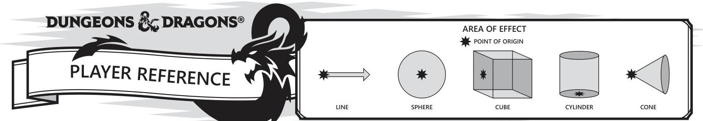

## COMBAT

RANGED ATTACKS (pg. 195)
Your attack roll has disadvantage when your target is beyond normal range, and you can not attack a target beyond the long range.
RANGED ATTACKS IN CLOSE QUARTERS (pg. 195)
When you make a ranged attack with a weapon, a spell, or some other means, you have disadvantage on the attack roll if you are within 5 feet of a hostile creature who can see you and who is not incapacitated
MELLE ATTACKS (pg. 195)
Combat within a 5 -foot reach
Unarmed Strike: 1 bludgeoning damage (pg. 149)
OPPORTUNITY ATTACK (pg. 195)
REACTION: A hostile creature moves out of your reach without disengaging. Gain interrupting attack
TWO-WEAPON FIGHTING (pg. 195)
2 light weapon attacks, one as action; other as bonus action. Thrown weapons can be thrown. Only negative modifiers apply to bonus attack
GRAPHUNG (pg. 195)
Attacker Athletics vs. Target Athletics or Acrobatics (target choice). See Grappled Condition
SHOWNING A CREATURE (pg. 195)
Attacker Athletics vs. Target Athletics or Acrobatics (target choice). Knock the target prone or push it 5 feet away

## SPELL CASTING (pg. 201)

## SPELLCASTING FOCUS

An item such as a crystal, an orb, a rod or wand, or holy symbol. Can be used in place of costless material components. Holy symbol must be held or worn visibly (for example, a shield)
CASTING IN ARMOIR
Must be proficient in armor type worn
ATTACK ROLLS
GDI + spellcasting ability modifier+ proficiency bonus
Ranged attacks have disadvantage within 5 feet of hostile who is not incapacitated
SAVING THROWS
DC $+8+$ spellcasting ability modifier + proficiency bonus + special modifiers
TARGETS
A CLEAR PATH TO TARGET - Cannot be behind total cover Area effect begins on near side of obstruction
TARGETING YOURSELF - If spell is target of choice, it can be caster, unless specified hostile or not caster (see spell description). Area of Effect can also target caster COMPONENTS
VERBAL (V) - Caster gagged or in area of silence can not cast a spell with verbal component
SOMATIC (S) - Caster must have one free hand to perform gestures for somatic component
MATERIAL (M) - Caster can use component pouch or spellcasting focus. Must have specific component to cast spell, even if consumed by spell. Must have one hand free to access component
DURATION
INSTANTANEOUS - Can not be dispelled
CONCENTRATION - If concentration is lost, spell ends. End concentration at any time, no action required. Moving \& attacking do not interfere with concentration. Casting another concentration spell. taking damage (DC $+10$ or 1/2 damage amount, whichever is higher), being incapacitated or killed ends concentration
COMBINING MADICAL EFFECTS
Effects of different spells add together and duration overlaps. Effects of same spells cast do not combine. Highest bonus applies while durations overlap SPELLCASTING CLASSES
'KNOWN' SPELL CLASSES - Arcane Trickster, Bard, Eldritch Knight, Paladin (Oath), Ranger, Sorcerer, Warlock
'PREPARED' SPELL CLASSES - Cleric, Druid, Monk (Elemental), Paladin, Wizard

## EXHAUSTION (CUMULATIVE)

## LEVEL EFFECT

1 Disadvantage on Ability checks
2 Speed halved
3 Disadvantage on attack rolls and saving throws
4 Hit Point maximum halved
5 Speed reduced to 0
6 Death

## ACTIONS IN COMBAT (pg. 192)

Attack
Cast Spell
Dash (additional movement up to your current speed) Disengage (prevents opportunity attacks)
Dodge (Hostile has disadvantage. Dexterity save has advantage) Help (give target advantage on next Check or Attack) Hide (Stealth Check for success) Ready (decide trigger \& reaction / hold spell before casting) Search (Perception or Investigation check) Use Object Improves an unlisted action Take Bonus Action if available

## CONDITIONS (pg. 290)

BUNDED - Auto-fail sight-dependant checks, disadvantage to your attacks, hostile has advantage
CHARMED - Cannot hurt / attack charmer, charmer has advantage to social ability checks
DEAFENED - Auto-fail hearing-dependant checks
FRIGHTENED - Disadvantage to checks/attacks while source of fear is in line of sight. Can't move closer to source of fear GRAPHLED - Speed 0, no bonus. Ends when grappler incapacitated or when moved out of reach of grappler from an effect
INCAPACITATED - No actions / reactions
INVISIBLE - Hiding + Heavily Obscured, still makes noise and tracks. You attack with advantage, hostile has disadvantage
PARALYZED - Incapacitated. Auto-fail DEX \& STR saves. Hostile has advantage. All damage from within 5 ft . critical
PETRIFIED - Your weight increases $\pm 10$, incapacitated, unaware of surroundings. Hostile has advantage. Auto-fail DEX and STR saves, resist all damage / poison / disease
POISONED - Attacks \& ability checks have disadvantage
PROMI - Can only crawl (1/2 speed), unless stands. Standing costs half of movement speed for round. You attack with disadvantage. Hostile has advantage within 5 ft ; over 5 ft ., has disadvantage
RESTRAIRED - Speed 0, no bonus. Your attacks \& DEX saves have disadvantage. Hostile has advantage
STUNNED - Incapacitated. Hostile has advantage. Auto-fail DEX / STR saves
UNCONSCIOUS - Incapacitated \& prone. Auto-fail DEX \& STR saves. Hostile has advantage. All damage from within 5 ft . critical

## MOVEMENT (pg. 182)

DIFFICULT TERRAIN
1 foot $+2$ feet of movement
CLIMBING, SWIMMING, CRAWLING
1 extra foot of movement
LONG JUMP
Run 10 ft ., distance $+u p$ to Strength score
Standing: 1/2 Strength score
HIGH JUMP
Run 16 ft .; $3+$ Strength modifier
Standing: $1 / 2$ that (extend arms to add 1.5 x height)

## MISCELLANEOUS

HIDING (pg. 177)
(if in combat, must disengage first)
Stealth vs. Perception (activity looking)
Stealth vs. Passive Perception (not looking)
Lightly Obscured + disadvantage on Perception check
Heavily Obscured + Blindness (see condition)
COVER (pg. 196)
1/2 cover $++2$ AC and DEX saving throws
3/4 cover $++5$ AC and DEX saving throws
Total cover $+$ Can't be targeted directly by attack or spell
CRITICAL HIT (pg. 196)
Roll damage twice, then add modifiers
RESTING (pg. 186)
Short $=$ at least 1 hr . use Hit Dice to regain lost Hit Points Long $+8 \mathrm{hr}$; regain all Hit Points, $1 / 2$ max Hit Dice, all spell slots CARRYING CAPACITY
Your carrying capacity is your Strength score multiplied by 15, weight in pounds.
PUSH, DRAG, OR LIFT
You can push, drag, or lift a weight in pounds up to twice your carrying capacity (or 30 times your Strength score) While pushing or dragging weight in excess of your carrying capacity, your speed drops to 5 feet.
SIZE AND STRENGTH
For each size category above Medium, double the creature's carrying capacity. For a Tiny creature, halve.

## SKILLS (pg. 174)

## STRENGTH

ATHLETICS - Covers difficult situations you encounter while climbing, jumping, or swimming.

## DEATBRITY

ACROBATICS - Covers your attempt to stay on your feet in a tricky situation, such as when you're trying to run across a sheet of ice, balance on a tightrope, or stay upright on a rocking ship's deck.
SLEIGHT OF HAND - When you attempt an act of legerdemain or manual trickery, such as planting something on someone else or concealing an object on your person. When you lift a coin purse off another person or slip something out of another person's pocket.
STEALTH - When you attempt to conceal yourself from enemies, slink past guard, slip away without being noticed, or sneak up on someone without being seen or heard.

## INTELLIGENCE

ARCANA - Measures your ability to recall lore about spells, magic items, eldritch symbols, magical traditions, the planes of existence, and the inhabitants of those planes.
HISTORY - Measures your ability to recall lore about historical events, legendary people, ancient kingdoms, past disputes, recent wars, and lost civilizations.
INVESTIGATION - When you look around for clues and make deductions based on those clues. You might deduce the location of a hidden object, discern from the appearance of a wound what kind of weapon dealt it, or determine the weakest point in a tunnel that could cause it to collapse. Poring through ancient scrolls is search of a hidden fragment of knowledge.
NATURE - Measures your ability to recall lore about terrain, plants and animals, the weather, and natural cycles.
RELIGION - Measures your ability to recall lore about deities, rites and prayers, religious hirarchies, holy symbols, and the practices of secret cults.

## WISDOM

ANIMAL HANDLING - When there is any question whether you can calm down a domesticated animal, keep a mount from getting spooked, or intuit an animal's intentions. Check to control your mount when you attempt a tricky maneuver. INSIGHT - Whether you can determine the true intentions of a creature, such as searching out a lie or predicting someone's next move. Doing so includes gleaning clues from body language, speech habits, and changes in mannerisms. MEDICINE - Try to stabilize a dying companion or diagnose an illness.
PERCEPTION - Lets you spot, hear, or otherwise detect the presence of something. It measures your general awareness of your surroundings and the keenness of your senses. For example, you might try to hear a conversation through a closed door, eavesdrop under an open window, or hear monsters moving stealthily in the forest. Or you might try to spot things that are obscured or easy to miss, whether they are orcs lying in ambush on a road, thugs hiding in the shadows of an alley, or candlelight under a closed secret door.
SURVIVAL - Follow tracks, hunt wild game, guide your group through frozen wastelands, identify signs that owllsears live nearby, predict the weather, or avoid quicksand and other natural hazards.

## CHARISMA

DECEPTION - Determines whether you can convincingly hide the truth, either verbally or through your actions. This deception can encompass everything from misleading others through ambiguity to telling outright lies. Typical situations include trying to fast-talk a guard, con a merchant, earn money through gambling, pass yourself off in a disguise, dull someone's suspicions with false assurances, or maintain a straight face while telling a blatant lie.
INTIMIDATION - When you attempt to influence someone through over threats, hostile actions, and physical violence. Examples include trying to pry information out of a prisoner, convincing street thugs to back down from a confrontation, or using the edge of a broken bottle to convince a sneering vizier to reconsider a decision.
PERFORMANCE - Determines how well you can delight an audience with music, dance, acting, storytelling, or some other form of entertainment.
PERSUASION - When you attempt to influence someone or a group of people with tact, social graces, or good nature. Typically, you use persuasion when acting in good faith, to foster friendships, make cordial requests, or exhibit proper etiquette. Examples of persuading others include convincing a
chamberlain to let your party see the king, negotiating peace between warring tribes, or inspiring a crowd of townsfolk.