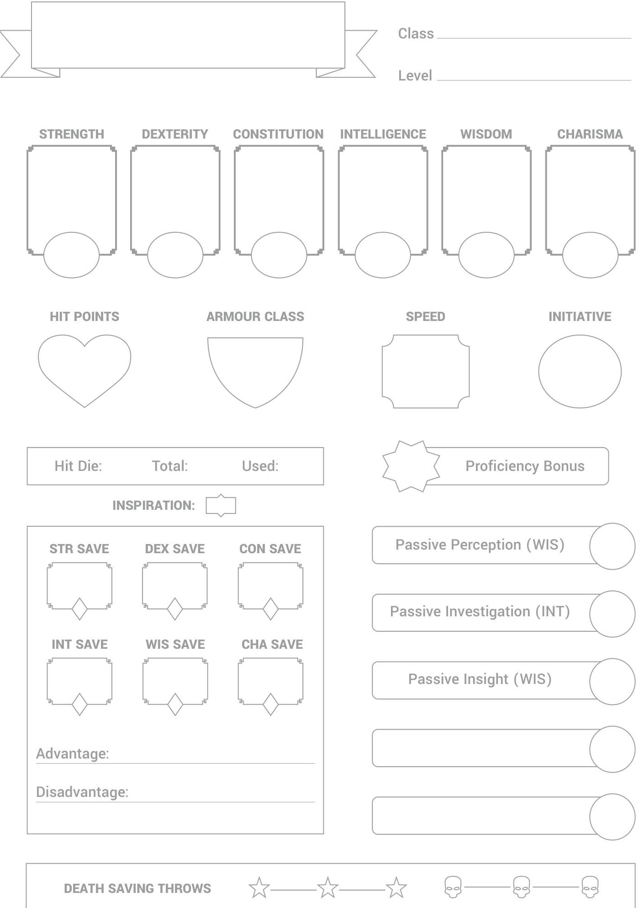
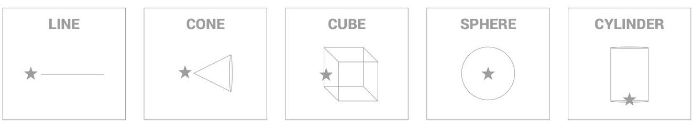
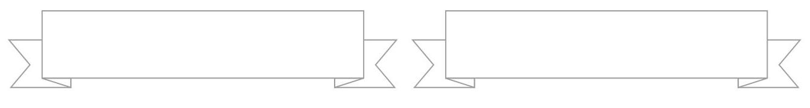

# Character Profile

## Character Profile

### Character Name

### Species

- **Class**
- **Level**

### Legend

- **STRENGTH**
- **DEXTERITY**
- **CONSTITUTION**
- **INTELLIGENCE**
- **WISDOM**
- **CHARISMA**

### HIT POINTS

- **ARMOUR CLASS**
- **SPEED**
- **INITIATIVE**

### Hit Die:

- **Total:**
- **Used:**

### INSPIRATION

- **STR SAVE**
- **DEX SAVE**
- **CON SAVE**

### INT SAVE

- **WIS SAVE**
- **CHA SAVE**

### Advantage:

### Disadvantage:

### Proficiency Bonus

### Passive Perception (WIS)

### Passive Investigation (INT)

### Passive Insight (WIS)

### DEATH SAVING THROWS

- **DEATH SAVING THROWS**

---

# **Proficieries**

|  Prof. | Mod. | Skill | Bonus | WEAPONS  |
| --- | --- | --- | --- | --- |
|  ☐ | DEX | ACROBATICS |  |   |
|  ☐ | WIS | ANIMAL HANDLING |  |   |
|  ☐ | INT | ARCANA |  |   |
|  ☐ | STR | ATHLETICS |  |   |
|  ☐ | CHA | DECEPTION |  | ARMOUR  |
|  ☐ | INT | HISTORY |  |   |
|  ☐ | WIS | INSIGHT |  |   |
|  ☐ | CHA | INTIMIDATION |  |   |
|  ☐ | INT | INVESTIGATION |  |   |
|  ☐ | WIS | MEDICINE |  | TOOLS  |
|  ☐ | INT | NATURE |  |   |
|  ☐ | WIS | PERCEPTION |  |   |
|  ☐ | CHA | PERFORMANCE |  |   |
|  ☐ | CHA | PERSUASION |  |   |
|  ☐ | INT | RELIGION |  | OTHER  |
|  ☐ | DEX | SLEIGHT OF HAND |  |   |
|  ☐ | DEX | STEALTH |  |   |
|  ☐ | WIS | SURVIVAL |  |   |
|  ☐ |  |  |  |   |
|  ☐ |  |  |  |   |
|  ☐ |  |  |  |   |
|  ☐ |  |  |  |   |

**Languages**

---

# Action List

- **ATTACK**
- **UNARMED STRIKE**
- **CAST A SPELL**
- **DASH**
- **DISENGAGE**
- **DODGE**
- **GRAPPLE**
- **HELP**
- **HIDE**
- **IMPROVISE**
- **READY**
- **SEARCH**
- **SHOVE**
- **USE AN OBJECT**

## Attacks

- **Weapon**: Range
- **Hit**: Damage

## Bonus Actions

## Reactions

---

# Class Features

---

# Species Traits

---

# Appearance 

| Height | Weight | Age | Eyes | Skin | Hair |
| :-- | :-- | :-- | :-- | :-- | :-- |

## PORTRAIT

## Alignment

|  | Lawful (Principle) | Neutral (Need) | Chaotic (Impulse) |
| :--: | :--: | :--: | :--: |
| Good   (Pure) | Truth, order and   justice bring joy   and harmony. | My own morals   lead me to help   those in need. | Doing the right thing   is all that counts, no   matter the means. |
| Neutral   (Self) | The honour code   I live by defines all   my actions. | I don't take sides.   Instead, I do what   best suits my goal. | Freedom is the   most important   thing we have. |
| Evil   (Corrupt) | Those who do not   stand in line will be   removed with force. | My cause is clear,   and it's the only   thing that matters. | Destroying and   hurting others gives   me great enjoyment. |

---

# > 

## Special

## > Ideals

$\qquad$
$\qquad$
$\qquad$
$\qquad$
$\qquad$
$\qquad$
$\qquad$
$\qquad$

## Bonds

$\qquad$
$\qquad$
$\qquad$
$\qquad$
$\qquad$
$\qquad$
$\qquad$

## Flaws

$\qquad$
$\qquad$
$\qquad$
$\qquad$
$\qquad$
$\qquad$

## Family

$\qquad$
Grandparents: $\qquad$

Parents: $\qquad$

Siblings: $\qquad$ Spouse: $\qquad$

Children: $\qquad$

---

# Backstory

---

# Equipment 

Name Weight Quantity Value Properties

---

# Equipment

|  Name | Weight | Quantity | Value | Properties  |
| --- | --- | --- | --- | --- |
|  |   |   |   |   |
|  |   |   |   |   |
|  |   |   |   |   |
|  |   |   |   |   |
|  |   |   |   |   |
|  |   |   |   |   |
|  |   |   |   |   |
|  |   |   |   |   |
|  |   |   |   |   |
|  |   |   |   |   |
|  |   |   |   |   |
|  |   |   |   |   |
|  |   |   |   |   |
|  |   |   |   |   |
|  |   |   |   |   |
|  |   |   |   |   |
|  |   |   |   |   |
|  |   |   |   |   |
|  |   |   |   |   |
|  |   |   |   |   |
|  |   |   |   |   |
|  |   |   |   |   |
|  |   |   |   |   |
|  |   |   |   |   |
|  |   |   |   |   |
|  |   |   |   |   |
|  |   |   |   |   |
|  |   |   |   |   |
|  |   |   |   |   |
|  |   |   |   |   |
|  |   |   |   |   |

---

# Currency

|  PLATINUM | GOLD | ELECTRUM | SILVER | COPPER  |
| --- | --- | --- | --- | --- |
|  |   |   |   |   |

|  Coin Type | Copper | Silver | Electrum | Gold | Platinum  |
| --- | --- | --- | --- | --- | --- |
|  Copper | 1 | 1/10 | 1/50 | 1/100 | 1/1000  |
|  Silver | 10 | 1 | 1/5 | 1/10 | 1/100  |
|  Electrum | 50 | 5 | 1 | 1/2 | 1/20  |
|  Gold | 100 | 10 | 2 | 1 | 1/10  |
|  Platinum | 1000 | 100 | 20 | 10 | 1  |

## Outstanding Debts

|  Paid | Name | Amount | Due | Reason  |
| --- | --- | --- | --- | --- |
|  ☐ |  |  |  |   |
|  ☐ |  |  |  |   |
|  ☐ |  |  |  |   |
|  ☐ |  |  |  |   |
|  ☐ |  |  |  |   |
|  ☐ |  |  |  |   |
|  ☐ |  |  |  |   |
|  ☐ |  |  |  |   |
|  ☐ |  |  |  |   |
|  ☐ |  |  |  |   |
|  ☐ |  |  |  |   |
|  ☐ |  |  |  |   |
|  ☐ |  |  |  |   |
|  ☐ |  |  |  |   |
|  ☐ |  |  |  |   |
|  ☐ |  |  |  |   |
|  ☐ |  |  |  |   |
|  ☐ |  |  |  |   |
|  ☐ |  |  |  |   |
|  ☐ |  |  |  |   |
|  ☐ |  |  |  |   |
|  ☐ |  |  |  |   |
|  ☐ |  |  |  |   |
|  ☐ |  |  |  |   |
|  ☐ |  |  |  |   |
|  ☐ |  |  |  |   |
|  ☐ |  |  |  |   |
|  ☐ |  |  |  |   |
|  ☐ |  |  |  |   |
|  ☐ |  |  |  |   |
|  ☐ |  |  |  |   |

---

Done Quest Giver
Task
Reward
0
0
0
0
0
0
0
0
0
0
0
0
0
0
0
0
0
0
0
0
0
0
0
0
0
0
0
0
0
0
0
0
0
0
0
0
0
0
0
0
0
0
0
0
0
0
0
0
0
0
0
0
0
0
0
0
0
0
0
0
0
0
0
0
0
0
0
0
0
0
0
0
0
0
0
0
0
0
0
0
0
0
0
0
0
0
0
0
0
0
0
0
0
0
0
0
0
0
0
0

---

# Downtime Activities 

Activity Progress Cost

---

# House Rules

## House Rules

### First Name

### Second Name

### Third Name

### Fourth Name

### FULL & FULL FREEDOM

### FULL FREEDOM

### FULL FREEDOM

### FULL FREEDOM

### FULL FREEDOM

### FULL FREEDOM

### FULL FREEDOM

### FULL FREEDOM

### FULL FREEDOM

### FULL FREEDOM

### FULL FREEDOM

### FULL FREEDOM

### FULL FREEDOM

### FULL FREEDOM

### FULL FREEDOM

### FULL FREEDOM

### FULL FREEDOM

### FULL FREEDOM

### FULL FREEDOM

### FULL FREEDOM

### FULL FREEDOM

### FULL FREEDOM

### FULL FREEDOM

### FULL FREEDOM

### FULL FREEDOM

### FULL FREEDOM

### FULL FREEDOM

### FULL FREEDOM

### FULL FREEDOM

### FULL FREEDOM

### FULL FREEDOM

### FULL FREEDOM

---

# Class Features by Level 

Level Prof. Bonus Features Other
1st $+2$ $\qquad$ $\qquad$ $\qquad$ $\qquad$
2nd $+2$ $\qquad$ $\qquad$ $\qquad$ $\qquad$
3rd $+2$ $\qquad$ $\qquad$ $\qquad$ $\qquad$
4th $+2$ $\qquad$ $\qquad$ $\qquad$ $\qquad$
5th $+3$ $\qquad$ $\qquad$ $\qquad$ $\qquad$
6th $+3$ $\qquad$ $\qquad$ $\qquad$ $\qquad$
7th $+3$ $\qquad$ $\qquad$ $\qquad$ $\qquad$ $\qquad$
8th $+3$ $\qquad$ $\qquad$ $\qquad$ $\qquad$ $\qquad$
9th $+4$ $\qquad$ $\qquad$ $\qquad$ $\qquad$ $\qquad$
10th $+4$ $\qquad$ $\qquad$ $\qquad$ $\qquad$ $\qquad$

Class Notes

---

| Level | Prof. Bonus | Features | Other |
| :--: | :--: | :--: | :--: |
| 11th | $+4$ |  |  |
| 12th | $+4$ |  |  |
| 13th | $+5$ |  |  |
| 14th | $+5$ |  |  |
| 15th | $+5$ |  |  |
| 16th | $+5$ |  |  |
| 17th | $+6$ |  |  |
| 18th | $+6$ |  |  |
| 19th | $+6$ |  |  |
| 20th | $+6$ |  |  |
| Subclass Notes |  |  |  |

---

# Spell Slots 

---

# Spell Slots

|  Lv | Slots | Remaining | Lv | Slots | Remaining  |
| --- | --- | --- | --- | --- | --- |
|  6 |  |  | 8 |  |   |

|  Prep | Spell Name | Prep | Spell Name  |
| --- | --- | --- | --- |
|  ☐ |  | ☐ |   |
|  ☐ |  | ☐ |   |
|  ☐ |  | ☐ |   |
|  ☐ |  | ☐ |   |
|  ☐ |  | ☐ |   |
|  ☐ |  | ☐ |   |
|  ☐ |  | ☐ |   |
|  ☐ |  | ☐ |   |
|  ☐ |  | ☐ |   |
|  ☐ |  | ☐ |   |
|  ☐ |  | ☐ |   |
|  ☐ |  | ☐ |   |
|  ☐ | Slots | Remaining | Lv  |
|  7 |  |  | 9  |

|  Prep | Spell Name | Prep | Spell Name  |
| --- | --- | --- | --- |
|  ☐ |  | ☐ |   |
|  ☐ |  | ☐ |   |
|  ☐ |  | ☐ |   |
|  ☐ |  | ☐ |   |
|  ☐ |  | ☐ |   |
|  ☐ |  | ☐ |   |
|  ☐ |  | ☐ |   |
|  ☐ |  | ☐ |   |
|  ☐ |  | ☐ |   |
|  ☐ |  | ☐ |   |
|  ☐ |  | ☐ |   |
|  ☐ |  | ☐ |   |
|  ☐ |  | ☐ |   |
|  ☐ |  | ☐ |   |
|  ☐ |  | ☐ |   |
|  ☐ |  | ☐ |   |
|  ☐ |  | ☐ |   |
|  ☐ |  | ☐ |   |
|  ☐ |  | ☐ |   |
|  ☐ |  | ☐ |   |
|  ☐ |  | ☐ |   |
|  ☐ |  | ☐ |   |
|  ☐ |  | ☐ |   |
|  ☐ |  | ☐ |   |
|  ☐ |  | ☐ |   |
|  ☐ |  | ☐ |   |
|  ☐ |  | ☐ |   |
|  ☐ |  | ☐ |   |
|  ☐ |  | ☐ |   |
|  ☐ |  | ☐ |   |
|  ☐ |  | ☐ |   |

---

Name
Level Rules

---

# Favourite Spells 

Name
Level Rules
$\qquad$
$\qquad$
$\qquad$
$\qquad$
$\qquad$
$\qquad$
$\qquad$
$\qquad$
$\qquad$
$\qquad$
$\qquad$
$\qquad$
$\qquad$
$\qquad$
$\qquad$
$\qquad$
$\qquad$
$\qquad$
$\qquad$
$\qquad$
$\qquad$
$\qquad$
$\qquad$
$\qquad$
$\qquad$
$\qquad$
$\qquad$
$\qquad$
$\qquad$
$\qquad$
$\qquad$

## Areas of Effect

$\star=$ Point of Origin

---

$\qquad$
$\qquad$
$\qquad$
$\qquad$
$\qquad$
$\qquad$
$\qquad$
$\qquad$
$\qquad$
$\qquad$
$\qquad$
$\qquad$
$\qquad$
$\qquad$
$\qquad$

$\qquad$
$\qquad$
$\qquad$
$\qquad$
$\qquad$
$\qquad$
$\qquad$
$\qquad$
$\qquad$
$\qquad$
$\qquad$
$\qquad$
$\qquad$
$\qquad$
$\qquad$
$\qquad$
$\qquad$

---

|  |   |   |
| --- | --- | --- |
|  |   |   |
|  |   |   |
|  |   |   |
|  |   |   |
|  |   |   |
|  |   |   |
|  |   |   |
|  |   |   |
|  |   |   |
|  |   |   |
|  |   |   |
|  |   |   |
|  |   |   |
|  |   |   |
|  |   |   |
|  |   |   |
|  |   |   |
|  |   |   |
|  |   |   |
|  |   |   |
|  |   |   |
|  |   |   |
|  |   |   |
|  |   |   |
|  |   |   |
|  |   |   |
|  |   |   |
|  |   |   |
|  |   |   |
|  |   |   |
|  |   |   |

---

.

---

|  11 |  |  |  |  |  |  |  |  |  |  |  |  |  |  |  |  |  |  |  |  |  |  |  |  |  |  |  |  |  |  |  |  |  |  |  |  |  |  |  |  |  |  |  |  |   |
| --- | --- | --- | --- | --- | --- | --- | --- | --- | --- | --- | --- | --- | --- | --- | --- | --- | --- | --- | --- | --- | --- | --- | --- | --- | --- | --- | --- | --- | --- | --- | --- | --- | --- | --- | --- | --- | --- | --- | --- | --- | --- | --- | --- | --- |
|  12 |  |  |  |  |  |  |  |  |  |  |  |  |  |  |  |  |  |  |  |  |  |  |  |  |  |  |  |  |  |  |  |  |  |  |  |  |  |  |  |  |  |   |
|  13 |  |  |  |  |  |  |  |  |  |  |  |  |  |  |  |  |  |  |  |  |  |  |  |  |  |  |  |  |  |  |  |  |  |  |  |  |  |  |  |  |  |   |
|  14 |  |  |  |  |  |  |  |  |  |  |  |  |  |  |  |  |  |  |  |  |  |  |  |  |  |  |  |  |  |  |  |  |  |  |  |  |  |  |  |  |  |   |
|  15 |  |  |  |  |  |  |  |  |  |  |  |  |  |  |  |  |  |  |  |  |  |  |  |  |  |  |  |  |  |  |  |  |  |  |  |  |  |  |  |  |  |   |
|  16 |  |  |  |  |  |  |  |  |  |  |  |  |  |  |  |  |  |  |  |  |  |  |  |  |  |  |  |  |  |  |  |  |  |  |  |  |  |  |  |  |  |   |
|  17 |  |  |  |  |  |  |  |  |  |  |  |  |  |  |  |  |  |  |  |  |  |  |  |  |  |  |  |  |  |  |  |  |  |  |  |  |  |  |  |  |  |   |
|  18 |  |  |  |  |  |  |  |  |  |  |  |  |  |  |  |  |  |  |  |  |  |  |  |  |  |  |  |  |  |  |  |  |  |  |  |  |  |  |  |  |  |   |
|  19 |  |  |  |  |  |  |  |  |  |  |  |  |  |  |  |  |  |  |  |  |  |  |  |  |  |  |  |  |  |  |  |  |  |  |  |  |  |  |  |  |  |   |
|  20 |  |  |  |  |  |  |  |  |  |  |  |  |  |  |  |  |  |  |  |  |  |  |  |  |  |  |  |  |  |  |  |  |  |  |  |  |  |  |  |  |  |   |
|  21 |  |  |  |  |  |  |  |  |  |  |  |  |  |  |  |  |  |  |  |  |  |  |  |  |  |  |  |  |  |  |  |  |  |  |  |  |  |  |  |  |  |   |
|  22 |  |  |  |  |  |  |  |  |  |  |  |  |  |  |  |  |  |  |  |  |  |  |  |  |  |  |  |  |  |  |  |  |  |  |  |  |  |  |  |  |  |   |
|  23 |  |  |  |  |  |  |  |  |  |  |  |  |  |  |  |  |  |  |  |  |  |  |  |  |  |  |  |  |  |  |  |  |  |  |  |  |  |  |  |  |  |   |
|  24 |  |  |  |  |  |  |  |  |  |  |  |  |  |  |  |  |  |  |  |  |  |  |  |  |  |  |  |  |  |  |  |  |  |  |  |  |  |  |  |  |  |   |
|  25 |  |  |  |  |  |  |  |  |  |  |  |  |  |  |  |  |  |  |  |  |  |  |  |  |  |  |  |  |  |  |  |  |  |  |  |  |  |  |  |  |  |   |
|  26 |  |  |  |  |  |  |  |  |  |  |  |  |  |  |  |  |  |  |  |  |  |  |  |  |  |  |  |  |  |  |  |  |  |  |  |  |  |  |  |  |  |   |
|  27 |  |  |  |  |  |  |  |  |  |  |  |  |  |  |  |  |  |  |  |  |  |  |  |  |  |  |  |  |  |  |  |  |  |  |  |  |  |  |  |  |  |   |
|  28 |  |  |  |  |  |  |  |  |  |  |  |  |  |  |  |  |  |  |  |  |  |  |  |  |  |  |  |  |  |  |  |  |  |  |  |  |  |  |  |  |  |   |
|  29 |  |  |  |  |  |  |  |  |  |  |  |  |  |  |  |  |  |  |  |  |  |  |  |  |  |  |  |  |  |  |  |  |  |  |  |  |  |  |  |  |  |   |
|  30 |  |  |  |  |  |  |  |  |  |  |  |  |  |  |  |  |  |  |  |  |  |  |  |  |  |  |  |  |  |  |  |  |  |  |  |  |  |  |  |  |  |   |
|  31 |  |  |  |  |  |  |  |  |  |  |  |  |  |  |  |  |  |  |  |  |  |  |  |  |  |  |  |  |  |  |  |  |  |  |  |  |  |  |  |  |  |   |
|  32 |  |  |  |  |  |  |  |  |  |  |  |  |  |  |  |  |  |  |  |  |  |  |  |  |  |  |  |  |  |  |  |  |  |  |  |  |  |  |  |  |  |   |
|  33 |  |  |  |  |  |  |  |  |  |  |  |  |  |  |  |  |  |  |  |  |  |  |  |  |  |  |  |  |  |  |  |  |  |  |  |  |  |  |  |  |  |   |
|  34 |  |  |  |  |  |  |  |  |  |  |  |  |  |  |  |  |  |  |  |  |  |  |  |  |  |  |  |  |  |  |  |  |  |  |  |  |  |  |  |  |  |   |
|  35 |  |  |  |  |  |  |  |  |  |  |  |  |  |  |  |  |  |  |  |  |  |  |  |  |  |  |  |  |  |  |  |  |  |  |  |  |  |  |  |  |  |   |
|  36 |  |  |  |  |  |  |  |  |  |  |  |  |  |  |  |  |  |  |  |  |  |  |  |  |  |  |  |  |  |  |  |  |  |  |  |  |  |  |  |  |  |   |
|  37 |  |  |  |  |  |  |  |  |  |  |  |  |  |  |  |  |  |  |  |  |  |  |  |  |  |  |  |  |  |  |  |  |  |  |  |  |  |  |  |  |  |   |
|  38 |  |  |  |  |  |  |  |  |  |  |  |  |  |  |  |  |  |  |  |  |  |  |  |  |  |  |  |  |  |  |  |  |  |  |  |  |  |  |  |  |  |   |
|  39 |  |  |  |  |  |  |  |  |  |  |  |  |  |  |  |  |  |  |  |  |  |  |  |  |  |  |  |  |  |  |  |  |  |  |  |  |  |  |  |  |  |   |
|  40 |  |  |  |  |  |  |  |  |  |  |  |  |  |  |  |  |  |  |  |  |  |  |  |  |  |  |  |  |  |  |  |  |  |  |  |  |  |  |  |  |  |   |
|  41 |  |  |  |  |  |  |  |  |  |  |  |  |  |  |  |  |  |  |  |  |  |  |  |  |  |  |  |  |  |  |  |  |  |  |  |  |  |  |  |  |  |   |
|  42 |  |  |  |  |  |  |  |  |  |  |  |  |  |  |  |  |  |  |  |  |  |  |  |  |  |  |  |  |  |  |  |  |  |  |  |  |  |  |  |  |  |   |
|  43 |  |  |  |  |  |  |  |  |  |  |  |  |  |  |  |  |  |  |  |  |  |  |  |  |  |  |  |  |  |  |  |  |  |  |  |  |  |  |  |  |  |   |
|  44 |  |  |  |  |  |  |  |  |  |  |  |  |  |  |  |  |  |  |  |  |  |  |  |  |  |  |  |  |  |  |  |  |  |  |  |  |  |  |  |  |  |   |
|  45 |  |  |  |  |  |  |  |  |  |  |  |  |  |  |  |  |  |  |  |  |  |  |  |  |  |  |  |  |  |  |  |  |  |  |  |  |  |  |  |  |  |   |
|  46 |  |  |  |  |  |  |  |  |  |  |  |  |  |  |  |  |  |  |  |  |  |  |  |  |  |  |  |  |  |  |  |  |  |  |  |  |  |  |  |  |  |   |
|  47 |  |  |  |  |  |  |  |  |  |  |  |  |  |  |  |  |  |  |  |  |  |  |  |  |  |  |  |  |  |  |  |  |  |  |  |  |  |  |  |  |  |   |
|  48 |  |  |  |  |  |  |  |  |  |  |  |  |  |  |  |  |  |  |  |  |  |  |  |  |  |  |  |  |  |  |  |  |  |  |  |  |  |  |  |  |  |   |
|  49 |  |  |  |  |  |  |  |  |  |  |  |  |  |  |  |  |  |  |  |  |  |  |  |  |  |  |  |  |  |  |  |  |  |  |  |  |  |  |  |  |  |   |
|  50 |  |  |  |  |  |  |  |  |  |  |  |  |  |  |  |  |  |  |  |  |  |  |  |  |  |  |  |  |  |  |  |  |  |  |  |  |  |  |  |  |  |   |
|  51 |  |  |  |  |  |  |  |  |  |  |  |  |  |  |  |  |  |  |  |  |  |  |  |  |  |  |  |  |  |  |  |  |  |  |  |  |  |  |  |  |  |   |
|  52 |  |  |  |  |  |  |  |  |  |  |  |  |  |  |  |  |  |  |  |  |  |  |  |  |  |  |  |  |  |  |  |  |  |  |  |  |  |  |  |  |  |   |
|  53 |  |  |  |  |  |  |  |  |  |  |  |  |  |  |  |  |  |  |  |  |  |  |  |  |  |  |  |  |  |  |  |  |  |  |  |  |  |  |  |  |  |   |
|  54 |  |  |  |  |  |  |  |  |  |  |  |  |  |  |  |  |  |  |  |  |  |  |  |  |  |  |  |  |  |  |  |  |  |  |  |  |  |  |  |  |  |   |
|  55 |  |  |  |  |  |  |  |  |  |  |  |  |  |  |  |  |  |  |  |  |  |  |  |  |  |  |  |  |  |  |  |  |  |  |  |  |  |  |  |  |  |   |
|  56 |  |  |  |  |  |  |  |  |  |  |  |  |  |  |  |  |  |  |  |  |  |  |  |  |  |  |  |  |  |  |  |  |  |  |  |  |  |  |  |  |  |   |
|  57 |  |  |  |  |  |  |  |  |  |  |  |  |  |  |  |  |  |  |  |  |  |  |  |  |  |  |  |  |  |  |  |  |  |  |  |  |  |  |  |  |  |   |
|  58 |  |  |  |  |  |  |  |  |  |  |  |  |  |  |  |  |  |  |  |  |  |  |  |  |  |  |  |  |  |  |  |  |  |  |  |  |  |  |  |  |  |   |
|  59 |  |  |  |  |  |  |  |  |  |  |  |  |  |  |  |  |  |  |  |  |  |  |  |  |  |  |  |  |  |  |  |  |  |  |  |  |  |  |  |  |  |   |
|  60 |  |  |  |  |  |  |  |  |  |  |  |  |  |  |  |  |  |  |  |  |  |  |  |  |  |  |  |  |  |  |  |  |  |  |  |  |  |  |  |  |  |   |
|  61 |  |  |  |  |  |  |  |  |  |  |  |  |  |  |  |  |  |  |  |  |  |  |  |  |  |  |  |  |  |  |  |  |  |  |  |  |  |  |  |  |  |   |
|  62 |  |  |  |  |  |  |  |  |  |  |  |  |  |  |  |  |  |  |  |  |  |  |  |  |  |  |  |  |  |  |  |  |  |  |  |  |  |  |  |  |  |  |   |
|  63 |  |  |  |  |  |  |  |  |  |  |  |  |  |  |  |  |  |  |  |  |  |  |  |  |  |  |  |  |  |  |  |  |  |  |  |  |  |  |  |  |  |  |   |
|  64 |  |  |  |  |  |  |  |  |  |  |  |  |  |  |  |  |  |  |  |  |  |  |  |  |  |  |  |  |  |  |  |  |  |  |  |  |  |  |  |  |  |  |   |
|  65 |  |  |  |  |  |  |  |  |  |  |  |  |  |  |  |  |  |  |  |  |  |  |  |  |  |  |  |  |  |  |  |  |  |  |  |  |  |  |  |  |  |  |   |
|  66 |  |  |  |  |  |  |  |  |  |  |  |  |  |  |  |  |  |  |  |  |  |  |  |  |  |  |  |  |  |  |  |  |  |  |  |  |  |  |  |  |  |  |   |
|  67 |  |  |  |  |  |  |  |  |  |  |  |  |  |  |  |  |  |  |  |  |  |  |  |  |  |  |  |  |  |  |  |  |  |  |  |  |  |  |  |  |  |  |   |
|  68 |  |  |  |  |  |  |  |  |  |  |  |  |  |  |  |  |  |  |  |  |  |  |  |  |  |  |  |  |  |  |  |  |  |  |  |  |  |  |  |  |  |  |  |   |
|  69 |  |  |  |  |  |  |  |  |  |  |  |  |  |  |  |  |  |  |  |  |  |  |  |  |  |  |  |  |  |  |  |  |  |  |  |  |  |  |  |  |  |  |  |   |
|  70 |  |  |  |  |  |  |  |  |  |  |  |  |  |  |  |  |  |  |  |  |  |  |  |  |  |  |  |  |  |  |  |  |  |  |  |  |  |  |  |  |  |  |   |
|  71 |  |  |  |  |  |  |  |  |  |  |  |  |  |  |  |  |  |  |  |  |  |  |  |  |  |  |  |  |  |  |  |  |  |  |  |  |  |  |  |  |  |  |   |
|  72 |  |  |  |  |  |  |  |  |  |  |  |  |  |  |  |  |  |  |  |  |  |  |  |  |  |  |  |  |  |  |  |  |  |  |  |  |  |  |  |  |  |  |   |
|  73 |  |  |  |  |  |  |  |  |  |  |  |  |  |  |  |  |  |  |  |  |  |  |  |  |  |  |  |  |  |  |  |  |  |  |  |  |  |  |  |  |  |  |   |
|  74 |  |  |  |  |  |  |  |  |  |  |  |  |  |  |  |  |  |  |  |  |  |  |  |  |  |  |  |  |  |  |  |  |  |  |  |  |  |  |  |  |  |  |   |
|  75 |  |  |  |  |  |  |  |  |  |  |  |  |  |  |  |  |  |  |  |  |  |  |  |  |  |  |  |  |  |  |  |  |  |  |  |  |  |  |  |  |  |  |   |
|  76 |  |  |  |  |  |  |  |  |  |  |  |  |  |  |  |  |  |  |  |  |  |  |  |  |  |  |  |  |  |  |  |  |  |  |  |  |  |  |  |  |  |  |   |
|  77 |  |  |  |  |  |  |  |  |  |  |  |  |  |  |  |  |  |  |  |  |  |  |  |  |  |  |  |  |  |  |  |  |  |  |  |  |  |  |  |  |  |  |   |
|  78 |  |  |  |  |  |  |  |  |  |  |  |  |  |  |  |  |  |  |  |  |  |  |  |  |  |  |  |  |  |  |  |  |  |  |  |  |  |  |  |  |  |  |   |
|  79 |  |  |  |  |  |  |  |  |  |  |  |  |  |  |  |  |  |  |  |  |  |  |  |  |  |  |  |  |  |  |  |  |  |  |  |  |  |  |  |  |  |  |   |
|  80 |  |  |  |  |  |  |  |  |  |  |  |  |  |  |  |  |  |  |  |  |  |  |  |  |  |  |  |  |  |  |  |  |  |  |  |  |  |  |  |  |  |  |  |   |
|  81 |  |  |  |  |  |  |  |  |  |  |  |  |  |  |  |  |  |  |  |  |  |  |  |  |  |  |  |  |  |  |  |  |  |  |  |  |  |  |  |  |  |  |  |   |
|  82 |  |  |  |  |  |  |  |  |  |  |  |  |  |  |  |  |  |  |  |  |  |  |  |  |  |  |  |  |  |  |  |  |  |  |  |  |  |  |  |  |  |  |  |   |
|  83 |  |  |  |  |  |  |  |  |  |  |  |  |  |  |  |  |  |  |  |  |  |  |  |  |  |  |  |  |  |  |  |  |  |  |  |  |  |  |  |  |  |  |  |   |
|  84 |  |  |  |  |  |  |  |  |  |  |  |  |  |  |  |  |  |  |  |  |  |  |  |  |  |  |  |  |  |  |  |  |  |  |  |  |  |  |  |  |  |  |  |   |
|  85 |  |  |  |  |  |  |  |  |  |  |  |  |  |  |  |  |  |  |  |  |  |  |  |  |  |  |  |  |  |  |  |  |  |  |  |  |  |  |  |  |  |  |  |  |   |
|  86 |  |  |  |  |  |  |  |  |  |  |  |  |  |  |  |  |  |  |  |  |  |  |  |  |  |  |  |  |  |  |  |  |  |  |  |  |  |  |  |  |  |  |  |  |  |   |
|  87 |  |  |  |  |  |  |  |  |  |  |  |  |  |  |  |  |  |  |  |  |  |  |  |  |  |  |  |  |  |  |  |  |  |  |  |  |  |  |  |  |  |  |  |  |  |  |   |
|  88 |  |  |  |  |  |  |  |  |  |  |  |  |  |  |  |  |  |  |  |  |  |  |  |  |  |  |  |  |  |  |  |  |  |  |  |  |  |  |  |  |  |  |  |  |  |  |   |
|  89 |  |  |  |  |  |  |  |  |  |  |  |  |  |  |  |  |  |  |  |  |  |  |  |  |  |  |  |  |  |  |  |  |  |  |  |  |  |  |  |  |  |  |  |  |  |  |  |   |
|  90 |  |  |  |  |  |  |  |  |  |  |  |  |  |  |  |  |  |  |  |  |  |  |  |  |  |  |  |  |  |  |  |  |  |  |  |  |  |  |  |  |  |  |  |  |  |  |  |  |   |
|  91 |  |  |  |  |  |  |  |  |  |  |  |  |  |  |  |  |  |  |  |  |  |  |  |  |  |  |  |  |  |  |  |  |  |  |  |  |  |  |  |  |  |  |  |  |  |  |  |  |   |
|  92 |  |  |  |  |  |  |  |  |  |  |  |  |  |  |  |  |  |  |  |  |  |  |  |  |  |  |  |  |  |  |  |  |  |  |  |  |  |  |  |  |  |  |  |  |  |  |  |  |  |   |
|  93 |  |  |  |  |  |  |  |  |  |  |  |  |  |  |  |  |  |  |  |  |  |  |  |  |  |  |  |  |  |  |  |  |  |  |  |  |  |  |  |  |  |  |  |  |  |  |  |  |  |  |  |   |
|  94 |  |  |  |  |  |  |  |  |  |  |  |  |  |  |  |  |  |  |  |  |  |  |  |  |  |  |  |  |  |  |  |  |  |  |  |  |  |  |  |  |  |  |  |  |  |  |  |  |  |  |  |  |  |   |
|  95 |  |  |  |  |  |  |  |  |  |  |  |  |  |  |  |  |  |  |  |  |  |  |  |  |  |  |  |  |  |  |  |  |  |  |  |  |  |  |  |  |  |  |  |  |  |  |  |  |  |  |  |  |  |   |
|  96 |  |  |  |  |  |  |  |  |  |  |  |  |  |  |  |  |  |  |  |  |  |  |  |  |  |  |  |  |  |  |  |  |  |  |  |  |  |  |  |  |  |  |  |  |  |  |  |  |  |  |  |  |  |  |   |
|  97 |  |  |  |  |  |  |  |  |  |  |  |  |  |  |  |  |  |  |  |  |  |  |  |  |  |  |  |  |  |  |  |  |  |  |  |  |  |  |  |  |  |  |  |  |  |  |  |  |  |  |  |  |  |  |  |   |
|  98 |  |  |  |  |  |  |  |  |  |  |  |  |  |  |  |  |  |  |  |  |  |  |  |  |  |  |  |  |  |  |  |  |  |  |  |  |  |  |  |  |  |  |  |  |  |  |  |  |  |  |  |  |  |  |  |  |   |
|  99 |  |  |  |  |  |  |  |  |  |  |  |  |  |  |  |  |  |  |  |  |  |  |  |  |  |  |  |  |  |  |  |  |  |  |  |  |  |  |  |  |  |  |  |  |  |  |  |  |  |  |  |  |  |  |  |  |  |   |
|  100 |  |  |  |  |  |  |  |  |  |  |  |  |  |  |  |  |  |  |  |  |  |  |  |  |  |  |  |  |  |  |  |  |  |  |  |  |  |  |  |  |  |  |  |  |  |  |  |  |  |  |  |  |  |  |  |  |  |  |  |   |
|  101 |  |  |  |  |  |  |  |  |  |  |  |  |  |  |  |  |  |  |  |  |  |  |  |  |  |  |  |  |  |  |  |  |  |  |  |  |  |  |  |  |  |  |  |  |  |  |  |  |  |  |  |  |  |  |  |  |  |  |  |  |  |   |
|  102 |  |  |  |  |  |  |  |  |  |  |  |  |  |  |  |  |  |  |  |  |  |  |  |  |  |  |  |  |  |  |  |  |  |  |  |  |  |  |  |  |  |  |  |  |  |  |  |  |  |  |  |  |  |  |  |  |  |  |  |  |  |  |  |  |  |   |
|  103 |  |  |  |  |  |  |  |  |  |  |  |  |  |  |  |  |  |  |  |  |  |  |  |  |  |  |  |  |  |  |  |  |  |  |  |  |  |  |  |  |  |  |  |  |  |  |  |  |  |  |  |  |  |  |  |  |  |  |  |  |  |  |  |  |  |  |  |  |  |  |  |   |
|  104 |  |  |  |  |  |  |  |  |  |  |  |  |  |  |  |  |  |  |  |  |  |  |  |  |  |  |  |  |  |  |  |  |  |  |  |  |  |  |  |  |  |  |  |  |  |  |  |  |  |  |  |  |  |  |  |  |  |  |  |  |  |  |  |  |  |  |  |  |  |  |  |  |  |  |  |  |  |   |
|  105 |  |  |  |  |  |  |  |  |  |  |  |  |  |  |  |  |  |  |  |  |  |  |  |  |  |  |  |  |  |  |  |  |  |  |  |  |  |  |  |  |  |  |  |  |  |  |  |  |  |  |  |  |  |  |  |  |  |  |  |  |  |  |  |  |  |  |  |  |  |  |  |  |  |  |  |  |  |  |  |  |  |  |  |  |  |  |  |  |  |  |  |  |  |  |  |  |  |  |  | 